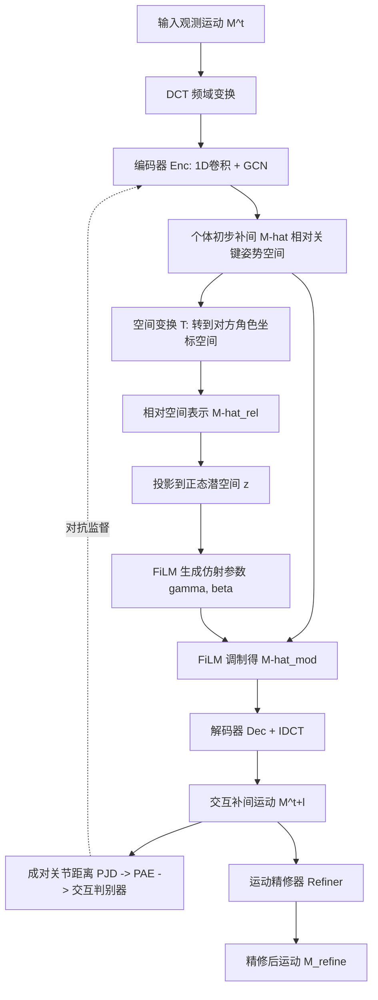

## 一句话总结

面向双人密集交互（如拳击、双人舞）的动作补间方法：通过跨空间建模让两个角色在稀疏关键姿势之间自然地相互回应，并借助交互周期性与运动精修两项设计，把可靠合成延伸到长时程。

## 研究背景

动作补间（motion in-betweening）指在若干预定义关键姿势之间合成连贯的角色运动，让动画师只需指定关键姿势即可高效创作可控动作。以往研究几乎都聚焦于单角色，直接推广到密集交互的双角色场景非常困难，因为它同时要求满足三类约束：

- 两个角色的运动要在时空上对齐，才能保持语义上的交互性；
- 两个角色要在同一时刻各自到达预定义的关键姿势；
- 补间要能泛化到用户自定义、且往往落在训练分布之外的关键姿势。

这些精确要求相比单角色补间引入了大量额外约束，严重压缩了解空间。核心挑战是双重的：一方面要显式建模交互，捕捉定义交互的精确动作与时序；另一方面，密集交互带来的众多约束容易导致不自然运动、关键姿势不可达，而且这种退化会随时间累积，使长时程交互合成难以为继。

## 方法

### 整体框架

方法名为 Cross-Space In-Betweening（跨空间补间），将双角色补间分解为两个阶段：先在关键姿势坐标空间中为每个角色独立预测初步补间，再把预测转换到对方角色的坐标空间提取相对空间信息，用 FiLM（Feature-wise Linear Modulation）仿射调制生成最终交互运动。为支撑长时程，另设两个模块：交互判别器建模交互周期性，运动精修器抑制单角色姿势误差累积。整个系统自回归地逐步预测（每步输入 $$T=20$$ 帧观测，预测未来 $$l=10$$ 帧），直到逼近关键姿势。

### 关键设计

- **跨空间补间（Cross-Space In-Betweening）**：先在关键姿势坐标空间用 DCT 频域表示 + 编码器（1D 卷积叠加 GCN）预测个体运动初值 $$\hat{M}^{t+l}=Enc(DCT(M^t))$$；再把初值变换到对方角色根空间得到相对表示 $$\hat{M}^{t+l}_{rel}$$，投影到正态潜空间后用 FiLM 学习仿射参数 $$\gamma,\beta$$ 调制个体特征 $$\hat{M}^{t+l}_{mod}=\hat{M}^{t+l}\cdot\gamma+\beta$$，再经解码器与 IDCT 还原。这一两阶段设计让运动同时受关键姿势与对方角色相对位置约束，兼顾稳定性与响应性。

- **交互周期性建模**：观察到拳击、舞蹈等密集交互往往表现出周期性的角色间距变化（出拳靠近、收拳远离）。方法用成对关节距离 PJD 表示两角色几何关系（取欧氏距离的逐帧偏移），再用 Periodic Autoencoder（PAE）编码为正弦参数化的潜频率 $$h^t=a^t sin(2\pi(f^t+\phi^t))+b^t$$（相位通道设为 15）。据此训练判别器，对主网络施加对抗监督，评估较长片段（$$N=30$$）的周期质量，从而维持长时程交互一致性。

- **运动精修器（Motion Refiner）**：单角色姿势误差会破坏交互一致性。精修器（自编码器 + GCN 结构）在推理阶段以非重叠的 10 帧片段为单位，修正主网络产生的漂移潜空间与关节级误差，避免误差累积与分布漂移。它独立更新，不依赖主网络的退化分布，用 $$L_{refine}=\frac{1}{P}\sum(M^{t+l}_{refine}-M^{t+l}_{gt})^2$$ 优化。

- **训练策略**：自回归训练中采用 scheduled sampling 提升鲁棒性，主模块以 MSE 与 KL 散度联合优化 $$L_{inbetween}=\lambda_{mse}L_{mse}+\lambda_{kl}L_{kl}$$。姿势用每关节独立的笛卡尔 3D 表示（$$J=52$$ 关节，$$C=9$$ 维：3 位置 + 6 旋转，旋转以前向和上向向量对表示以避免歧义）。

## 实验结果

在 Boxing、ReMoCap、InterHuman 三个数据集上评测，指标包括重建精度（L2P、L2Q）、脚部滑动、交互质量、多样性、FID 与 NPSS。下表为 Boxing 数据集上与基线及消融版本的部分对比（所有对比与消融均只在 Boxing 上训练）。

| 方法 | L2P↓ (30) | L2Q↓ (30) | 交互质量↑ (40) | FID↓ (100) | 100×NPSS↓ (100) |
| --- | --- | --- | --- | --- | --- |
| Ours | 0.192 | 0.254 | 0.914 | 0.282 | 1.398 |
| w/o 交互建模 | 0.243 | 0.291 | 0.864 | 0.428 | 1.837 |
| w/o 交互 GAN | 0.191 | 0.248 | 0.904 | 0.504 | 2.016 |
| w/o 运动精修器 | 0.235 | 0.288 | 0.908 | 0.696 | 2.197 |
| Phase Betweener (separate) | 0.211 | 0.257 | 0.866 | 0.519 | 2.119 |
| Phase Betweener (combined) | 0.202 | 0.250 | 0.880 | 0.547 | 2.849 |
| Cross-Interaction | 0.217 | 0.267 | 0.882 | 0.482 | 2.147 |
| CondMDI | 0.212 | 0.263 | 0.905 | 0.478 | 1.833 |

结果显示：完整方法在多数指标上优于基线；去掉交互建模会使重建性能下降约 20%；去掉交互判别器虽在短期重建上略有提升，但长时程 FID 明显变差；去掉运动精修器时 FID 显著恶化，说明其对长时程质量至关重要。实时推理每 10 帧约 125 ms。50 人用户研究（1~10 分）中，本方法评分一致优于所有基线，并接近真实动作。

## 亮点与局限

亮点：

- 首个专门面向双人交互补间的方法，把单角色补间扩展到需要精确时空对齐的密集交互场景；
- 跨空间建模 + FiLM 调制的两阶段设计巧妙地解耦了「逼近关键姿势」与「保持交互」两个目标；
- 用成对关节距离的周期性来度量与增强交互质量，契合拳击/舞蹈类动作的物理直觉；
- 支持实时、可控（用户可自定义关键姿势的根位置与朝向）的长时程合成。

局限（作者自述）：

- 面对用户自定义关键姿势时，施加的空间约束可能在时序上错配（如强迫两角色同时出拳），且模型无法推断未见过的交互；因是在线合成、缺乏全局运动规划，无法对整段序列做离线精修以改善关键姿势对齐；
- 周期性策略主要适用于有明显重复模式的交互，难以直接扩展到非周期交互；
- 作为首个交互补间工作，目前尚不支持补间时序（timing）条件，否则会进一步增加建模复杂度。

## 延伸思考

- 全局规划的缺失是当前在线自回归范式的通病，若能引入一层轻量的全局轨迹/时序规划，或允许可选的离线精修，或许能同时兼顾实时性与关键姿势的精确对齐。
- 用 PJD 周期性刻画交互质量是一个可迁移的思路，但对话、协作搬运等非周期交互需要新的交互表征，例如接触事件序列或意图级条件。
- 方法目前限定两角色；推广到三人及以上的密集交互时，成对关系数量呈组合增长，如何在保持实时的前提下建模多体交互是值得探索的方向。
- 引入补间时序条件（指定何时到达关键姿势）会让创作更可控，这与近期「不精确时序关键帧」的补间研究方向相呼应，值得结合。
