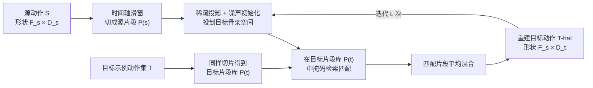

## 一句话总结

Motion2Motion 是一个免训练框架，只需目标骨架上的一两段示例动作和源、目标骨架之间的稀疏骨骼对应，就能把动画在拓扑差异极大的角色之间迁移，甚至实现跨物种（如蟒蛇到霸王龙）的动作迁移。

## 研究背景

跨拓扑动作迁移是计算机动画中长期存在的难题。已有的重定向方法大多分为两类：基于骨架的迁移与考虑角色几何的更精细迁移。但无论哪一类，在真实场景中都会遇到两个核心障碍。

第一个障碍是数据稀缺。主流数据驱动方法依赖大规模配对动作数据，而跨拓扑的配对动作数据集几乎不存在，即便最易获取的人体动作数据（如基于 SMPL 的数据）也缺少足量高质量样本。因此这些方法在测试时常常失效，尤其当目标角色比训练数据更复杂（带裙摆、头发等动态元素，或从两足迁移到四足）时。

第二个障碍是骨骼绑定。当源、目标骨架的拓扑或关节数差异显著时，很难为所有骨骼建立一致的一对一对应，而这种关节级映射恰恰是传统迁移方法的关键前提。

针对这两点，作者提出两个贴合现实的温和假设：其一，可以拿到目标骨架上少量示例动作（少样本设定，没有任何示例则问题无解）；其二，源、目标骨架之间存在一组稀疏关节对应，可由用户指定或自动匹配得到。在此之上，作者把跨拓扑迁移重新表述为"条件式的、基于运动片段的匹配问题"。

## 方法

### 整体框架

Motion2Motion 的核心观察是：绑定关节与未绑定关节之间的运动协调关系，往往只需观察少量示例就能推断出来（例如四足行走时，后腿运动可以从前腿的运动模式外推）。因此它把迁移做成"检索—混合"的迭代过程，完全不需要训练神经网络。

动作用 $$M \in \mathbb{R}^{F \times D}$$ 表示，$$F$$ 为帧数，$$D$$ 为表示维度。每帧姿态由 6D 关节旋转和根速度构成，对于 $$J$$ 个关节的角色 $$D = 3 + 6J$$。迁移前需要对齐源、目标的 rest pose 协议。

### 关键设计

**稀疏对应矩阵与掩码。** 用户或自动匹配给出稀疏关节对应集合 $$M = \{(t,s) \lvert t \in J_t, s \in J_s\}$$，据此构造对应矩阵 $$C \in \mathbb{R}^{D_t \times D_s}$$：有对应的骨骼块填单位阵，无对应的填零阵。再由 $$m[i] = \sum_{j=1}^{D_s} C[i,j]$$ 得到掩码向量，标记目标骨架中哪些维度没有源映射。这样匹配时只对齐有对应的骨骼段，捕捉核心运动学特征、丢弃冗余信息。

**运动投影与噪声初始化。** 把源动作映射到目标骨架空间：$$P_{s \to t} = SC^\top + (1 - m) \odot N$$，其中 $$N \sim \mathcal{N}(O, I)$$ 是标准正态噪声。第一项把有对应关系的骨骼动作直接搬运过去，第二项对没有源映射的目标维度用噪声初始化，随后在迭代中被"生成"为合理的运动。

**掩码运动匹配。** 对投影后动作的每个片段 $$P(\hat{t})$$，在目标片段库中检索最相似片段：

$$P_{match} = \arg\min_{P \in P(t)} \alpha L(m \odot P, m \odot P(\hat{t})) + (1-\alpha) L((1-m) \odot P, (1-m) \odot P(\hat{t}))$$

其中 $$L$$ 为均方误差，$$\alpha \in [0,1]$$ 平衡"有对应部分"（强调稀疏对应带来的语义对齐）与"无对应部分"（用噪声引入多样性与灵活性）。

**迭代混合。** 每个源片段匹配到一个目标片段后取平均混合。为避免直接混合损伤自然度或扭曲关键动作，整个匹配—混合过程重复 $$L$$ 次，逐步细化以保证整段时间连贯。$$\alpha$$ 还充当多样性旋钮：越大越贴合源、多样性越低。

## 实验结果

作者用 Truebones-Zoo 动物动作数据集（关节数 9 到 143）和 LAFAN 人体数据集，收集 14 个角色动画、共 1167 帧组成跨拓扑迁移基准，涵盖跑、走、跳、攻击等动作，并区分"相似骨架"与"跨物种骨架"两档难度。与两个最新基线 Walk-The-Dog 和 Pose-to-Motion 对比，指标包括 FID（质量）、频率对齐、接触一致性、多样性和推理 FPS。

| 方法 | 训练 | 相似骨架 FID↓ | 相似骨架 频率对齐(%)↑ | 相似骨架 接触一致(%)↑ | 相似骨架 多样性↑ | 相似骨架 FPS↑ | 跨物种 FID↓ | 跨物种 频率对齐(%)↑ | 跨物种 接触一致(%)↑ | 跨物种 多样性↑ | 跨物种 FPS↑ |
|---|---|---|---|---|---|---|---|---|---|---|---|
| Li et al. 2024 | 是 | 0.507 | 72.0 | 70.5 | 0.02 | 833 | 2.250 | 66.9 | 62.4 | 0.03 | 729 |
| Zhao et al. 2024 | 是 | 0.389 | 80.1 | 78.6 | 0.33 | 234 | 1.68 | 72.4 | 64.5 | 0.30 | 215 |
| Motion2Motion | 否 | **0.033** | **96.2** | **93.5** | **3.20** | 778 | **0.492** | **90.3** | **79.7** | **1.90** | 752 |

在两档设定下，Motion2Motion 在质量、时间连贯性和多样性上都明显领先，多样性优势尤为突出。它在免训练、无 GPU（单块 MacBook M1，无独显）条件下仍保持高推理帧率，而两个基线都跑在 RTX 3090 上。作者分析基线较差的原因是高度数据驱动、易在分布外场景产生伪影和过拟合，且难以重定向到训练中未见过的动作频率；而基于匹配的方法可通过片段混合灵活组合，相当于一个频率插值器。

此外论文还展示了"测试时缩放"特性（目标样本从 1 增到 3，各指标随之改善）、速度特征匹配甚至优于 6D 旋转、关键帧稀疏输入下的时间插值，以及把视频捕获的 SMPL 动作迁移到含裙摆和头发、多达 331 关节角色的应用。用户研究中 50 名用户对 10 对动作打分，本方法在质量（4.36）和对齐（4.60）上均大幅领先。

## 亮点与局限

亮点：

- 免训练、无需 GPU、可实时运行在 CPU 笔记本上，把跨拓扑迁移从"重数据训练"重新表述为轻量的"运动片段检索—混合"，工程可落地性强。
- 仅需极稀疏的骨骼绑定（例如只绑 2 对、4 对或 6 对骨骼）就能完成两足到四足、无肢到两足等剧烈拓扑变化的迁移，未绑定关节（前肢、尾巴、手指等）能被合理推断。
- 匹配特征灵活（6D 旋转、位置、速度均可），并天然支持关键帧插值和多样性控制，还配套了 Blender 插件融入真实动画流程。

局限：

- 依赖目标骨架上的一或少量示例动作，对动画制作流程仍有一定人工负担。
- 当目标示例与源动作在语义上差异过大（如武术对舞蹈）时，迁移会失败，目前只能靠人工提供关键帧作为示例来缓解。
- 自动骨骼绑定在跨物种场景下与人工绑定仍有差距，拓扑差异大时更依赖专家校验的对应关系。

## 延伸思考

这篇工作最有意思的地方在于把"生成"问题降维成"检索+混合"，用少量示例作为运动先验库，规避了大规模配对数据这一根本瓶颈。这与图像领域的 patch-based 合成、以及游戏工业里成熟的 Motion Matching 思路一脉相承，说明在数据稀缺的结构化领域，非参数的匹配方法仍具有很强竞争力。

值得思考的方向有几个：一是稀疏对应目前主要靠人工或模糊子图匹配，若能结合语义或几何先验实现更可靠的自动绑定，将进一步降低使用门槛；二是"语义差异过大即失败"暴露了纯匹配缺乏语义泛化能力的软肋，未来或可与生成式模型结合，在示例库不足时补足语义推断；三是该框架把噪声项作为多样性来源与未映射维度的初始化，这种"条件生成"视角或许能迁移到其他稀疏条件下的结构化序列合成任务中。
