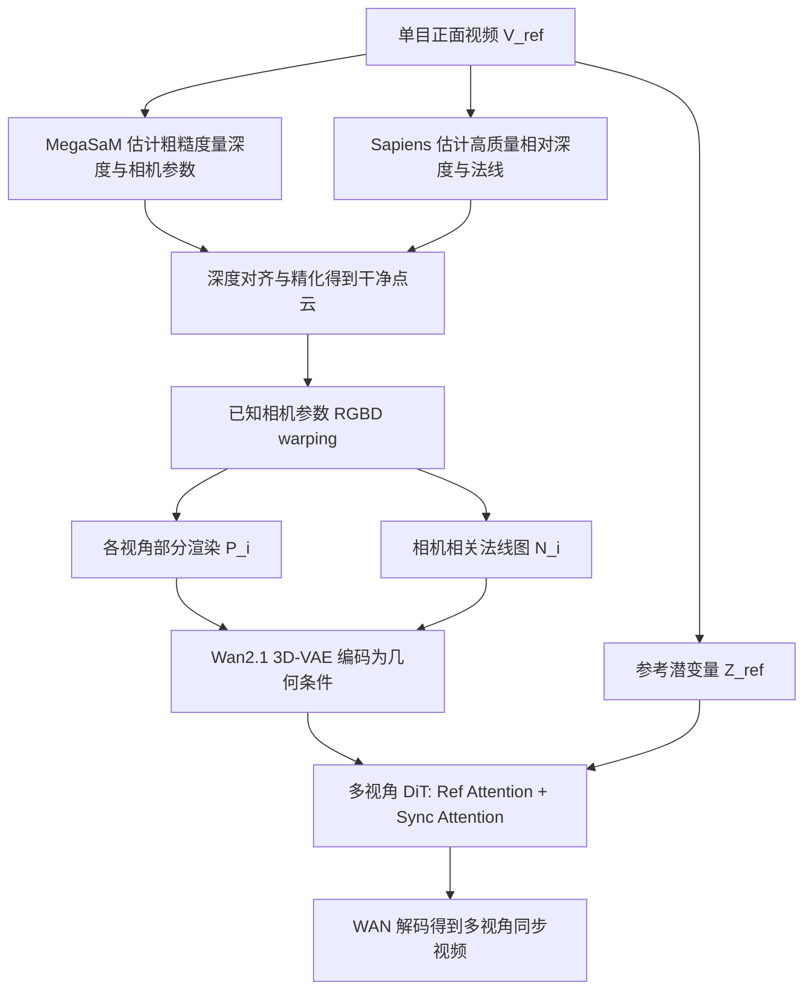

## 一句话总结

MV-Performer 把预训练的视频扩散模型 Wan2.1 改造成多视角同步生成器，仅用单目正面全身视频作为输入，就能合成 360 度环绕、视角一致且时序连贯的 4D 人体新视角视频。

## 研究背景

4D 人体新视角合成在影视制作、AR/VR、沉浸式媒体中有广泛需求。传统做法要么依赖标定好的同步多相机阵列（成本高、部署复杂），要么用 NeRF/3DGS 从单目视频重建（对未观测区域难以补全，且优化耗时长）。

近期视频扩散模型展现出充当隐式 4D 新视角合成器的潜力，主要有两条技术路线：一是把相机位姿嵌入注入网络（如 Plücker 射线），但收敛慢，且需要训练集里有密集视角才能泛化；二是用深度做图像 warping 再做视频修补（inpainting），但难以应对大幅度视角变化。作者指出这两条路线在人体场景下失败的两个核心原因：$$(i)$$ 单目输入提供的 3D 线索不足，后视角的 warping 条件对前后朝向存在歧义；$$(ii)$$ 单目深度估计不准，视角变化大时 warping 会产生"漂浮物"（floater）伪影。

本文聚焦人体这一子领域，主张利用 MVHumanNet 这类多视角人体数据集，配合信息量更充分的条件信号来实现真正的 360 度同步多视角合成。

## 方法

### 整体框架

MV-Performer 以单目正面全身视频 $$V_{ref}$$（含 $$f$$ 帧）为输入，目标是合成 $$m$$ 路同步的新视角人体视频 $$\lbrace V_1, V_2, ..., V_m \rbrace$$。整体流程：先估计并精化深度得到彩色点云，把点云 warping 渲染到各目标视角作为几何条件，再送入基于 Wan2.1 改造的多视角视频扩散模型完成生成。

### 关键设计

1. **深度 warping 几何条件**：给定正面 RGB 图、度量深度 $$D$$ 与相机内外参，先反投影得到世界坐标下的彩色部分点云 $$X(u) = R^{-1}D(u)K^{-1}u$$，再按目标相机把点云渲染到各新视角，得到部分渲染 $$\lbrace P_1, ..., P_m \rbrace$$。相比隐式相机嵌入，显式几何先验更适合视角有限（32~60 个固定机位）的多视角数据集。

2. **相机相关法线图条件**：为解决大视角下前后朝向的歧义，作者对每个点计算法线 $$\vec{n}$$ 与相机朝向 $$\vec{d}$$ 的点积 $$o = \vec{n} \cdot \vec{d}$$。$$o > 0$$ 表示表面朝向相机，$$o < 0$$ 表示背对相机；把朝向相机的法线映射到 RGB，把背向区域涂黑遮蔽。这样既凸显几何结构又传达精确的朝向线索，是实现 360 度合成的关键。

3. **Ref Attention 与 Sync Attention**：在每个 DiT block 中加入两种机制。Ref Attention 用当前潜变量 $$Z_{in}$$ 作 query、参考潜变量 $$Z_{ref}$$ 作 key/value 做交叉注意力，补偿遮挡丢失的信息，$$Z_{out} = Z_{in} + proj(cross\_attn(Z_{in}, Z_{ref}))$$；为简化设计复用了原有的文本交叉注意力层。Sync Attention 对拼接后的多视角潜变量 $$Z_{in} = concat(Z^{ref}_{in}, Z^1_{in}, ..., Z^m_{in})$$ 做帧级空间自注意力，聚合跨视角信息以保证同步一致，且不引入相机位姿嵌入。

4. **鲁棒的野外推理**：针对野外视频深度估计不准的问题，用 MegaSaM 得到粗糙度量深度 $$\hat{D}_i$$ 与相机参数、Sapiens 得到高质量相对深度 $$\tilde{D}_i$$ 与法线 $$\tilde{N}$$；先用最小二乘闭式解对齐尺度与偏移 $$\arg\min_{\alpha,\beta} \lvert\lvert(\alpha \cdot \tilde{D}_i + \beta) - \hat{D}_i\rvert\rvert^2$$，再用法线进一步优化对齐后的深度，从而抑制漂浮物伪影、产生干净的几何条件。训练上采用渐进策略：先训视频修补（5 epoch），再冻结其他模块只训同步模块（5 epoch）。

## 实验结果

在 MVHumanNet 和 DNA-Rendering 两个多视角人体数据集上，与相机可控视频扩散模型 TrajectoryCrafter、ReCamMaster（含在 MVHumanNet 上微调的 ReCamMaster*）以及人体图像动画方法 Champ 对比。

| 数据集 / 方法 | PSNR ↑ | SSIM ↑ | LPIPS ↓ | FID ↓ | FVD ↓ |
| --- | --- | --- | --- | --- | --- |
| MVHumanNet · Champ | 11.23 | 0.813 | 0.328 | 55.92 | 5.54 |
| MVHumanNet · ReCamMaster | 6.97 | 0.600 | 0.620 | 154.03 | 10.78 |
| MVHumanNet · ReCamMaster* | 11.62 | 0.817 | 0.287 | 26.44 | 2.17 |
| MVHumanNet · TrajectoryCrafter | 4.18 | 0.493 | 0.722 | 154.00 | 17.25 |
| MVHumanNet · Ours | 24.35 | 0.926 | 0.066 | 24.47 | 0.12 |
| DNA-Rendering · Champ | 9.08 | 0.750 | 0.399 | 58.59 | 4.73 |
| DNA-Rendering · ReCamMaster | 6.46 | 0.595 | 0.602 | 138.25 | 7.80 |
| DNA-Rendering · ReCamMaster* | 10.02 | 0.769 | 0.342 | 36.78 | 4.28 |
| DNA-Rendering · TrajectoryCrafter | 4.72 | 0.498 | 0.758 | 154.66 | 15.52 |
| DNA-Rendering · Ours | 15.63 | 0.861 | 0.152 | 30.05 | 0.73 |

MV-Performer 在所有指标上大幅领先，尤其 FVD 显著优于基线，说明生成视频的时序与跨视角一致性更好；正面生成结果几乎与真值逐像素对齐，背面服饰纹理由扩散模型合理想象。消融实验进一步验证：去掉法线条件、去掉同步模块都会导致指标退化（FID 从 30.05 分别升到 36.60、38.96）；采样步数上，25~50 步在质量与开销间取得平衡。全流程可在 24G 显存（如 RTX3090）上同时生成约 10 路 49 帧视频。

## 亮点与局限

亮点：
- 首个把单目人体视频转成密集多视角同步视频的生成式框架，实现真正的 360 度环绕合成。
- 用相机相关法线图巧妙化解大视角下的前后朝向歧义，是显式 warping 范式能扩展到 360 度的关键。
- Ref/Sync 双注意力设计简洁，尽量复用 Wan2.1 已有结构，训练与部署代价可控。
- 面向野外的深度精化流程显著提升鲁棒性。

局限：
- 仅接受正面全身视频输入，背面纹理为模型想象，与真值存在差异（作者也承认"合理但非精确"）。
- 依赖 MVHumanNet 等多视角数据集训练，视角分布受限于机位设置。
- 生成质量高度依赖深度估计与精化质量，深度不准仍会带来伪影。
- 缺少与 Human4DiT、Disco4D 等方法的直接对比（因无开源代码或复现成本高）。

## 延伸思考

- 显式几何条件（点云 warping + 法线朝向）相比隐式相机嵌入，在训练视角稀疏时更易泛化，这一思路对其他"数据有限但需大视角外推"的生成任务（如物体、场景级 4D 合成）具有借鉴价值。
- 背面纹理靠扩散模型"想象"填补，如何在保证真实感的同时提升与真人身份/服饰的一致性，是走向可信数字人的关键瓶颈。
- 把视频扩散模型的先验当作"隐式渲染器"配合几何条件驱动，是当前 4D 生成的重要范式；未来若能减少对度量深度精度的依赖、或引入自监督的几何一致性约束，有望进一步提升野外鲁棒性。
