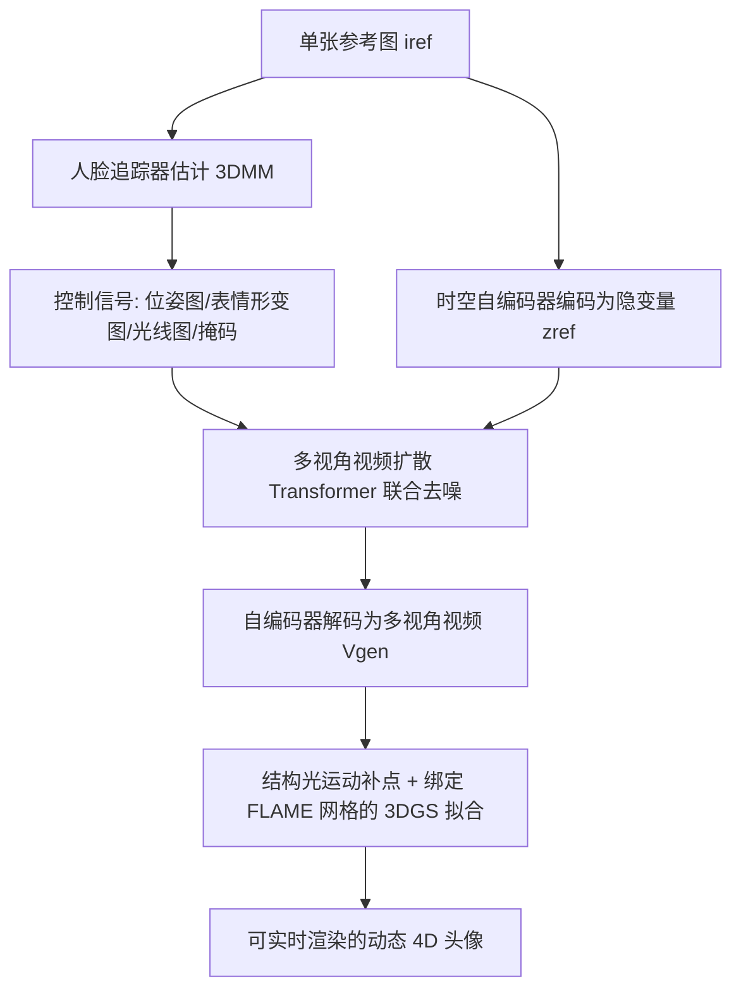

## 一句话总结

本文提出 MVP4D：基于预训练视频扩散 Transformer，构建一个"可形变的多视角视频扩散模型"（MMVDM），只需单张参考人像即可一次采样生成多达数百帧、覆盖 360 度视角、且可控表情与头姿的多视角人像视频，再把这些视频蒸馏成可实时渲染的动态 4D 头像。

## 研究背景

在虚拟环境中重建可驱动、逼真的数字人头像，是游戏、影视、VR 等应用的核心需求，但传统流程依赖庞大的多相机采集装置和专业 3D 美术的大量人工，成本高、周期长。近年从单张随手拍照片自动生成可动画头像的研究大致分两条路线，各有短板：

- 基于 3D 表示的方法（NeRF、3D 高斯泼溅等）多视角一致性强，但受几何/形变模型限制，难以刻画精细的面部动态和随表情变化的外观（如舌头、嘴唇的细微运动）。
- 基于 2D 生成的方法直接合成头像视频，借助大规模生成模型能较好还原细腻的运动与表情，却缺乏显式 3D 约束，当渲染视角明显偏离参考图时质量与真实感急剧下降。

已有工作试图用"联合建模并渲染多视角"来增强 2D 方法的 3D 一致性，但当前多视角人体视频生成大多建立在图像扩散模型之上，一次只能生成很少的帧数（通常个位数到几十帧），严重限制了动画保真度与时序连贯性。同时缺乏大规模多视角视频数据集这一根本瓶颈，使得直接训练这样的模型不可行。

## 方法

整体框架分两步：第一步用 MMVDM 从单张参考图生成大量多视角视频；第二步把这些视频蒸馏进一个绑定在 3DMM 网格上的可形变 3D 高斯泼溅表示，得到可实时渲染的 4D 头像。MMVDM 以 CogVideoX-2B 视频扩散 Transformer 为骨干，去掉文本编码器，用时空自编码器把参考图和各视角视频编码到隐空间，Transformer 在空间、帧、视角三个维度上联合注意力，从而在参考图与所有视角、所有帧之间共享信息。模型由 3DMM（基于 FLAME）导出的控制信号驱动：3D 位姿图、表情形变图、相机光线方向/原点图、以及区分参考帧与生成帧的二值掩码。

### 关键设计 1：多模态训练课程

理想情况需要大规模多视角视频数据来训练，但这类数据并不存在，且视角越多 Transformer 的 token 数与算力开销越大。作者设计三阶段渐进课程，混用三种模态数据：单目动态视频（VFHQ，提供丰富运动与身份多样性以强化时序一致性）、多视角动态视频（Nersemble、RenderMe-360 的少量序列，作为时空对齐的桥梁）、以及多视角静态图像（RenderMe-360、Ava-256，提供最高达 360 度的宽视角覆盖以学习多视角一致性）。训练从 $$256\times256$$、少帧起步，逐步提升分辨率、帧数与生成模式（阶段三扩到 $$V=4, F=49$$）。由此模型能在推理时外推到训练未见的配置——合成 $$V=8$$ 路、每路 $$49$$ 帧的同步视频，实现 360 度视频生成，而全程仅用了约 481 段 360 度多视角视频序列。

### 关键设计 2：四种灵活生成模式 + 迭代扩展采样

模型支持四种模式：模式 1 仅用参考图生成全部视角/帧；模式 2 用参考图加一半视角作参考生成其余视角；模式 3 用参考图加前三个隐帧生成后续帧；模式 4 是二者结合。推理时采用迭代扩展策略：先用模式 1 生成少量关键视角视频，再把其余视角按邻近聚成四个一组、用模式 2 参考最近的关键视角生成，随后用模式 3 延长关键视角帧数、模式 4 延长其余视角，从而在算力受限下逐步扩展成一致的多视角视频语料，最终生成 120 度（32 视角）或 360 度（48 视角）头像。

### 关键设计 3：多视角无分类器引导（Multi-View CFG）

标准 CFG 在单视角有效，但直接用于多视角时，无条件分支下所有 token 拥有相同的时空编码与噪声隐块、缺乏视角特异信息，导致 Transformer 混淆跨视角 token 关系、无条件预测变差。作者改为对每个视角独立前向、生成视角特异的无条件预测 $$\boldsymbol{\epsilon}_{uncond}=\lbrace \boldsymbol{\epsilon}_{uncond,v} \rbrace_{v=1}^{V}$$，并随视角与最近参考视角的角距把引导尺度从 $$1.1$$（$$0$$ 度）线性增大到 $$1.6$$（$$180$$ 度）。引导公式为 $$\boldsymbol{\epsilon}_{guided}=\boldsymbol{\epsilon}_{uncond}+s\cdot(\boldsymbol{\epsilon}_{cond}-\boldsymbol{\epsilon}_{uncond})$$。

### 关键设计 4：4D 高斯泼溅蒸馏与补结构

4D 重建把高斯基元绑定到由参考图预测的 FLAME 网格三角面上，用 FLAME blendshape 驱动网格形变，并以一个 U-Net 预测逐帧、逐高斯的形变（以 UV 图表示）来刻画皱纹等细节；与 CAP4D 不同，这里用 $$8$$ 通道正弦时间嵌入而非表情形变图来条件化。对 FLAME 网格未覆盖的结构（头发、耳环、眼镜），用 DISK+LightGlue 在各视角首帧间匹配关键点并做运动恢复结构三角化，为每个三角化点补一个绑定到最近三角面的高斯基元，并对高斯的速度与相对旋转做正则。

## 实验结果

在 Nersemble 数据集的自重演（self-reenactment）评测中，MVP4D 在时序一致性指标 JOD 上超越所有基线，在光度精度（PSNR、SSIM）上具有竞争力，表明其优势主要来自更强的时序连贯性（一次性联合生成所有视角，而非逐批合成）。CSIM 为身份保持（身份嵌入余弦相似度），RE@LG 为基于关键点重投影误差衡量的 3D 一致性。

| 方法 | PSNR↑ | SSIM↑ | LPIPS↓ | JOD↑ | RE@LG↓ | CSIM↑ |
| --- | --- | --- | --- | --- | --- | --- |
| GAGAvatar | 20.01 | 0.721 | 0.353 | 4.73 | 2.25 | 0.656 |
| Portrait4D-v2 | 17.05 | 0.662 | 0.392 | 3.67 | 3.75 | 0.659 |
| VOODOO3D | 20.09 | 0.692 | 0.349 | 4.86 | 1.84 | 0.517 |
| CAP4D (MMDM) | 22.17 | 0.768 | 0.280 | 5.30 | 1.28 | 0.793 |
| CAP4D (120) | 21.56 | 0.778 | 0.302 | 5.49 | 0.634 | 0.755 |
| MVP4D (MMVDM) | 23.39 | 0.765 | 0.294 | 5.88 | 1.03 | 0.707 |
| MVP4D (360) | 22.76 | 0.774 | 0.308 | 5.57 | 0.643 | 0.715 |
| MVP4D (120) | 23.16 | 0.790 | 0.301 | 5.62 | 0.656 | 0.708 |

在 RenderMe-360 的 360 度自重演上，MVP4D（PSNR 18.78、JOD 4.45）大幅领先 F-Y-E+PanoHead 与 CAP4D-MMDM；后者未在 360 度数据上训练、无法生成头后视角。交叉重演（cross-reenactment）的用户研究中（45 名被试、6750 次响应），MVP4D 在视觉细节、表情迁移、3D 结构、运动质量与总体偏好上均显著优于基线，相较最强基线 CAP4D 总体偏好率达 86%。消融显示：去掉 CFG 或用常规 CFG 都会明显掉点；虽以 $$V=4$$ 训练，但采样时用 $$V=8$$ 能进一步提升质量与 3D 一致性。

## 亮点与局限

亮点：
- 首个可形变的多视角视频扩散模型，单次扩散采样即可生成 360 度、多达 392 帧的人像视频，帧数比同类基线高约一个数量级，且可由头姿与表情完全驱动。
- 多模态训练课程巧妙绕过"缺乏大规模多视角视频数据"的瓶颈，用单目视频、多视角图像与少量多视角视频拼出跨视角、跨时间的一致性。
- 蒸馏出的 4D 高斯头像可实时渲染，能捕捉皮肤瑕疵、发丝、随表情变化的皱纹等细节，并支持语音驱动、文本到 4D 头像等扩展。

局限：
- 自编码器的高时空压缩使得快速出现/消失的精细时序细节（如牙齿）难以准确刻画。
- 用首帧条件化（模式 3）生成长序列时，每次迭代质量递减，限制了实际可生成的序列长度。
- 因训练数据在多视角设定下光照变化有限，无法准确建模极端光照条件。
- 生成一个 120 度头像需约 6.5 小时、360 度约 10.5 小时（单张 RTX 6000 Ada），加上 1.5 小时 4D 重建，整体生成开销仍很大。

## 延伸思考

MVP4D 的核心价值在于把"视频扩散 Transformer 的时序建模能力"迁移到 4D 头像生成，并用多模态课程学习化解了多视角视频数据稀缺的死结——这套"用不同模态数据分别补齐时序一致性与多视角一致性"的思路，对其他缺乏配对多视角动态数据的生成任务同样有借鉴意义。多视角 CFG 的提出也提醒我们：把单视角成熟技巧直接搬到多视角/多序列联合生成时，需重新审视无条件分支的语义歧义。局限则指向清晰的后续方向：引入基于物理的光照与反射建模以支持可控打光，以及借助前馈式直接生成 3D 表示来大幅降低当前动辄数小时的生成成本，可能是把这类方法推向实用的关键。
