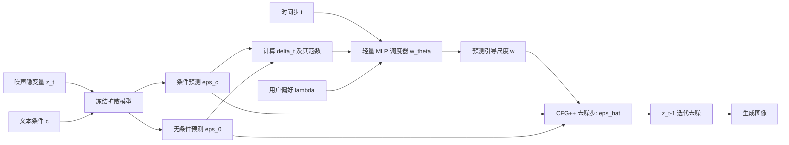

## 一句话总结

针对文本到图像扩散模型中 Classifier-Free Guidance（CFG）引导尺度难以设定、固定取值易顾此失彼的问题，本文提出一个可学习的退火引导调度器：用轻量 MLP 根据时间步 $$t$$、条件与无条件预测之差的范数 $$\lVert \delta_t \rVert$$ 以及用户偏好参数 $$\lambda$$ 动态预测引导尺度 $$w$$，在不增加显存和额外计算的前提下无缝替换 CFG，同时提升图像质量与文本对齐。

## 研究背景

去噪扩散模型在文本条件图像生成上表现出色，但采样过程高度依赖引导策略。Classifier-Free Guidance（CFG）是当前主流机制：它把带引导的噪声预测写成无条件预测 $$\epsilon_t^{\varnothing}$$ 与条件预测 $$\epsilon_t^{c}$$ 的外推组合，引导尺度 $$w$$ 控制外推强度。

$$\hat{\epsilon}_t = \epsilon_t^{\varnothing} + w \cdot (\epsilon_t^{c} - \epsilon_t^{\varnothing})$$

问题在于 $$w$$ 的选取极为棘手。作者把 VAE 隐空间称为"扩散空间"（diffusion space），它是一个密度非均匀、结构复杂的高维地形。要在其中导航，需要跳过低似然区域、走向与文本对齐的邻近模态：

- $$w$$ 偏小会"欠射"（undershoot），对齐不足；
- $$w$$ 偏大会"过射"（overshoot），产生过饱和、伪影，甚至偏离自然图像流形。

已有工作尝试用随时间步变化的调度器缓解 CFG 的不稳定，但这些调度多为手工设计、基于相互对立的启发式规则，且**不随初始噪声或去噪轨迹自适应**——而后两者恰恰是有效导航扩散空间的关键。因此作者主张：$$w$$ 不仅应依赖时间步 $$t$$，还应依赖能反映当前轨迹状态的信号 $$\delta_t = \epsilon_t^{c} - \epsilon_t^{\varnothing}$$。

## 方法

### 整体框架

本方法建立在 CFG++ 之上。CFG++ 把采样重新解释为最小化 Score Distillation Sampling（SDS）损失的流形约束梯度下降：它将 $$w$$ 限制在 $$[0,1]$$，且去噪用带引导预测 $$\hat{\epsilon}_t$$、renoise（重新加噪）时改用无条件预测 $$\epsilon_t^{\varnothing}$$。关键观察是，SDS 损失的梯度近似为

$$\nabla_{z_{0\mid t}} L_{\text{SDS}} = 2\gamma_t (\epsilon_t^{c} - \epsilon_t^{\varnothing}) = 2\gamma_t\, \delta_t$$

即 $$\delta_t$$ 是 SDS 梯度的时间归一化代理。因此 $$\lVert \delta_t \rVert$$ 越小，说明条件预测与无条件预测越一致，样本越接近既符合文本又落在模型分布上的稳定点。作者据此设计一个可学习模型 $$w_\theta(t, \lVert \delta_t \rVert, \lambda)$$ 来自适应预测引导尺度，并放开 CFG++ 对 $$w \in [0,1]$$ 的约束，以便探索条件分布的多个模态。推理时仅需把 CFG++ 中的常数 $$w$$ 替换为 $$w_\theta$$：

$$\hat{\epsilon}_t = \epsilon_t^{\varnothing} + w_\theta(t, \delta_t, \lambda) \cdot (\epsilon_t^{c} - \epsilon_t^{\varnothing})$$

### 关键设计 1：以 $$\lVert \delta_t \rVert$$ 作为对齐导航信号

作者用二维示意给出几何直觉：设条件分布 $$p(z_0 \mid c)$$ 有两个模态 A、B，样本先落在部分匹配文本的模态 A 附近，此时 $$\epsilon_t^{c}$$ 相对 $$\epsilon_t^{\varnothing}$$ 偏移很小，$$\lVert \delta_t \rVert$$ 也小。沿 $$\delta_t$$ 方向前进可走向更契合文本的模态 B；在 B 附近，条件与无条件预测重新对齐，$$\lVert \delta_{t-1} \rVert$$ 达到极小。因此 $$\lVert \delta_t \rVert$$ 能反映与文本条件的对齐程度，可作为动态选取 $$w$$ 的信号。

### 关键设计 2：$$\delta$$-loss 与 $$\epsilon$$-loss 的双目标训练

调度器实现为轻量 MLP，在 LAION-POP 高分辨率、高对齐子集上训练，扩散模型全程冻结。总损失由用户偏好 $$\lambda \in [0,1]$$ 平衡两项：

$$L = \lambda L_t^{\delta} + (1-\lambda) L_t^{\epsilon}$$

- $$\delta$$-loss（促对齐）：对 $$z_t$$ 用 $$\hat{\epsilon}_t$$ 去噪、用 $$\epsilon_t^{\varnothing}$$ 重新加噪得到 $$z_{t-1}$$，再评估 $$L_t^{\delta} = \lVert \delta_{t-1} \rVert_2^2$$，鼓励轨迹走向条件/无条件预测开始一致的区域。
- $$\epsilon$$-loss（保质量）：$$L_t^{\epsilon} = \lVert \hat{\epsilon}_t - \epsilon \rVert_2^2$$，作为重建正则，防止只优化 $$\delta$$-loss 时引导尺度被推得过大、样本偏离流形。二维实验显示，$$\lVert \delta_t \rVert$$ 在远离数据环的区域也可能偏低，单靠它会把样本导出流形，故需 $$\epsilon$$-loss 约束。

### 关键设计 3：训练期提示扰动（Prompt Perturbation）

训练时隐变量 $$z_t$$ 与其匹配文本天然对齐，而推理从纯噪声起步、对齐对初始种子敏感，二者存在分布错配。作者借鉴 CADS，在训练期向文本嵌入注入高斯噪声，模拟推理时不完美的图文对齐，从而提升调度器鲁棒性：$$\lambda$$ 低（$$\epsilon$$-loss 主导）时即便对齐不精也能产出高质量图像；$$\lambda$$ 高（$$\delta$$-loss 主导）时能自适应转向更契合文本的邻近模态。

### 关键设计 4：用户偏好参数 $$\lambda$$

$$\lambda$$ 取代了手工设定固定 $$w$$，提供可解释的高层偏好接口：用户只需指定 $$\lambda$$（质量 vs. 对齐的权衡），调度器即在整个生成过程中自适应给出每步的 $$w$$。热力图显示 $$w_\theta$$ 会随 $$t$$、$$\lVert \delta_t \rVert$$ 与 $$\lambda$$ 呈非单调变化。该方法不增加任何额外激活或显存开销，可直接替换 CFG。

## 实验结果

在 MSCOCO 2017 验证集上，用相同种子每个模型生成 5000 张图，基于 SDXL，与 CFG、APG、CFG++ 对比。图像质量用 FID、FD-DINOv2 衡量，文本对齐用 CLIP 相似度衡量，另报告 ImageReward（IR，人类偏好）、Precision（P）、Recall（R）。下表按 FD-DINOv2 匹配各方法的近似工作点：

| 方法 | Scale | FID ↓ | CLIP ↑ | IR ↑ | P ↑ | R ↑ |
| --- | --- | --- | --- | --- | --- | --- |
| CFG | $$w=7.5$$ | 25.13 | 32.12 | 0.817 | 0.863 | 0.630 |
| APG | $$w=10$$ | 25.25 | 32.08 | 0.818 | 0.862 | 0.631 |
| CFG++ | $$w=0.6$$ | 24.97 | 32.12 | 0.808 | 0.859 | 0.629 |
| **Ours** | $$\lambda=0.05$$ | **24.76** | **32.16** | 0.809 | 0.860 | 0.620 |
| CFG | $$w=10$$ | 26.06 | 32.22 | 0.859 | 0.859 | 0.594 |
| APG | $$w=15$$ | 26.60 | 32.19 | 0.865 | 0.864 | 0.592 |
| CFG++ | $$w=0.8$$ | 25.61 | 32.20 | 0.857 | 0.855 | 0.601 |
| **Ours** | $$\lambda=0.4$$ | **25.35** | **32.25** | 0.865 | 0.859 | 0.606 |
| CFG | $$w=12.5$$ | 26.61 | 32.25 | 0.881 | 0.850 | 0.570 |
| APG | $$w=17.5$$ | 26.58 | 32.21 | **0.887** | 0.861 | 0.586 |
| CFG++ | $$w=1$$ | 26.33 | 32.26 | 0.882 | 0.848 | 0.570 |
| **Ours** | $$\lambda=0.7$$ | **25.95** | 32.26 | 0.884 | 0.852 | 0.594 |
| CFG | $$w=15$$ | 27.15 | 32.27 | 0.883 | 0.844 | 0.570 |
| APG | $$w=20$$ | 26.85 | 32.23 | 0.893 | 0.855 | 0.577 |
| CFG++ | $$w=1.2$$ | 26.84 | 32.28 | 0.894 | 0.847 | 0.551 |
| **Ours** | $$\lambda=0.8$$ | **26.40** | **32.29** | **0.898** | 0.846 | 0.586 |

在所有匹配设置中，本方法均取得最低 FID 与最高（或并列最高）CLIP，在较高引导强度下 Recall 也更优，并在四组中的两组取得最高 ImageReward。FID-CLIP 权衡曲线上，APG 相对 CFG 无明显提升、CFG++ 仅在 FID/CLIP 空间有增益，而本方法在质量与对齐两方面同时改进。二维环形分布玩具实验进一步表明：固定小 $$w$$ 对齐不足、固定大 $$w$$ 过拟合条件而偏离流形，退火调度器在保持流形保真的同时实现更好的条件对齐与分布覆盖。

## 亮点与局限

亮点：

- 提出**依赖去噪轨迹**的引导尺度调度：不仅用时间步 $$t$$，还用 $$\lVert \delta_t \rVert$$ 作为 SDS 收敛与文本对齐的代理信号，实现样本级、轨迹感知的自适应引导。
- 从 SDS/CFG++ 的优化视角出发，给出 $$\delta_t$$ 是 SDS 梯度代理的原理性推导，并配以清晰的二维几何直觉。
- $$\delta$$-loss 与 $$\epsilon$$-loss 双目标兼顾对齐与保真，训练期提示扰动提升鲁棒性；用户仅需一个可解释参数 $$\lambda$$ 取代难调的固定 $$w$$。
- 调度器为轻量 MLP，**零额外显存与激活开销**，可无缝替换现有 CFG。

局限：

- 论文明确指出仍存在文本严格对齐与保持在数据流形之间的根本性权衡，退火只是更好地平衡而非消除。
- 高维扩散空间的多模态结构本身导航困难，方法对复杂提示更有效，但并不能保证在所有情形下都收敛到理想模态。
- 仅最小化 $$\lVert \delta_t \rVert$$ 会把样本导出流形，故必须依赖 $$\epsilon$$-loss 正则，说明 $$\delta$$ 信号并非完备判据。
- 实验主要基于 SDXL 与 MSCOCO，跨更多主干、求解器与数据集的普适性仍需依赖补充材料佐证。

## 延伸思考

- 调度器目前只用标量 $$\lVert \delta_t \rVert$$ 概括高维 $$\delta_t$$，若引入方向性或空间局部化信息（如逐区域引导），能否在保持轻量的同时进一步提升复杂构图与计数的对齐。
- $$\delta_t$$ 作为 SDS 梯度代理的思路是否可迁移到 3D 生成、视频扩散等同样依赖引导与 SDS 的任务，用可学习调度替代手工引导。
- 论文已在流匹配（flow-matching）上给出扩展，说明该框架不局限于 DDPM 型采样；探索其在少步蒸馏模型上的表现值得关注。
- 用户参数 $$\lambda$$ 提供了质量-对齐连续控制，是否可进一步做到"按提示难度自动选 $$\lambda$$"，实现完全免调参的引导。
