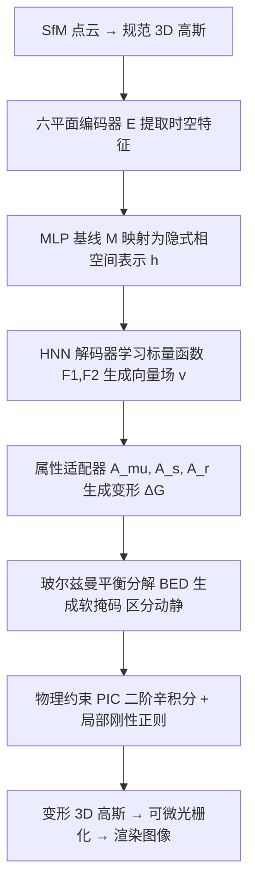

## 一句话总结

提出 NeHaD，用哈密顿力学作为物理先验来改造动态高斯溅射的变形场，用哈密顿神经网络学习守恒律、用玻尔兹曼平衡分解区分动静高斯，从而在保持实时性的同时得到物理合理、运动连贯的动态场景渲染。

## 研究背景

动态场景的新视角合成是 VR、元宇宙等沉浸式应用的关键。给定离散的时序视频，目标是在任意时间戳实时合成高保真新视角，同时要应对两大挑战：一是复杂快速运动与拓扑变化下的高保真重建，二是低训练成本下的实时渲染效率。

基于 NeRF 的动态方法（变形场 / 规范场或 4D 显式结构如平面、哈希编码）渲染质量高，但需沿光线密集采样，速度慢。3D 高斯溅射（3DGS）实现了静态场景的实时高保真渲染，其动态扩展（如 4DGS 用六平面变形场）虽然快，却普遍用纯数据驱动的 MLP 预测变形，缺乏物理归纳偏置，导致：图元的突然出现/消失、轨迹不连续、变形高斯坐标过度重叠，进而在复杂运动场景下产生渲染退化。

作者的核心观察是：高斯图元天然存在于一个相空间中，其协方差矩阵位于辛流形上，因此哈密顿力学（相空间结构、能量守恒、辛性）非常契合用于重新表述高斯变形场，为「物理合理的运动」提供数学框架。

## 方法

### 整体框架

NeHaD 在 4DGS 基础上，把 MLP 变形解码器替换为哈密顿神经网络（HNN）解码器，配合玻尔兹曼平衡分解（BED）与物理约束（PIC），最终经辛积分和刚性正则得到变形高斯并光栅化渲染。

### 关键设计

1. **哈密顿神经网络变形场（HNN Decoder）**：不直接为高维高斯定义显式位置-动量坐标（不可行），而是把六平面特征经 MLP 映射为隐式隐变量 $$\mathbf{h}_i$$ 作为「学习到的隐式相空间」的广义坐标。HNN 学习两个标量函数 $$F_1, F_2$$，通过自动微分生成保守场 $$\mathbf{v}_c=\nabla_{\mathbf{h}_i}F_1(\mathbf{h}_i)\mathbf{I}$$（无旋、保能量、产生梯度型运动）与螺线场 $$\mathbf{v}_s=\nabla_{\mathbf{h}_i}F_2(\mathbf{h}_i)\mathbf{M}^{\top}$$（无散、保体积、产生旋转型运动），其中 $$\mathbf{M}$$ 为保持辛结构的置换张量。再由轻量属性适配器分别输出位置、缩放、旋转的变形量。这样以最小训练开销无监督地学到守恒律，保证变形平滑连贯、无突变。

2. **玻尔兹曼平衡分解（BED）**：观察到大部分区域是静态的，用统计力学思想构造软掩码，仅激活偏离平衡态的图元做变形。对位置采用「时空分解」：由空间偏差 $$\Delta d_i$$ 与时间偏差 $$\Delta\tau_i$$ 构造谐振子能量 $$E^{(i)}_{st}=\tfrac{1}{2}(\Delta d_i^2+\Delta\tau_i^2)+\lambda\,\Delta d_i\Delta\tau_i$$，掩码取玻尔兹曼分布 $$M^{(i)}_{pos}=(1-\gamma)\exp(-\beta E^{(i)}_{st})+\gamma$$；对缩放采用「仅时间分解」（空间普适、时间选择性）。混合方式为 $$\boldsymbol{\mu}'_i=\boldsymbol{\mu}_i+\Delta\boldsymbol{\mu}_i\odot(1-M^{(i)}_{pos})$$，让平衡态附近的图元保持静止。

3. **二阶辛积分（位置动力学）**：为应对真实世界的耗散力，用 Position Verlet 辛积分更新位置，避免 Euler / Runge-Kutta 的能量漂移。把变形向量 $$\Delta\boldsymbol{\mu}_i$$ 视作速度，把保守场负梯度视作力（即加速度，设单位质量），更新式为 $$\tilde{\boldsymbol{\mu}}_i=\boldsymbol{\mu}_i+\Delta t\cdot\Delta\boldsymbol{\mu}_i+\tfrac{(\Delta t)^2}{2}\mathbf{F}_i$$，从而在存在耗散时也尽量守恒、保持长期稳定。

4. **局部刚性正则（旋转动力学）**：借鉴 ARAP 思想约束旋转，使局部邻域近似刚性变换。把四元数增量转成轴-角表示得旋转角 $$\phi_i$$，再用平滑限幅 $$\phi'_i=\phi_{max}\tanh(\phi_i/\phi_{max})$$ 压制过大旋转、保留自然小旋转，最后经四元数乘法与归一化得到最终旋转。

此外，NeHaD 通过尺度感知各向异性 MipMapping（抗锯齿）与分层渐进优化（LOD），扩展到带宽受限的自适应流式传输场景。

## 实验结果

在合成单目数据集 D-NeRF（800×800）上与代表性方法对比，NeHaD 在渲染质量指标上取得最优，同时保持可接受的训练时间与帧率：

| 方法 | PSNR ↑ | SSIM ↑ | LPIPS ↓ | 训练时间 ↓ | FPS ↑ |
|------|--------|--------|---------|-----------|-------|
| D-NeRF | 29.68 | 0.947 | 0.058 | 48hrs | <1 |
| TiNeuVox | 32.74 | 0.972 | 0.051 | 28min | 1.5 |
| HexPlane | 31.04 | 0.97 | 0.04 | 11.5min | 2.5 |
| 4DGS | 35.34 | 0.985 | 0.021 | 20min | 82 |
| SC-GS | 40.26 | 0.992 | 0.009 | 30min | 164 |
| Ours | 40.91 | 0.995 | 0.008 | 24min | 62 |

在真实世界数据集 HyperNeRF、DyNeRF 上同样在质量指标（PSNR/SSIM/LPIPS）上全面领先，帧率维持在 20 FPS 以上。消融实验（D-NeRF）显示：加入 HNN 解码器使质量指标较基线提升约 6.7%（PSNR 35.34→37.69）；BED 与物理约束进一步减少运动区域伪影，完整模型达到 PSNR 40.91。

## 亮点与局限

亮点：
- 首次将哈密顿力学引入神经高斯变形场，用共享的相空间结构把「物理合理运动」这一先验落到实处，运动更有序、更连贯。
- 用「学习两个标量函数再自动微分」的技巧，规避高维向量场直接学习的模式崩塌与能量守恒难题，且训练开销小。
- 玻尔兹曼平衡分解以能量为依据自适应区分动静高斯，对位置和缩放采用不同分解策略，符合两类属性的视觉特性。
- 二阶辛积分 + 局部刚性正则提供物理约束，兼顾长期稳定与自然运动；并自然扩展到流式传输。

局限：
- 针对真实场景的专门正则在遮挡、大耗散、流体变形等情形下可能与真实动态冲突。
- 学习哈密顿量带来额外计算开销，实时渲染性能有所下降（真实场景帧率不及最快方法）。

## 延伸思考

- HNN 保持的是「接近但不完全等于」总能量的量，作者用辛积分与刚性正则来缓解非保守力（如摩擦）的影响；未来若能显式建模耗散项（如端口哈密顿 / 耗散哈密顿系统），或许能在流体、强遮挡等强耗散场景更稳健。
- 隐式「学习到的相空间」是关键折中：它避免了显式定义高维位置-动量坐标，但也让「物理量」的可解释性和守恒性更依赖网络学习质量，如何验证学到的守恒律是否真有物理意义值得深究。
- 方法本质是给数据驱动的变形场加物理归纳偏置，这一思路可迁移到其它可微渲染 / 动态重建管线（如点云、网格、隐式场），也可与光流、运动掩码等显式监督互补。
