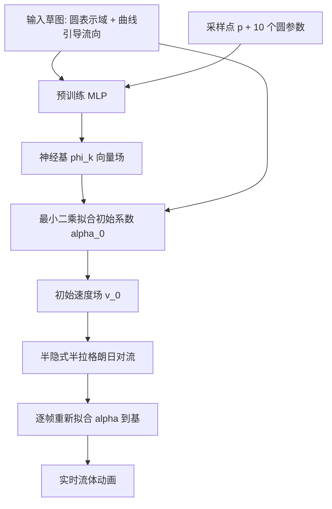

## 一句话总结

本文用一个 MLP 学习一组"神经运动学基（neural kinematic bases）"来表示流体速度场，这组基天然满足无散、边界贴合、正交、光滑等物理不变量，动画师只需勾勒草图即可拟合初始流场，并用标准半隐式时间积分器实时演化，天然支持任意域、移动边界并可扩展到三维。

## 研究背景

从稀疏数据驱动二维或三维形状动画是计算机图形学的核心难题，典型如骨骼驱动角色动画：用稀疏的骨架控制复杂形变，关键在于设计合适的基以保证生成的形变看起来物理合理。随着机器学习进入这一领域，研究重心从"手工构造基"转向"设计生成基的网络"。

与此并行，机器学习也被用来以廉价网络替代昂贵的物理仿真，尤其是流体仿真。但这类方法与传统物理仿真共享同一个局限：输入是系统状态（初始与边界条件），输出是一段动画，缺乏动画流水线里那种细粒度、可由稀疏数据交互控制的能力。

本文希望把传统动画流水线的交互性与易用性，和物理仿真中神经表示的表达力结合起来：类似骨骼动画，设计一组能编码流体复杂动力学的基。这组基用 MLP 表示，仅靠不可压缩、光滑、边界对齐、正交等基本物理属性做无监督训练，不需要任何真值数据；训练数据很小，只用于让神经基泛化到未见过的新域。由于网络被强制编码这些基本规律，从基生成的任意动画都会继承同样的属性；拟合初始流场后，用标准积分技术即可演化出合理的流体动画。

## 方法

### 整体框架

核心是设计一组非线性的神经基函数 $$\varphi_k$$，注意这些基本身是向量场，这与有限元里"形函数是标量、待求系数是节点上的向量"的做法不同。在带 $$m$$ 个可重叠圆孔的单位圆角方形域 $$\Omega$$ 上，定义 $$b$$ 个神经基 $$\varphi_k,\ k=1\dots b$$，用它们的线性组合近似任意速度场 $$v(p)=\sum_{k=1}^{b}\varphi_k(p)\alpha_k$$。其中系数 $$\alpha_k$$ 是仿真时求解的未知量，作用类似特征模态的权重或有限元系数；与传统有限元不同，无论 $$\alpha_k$$ 取何值，速度场 $$v$$ 都会满足上述不变量。$$\alpha_k$$ 不驻留在空间节点上，而存在于一个抽象的全局设定中，从而激进地压缩了自由度。

整个流水线：从一张域草图（用一组圆表示障碍、用若干曲线引导流向）出发，用预训练 MLP 生成流体基，把基拟合到输入草图得到初始流场，再逐帧对流演化生成动画。

### 关键设计

1. **物理不变量作为无监督损失**：MLP 输入是评估点 $$p$$ 与 $$m$$ 个圆的圆心、半径，输出 $$b$$ 个基函数。训练完全依赖基本物理属性，通过在随机采样点上做蒙特卡洛积分构造六个损失：散度损失 $$\mathcal{L}_{div}$$（鼓励基能重建无散场）、滑移边界损失 $$\mathcal{L}_{bc}$$（用余弦相似度约束基与边界法向正交）、正交损失 $$\mathcal{L}_{orth}$$（防止基退化为同一个）、长度损失 $$\mathcal{L}_{len}$$（约束平均模长接近目标值 $$c=0.37$$）、小基惩罚 $$\mathcal{L}_{small}$$、光滑损失 $$\mathcal{L}_{smooth}$$（惩罚雅可比 Frobenius 范数）。六项加权求和得到流体损失，权重为 $$(w_{drch},w_{div},w_{orth},w_{bc},w_{len},w_{small})=(0.01,5,100,30,100,100)$$。

2. **域的隐式编码与软掩码**：用带圆角（半径 0.2）的单位方形加障碍团表示域，障碍用十个隐式圆（三维为球）经 metaball/blob 方式融合成隐式函数 $$f(p)$$，平滑参数 $$k=30$$。再定义边界指示函数 $$w_b$$ 与域掩码 $$w$$，把域外点滤除，使损失在域内为一、离边界超过 $$\varepsilon$$ 处降为零，并对损失做归一化以独立于采样点数量与位置。

3. **草图拟合与半隐式对流**：对每条引导曲线 $$\gamma$$ 均匀采样，取归一化切向 $$t_i=\nabla\gamma(c_i)/\lVert\nabla\gamma(c_i)\rVert$$ 作为目标速度，最小二乘拟合出初始系数 $$\alpha_0$$。演化时用半隐式（半拉格朗日）积分：回溯原点位置 $$p_o=p-v_t(p)\,dt$$（越界则投影到最近点），从原点复制速度得到 $$\bar v_{t+1}$$，再最小二乘把它重新拟合回基以得到 $$\alpha_{t+1}$$。

4. **移动边界的天然支持**：由于神经基可在任意域上即时求值，处理移动边界时只需在计算新速度后，把 $$\bar v_{t+1}$$ 投影到定义在新域上的一组新基即可，从而捕捉平移、旋转乃至域拓扑变化（如夹爪开合改变亏格）的流动。相比 Cui et al.［2018］每个域需要至少 5.5 小时预计算，本方法只需一次性训练，之后无需按域预计算即可支持无限次仿真。

## 实验结果

网络为 8 层全连接、每层 256 通道、Leaky ReLU 激活（末层用 ELU 以输出负值），用 Adam 训练，在 1000 个几何样本（随机圆/球、两三分量随机形状，二维还含英文字母形状）上每样本采样 $$n=10^6$$ 点，共 10 个 epoch。二维模型训练 22.9 小时、三维 23.6 小时，均在单张 NVIDIA GeForce RTX 3090 上完成。运行时，生成初始流体可交互，仿真在 25 万个点下可达 40 帧每秒。泛化性在 100 个未见过的随机圆/球测试集上评估。下表按原文汇总关键量化结论：

| 评估项 | 结果 |
|---|---|
| 泛化（测试集 vs 训练集） | 长度损失与正交损失基本持平；边界损失约大 20% |
| 散度分布（训练/测试） | 一致偏小（平均约 0.5），非严格为零 |
| 边界对齐分布 | 测试集略大于训练集 |
| 收敛行为 | 二维小基/正交损失前几 epoch 即平稳、长度快速达标；三维长度缓慢收敛；散度与边界损失需约 10~15 epoch 才平稳 |
| 实时性能 | 25 万点下 40 帧每秒（RTX 3090） |

消融研究验证了三项关键设计：去掉光滑损失后 MLP 更频繁产生不合理的基、甚至无法生成有效基；不做圆角平滑则训练难以处理边角过渡、生成把流体推出域外的基；把每形状采样点从 $$10^6$$ 减少会导致收敛变差、违反物理约束并退化出平凡基。

## 亮点与局限

亮点：
- 把动画流水线的交互性（草图驱动）与神经表示的表达力结合，让动画师能实时设计并编辑二维/三维流体。
- 完全无监督：仅用基本物理不变量训练，不需要任何真值仿真数据，训练是一次性成本，之后跨任意域即时求值、无需按域预计算。
- 天然支持移动边界与拓扑变化，配合标准半隐式积分器即可实时演化，适合游戏引擎等实时场景。

局限：
- 为控制训练时间只用了十个基，基数偏少；域几何用十个圆/球表示，精细度有限（作者建议改用胶囊集合）。
- 仅支持 Dirichlet 型边界（基与边界对齐），扩展到 Neumann 等其他边界需额外机制来指定与混合边界约束。
- 基本身是光滑的，导致流体动画与边界几何都平滑，难以适配非光滑边界。

## 延伸思考

这项工作把"物理不变量"从"仿真时逐帧硬约束"前移到了"离线训练一组通用基"，本质上是在用神经场重新表达约减阶模型（reduced order model）里的模态基，但摆脱了特征函数方法只能在单一矩形域、且需数小时逐域预计算的限制。它提示了一条更一般的路径：把守恒律、边界条件等物理先验编码进基函数本身，则任意由基线性组合出的解都自动合规，从而把"保证物理合理"与"运行时求解"解耦。值得延伸思考的是，用向量场基而非标量形函数、并让系数脱离空间节点存在于全局抽象空间，是激进降自由度的关键，但也带来对复杂或非光滑流动的表达力上限；未来若能在基数、域表示（如胶囊）与边界类型（Neumann）上放宽，并把这种"物理先验即基"的思路迁移到弹性体、烟雾或多物态耦合，或许能形成一类通用的实时物理动画后端。
