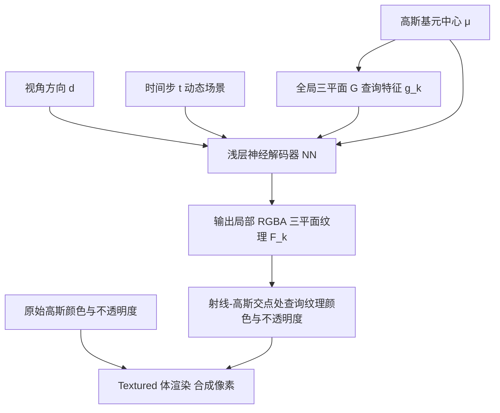

## 一句话总结

本文提出 Neural Texture Splatting（NTS）：用一个共享的全局三平面神经场为每个 3D 高斯基元预测局部 RGBA 纹理场，作为即插即用模块显著增强 3DGS 在稠密/稀疏视角新视角合成、几何重建与动态重建等多任务上的表达力与泛化性。

## 研究背景

3D Gaussian Splatting（3DGS）已成为高质量、实时新视角合成的主流表示，并被扩展到表面重建、稀疏视角重建、动态场景建模等诸多任务。但每个基元的表达能力受限于单个 3D 高斯核这一简化假设，难以刻画高频细节与复杂的外观、几何变化。

已有工作通过为每个 splat 增加二维纹理映射（per-splat texture）或修改高斯核形状来提升局部表达力，但这类方法主要面向"稠密视角 + 少量基元"的新视角合成设定，迁移到更一般的重建场景时收益不稳定。作者指出直接叠加 per-splat 纹理有两个根本缺陷：

- 纹理映射缺乏随视角和时间变化的能力，无法刻画镜面反射与动态场景中的时变外观，还会迫使模型用错误几何去补偿视角相关外观的不足；
- 逐基元独立优化的纹理容量冗余、相邻 splat 间空间一致性差，易过拟合。作者在 DTU 上验证：仅加逐基元纹理会让训练 PSNR 升高但测试 Chamfer Distance 变差（过拟合）。

## 方法

NTS 的核心思路是：先给每个 splat 引入局部 RGBA 纹理场以增强局部表达（Textured Gaussian Splatting），再用一个全局神经三平面场来"生成"这些局部纹理，从而在基元间共享信息、施加隐式正则、并注入视角/时间相关效果。

关键设计：

1. **Textured Gaussian Splatting（局部纹理场）**：为第 $$k$$ 个 splat 在其局部坐标系定义 RGBA 纹理场 $$F$$。世界点 $$\hat{x}$$ 经 $$x_k = S_k^{-1} R_k(\hat{x}-\mu_k)$$ 变换到局部坐标后查询纹理颜色 $$c^{tex}_k$$ 与不透明度 $$\alpha^{tex}_k$$，并叠加到标准 3DGS 体渲染式中：$$c(p)=\sum_{k=1}^{K}(c_k+c^{tex}_k)(\alpha_k P(G_k,p)+\alpha^{tex}_k)\prod_{j=1}^{k-1}(1-\alpha_j P(G_j,p)-\alpha^{tex}_j)$$，其中不透明度项被截断到 $$[0,0.99]$$ 以保证透射率非负；查询点由 Yu 等人的射线-高斯精确交点算法给出。

2. **三平面压缩局部纹理**：局部 RGBA 体用三个正交平面 $$F^k_{xy},F^k_{xz},F^k_{yz}\in\mathbb{R}^{\tau\times\tau\times4}$$ 表示（而非 $$\tau^3$$ 体素），双线性插值采样后取三平面均值，兼顾表达力与显存。

3. **全局神经三平面场（NTS 核心）**：用全局三平面 $$G_{xy},G_{xz},G_{yz}$$ 在基元中心 $$\mu_k$$ 处提取特征 $$g_k$$，与位置、视角方向 $$d_k$$、可选时间 $$t$$ 拼接后送入浅层神经网络，预测该 splat 的局部 RGBA 三平面纹理。共享的全局表示带来隐式正则与跨基元信息交换，显著缩小模型体积并提升泛化；视角方向仅输入到颜色网络，时间仅用于动态场景。

4. **CP 分解进一步降本**：网络不直接输出 $$\tau\times\tau\times3\times4$$ 的三平面，而是为每个平面输出一对 1D 向量 $$v^{0,k}_{uv},v^{1,k}_{uv}\in\mathbb{R}^{4\tau}$$，通过外积 $$F^k_{uv}=v^{0,k}_{uv}\otimes v^{1,k}_{uv}$$ 重建平面，从而支持更高分辨率纹理。优化沿用 3DGS 的 L1 + D-SSIM 光度损失（$$\lambda=0.2$$），并对三平面纹理施加 L1 稀疏正则（权重 0.01）。

## 实验结果

NTS 作为即插即用模块，在稠密视角重建中对 GOF 与 3DGS-MCMC 两个骨干均带来一致提升，覆盖新视角合成（Blender、MipNeRF360）与表面重建（DTU，指标为 Chamfer Distance）。

| 方法 | Blender PSNR↑ | Blender LPIPS↓ | MipNeRF360 PSNR↑ | DTU CD↓ |
|------|------|------|------|------|
| 3DGS | 33.08 | 0.0440 | 27.26 | —— |
| 2DGS | 33.08 | 0.0332 | 26.81 | 0.80 |
| GOF | 33.44 | 0.0307 | 27.45 | 0.74 |
| GOF + Ours | 34.09 | 0.0286 | 27.71 | 0.67 |
| 3DGS-MCMC | 33.81 | 0.0284 | 28.14 | —— |
| 3DGS-MCMC + Ours | 34.06 | 0.0275 | 28.24 | —— |

此外在 Owlii 动态稀疏重建上，SplatFields4D + Ours 将平均 PSNR 从 27.87 提升到 29.25；在 Blender 稀疏静态重建上将 SplatFields3D 的平均 PSNR 从 22.58 提升到 23.05。

## 亮点与局限

亮点：

- 即插即用、模块化：可无缝接入 GOF、3DGS-MCMC、SplatFields/SplatFields4D 等多种主流骨干，在稠密/稀疏、静态/动态、外观/几何多任务上都有稳定收益。
- 用共享全局神经场生成局部纹理，兼得局部高频表达与全局一致性正则，缓解逐基元纹理的过拟合问题（DTU 上测试 CD 从 0.48 降至 0.44）。
- 通过视角/时间条件建模弥补了 per-splat 纹理无法刻画视角相关与时变效果的短板。

局限：

- 引入全局三平面与神经解码器带来额外计算与查询开销；论文主要依赖三平面 + CP 分解来控制成本。
- 收益幅度在部分稠密设定下相对温和（如 MipNeRF360 上 SSIM/LPIPS 提升有限），个别指标甚至略有波动。
- 表面重建能力仍依赖所选骨干（如 GOF）的几何重建与网格提取管线。

## 延伸思考

NTS 传达的一个核心观点是：与其让每个基元各自"记住"局部纹理，不如让一个共享的全局神经场"生成"局部纹理——用神经网络的隐式正则换取跨基元一致性与泛化。这与 SplatFields 从空间位置回归 splat 特征的思路一脉相承，也提示"显式基元 + 全局神经调制"可能是提升点基表示表达力的通用范式。后续可探索的方向包括：把该框架推广到更强的视角相关效果（反射、折射）、与可编辑纹理/材质分解结合，以及在大规模场景下平衡纹理分辨率与实时渲染开销。
