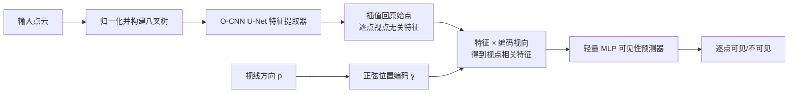

## 一句话总结

本文把点云的"某个视点下每个点是否可见"这一问题重新表述为逐点二分类任务，用一个基于八叉树 CNN 的 3D U-Net 提取与视点无关的点特征、再用轻量 MLP 结合视线方向预测可见性，从而在精度和速度上都大幅超越传统的隐藏点移除（HPR）方法，最高可达 126 倍加速。

## 研究背景

点云是图形学、计算机视觉与机器人领域最常用的 3D 表示之一，但"从给定视点判断每个点是否可见"却很棘手：点在数学上是无穷小的，一个点恰好被另一个点遮挡的概率几乎为零，加之点云稀疏且缺乏显式连接关系，可见性天然存在歧义。

现有做法主要分三类，各有短板：

- 先做表面重建再在重建面上做可见性测试。但表面重建本身是开放难题，对大规模、含噪声或无朝向的点云计算代价高。
- 隐藏点移除（HPR）：把点云相对以视点为中心的球面做变换后计算凸包，落在凸包上的点视为可见。它无需重建，但凸包计算对大点云开销大，且对噪声、凹区域、低密度点云表现差，还需要针对不同密度手工调参数 $$\gamma$$。
- 把点云投影到像素空间、用 2D 网络预测投影点可见性（如 InvSfM）。精度受图像分辨率和点云密度限制，泛化性差。

作者的核心洞察是：无表面先验时可见性本质上是病态问题，但可以借助深度学习从数据中学到必要的先验，从而摆脱手工方法的局限。

## 方法

### 整体框架

网络由两部分组成：一个强大的特征提取器和一个轻量的可见性预测器。特征提取器是建立在八叉树 CNN（O-CNN）之上的 U-Net，为输入点云的每个点提取**与视点无关**的特征，因此该特征只需前向一次即可在多个视点间复用；可见性预测器是一个 MLP，把逐点特征与编码后的视线方向结合，输出该点在该视点下"可见/不可见"的二分类结果。

### 关键设计

1. **八叉树 U-Net 特征提取器**：输入点云先归一化到单位立方体，递归细分非空体素构建八叉树，最细节点存该体素内点的平均坐标（若有法向则拼接平均法向）作为输入信号。U-Net 由残差块、下采样/上采样层和跳跃连接构成，每个残差块含两层八叉树卷积并配合批归一化与 ReLU。最后用八叉树上的插值模块把节点特征溅射回原始点。八叉树对点云起到重采样作用，使不同采样密度下的特征近似一致，这是其可扩展性的来源。

2. **视线方向的正弦编码**：视线方向表示为 3D 单位向量 $$\mathbf{p}=(p_1,p_2,p_3)$$，每个分量用一组正弦函数编码以帮助网络学习高频细节：$$\gamma(p_i)=\left(\sin(2^0\pi p_i),\cos(2^0\pi p_i),\dots,\sin(2^{L-1}\pi p_i),\cos(2^{L-1}\pi p_i)\right)$$，其中 $$L$$ 为频率数。三个分量分别编码后拼接。

3. **视点相关特征与 MLP 预测**：把编码后的视向与 U-Net 提取的特征**相乘**（实验中相乘略优于拼接）得到视点相关特征，送入两层全连接的 MLP（隐藏维 128 与 64），输出两通道分别代表可见与不可见的分数。训练用交叉熵损失：$$L=-\frac{1}{N}\sum_{i=1}^{N}\left(y_i\log(\hat{y}_i)+(1-y_i)\log(1-\hat{y}_i)\right)$$，其中 $$y_i$$ 为点 $$i$$ 的真实可见性，$$\hat{y}_i$$ 为预测值。

4. **训练数据构造**：为解决缺乏可见性标注的问题，作者用 ShapeNet 网格生成合成监督数据。先把网格修复为水密且流形，随机采样 $$200k$$ 个表面点，并在点云包围球面上均匀随机采样视点；对每个点连接到视点构成线段并与所有三角面求交，有交点则该点不可见，否则可见，由此得到真值标签。虽为合成数据训练，模型对真实数据仍能良好泛化。

## 实验结果

在 ShapeNet 测试集上，以可见性准确率为指标，跨 2k/8k/32k/81k 四种点密度与 HPR、HPRO、InvSfM 对比（下表为各方法的平均准确率，%）。本文方法在几乎所有情形下均领先，尤其在稀疏点云与复杂形状上优势明显；带法向输入时进一步提升，而其他方法无法利用法向。

| 方法 | 2k | 8k | 32k | 81k |
| --- | --- | --- | --- | --- |
| HPR | 89.3 | 93.6 | 95.1 | 96.2 |
| HPRO | 82.3 | 85.6 | 88.6 | 87.7 |
| InvSfM | 39.5 | 52.7 | 65.2 | 70.9 |
| Ours | 93.0 | 96.3 | 97.2 | 97.4 |
| Ours（含法向） | 97.3 | 97.7 | 97.6 | 97.6 |

在稀疏 2k 点云上，本文比最好的已有方法高出 3.7% 以上；在 81k 稠密点云上高出 1.5% 以上；在 table、bench 等复杂类别上超出 5.0% 以上。效率方面，本文时间复杂度约为 $$O(n/m)$$（$$m$$ 与 GPU 核心数相关），而 HPR 平均为 $$O(n\log n)$$、最坏 $$O(n^2)$$；当点数超过 200k 时，本文处理仅需 4.27 ms，而 HPR 需 541.5 ms，实现约 126 倍加速。此外，仅用 13 类训练在其余 5 类上测试，准确率下降不足 0.3%，并在 ABC、Google Scanned Objects 等跨数据集/真实扫描上保持鲁棒。

## 亮点与局限

亮点：

- 把可见性判定重新表述为可学习的逐点二分类任务，用数据先验取代手工先验，摆脱了 HPR 对逐点云调参的依赖。
- 视点无关特征只需前向一次即可复用于多视点，配合八叉树的重采样特性，兼顾实时效率与跨密度可扩展性。
- 全流程可微、可端到端训练，便于嵌入其他优化或学习管线；支持点云可视化、法向估计、Poisson 表面重建、阴影投射、视角优化等多种下游应用。

局限（作者指出）：

- 仅面向单个物体、且视点位于视觉包（visual hull）外的情形，尚未支持场景级或多物体可见性。
- 依赖真值可见性标签训练，真实场景中未必可得，可探索半监督/自监督策略。
- 目前是二值可见性，难以刻画部分遮挡或透明效果，可扩展为概率可见性。

## 延伸思考

把"几何可见性"这类传统上依赖显式计算几何（凸包、求交）的问题交给学习到的先验来解决，是一个有代表性的思路转变：当问题本身病态、且手工算法在噪声与稀疏性下退化时，数据驱动的近似反而更稳更快。值得注意的是，加速的关键并不只是网络本身，而是"视点无关特征可复用"这一结构性设计——它把每视点重复的凸包计算换成了一次性的特征提取，这提示我们在设计学习系统替代经典算法时，除了追求精度，更应关注计算能否在使用维度上被摊销。作者提出的概率可见性方向也很有想象空间：若能输出软可见性，将天然契合点基渲染中的透明与抗锯齿需求，并可能与可微渲染、3D 高斯等表示形成互补。
