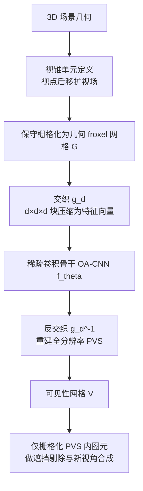

## 一句话总结

NeuralPVS 是首个用深度学习做可见性计算的方法：它把场景栅格化成视锥对齐的体素网格（froxel grid），再用一个稀疏卷积网络在约 100 Hz（每帧 10 ms）内预测出大场景的"从区域可见集"（from-region PVS），漏几何率低于 1%，且无需针对具体场景做预计算或微调。

## 研究背景

可见性计算是计算机图形学的基础问题，支撑着阴影贴图、光场渲染、全局光照、碰撞检测等大量应用。常见做法是求解一个潜在可见集（PVS），即场景中可见部分的近似。PVS 又分为"从单点"和"从区域"（视锥单元 viewcell）两类：商业游戏引擎常在着色前算一个从点 PVS 来减负，而从区域 PVS 对帧外推、预取、流式渲染等场景更有价值。

问题在于，从区域 PVS 计算复杂度天然很高，绝大多数算法只能作为静态场景的预计算步骤（如虚幻引擎的预计算可见性）。近年出现的一些在线方法（相机偏移空间、深度剥离、粗八叉树 + k-buffer 等）虽有进展，但受限于底层算法：要么需要维护昂贵的排序链表，要么依赖光追硬件的随机收敛，要么每层都需 GPU 同步，在高分辨率和高几何复杂度场景下扩展性受限。作者观察到：可见性可以高效地表达在一个 froxel 网格里——每个 froxel 只需一个比特标记是否被遮挡，而这种网格构建远比链表、k-buffer 或深度剥离层廉价，并且天然适合作为卷积网络的输入。

## 方法

### 整体框架

NeuralPVS 把 PVS 计算重新表述为一个体素到体素的映射学习问题。给定视锥单元，先把场景几何保守栅格化进一个几何网格 $$G(x)$$（占用为 1、否则为 0），网络预测出同一空间下的可见性网格 $$V(x)$$，再据此剔除不可见 froxel 内的图元。为了达到实时速度，网络前后各加一个"体积守恒交织/反交织"层来压缩数据，中间用稀疏卷积骨干 OA-CNN 做推理。整条流水线每个视锥单元只需一次前向推理，随后可复用该 PVS 直到相机离开当前视锥单元。

### 关键设计

1. **Froxel 化的可见性表示**：场景被栅格化进视锥对齐、以归一化设备坐标表达的规则网格（典型分辨率 $$256^3$$）。为保证无缝栅格化会做超采样，并把 $$x$$ 轴上连续 8 个 froxel 用原子按位或打包进 8-bit 整数以支持并发写入。网络运行成本只与网格分辨率相关，与目标图像分辨率、场景几何复杂度都无关，这是相对传统算法的关键优势。

2. **3D 体积守恒交织（interleaving）**：CNN 推理时间近似线性依赖输入分辨率，而对特征通道数不敏感。作者把一个 $$d \times d \times d$$ 的块堆叠成一维特征向量，从而把空间尺寸缩小 $$d^3$$ 倍、把这部分成本转移到通道维；反交织再还原。$$d$$ 取 $$\lbrace 8, 16, 32 \rbrace$$ 以对齐内存，实验中 $$d=16$$ 最优。消融显示交织是实时化的关键：把推理速率从 39 Hz 提升到 100 Hz（约 2.5 倍加速），并降低约 70% 显存。

3. **稀疏卷积骨干 OA-CNN**：稠密体素网络（如 VNet）即便其稀疏变体也太慢。由于体素场景占用率通常低于 5%，作者采用具有自适应感受野和动态卷积权重的 OA-CNN，兼顾速度与精度。消融中用 VNet 替换会使 FNR 上升约 15%。

4. **排斥式可见性损失（RVL）**：真实场景可见 froxel 只占 0.5%~10%，数据极不均衡，网络易陷入"全预测为可见"的局部极小。作者在加权 Dice 损失（把漏检 FN 的惩罚按系数 $$\alpha$$ 放大）之外，提出 RVL：吸引项 $$L_{attr}=1-\text{FN}/\text{GTP}$$ 拉近预测与真值，排斥项 $$L_{rep}=\text{FP}/\text{GTP}$$ 推离非可见区。消融显示去掉 RVL 会导致 FPR 高达 0.618（几乎把整个场景判为可见）。总损失为 $$L=\lambda \cdot L_{dice}+(1-\lambda)\cdot L_{rv}$$，训练用 $$\lambda=0.99$$。

## 实验结果

在两个室内场景（Sponza、Robot Lab）与三个室外场景（Viking Village、Big City、Industrial Set）上评测，每个场景沿预录相机路径渲染 60 秒 60 Hz 动画。指标包括假阴率 FNR、假阳率 FPR、像素错误率 PER 和图像 SSIM。所有测试场景对网络完全未知（仅用纯合成随机几何训练）。与目前最快的从区域 PVS 方法 Trim Regions（TR）[Voglreiter 等 2023] 在同一 GPU、同一场景下对比，下表为主实验（表 1，Ours 用 $$r=30, d=16$$）：

| 场景 | 时间/ms ↓ (Ours) | 时间/ms ↓ (TR) | 显存/MB ↓ (Ours) | PER/% ↓ (Ours) | PER/% ↓ (TR) | SSIM ↑ (Ours) |
|---|---|---|---|---|---|---|
| Viking Village | 9.9 | 19.3 | 328.8 | 0.032 | 0.006 | 0.9996 |
| Robot Lab | 9.9 | 17.2 | 318.0 | 0.255 | 0.030 | 0.9984 |
| Sponza | 10.1 | 17.8 | 323.4 | 0.151 | 0.021 | 0.9981 |
| City | 10.3 | 16.4 | 333.5 | 0.142 | 0.006 | 0.9988 |

TR 平均 57 Hz（18 ms），本方法超过 100 Hz（10 ms），速度提升约 76%；平均 FNR 比 TR 低 83.8%、FPR 低 63.4%。虽然本方法 PER 略高于 TR，但 SSIM 均接近 1，说明误差在人眼层面几乎不可察觉。速度上，PVS 在相机以 3 m/s 移动时可复用 6~18 帧，摊销后推理仅占 60 Hz 应用约 3.3% 的计算时间，非常适合帧外推与流式渲染。

## 亮点与局限

亮点：
- 首个用神经网络求解可见性/PVS 的工作，把从区域 PVS 从"离线预计算"推进到"实时在线推理"。
- 运行成本只依赖 froxel 网格分辨率，与场景几何复杂度、目标图像分辨率解耦，扩展性好。
- 交织机制与 RVL 分别解决了实时性与数据极度不均衡两大难题，且模型可作为传统 PVS 生成器的即插即用替代，无需针对场景微调。
- 仅在纯合成简单几何上训练即可泛化到多种未知真实场景，鲁棒性强。

局限：
- 在复杂遮挡关系（多层薄遮挡物、金属栅栏等训练集未覆盖的结构）和远景低分辨率区域会产生更多漏检像素。
- 方法本质上仍依赖训练数据分布，针对特定场景微调才能进一步降低误差。
- 视锥单元定义在纯空间中，动态物体需借助时序包围体（TBV）额外处理，且动态遮挡物情形难以从中获得加速。

## 延伸思考

这项工作最具启发性的一点，是把"可见性"这一几何/组合问题转译成了体素网格上的稠密预测任务，从而让 3D 视觉里成熟的稀疏卷积与自适应感受野技术得以迁移过来。它提示我们：许多传统图形算法的瓶颈并不在数学定义本身，而在于其数据结构不利于并行与硬件加速；换一种对 GPU 友好的表示（froxel + 稀疏张量），再叠加学习，可能带来量级上的性能改变。同时，"随机合成几何训练、真实场景推理"的成功也说明可见性更多取决于局部遮挡的几何模式而非具体语义，这为低成本构造训练集提供了思路。未来若把该范式推广到辐射传输、阴影、全局光照等同样以可见性为核心的任务，或引入八叉树/哈希网格等更紧凑的空间结构，很可能进一步压缩成本；而合成数据与真实几何之间的域差距、以及动态遮挡物的处理，仍是走向通用生产管线前需要解决的关键问题。
