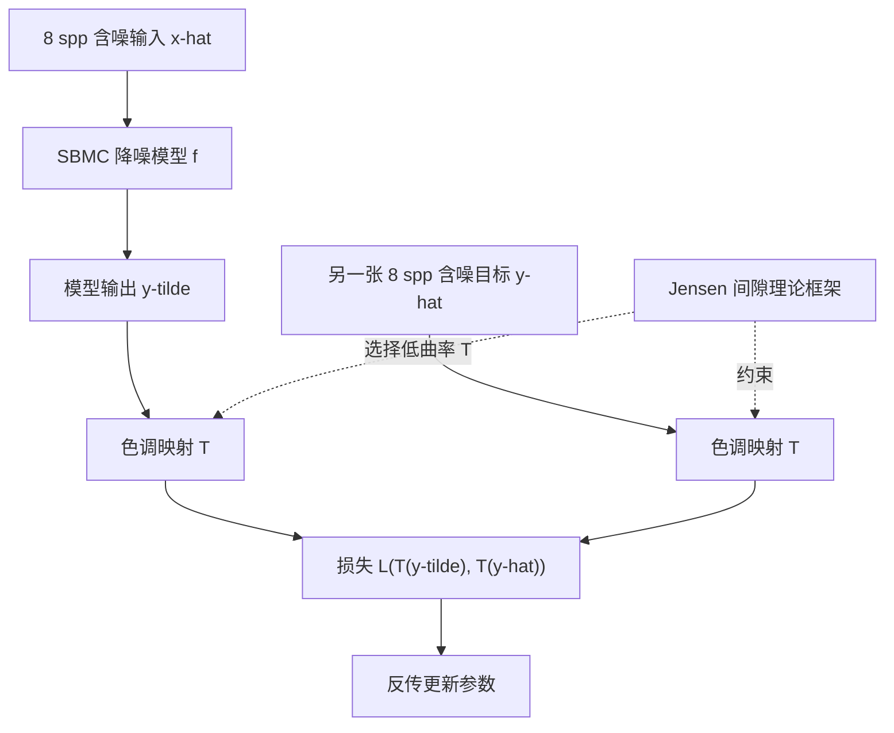

## 一句话总结

本文证明了在 Noise2Noise 训练中对含噪目标图施加特定的非线性函数（如色调映射）只会引入可忽略的偏差，从而让蒙特卡洛降噪器可以只用低采样含噪图像对训练，效果逼近用干净参考图训练的原始实现。

## 研究背景

学习型降噪器通常靠"含噪输入 + 干净参考"的成对数据做监督训练，但在长曝光摄影、蒙特卡洛渲染等场景中，干净参考图需要海量采样才能得到，代价高昂。Noise2Noise 提出用"含噪输入 + 含噪目标"的弱监督方式训练：只要噪声零均值，用 $$L_2$$ 损失恢复出的含噪目标期望 $$E[\hat{y}]$$ 就等于干净目标 $$y$$，训练误差随样本量增加趋于零。

但 Noise2Noise 有一个关键限制：对含噪目标施加非线性函数会让结果产生偏差，因为一般情况下 $$E[\varphi(\hat{y})] \neq \varphi(E[\hat{y}])$$。而图像处理中非线性函数很常见，回避它们就限制了可对目标做的预处理。蒙特卡洛噪声天然零均值，本是 Noise2Noise 的理想对象，但渲染图往往是跨越多个数量级的高动态范围（HDR），低采样下 $$L_2$$ 损失会被离群值压垮而无法收敛。业界常用做法是对输出和目标施加非线性的色调映射来压缩动态范围，可这恰好被认为与 Noise2Noise 不兼容。本文要解决的正是这个矛盾：能否既用非线性色调映射稳住 HDR 训练，又不破坏 Noise2Noise 的无偏性。

## 方法

### 整体框架

作者的核心洞见是：某些非线性函数施加到含噪目标上时引入的偏差极小。他们基于 Jensen 间隙 $$E[\varphi(\hat{y})] - \varphi(E[\hat{y}])$$ 建立理论框架，量化非线性对 Noise2Noise 训练的偏差影响，并据此刻画出一类"低偏差"的非线性函数。方法落地时，把非线性色调映射函数 $$T(v)$$ 同时施加到模型输出 $$\tilde{y}$$ 与含噪目标 $$\hat{y}$$ 上再送入损失，即 $$L(T(\tilde{y}), T(\hat{y}))$$，要求 $$T(v)$$ 二阶可导、严格单调且在 $$v \ge 0$$ 时非负。

### 关键设计

1. **对损失最小值的解析推导**：把训练目标写成对每个输入分别最小化内层期望 $$\arg\min_{\tilde{y}} E_{\hat{y}\mid\hat{x}}[L(\tilde{y}, \hat{y})]$$。对施加色调映射后的 $$L_2$$ 损失求导得到最小值 $$\tilde{y} = T^{-1}(E_{\hat{y}\mid\hat{x}}[T(\hat{y})])$$，并证明其在 $$\tilde{y} \ge 0$$ 上伪凸、为唯一全局最小；对 $$L_{rMSE}$$、$$L_{HDR}$$ 也给出对应的最小值表达式。

2. **用 Jensen 间隙界定偏差**：借助 Liao 与 Berg 的方法，把偏差写成 $$J(\mu)\mathrm{Var}(X)$$ 的上下界形式，其中 $$J$$ 与非线性函数在均值附近的曲率相关。偏差在两种情形下变小：含噪目标方差 $$\mathrm{Var}(\hat{y})$$ 小，或 $$\varphi(\hat{y})$$ 接近线性。

3. **选择低偏差的非线性函数**：好的色调映射应在零附近曲率大（有效压缩动态范围）、向无穷方向趋于线性（低 $$J(y)$$）。HDR 图的干净目标 $$y$$ 往往取值较大，正好落在低 $$J(y)$$ 区间。再结合 Bhatia-Davis 不等式 $$\mathrm{Var}(\hat{y}) \le (M-y)(y-m)$$（取最小值 $$m=0$$），可知方差界在 $$y$$ 接近 0 或最大值 $$M$$ 时也很小，进一步压低偏差。

4. **落到实处的组合**：评估 Reinhard 映射 $$T_R(v)=v/(1+v)$$、加伽马压缩的 $$T_{RG}(v)=(v/(1+v))^{1/2.2}$$ 与纯伽马 $$T_G(v)=v^{1/2.2}$$，与 $$L_2$$、$$L_{rMSE}$$、$$L_{HDR}$$ 三种损失、以及"施加到输出+目标 / 仅目标 / 都不加"三种位置做网格搜索（共 22 组）。理论预测 $$L_2$$、$$L_{HDR}$$ 配 $$T_R$$、$$T_{RG}$$ 偏差低、表现好，而 $$L_{rMSE}$$ 系列 Jensen 间隙大、表现差。

## 实验结果

方法应用于基于核泼溅网络的离线降噪器 SBMC。训练集仿照 SBMC 生成约 28.4 万对 128×128 样本，但输入与目标都只渲染到 8 spp（原 SBMC 参考图为 4096 spp），且仅含室外场景。在 SBMC 官方 55 个测试场景（参考图 8192 spp）上，与用干净参考训练的 SBMC 及其他降噪器对比，指标 rMSE 与 DSSIM 均越低越好。下表摘自表 1 的核心行：

| 采样数 | 指标 | Input | Ours (Orig.) | Ours (Large) | SBMC |
|---|---|---|---|---|---|
| 8 spp | rMSE | 7.4732 | 0.3193 | 0.2940 | 0.0382 |
| 8 spp | DSSIM | 0.3995 | 0.0707 | 0.0700 | 0.0599 |
| 32 spp | rMSE | 16.5478 | 0.0841 | 0.0588 | 0.0274 |
| 32 spp | DSSIM | 0.2775 | 0.0572 | 0.0545 | 0.0510 |
| 128 spp | rMSE | 1.7717 | 0.0497 | 0.0377 | 0.0254 |
| 128 spp | DSSIM | 0.0488 | 0.0539 | 0.0505 | 0.0488 |

其中 $$L_{HDR}(T_{RG}(\tilde{y}), T_{RG}(\hat{y}))$$ 取得整体最低验证损失与最佳定性效果。仅用含噪数据训练的两个模型在 DSSIM 上全程接近 SBMC，rMSE 在高采样数下接近、低采样数下约高一个数量级；用双倍数据训练的 Large 模型在几乎所有情形优于原始模型。在与其余降噪器的比较中，本方法多数情况下仅次于 SBMC 位列第二，而这是在只用室外场景、参考图采样量少 512 倍的劣势下取得的。

## 亮点与局限

亮点：
- 从理论上打破了"非线性与 Noise2Noise 不兼容"的成见，给出可解析的 Jensen 间隙偏差界，并提炼出"选低曲率非线性函数"的实用准则。
- 让复杂蒙特卡洛降噪器可以完全脱离昂贵的高采样参考图训练，参考采样量减少 512 倍仍逼近原始实现效果。
- 理论框架不局限于降噪，可迁移到 Noise2Void、Noise2Self 等其他利用 Noise2Noise 性质的方法。

局限：
- 解析刻画 Jensen 间隙界只对简单的损失函数与非线性函数可行，复杂情形只能退而求其次靠数值或实验估计。
- 因原始室内数据集 SunCG 已下架，训练仅用室外场景，向室内场景的泛化能力受限；低采样下 rMSE 与干净参考训练仍有约一个数量级差距。

## 延伸思考

这项工作把"非线性预处理会破坏无偏性"这一看似绝对的限制，转化为一个可量化、可优化的偏差-收益权衡问题，思路颇具启发性：与其一刀切地回避非线性，不如借助 Jensen 间隙这类工具去定位"偏差可忽略"的安全区间。沿此逻辑，色调映射之外的许多非线性预处理（如感知色彩空间变换、对数域处理）都值得重新审视其在弱监督训练中的可用性。另一个耐人寻味的点是作者指出——由于现实中永远采集不到真正零噪的图，即便用所谓"干净"参考训练，本质上也在做 Noise2Noise，这提示监督与弱监督之间的界线并没有想象中清晰。最后，论文引用 Noise2Noise 原作在别的任务上曾以含噪数据超越干净参考的先例，暗示"用更多廉价含噪数据换取更强性能"或许是比死磕高采样参考图更划算的方向。
