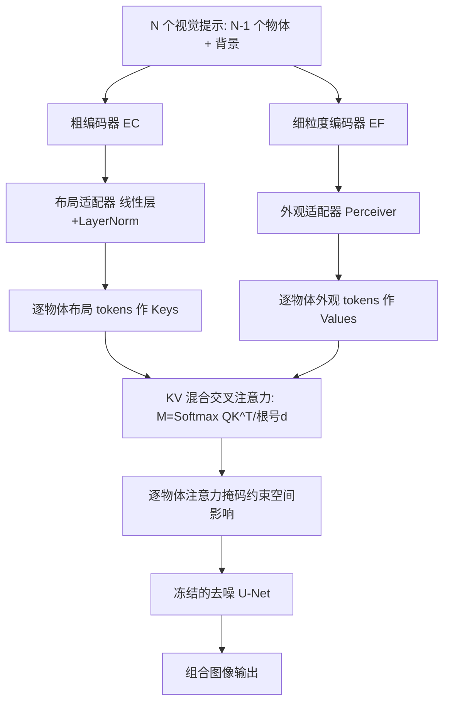

## 一句话总结

提出 VisualComposer，把多个"物体级视觉提示"（前景物体 + 背景图）像文本提示一样注入文生图扩散模型，通过一种"键取粗、值取细"的 KV 混合交叉注意力，在保持每个物体身份的同时生成布局、姿态、场景各异的组合图像。

## 研究背景

文生图模型已能根据文本生成包含多物体、复杂交互的照片级场景，但把"图像"作为提示（visual prompt）并不是这类架构的原生能力。为此出现了个性化与定制方法，其中广泛使用的是图像提示适配器 IP-Adapter：它把整张输入图编码后经解耦交叉注意力注入模型，让文本与视觉线索联合作用。

IP-Adapter 有两个主要缺陷。其一，它把输入图当作单一整体提示，无法区分与单独控制场景中的各个物体。其二，它存在固有的"身份保持 vs 多样性"权衡：编码器瓶颈小（信息压缩强）时难以保住物体细节、身份丢失；瓶颈大（保留细节多）时又会过拟合原图的姿态与结构，导致生成布局与姿态缺乏变化。

作者由此指出，需要一种既能保留各视觉元素独特特征、又能生成连贯灵活组合的方法，并且无需用户预先提供布局。

## 方法

核心洞察来自交叉注意力中键与值的分工：注意力图（由键决定）主要控制布局，值主要决定外观。据此作者用两个不同瓶颈的编码器分别产生键与值——粗编码器（窄瓶颈，CLIP 全局嵌入）产键以促进姿态与布局的多样性，细粒度编码器（宽瓶颈，CLIP 倒数第二层网格特征）产值以精确保留身份细节，二者混合即"KV 混合交叉注意力"。

关键设计一：KV 混合交叉注意力。每个视觉提示经双流处理——外观流用细粒度编码器加 Perceiver Transformer 外观适配器得到外观 tokens，布局流用粗编码器加线性层布局适配器得到布局 tokens。二者拼接后送入加在每个交叉注意力层旁的解耦 KV 混合层：布局 tokens 作键、决定每个提示在图中的空间影响（体现为逐物体注意力掩码）；外观 tokens 在算完注意力掩码后作值注入，因而只影响外观与身份。基础文生图模型与两个图像编码器全程冻结。

关键设计二：训练目标。训练样本由真实图与合成多物体图构成，每个样本含输入图、文本、$N-1$ 个二值物体掩码，以及把所有物体抠除后修补得到的背景图；物体视觉提示由掩码作用于原图得到，第 $N$ 个提示为背景。仅优化外观适配器、布局适配器及 KV 混合层的 $f_K^{img}, f_V^{img}, f_Q$ 线性层。损失为标准扩散重建损失加一个有界交叉注意力损失 $$L_{xa}^{n}=1-\frac{M_{img}^{n}\odot m^{n}}{M_{img}^{n}\odot m^{n}+\alpha\,M_{img}^{n}\odot(1-m^{n})}$$，鼓励每个提示的注意力图 $M_{img}^{n}$ 与其物体掩码 $m^{n}$ 对齐，惩罚物体不出现区域的注意力。

关键设计三：推理期组合引导（Compositional Guidance）。分两阶段生成——先不干预生成一张图，用开集分割得到候选片段，再用 DINOv2 相似度作代价、匈牙利算法把每个输入提示与片段做一一匹配 $\sigma(n)$。随后调整注意力：把提示 $n$ 匹配片段外的区域在 Softmax 前置为 $-\infty$，抑制串扰与重复；并定义身份损失 $$L_{id}=\sum_{n}\bigl(1-\mathrm{Sim}(n,\sigma(n))\bigr)$$ 反传更新细粒度编码器的外观 tokens——只更新外观 tokens 以在不改变布局的前提下精修身份。

## 实验结果

评测在改造自 DreamBooth 的组合数据集上进行：随机采样单物体并配随机背景，生成 300 个输入，每个含 3、4 或 5 个视觉提示。多样性用同一输入不同随机种子 5 张输出两两 LPIPS 平均衡量（越高越多样）；身份保持用新提出的"组合身份指标"——对生成图做开集检测、以 DINOv2 或 CLIP 特征相似度经匈牙利匹配输入与检出物体，得 $\mathrm{DINO}_{comp}$ 与 $\mathrm{CLIP}_{comp}$。基础模型为 Stable Diffusion 1.5。

| 方法 | LPIPS_avg（↑，多样性） | DINO_comp（↑，身份） | CLIP_comp（↑，身份） |
|---|---|---|---|
| IP-Adapter | 0.669 | 0.201 | 0.481 |
| IP-Adapter Plus | 0.578 | 0.255 | 0.560 |
| BLIP-Diffusion | 0.734 | 0.209 | 0.511 |
| KOSMOS-G | 0.687 | 0.294 | 0.596 |
| λ-ECLIPSE | 0.671 | 0.241 | 0.669 |
| Break-A-Scene | 0.587 | 0.363 | 0.655 |
| VisualComposer（本文） | 0.688 | **0.518** | **0.676** |

本文在身份保持两项指标上大幅领先，同时多样性保持在较高水平。图像提示类方法普遍出现身份融合（如 BLIP-Diffusion 把灰猫与红色松狮犬混成偏红的灰猫），KOSMOS-G 与 λ-ECLIPSE 难以生成多物体且属性泄漏严重，优化式的 Break-A-Scene 因依赖输入图内真实交互而布局不自然且逐图优化代价高。消融显示：键值都用细粒度编码器会过拟合、缺乏变化；都用粗编码器则身份保持差；KV 混合取得更好折中，加入组合引导后身份保持与多样性进一步提升，并减少属性泄漏与重复物体。

## 亮点与局限

亮点在于把"键控布局、值控外观"这一注意力分工落成可操作的架构：用两个互补瓶颈的编码器分别供键与值，正面化解了身份保持与组合多样性的固有权衡；且支持物体级的独立视觉提示（含背景），无需预定义布局；再以推理期组合引导借分割与最优匹配抑制串扰、重复与身份漂移，且只更新外观 tokens 不扰动布局。

局限在于流程依赖开集检测与分割、DINOv2 匹配等外部模块的可靠性，两阶段推理与反传引导增加了推理开销；组合身份与多样性指标本身对姿态变化敏感，度量组合保真仍不完美；对更复杂交互与更多物体的可扩展性有待进一步验证。

## 延伸思考

这项工作的方法论价值在于把交叉注意力内部键与值的语义角色显式解耦，并用"不同信息瓶颈"这一简单旋钮去分别服务"要变的"（布局）与"要留的"（身份）。这种"按变量分配表征粒度"的思路可迁移到更广的条件生成：例如把风格、光照、材质等属性也拆到不同粒度的通道上分别注入。另一方面，推理期以分割与最优匹配做"生成—校正"的组合引导，与当下流行的验证式回路一脉相承，其上限同样受制于分割与相似度度量的准确性；若能把这类离线校正内化为训练时可微的结构约束，或许能减少推理开销并进一步稳住多物体场景的一致性。
