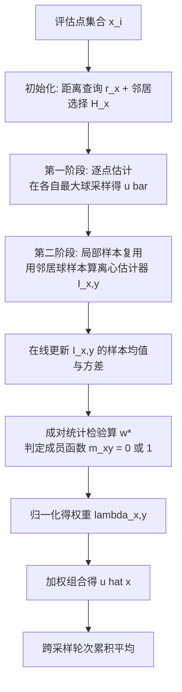

## 一句话总结

把蒙特卡洛去噪里的成对统计检验搬进 Walk on Spheres 型 PDE 求解器：让相邻评估点之间安全地复用样本（离心估计器），并用一个基于均值与方差的相似性权重筛掉离群与高偏差的复用，从而在拉普拉斯、泊松、屏蔽泊松以及混合边界等多类问题上稳定降方差、降误差。

## 研究背景

- 领域现状：随机 PDE 求解器（以 Walk on Spheres, WoS 为代表）无需空间离散化，已广泛用于几何处理、流体模拟、笼式形变等图形任务，能解拉普拉斯、泊松、屏蔽泊松方程，并支持 Dirichlet / Neumann / Robin 等边界条件。
- 加速思路：WoS 中各评估点的估计相互独立，为提速需要引入评估点之间的相关性来复用样本。离心估计器（off-centered estimator）正是一种复用手段——点 $$x$$ 落在邻居 $$y$$ 的最大球 $$B_y$$ 内时，可用 $$B_y$$ 上的样本反过来估计 $$u(x)$$。Czekanski 等 2024 在纯拉普拉斯情形用泊松核给出确定性上界作为权重。
- 核心痛点：把上述方案推广到更一般的算子时会暴露两个问题。其一是相关性伪影：一个误差较大的复用样本会污染所有依赖它的评估点，产生明显噪点与结构性瑕疵。其二是偏差：当离心格林函数无法精确计算、只能近似时（如屏蔽泊松），会引入额外偏差。确定性的泊松界权重无法有效约束这些更复杂情形下的方差。
- 本文 idea：借鉴 Sakai 等 2024 的蒙特卡洛统计去噪框架，用成对统计检验决定"某个离心估计器是否够格参与合并"，以抑制离群点、并在近似格林函数时提供可调的偏差-方差权衡。

## 方法

整体框架：把 $$u(x)$$ 表示为在多个积分域上的估计器的加权组合。中心估计器 $$\hat I_{x,x}$$ 用点 $$x$$ 自己的最大球；离心估计器 $$\hat I_{x,y}$$ 用邻居 $$y$$ 的球 $$B_y$$ 的样本来估计 $$u(x)$$。最终解为 $$\hat u(x)=\sum_{y\in H_x}\lambda_{x,y}\hat I_{x,y}$$，权重满足 $$\sum_{y\in H_x}\lambda_{x,y}=1$$。关键是如何确定权重 $$\lambda_{x,y}$$。

关键设计一（统计加权，核心）：把中心估计器 $$\hat I_{x,x}$$ 当作相似性参照，用如下统计量判定邻居是否可信：

$$w^{*}=\frac{(\hat I_{x,x}-\hat I_{x,y})^{2}+\mathrm{Var}(\hat I_{x,y})}{(\hat I_{x,x}-\hat I_{x,y})^{2}+\mathrm{Var}(\hat I_{x,y})+\mathrm{Var}(\hat I_{x,x})}$$

当 $$1-w^{*}$$ 超过阈值 $$\gamma$$ 时置成员函数 $$m_{xy}=1$$，否则置 $$0$$；再归一化得 $$\lambda_{x,y}=m_{xy}\big/\sum_{y\in H_x}m_{xy}$$。方差在采样过程中用存下来的样本均值与平方均值在线估计。直觉是：若离心估计器与中心估计器足够接近就纳入合并，一旦某个 $$y$$ 产生离群值就把它从复用中排除。作者特别指出，选中心估计器而非"最小方差估计器"作参照，是因为相似性同时依赖均值与方差，最小方差者的均值可能偏离真值。

关键设计二（偏差-方差权衡）：引入统计权重后估计器不再无偏，但误差被独立估计器的最大误差所界（行内竖线记作 $$\lvert \hat u(x)-u(x)\rvert \le \max_{y\in H_x}\lvert \hat I_{x,y}-u(x)\rvert$$），故当各 $$\hat I_{x,y}$$ 无偏时 $$\hat u$$ 仍随样本数收敛。对屏蔽泊松这类需近似格林函数的情形，通过关系 $$\mathrm{Var}(\hat I_{x,x})\big/(\hat I_{x,x}-\hat I_{x,y})^{2}<(1/\gamma-1)$$ 可知：中心估计器方差高时，允许带偏差的邻居进来降方差；样本增多、中心方差下降后，这些高偏差估计器被逐步剔除。调 $$\gamma$$ 即可权衡偏差与方差。

关键设计三（泛化能力）：框架可扩展到多类问题。对混合 Dirichlet–Neumann 边界，用内切球 $$B_x$$ 替代 Walk on Star 的星形域以支持复用；对梯度场估计，给出离心版的梯度多域估计器；离心格林函数对泊松方程用镜像法精确计算，对屏蔽泊松用 Sawhney 等 2022 的近似。

关键设计四（邻居选择与重要性采样）：并非所有邻居都有益，靠近 $$B_y$$ 边界的离心估计器方差大，故在采样前用 $$H_x=\{y\mid d(x,y)<\min(\alpha r_y,\beta)\}$$（经验取 $$\alpha=0.5, \beta=10$$）预筛；稠密网格上直接按索引找邻居。源项采样用两阶段方法避免格林函数在 $$z\to x$$ 处奇异导致的高方差离群。

## 实验结果

在 3D Dirichlet 泊松问题上与 vanilla WoS、边界值缓存（BVC）、均值缓存（MVC）在等时间预算（500 秒，$$\gamma=0.05$$）下比较 MSE，三个模型 × 三种真值频率 $$\omega$$：

| 模型/频率 $$\omega$$ | Vanilla | BVC | MVC | Proposed |
|---|---|---|---|---|
| 模型1 / $$\pi$$ | 1.947×10⁻⁴ | 1.848×10⁻⁴ | 2.788×10⁻⁵ | 4.504×10⁻⁶ |
| 模型1 / $$2\pi$$ | 1.038×10⁻³ | 5.949×10⁻⁴ | 1.082×10⁻⁴ | 1.302×10⁻⁵ |
| 模型1 / $$4\pi$$ | 5.283×10⁻³ | 9.547×10⁻⁴ | 3.795×10⁻⁴ | 4.352×10⁻⁵ |
| 模型2 / $$\pi$$ | 6.915×10⁻⁶ | 6.526×10⁻⁵ | 3.437×10⁻⁶ | 1.337×10⁻⁶ |
| 模型2 / $$2\pi$$ | 2.886×10⁻⁵ | 1.003×10⁻⁴ | 1.432×10⁻⁵ | 2.613×10⁻⁶ |
| 模型2 / $$4\pi$$ | 1.159×10⁻⁴ | 2.496×10⁻⁴ | 4.002×10⁻⁵ | 5.485×10⁻⁶ |
| 模型3 / $$\pi$$ | 2.708×10⁻⁵ | 3.106×10⁻⁵ | 6.388×10⁻⁶ | 8.707×10⁻⁷ |
| 模型3 / $$2\pi$$ | 1.215×10⁻⁴ | 6.256×10⁻⁵ | 2.879×10⁻⁵ | 2.806×10⁻⁶ |
| 模型3 / $$4\pi$$ | 7.171×10⁻⁴ | 1.707×10⁻³ | 1.140×10⁻⁴ | 9.209×10⁻⁶ |

本方法在全部配置上 MSE 最低，高频情形下比均值缓存低约一个数量级。屏蔽泊松问题上（$$\gamma=0.3$$）相对 BVC 有 3~5 倍改进；混合边界情形在两个模型上最优，仅在 Neumann 边界占 50% 的模型3 上不及 BVC。

## 亮点与局限

亮点：
- 把蒙特卡洛去噪的成对统计检验创造性地引入 WoS 型离心估计器，用同一套均值-方差相似性权重同时解决"相关性伪影"与"近似格林函数带来的偏差"两个问题。
- 提供了可调的偏差-方差权衡：阈值 $$\gamma$$ 越大越早剔除高偏差复用，随样本增多自动收紧，收敛性有误差上界保证。
- 泛化性强：覆盖拉普拉斯、泊松、屏蔽泊松，支持混合 Dirichlet–Neumann 边界与梯度场估计，且与多种逐点估计器兼容。

局限：
- 方法有偏，早期采样阶段估计噪声大，可能一时不如无偏方法；离心格式不再保持均值性质，简单拉普拉斯情形结果可能越出边界极值范围。
- 加权与邻居选择的超参数（$$\gamma, \alpha, \beta$$）全为固定值，各评估点游走数相同，缺乏自适应。
- 纯拉普拉斯情形下，专门设计的泊松界权重仍优于本方法。

## 延伸思考

这项工作最有价值的一点，是把"渲染里的样本复用与去噪"和"随机 PDE 求解里的样本复用"在方法论上打通：离心估计器之于 WoS，恰如 ReSTIR 的空间复用之于像素、MIS 之于多分布重要性采样，而统计检验则扮演了"哪些邻居样本可信"的守门人。这种以中心估计器为参照、用均值加方差判定相似性的思路，本质上是在做一个自适应的偏差-方差控制器。

顺着作者的展望，几个方向值得探索：其一是把固定的超参数与游走预算做成自适应，按局部方差分配算力；其二是发展专门面向 PDE 解的去噪器，而非直接套用图像去噪；其三是把与之正交的加速手段（如路径引导式重要性采样、walk-on-boundary 等替代逐点估计器）叠加进同一复用框架。更长远看，这套"多域估计 + 统计加权"的组合可能成为随机 PDE 求解通用的降方差中间件。
