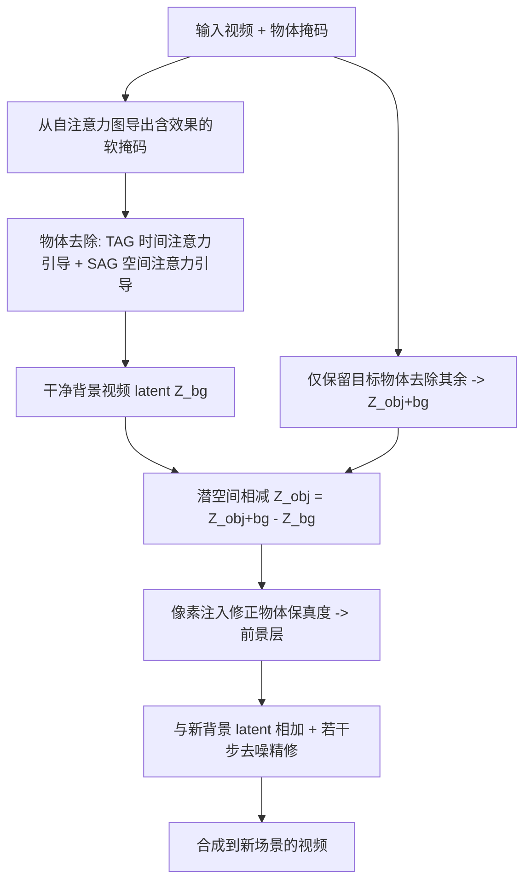

## 一句话总结

OmnimatteZero 是首个免训练的生成式 Omnimatte 方法，直接复用预训练视频扩散模型，通过注意力引导与潜空间算术，在 0.04 秒/帧的速度下完成视频中物体（含阴影、倒影等效果）的去除、抽取与重组。

## 研究背景

Omnimatte 任务要求把一段视频分解为背景层和若干前景物体层，且每个前景层不仅包含物体本身，还要包含它带来的关联效果，比如阴影、倒影、场景扰动。这类分层结果能支撑物体去除、背景替换、重定时、物体复制等编辑应用。

现有方法存在明显瓶颈：

- 视频修复（inpainting）方法虽在标注数据上训练，但难以处理物体带来的间接效果。
- 现有 Omnimatte 方法普遍依赖逐视频的自监督优化，或需要大规模人工数据集、3D 场景建模（网格或 NeRF），训练动辄数小时，渲染每帧需 2.5 到 9 秒。

作者提出的核心问题：能否像图像编辑里成功的免训练方法那样，直接借助现成的预训练视频扩散模型来做 Omnimatte？直接把逐帧图像修复搬到视频上会失败——掩码区域填充不可信，时序一致性也会崩坏，因为视频修复必须同时依赖空间和时间上下文来推断缺失内容。

## 方法

### 整体框架

OmnimatteZero 完全在扩散推理过程中运行，不引入任何训练或测试时优化。流水线依次为：扩展掩码以覆盖物体效果 → 通过注意力引导修复出干净背景 → 用潜空间算术隔离前景 → 把前景层重组到新场景。

### 关键设计

1. 时间注意力引导（TAG）：真实视频中缺失背景往往能在邻近帧找到。作者用 TAP-Net 跟踪物体点在其他帧的对应位置，剔除落在物体掩码内的点，得到背景对应集合 $$C$$。随后把前景点 $$p$$ 与其背景对应点之间的时间注意力分数，替换为所有背景点对之间的平均时间注意力：

$$\bar{A}_{temporal}=\frac{1}{\lvert C\rvert(\lvert C\rvert-1)}\sum_{j=1}^{\lvert C\rvert}\sum_{\substack{k=1\\ k\neq j}}^{\lvert C\rvert}A^{(j,k)}_{temporal}(c_j,c_k)$$

这把整个背景集合的一致性线索传递给前景点，促成跨帧一致的修复。

2. 空间注意力引导（SAG）：当某点在其他帧没有对应（静态场景或缺乏运动）时，退化为在同一帧内引导。把前景点 $$p$$ 与周围背景点的空间注意力，替换为同帧背景点对之间的平均空间注意力，保证无时序信息时仍能连贯填充。

3. 关联效果的免训练掩码：作者观察到视频扩散模型的自注意力图不仅关注物体本身，还能关联到阴影、倒影等效果（图像扩散模型如 Stable Diffusion 则做不到，作者将其归因于格式塔心理学的"共同命运"原则——一起运动的元素被视作同一物体）。因此只需一步加噪去噪，从各层注意力图聚合出软掩码，再用 Otsu 阈值得到二值掩码，即可自动把物体连同其效果一并覆盖，无需训练。

4. 前景抽取与重组：对同一视频跑两次去除——一次去掉所有物体得到背景 $$Z_{bg}$$，一次保留目标物体得到 $$Z_{obj+bg}$$，两者相减 $$Z_{obj}=Z_{obj+bg}-Z_{bg}$$ 即得含效果的物体层；由于潜值可能超出模型分布导致物体失真，再用用户掩码在像素空间注入原视频像素做修正。重组时把物体层潜码加到新背景潜码 $$Z^{N}_{obj+bg}=Z^{N}_{bg}+Z_{obj}$$，最后用 3 步加噪去噪平滑融合。

## 实验结果

在 Movies 与 Kubric 两个标准 Omnimatte 数据集上评测背景重建质量（PSNR、LPIPS、SSIM），并对比训练与运行时开销（单张 A100）。下表为背景重建的定量对比（节选），忠于原文数据：

| 方法 | Movie PSNR↑ | Movie LPIPS↓ | Kubric PSNR↑ | Kubric LPIPS↓ | 训练(小时) | 运行(秒/帧) |
|---|---|---|---|---|---|---|
| Omnimatte（Lu 等 2021） | 21.76 | 0.239 | 26.81 | 0.207 | 3 | 2.5 |
| OmnimatteRF（Lin 等 2023） | 33.86 | 0.017 | 40.91 | 0.028 | 6 | 3.5 |
| Generative Omnimatte（Lee 等 2024） | 32.69 | 0.030 | 44.07 | 0.010 | - | 9 |
| DiffuEraser | 29.51 | 0.105 | 35.19 | 0.048 | - | 0.8 |
| OmnimatteZero [LTXVideo]（本文） | 35.11 | 0.014 | 44.97 | 0.010 | 0 | 0.04 |
| OmnimatteZero [Wan2.1]（本文） | 34.12 | 0.017 | 45.55 | 0.006 | 0 | 3.2 |

OmnimatteZero [LTXVideo] 在两数据集上均取得最高 PSNR 和最低 LPIPS，超过所有有监督与自监督基线，且无需任何训练或逐视频优化，运行速度达 0.04 秒/帧（约 24 帧/秒）。作者强调该提升并非来自更强的生成模型：OmnimatteZero 与 Video RePaint 使用同一生成器，但后者指标最差，说明增益来自注意力引导策略本身。定性结果显示其能去除猫在镜子和水中的倒影、狗与自行车（含骑手）的阴影，甚至修正移除跳跃者后蹦床的形变。

## 亮点与局限

亮点：

- 首个免训练、免优化的生成式 Omnimatte 方法，直接复用现成视频扩散模型。
- 刷新速度记录，达到实时（0.04 秒/帧），同时在背景重建上超越有监督/自监督方法。
- 揭示视频扩散模型自注意力天然关联物体与其效果（阴影、倒影），并把它转化为免训练的效果掩码来源。
- 用简单潜空间加减实现前景隔离与重组，方法优雅且通用（在 LTXVideo 与 Wan2.1 上均验证）。

局限：

- 依赖 VAE 压缩与解压，重建视频与原输入可能存在细微偏差。
- 时间对应质量受 TAP 精度影响，在严重遮挡或低分辨率视频下会退化。
- 修复保真度最终受限于底层视频扩散模型的能力，在高复杂或陌生场景可能表现不佳。

## 延伸思考

这项工作最有意思的一点是把"生成模型的内部表征"当作免费的先验来直接读取——自注意力图既是分割线索又是效果关联线索，无需再训练一个分割或抠图网络。这提示我们，随着视频生成模型在保真度和时序一致性上持续增强，OmnimatteZero 这类框架能"零成本"搭上模型进步的顺风车。值得进一步思考的是：注意力引导本质上是对推理过程的手工干预，能否把 TAG/SAG 的思想推广到长视频、多物体强遮挡场景，以及能否用更鲁棒的点跟踪替代 TAP 来缓解遮挡退化，都是自然的下一步方向。
