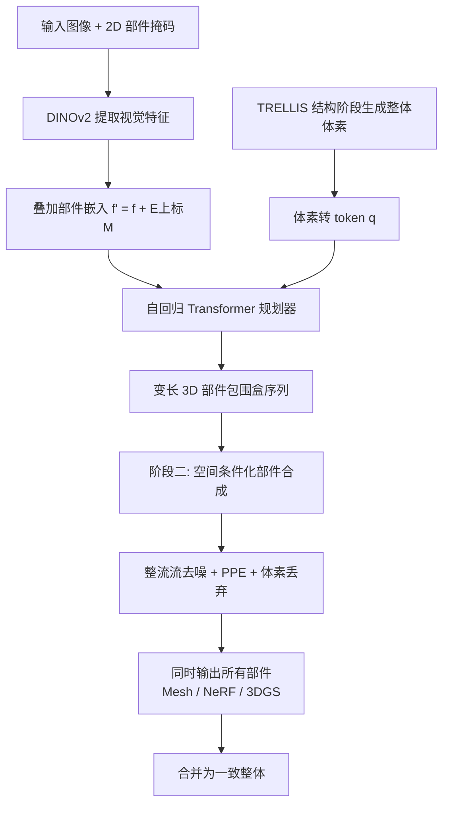

## 一句话总结

OmniPart 把"部件感知的 3D 生成"拆成两步——先用自回归模型规划一串可控的 3D 部件包围盒，再用空间条件化的整流流模型同时生成所有部件，在保持部件语义解耦的同时维持整体结构一致。

## 研究背景

现代 3D 内容创作越来越需要**具备显式、可编辑部件结构**的资产，用于合成编辑、程序化动画、材质分配和语义理解。然而主流 3D 生成方法大多只产出整块的（monolithic）几何，缺乏真实物体天然的部件结构，难以直接用于这些下游任务。

部件感知的 3D 生成需要在两个相互拉扯的目标间取得平衡：一方面要**低语义耦合**（各部件彼此独立、可单独寻址），另一方面要**高结构一致**（各部件能拼成合理、完整的整体）。已有工作往往顾此失彼：

- 基于 2D 部件分割再重建的方法，受多视角聚合困难与 2D 模型难以捕捉完整 3D 几何的限制，几何不一致、细节保真度不足；
- 直接做 3D 部件生成的方法，要么缺乏对部件分解的细粒度可控性，要么依赖稀缺的 3D 部件级标注，难以扩展。

作者提出的核心主张是：**把高层结构规划与细节部件合成原则性地解耦，再用强条件机制统一起来**。

## 方法

### 整体框架

OmniPart 以输入图像加 2D 部件掩码为条件，分两阶段生成部件感知的 3D 内容。整个框架构建在 TRELLIS 的稀疏体素结构化隐空间之上（一个 3D 网格上的局部隐编码集合 $$c = \{(f_i, p_i)\}_{i=1}^{L}$$，其中 $$p_i$$ 是激活体素的位置索引、$$f_i$$ 是对应的局部隐特征）：

- 阶段一"可控结构规划"：自回归地生成一串变长的 3D 部件包围盒，由灵活的 2D 掩码引导；
- 阶段二"空间条件化部件合成"：在规划好的布局内，微调预训练整体 3D 生成器，同时并一致地生成所有部件。

### 关键设计

1. **2D 掩码引导的自回归包围盒规划。** 每个 3D 包围盒被 tokenize 成离散序列（按 z-y-x 升序排列，加 $$\langle bos \rangle$$／$$\langle eos \rangle$$ 标记），用 decoder-only Transformer 做下一 token 预测。为解决"手算独立部件还是并入手臂"这类分解歧义，引入 2D 掩码作为条件：掩码只界定分解区域、不要求与包围盒一一对应、也不需要语义标签，从而可控地调节部件粒度与数量。

2. **Part Coverage Loss（部件覆盖损失）。** 由于第二阶段能丢弃无效体素却无法补回缺失体素，规划阶段倾向于生成"偏大"的包围盒以完整覆盖各部件。该损失惩罚过小的框——鼓励预测的最小坐标更小、最大坐标更大：
$$
\mathcal{L}_{coverage}(\theta) = \frac{1}{\lvert \mathcal{M} \rvert}\left( \sum_{i \in \mathcal{M}_{min}} \mathrm{ReLU}\left(s_i^{pred} - s_i^{gt}\right) + \sum_{i \in \mathcal{M}_{max}} \mathrm{ReLU}\left(s_i^{gt} - s_i^{pred}\right) \right)
$$
总损失为 $$\mathcal{L}_{total} = \mathcal{L}_{base} + \lambda_{cov}\,\mathcal{L}_{coverage}$$。

3. **部件位置嵌入（PPE）+ 整流流联合去噪。** 整体形状与各部件的噪声隐编码下采样后拼成 1D 序列送入 Transformer；整体形状 token 的 PPE 索引固定为 0，各部件从 1 起分配独立索引、同一部件内 token 共享嵌入。整体 token 用于保留基座模型先验、增强部件到整体的一致性。生成采用整流流线性插值前向过程 $$x(t) = (1-t)x_0 + t\boldsymbol{\epsilon}$$，用条件流匹配目标训练 $$\mathcal{L}_{CFM}(\theta) = \mathbb{E}_{t,x_0,\boldsymbol{\epsilon}}\lVert v_\theta(x,t) - (\boldsymbol{\epsilon} - x_0)\rVert_2^2$$。

4. **体素丢弃机制。** 因体素只能近似粗几何，相邻部件交界处常出现重叠或"噪声"体素。作者给部件隐编码增加一维有效性标量 $$f_{valid}$$：训练时有效体素赋 $$+\alpha$$、噪声体素赋 $$-\alpha$$；推理时对该维取 sigmoid 并与阈值比较（实验取 $$\beta = 0.5$$），有效判据为 $$\mathrm{sigmoid}(f_{valid}) > \beta$$，从而在初始化阶段过滤无效体素、得到干净的部件交界。

训练数据方面：先收集 180K 带部件标注的物体（规划阶段用全部 180K 从零训练自回归模型），再经评分系统筛出 15K 高质量样本用于第二阶段微调。

## 实验结果

在 300 个测试物体（按部件数分为 0–5、6–10、11–15、16–50 四组）上，与三类基线（先生成整体再分割、分割后再补全、单图直接推断部件）对比。所有形状归一化到 $$[-0.5, 0.5]$$ 后计算 Chamfer Distance 与 F1 分数，并在四个旋转角度取最优。

| 方法 | 部件级 CD ↓ | 部件级 F1-0.1 ↑ | 部件级 F1-0.5 ↑ | 整体 CD ↓ | 整体 F1-0.1 ↑ | 整体 F1-0.5 ↑ |
| --- | --- | --- | --- | --- | --- | --- |
| TRELLIS+SAM3D | 0.49 | 0.38 | 0.28 | 0.08 | 0.92 | 0.77 |
| TRELLIS+PartField | 0.19 | 0.69 | 0.52 | 0.08 | 0.92 | 0.77 |
| TRELLIS+PartField+HoloPart | 0.19 | 0.68 | 0.51 | 0.08 | 0.91 | 0.77 |
| Part123 | 0.43 | 0.31 | 0.16 | 0.47 | 0.33 | 0.19 |
| PartGen | 0.44 | 0.43 | 0.30 | 0.11 | 0.86 | 0.69 |
| OmniPart（本文） | **0.18** | **0.74** | **0.59** | **0.07** | **0.93** | **0.80** |

OmniPart 在部件级与整体级指标上均领先。值得注意的是，其合并后的整体形状甚至优于 TRELLIS 直接生成的整体结果，因为它能为每个部件生成完整几何（含交界与被遮挡区域），而单独跑 TRELLIS 无法准确重建这些区域。效率上，从单图到部件级 3D 输出，本文约 0.75 分钟，明显快于 Part123（约 15 分钟）与 PartGen（约 5 分钟）。

包围盒规划阶段的消融显示：去掉覆盖损失虽让框看起来更贴近真值，但体素召回与 IoU 明显下降、拖累第二阶段；去掉 2D 掩码则无法有效控制框的尺寸与位置。

## 亮点与局限

**亮点**

- 把结构规划与部件合成解耦的两阶段设计，兼顾了可控性、部件一致性与整体质量；
- 用 2D 掩码做非一一对应、免语义标签的条件，直观地控制部件粒度与数量；
- 通过微调整体预训练模型（TRELLIS）+ 体素丢弃机制，在部件级标注稀缺的情况下仍能高保真生成，且一次同时生成所有部件、效率高；
- 天然支持动画、掩码控制生成、多粒度生成、材质编辑、几何处理等多种下游应用。

**局限**

- 结果质量依赖 2D 掩码的准确性与 SAM 等分割模型的输出；
- 体素只是粗几何近似，交界处仍需靠丢弃机制清理，存在潜在噪声来源；
- 第二阶段高质量部件标注只有 15K，规模受限；
- 整体能力受基座模型 TRELLIS 表达上限约束。

## 延伸思考

- "先规划离散结构、再条件化生成细节"的解耦范式，与 2D 领域布局到图像、layer 级合成的思路一脉相承，是否可推广到场景级（多物体 + 部件）的分层 3D 生成？
- 2D 掩码作为免标签、免对应的弱条件很灵活，若进一步引入文本或功能语义（如可动关节、受力部件），能否让部件不仅几何独立、还带上物理／功能属性，直接服务仿真与机器人交互？
- 体素有效性打分本质是让模型自己判断"这个体素归不归我"，这种在生成过程中做软性归属决策的思路，或许也适用于其他需要处理边界重叠的组合式生成任务。
