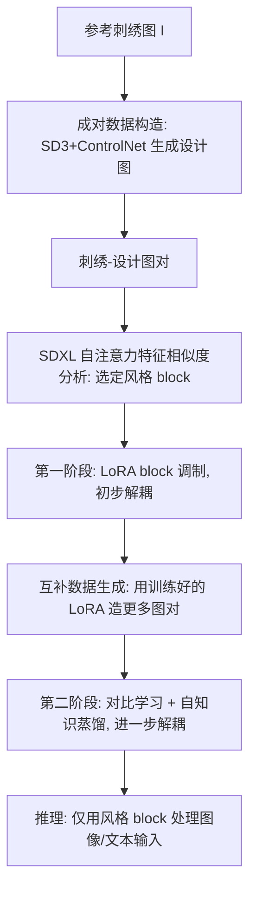

## 一句话总结

本文提出一个基于对比学习的细粒度风格定制框架，以刺绣为代表案例：只用一张参考刺绣图，借助"图像类比"思想构造刺绣—设计图对来定义风格，再通过两阶段对比式 LoRA 调制技术 EmoLoRA 把风格（针法、纱线、亮片等高频结构纹理）从内容（图案与颜色）中解耦，实现由图像或文本输入驱动的新刺绣生成。

## 研究背景

扩散模型正在推动"先售后产（sell it before you make it）"的零售新范式，让商家在实际生产前就能生成逼真的展示图。但对刺绣、真实纺织品这类细粒度结构元素的可控生成仍是难点。刺绣是一种由多样纱线、材料（珍珠、珠子、亮片等）结构化排列构成的纺织艺术，它的风格定制对已有的视觉风格迁移方法提出了独特挑战：

- 只靠预训练模型往往无法泛化到未见过的刺绣；而在大规模数据集上微调也不可行，因为刺绣数据稀缺、类内变化复杂。
- 通用风格迁移常把颜色当作风格的关键组成部分，而刺绣风格聚焦于高频结构纹理、几乎与颜色无关。这导致现有的网络 block 选择方法难以把刺绣风格与其图案设计内容分离——在刺绣里颜色反而属于"内容"。
- 其他用于通用风格解耦的有效约束（如正交约束）也难以捕捉复杂的刺绣风格。

作者由此提出一个新任务：一次性（one-shot）刺绣定制，并给出对比学习框架加以解决。

## 方法

核心思想是"用单张参考图做风格—内容解耦"，包含三个要点：其一，重拾图像类比的经典理念，构造单个图像对来定义风格，减少歧义、避免不同风格图之间的不一致；其二，利用预训练扩散模型的解耦表示，设计一个相似度度量来在图对内与跨图对之间衡量特征相似性；其三，设计对比式 LoRA 调制技术 EmoLoRA，先在选定 block 中捕捉风格，再用自知识蒸馏进一步解耦风格与内容。

整体流程分为：成对数据构造、SDXL 分析、对比式 LoRA 学习、模型推理。

### 成对数据构造

给定单张参考刺绣图，目标是解耦风格与内容以提供对比学习的监督。刺绣风格抽象难以显式刻画，但设计内容相对容易表示。于是作者构建一个刺绣到设计（embroidery-to-design）的数据流水线来生成对应的图案设计图，从而以数据对的形式定义风格。该模块采用 SD3 + ControlNet：先用 HED 检测器提取刺绣图的粗略边缘送入 ControlNet-Canny（保留设计结构、去除刺绣针法），再把模糊化的刺绣图送入 ControlNet-Tile 分支以保持色彩保真度，并用 WD14 生成描述作为提示词，配合"flat design, vector graphic design..."等词以更好地保留设计内容。经验上 SD3 的效果优于 SDXL，可能源于二者预训练数据的差异。

### SDXL 分析与 block 选择

受 B-LoRA 启发，作者利用预训练扩散模型的解耦表示，用不同 LoRA block 分离风格与内容。但与 B-LoRA 不同的是，刺绣风格无法被单个与颜色纠缠的 block 捕捉（因其与颜色无关），单个内容 block 也不足以重建完整设计。基于"UNet 自注意力特征编码空间结构（含高频细节）"这一先验，作者引入相似度度量来指导 block 选择，并选 SDXL 作为基础模型（分辨率更高、视觉保真更好、注意力特征解耦更自然）。

使用 ReNoise 反演（重建质量优于 DDIM），取每个自注意力层的输出特征来比较刺绣—设计图对的差异。设某自注意力层输入特征为 $$F_i$$，$$f_q, f_k, f_v, f_o$$ 分别为 query/key/value/output 的投影，$$d_k$$ 为 query 和 key 的维度，则输出自注意力特征为：

$$
F^o_i = f^o_i\left(\mathrm{Softmax}\left(\frac{Q_i K_i^T}{\sqrt{d_k}}\right) V_i\right)
$$

对每个 block 计算图对之间所有 $$F^o_i$$ 的平均余弦相似度（将 50 步生成分成 10 段求平均）。余弦相似度接近 1 表示该 block 对刺绣—设计图对产生几乎相同的特征，说明它主要表征非刺绣内容。分析发现 down_blocks 1.1、2.0 和 up_blocks 0.1、0.2 与刺绣特征相关性更高（图对间差异更大），且这种差异在去噪后期更显著——因为刺绣风格更关乎精细的低层图像特征，而非粗糙的高层语义。

### 对比式 LoRA 学习（EmoLoRA）

两阶段策略，从单张参考图捕捉刺绣风格，同时缓解标准 LoRA 的过拟合。LoRA 施加于 UNet 的注意力层。

第一阶段——LoRA block 调制。分离出上一步选定的四个 block（记作 $$\theta_e$$）来捕捉刺绣风格，同时用整个 LoRA（$$\theta_a$$）恢复设计内容，其中 $$\theta_e$$ 是 $$\theta_a$$ 的子集。刺绣图的提示词设为 "a \<des\> in [emb] style"，设计图为 "a \<des\>"。训练两步迭代进行：Step 1 把 "a \<des\>" 输入 SDXL 基座 $$\theta_0$$ 与全部 EmoLoRA block，用 $$L_{des}$$ 更新 $$\theta_a$$；Step 2 把 "a \<des\> in [emb] style" 输入四个刺绣 block、"a \<des\>" 输入其余 block，仅更新 $$\theta_e$$，用 $$L_{emb}$$。两个损失为：

$$
L_{des}(\theta_a) = \left\| \epsilon_t - \epsilon_{\theta_0,\theta_a}(z^{des}_t, t, c^{des}) \right\|_2^2
$$

$$
L_{emb}(\theta_e) = \left\| \epsilon_t - \epsilon_{\theta_0,\theta_a}(z^{emb}_t, t, c^{emb}) \right\|_2^2
$$

迭代后刺绣风格主要封装在 $$\theta_e$$ 中并与主内容解耦。但 $$\theta_e$$ 仍含有 Step 1 学到的部分内容信息（因其余 block 单独无法恢复完整内容图），导致生成图可能保留参考刺绣的颜色、与新内容融合欠佳。为此引入第二阶段对比学习。

互补数据生成。用第一阶段训练好的 EmoLoRA，以 "a (color) (object) in [emb] style" 系列提示词（共 $$N=10$$ 个）生成更多刺绣图，把 SDXL 先验与学到的刺绣风格融合。用自注意力输出特征计算各生成图与参考图的平均余弦相似度（只取后期第 5-9 段），按相似度排序取前一半 $$\lceil N/2 \rceil$$ 以保证刺绣质量，再用刺绣到设计流水线得到对应设计图。最后为移除与参考内容过于相似的图，对设计图之间的平均余弦相似度排序，取最不相似的 $$\lceil N/4 \rceil$$ 作为最终互补数据。

第二阶段——对比学习。目标是把不同图对共享的刺绣特征拉近、把刺绣特征与内容特征推远。受 NoiseCLR 启发，在带噪隐空间做对比学习。用"基座+EmoLoRA 预测"减去"基座预测"得到设计内容特征 $$\epsilon_{des}$$；同样用设计图的带噪特征 $$z^{des}_t$$ 但配刺绣提示词 $$c^{emb}$$ 得到 $$\epsilon_{emb}$$：

$$
\epsilon_{des} = \epsilon_{\theta_0,\theta_a}(z^{des}_t, t, c^{des}) - \epsilon_{\theta_0}(z^{des}_t, t, c^{des})
$$

$$
\epsilon_{emb} = \epsilon_{\theta_0,\theta_a}(z^{des}_t, t, c^{emb}) - \epsilon_{\theta_0}(z^{des}_t, t, c^{emb})
$$

由于 $$\epsilon_{emb}$$ 也含设计内容信息、不应被推离 $$\epsilon_{des}$$，因此用 $$\epsilon_{emb*} = \epsilon_{emb} - \epsilon_{des}$$ 表示纯刺绣特征并将其推离内容特征。每个训练批包含参考刺绣—设计对和一个生成对，对比损失为：

$$
L_{con}(\theta_e) = -\log \frac{\exp\left(s(\epsilon^{ref}_{emb*}, \epsilon^{gen}_{emb*})\right)}{\exp\left(s(\epsilon^{ref}_{emb*}, \epsilon^{gen}_{des})\right) + \exp\left(s(\epsilon^{ref}_{des}, \epsilon^{gen}_{emb*})\right)}
$$

其中温度 $$\tau$$ 设为 1（省略），$$s(\cdot,\cdot)$$ 为余弦相似度。由于生成设计图使 $$\epsilon^{gen}_{des}$$ 不够合理，采用三步迭代：Step 1、2 在参考对和生成对上分别按第一阶段方式更新 $$\theta_a$$、$$\theta_e$$；Step 3 用对比损失更新 $$\theta_e$$。

### 模型推理

两阶段训练后，推理时仅用四个刺绣 block $$\theta_e$$ 去更新 SDXL 基座 $$\theta_0$$。文本输入（须含 "in [emb] style"）走标准文生图；图像输入用 SDEdit 先加噪再在提示词引导下去噪。根据风格类型用 ControlNet 保持输入内容：平面刺绣类需精确对齐边界，用 ControlNet-Tile + ControlNet-Canny，并加一个色彩校正模块（将生成图转到 LAB 空间、用输入设计的 A/B 通道替换、再转回 RGB）以增强与输入设计的一致性；对含珠子或亮片的刺绣则禁用 ControlNet-Canny 和色彩校正，以允许边界处的必要改动。

## 实验结果

作者构建了刺绣定制基准：30 张参考刺绣图（含平针、毛巾针、豆针、亮片等多种针法材料）、50 张测试设计图，另预设 20 条文本提示。评测指标除 LPIPS（设计内容保持）、Histogram Loss（颜色一致性/与参考色差异）外，还提出针对刺绣的 High-Frequency Ratio Difference（HFRD），计算生成图与参考图之间高频能量比的绝对差异——因为 VGG、CLIP 等特征提取器主要捕捉颜色、布局或语义，不适合评刺绣风格。文本生成用 CLIP-Score 评语义符合度。

与六种风格迁移方法的定量对比（↓越低越好，↑越高越好）：

| 指标 | Ours | DB-LoRA | B-LoRA | InstantStyle | PairCustomization | StyleID | RB-Modulation |
| --- | --- | --- | --- | --- | --- | --- | --- |
| HFRD ↓（刺绣风格） | 6.50 | 8.15 | 6.63 | 12.41 | 12.48 | 21.66 | 8.10 |
| LPIPS ↓（设计内容） | 14.37 | 14.54 | 14.92 | 7.72 | 22.14 | 21.96 | 65.18 |
| Histogram Loss ↓（设计色） | 26.59 | 28.62 | 30.57 | 32.23 | 43.99 | 45.75 | 48.87 |
| CLIP-Score ↑（文本语义） | 32.23 | 30.94 | 31.84 | 25.14 | 32.47 | 30.31 | 30.04 |
| Histogram Loss ↑（与参考色差异） | 51.32 | 43.89 | 42.70 | 33.64 | 50.49 | 34.13 | 35.48 |

作者指出 Ours、DB-LoRA、B-LoRA 在 HFRD 和 LPIPS 上接近，很可能是现有指标在细粒度上评估刺绣风格与设计内容能力有限所致；InstantStyle 的 LPIPS 最好是因为它主要在还原输入设计。Ours 在设计色 Histogram Loss 上最优（更好地摆脱参考颜色），文本生成时 CLIP-Score 和与参考色差异均最高（语义遵从强、与参考色解耦好）。

由于指标与真实目标存在错位，作者做了用户研究：20 名用户（含 2 名刺绣专业人士、18 名普通消费者），每人随机看 90 对（Ours vs 另一方法），从整体质量、风格一致性、设计保持三方面二选一或弃权。Quality/Style/Design 各 1800 票、有效率分别 91.1%/96.2%/94.2%，Ours 相对所有对比方法和消融变体都获得明显偏好。

消融研究比较三种变体：（1）2-Block 调制——用余弦相似度最低的两个 block；（2）w/o 调制——用全部 block 捕捉风格；（3）w/o 对比学习——只用第一阶段结果。结论：仅两个 block 难以捕捉细粒度刺绣结构；用全部 block 或去掉第二阶段对比学习都无法有效把风格从颜色和语义中解耦，导致与输入设计融合不自然。

## 泛化与应用

方法在三个额外任务上验证了风格—内容解耦能力：

- 照片到艺术画：与同样从单图对学风格的 PairCustomization 相比，Ours 在域内相当、在跨域略优；DB-LoRA 因过拟合训练内容出现伪影，B-LoRA 风格化偏弱。
- 素描上色：在 color-Canny 图对上训练以分离风格（颜色与明暗）和内容（语义与布局），Ours 兼顾色彩一致与内容遵从，而 DB-LoRA 出现内容纠缠、其他方法出现明显色偏。
- 外观迁移：在 appearance-Canny 图对上训练，推理用结构图的 HED 图；仅用风格 block 的 Ours (a) 结构一致性更好，用全部 block 的 Ours (b) 保留部分参考结构并与输入兼容融合。

在刺绣工作流转型方面，方法可用于预览与预售（对齐生产者与消费者偏好、给定参考刺绣或设计图互相推荐兼容搭配）、制造支持（生成多样结果减少数字化确认迭代、配合 Wilcom EmbroideryStudio 数字化得到可制造文件、作为真实感渲染模块），以及借助 ACE++ 将生成刺绣叠加到服装、包、帽子上做直观预览，还能缓解该领域的数据稀缺。

## 亮点与局限

亮点：
- 提出细粒度风格定制的对比学习框架，用构造图像对定义风格 + 对比式 LoRA 调制解耦风格与内容，从单张参考图即可学习。
- 提出并分析一次性刺绣定制这一新任务，抓住了刺绣中"颜色是内容、高频结构纹理才是风格"的独特性质，并提出针对性的 HFRD 指标。
- 在刺绣定制上超越现有方法，并良好泛化到艺术画风格迁移、素描上色、外观迁移三个领域。

局限：
- 对组合多种材料的高度复杂风格或过于抽象的风格表现不佳（如多种珠子交错、抛光水钻的反射特性带来成像困难；抽象笔触风格下 block 选择可能选不到合适层）。
- 尚不支持局部风格指定或编辑。
- 依赖多阶段（成对数据构造、block 选择、两阶段训练），block 为经验性硬选择（如 2、3、7、8）；作者建议用基于低余弦相似度和统计约束的自动 block 选择，以及软加权替代硬选择来在更细粒度上优化。
- 刺绣到设计模块未必能直接泛化到其他风格。

## 延伸思考

这篇工作最有价值的洞见，是把"风格"的定义交还给具体领域：在刺绣里颜色属于内容、高频结构纹理才是风格，这直接推翻了通用艺术风格迁移把颜色当风格核心的默认假设，也解释了为何现成方法和现成指标都会失效。作者的应对是"先用图像类比构造正负样本对定义风格，再用对比学习在带噪隐空间里把风格特征从内容特征中减出来"，其中 $$\epsilon_{emb*} = \epsilon_{emb} - \epsilon_{des}$$ 这一步很关键——它承认刺绣提示触发的特征里天然混着内容，只把纯风格分量拿去做对比，避免了把内容也一起推远。这种"减法式"解耦思路对任何"风格与内容天然纠缠"的定制任务都有借鉴意义。

作者自己指出的未来方向也颇具想象力：把第一阶段当作元训练的 meta-learning 框架、用 LLM 把纯文本映射到风格标签来复用预训练 EmoLoRA、以及面向真正可制造的刺绣指令（EmbIns，类比 SVG 但更复杂）设计可微光栅化器。后者把生成从"逼真图像"推进到"可生产文件"，才是刺绣这类数字化制造场景真正的闭环所在。
