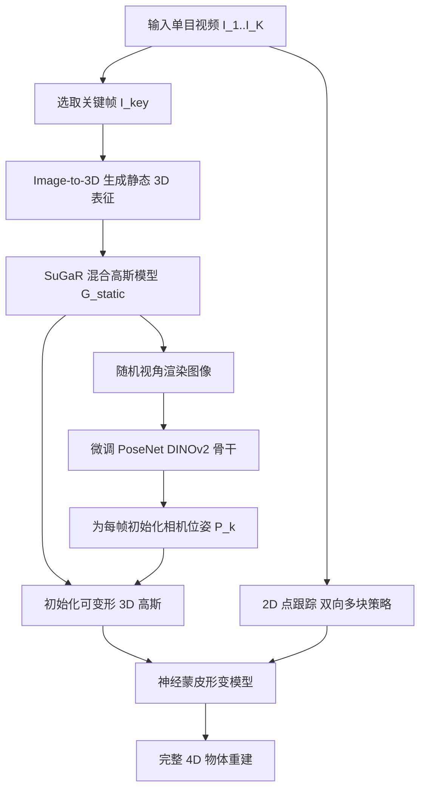

## 一句话总结

PAD3R 从一段随手拍摄、无相机位姿标注的单目视频中，重建出可变形物体完整的、随时间变化的 3D 几何、外观与非刚性形变，即使面对大幅度物体运动、大范围相机移动和有限视角覆盖也能保持鲁棒。

## 研究背景

从单目视频重建动态 3D 物体在游戏、影视、AR/VR 与机器人领域都很关键，但这是一个高度病态的问题：同一段 2D 观测可以对应无穷多种 3D 解释。经典方法要么依赖专用传感器，要么依赖类别专属模型，难以推广到真实世界中多样的物体与场景。

基于可微渲染（NeRF、3D Gaussian Splatting 及其动态扩展）的方法显著提升了通用场景的 3D/4D 重建质量，但通常要求精确的相机位姿和密集的视角覆盖。为摆脱这一依赖，一类工作把预训练 2D（或多视图）扩散模型的生成先验通过 Score Distillation Sampling（SDS）引入 4D 重建，但大多只适用于静态视角的合成场景；另一类工作微调视频扩散模型直接推断多视图，却严重依赖高质量多视图训练数据，难以泛化到含大幅相机与物体运动的真实视频。因此，来自真实野外单目视频的鲁棒动态 3D 重建仍是开放难题。

## 方法

### 整体框架

PAD3R 的核心思路是同时利用生成扩散先验（用于恢复静态 3D 表征）和可微渲染（用于联合估计以物体为中心的相机位姿与随时间变化的形变）。整体分为两个阶段：先做以物体为中心的相机位姿初始化，再做动态高斯泼溅重建。

### 关键设计

1. **以物体为中心的个性化 PoseNet 初始化**：真实视频中相机与物体运动纠缠在一起，且重建目标是动态物体本身，需要估计相对于物体坐标系（而非静态场景）的相机位姿，这比场景位姿估计更难，因为缺乏刚性约束。作者先用 Image-to-3D 方法从关键帧生成静态模型，采用 SuGaR 混合高斯表征（每个网格面附着六个扁平高斯以增强表面细节），再用该模型在随机视角下渲染图像，微调一个以 DINOv2 为骨干、MLP 回归头的轻量 PoseNet 预测 6-DoF 位姿。位姿损失包含平移项、旋转项以及一个不确定性项 $$L_{unc}=(\sigma-(L_{rot}+L_{trans}))^2$$，让预测的不确定性反映实际位姿误差幅度。

2. **神经蒙皮形变模型**：在静态 SuGaR 模型的网格顶点上均匀采样一组控制节点，形变模型以视频时间步为条件预测每帧节点形变。采用混合形变框架，每个顶点形变由邻近控制节点的变换加权混合，融合线性混合蒙皮（LBS）与对偶四元数蒙皮（DQS）；每个控制节点携带旋转、剪切、平移和一个可学习的刚性分数来调节其影响。

3. **双向多块密集跟踪监督**：仅靠光度损失对动态运动的约束有限。作者引入持续 2D 点跟踪提供时序对应，并提出双向多块（bi-directional multi-block）策略：把视频划分为 $$L$$ 个重叠 chunk，前向轨迹为 $$[k_0:K],[k_1:K],\dots,[k_{L-1}:K]$$，反向轨迹为 $$[K-k_0:0],\dots,[K-k_{L-1}:0]$$，其中 $$k_i=i\cdot\delta$$，$$\delta$$ 为时间步长。这保证任意帧对 $$(i,j)$$ 至少被一个 chunk 同时覆盖，大幅提升跟踪密度与遮挡区域的监督覆盖。跟踪损失为 $$L_{track}=\sum_{k,d} v_k^d\cdot\lvert \hat{x}_k^d-x_k^d\rvert$$，其中 $$v_k^d$$ 为可见性掩码，用于排除不可见点。

4. **联合优化目标**：总损失同时优化形变网络与位姿网络：$$L_{4D}=\lambda_{rgb}L_{rgb}+\lambda_{track}L_{track}+\lambda_{multi}L_{multi\text{-}track}+\lambda_{arap}L_{ARAP}$$，其中光度损失 $$L_{rgb}=\lVert \hat{I}-I\rVert_2^2$$，并额外引入 as-rigid-as-possible（ARAP）正则约束局部刚性形变，同时用 MLP 优化每帧的相机位姿增量。

## 实验结果

在 Consistent4D 数据集（单视角输入、四个新视角评估）上，PAD3R 在静态相机设定下于 LPIPS、FVD、CLIP 三项指标均取得最佳；在动态相机设定（假设位姿未知并自行估计）下依然具有竞争力，并超过同样显式建模相机运动的 BANMo。

| Methods | Camera modeling | LPIPS ↓ | FVD ↓ | CLIP ↑ |
| --- | --- | --- | --- | --- |
| STAG4D | ✗ | 0.134 | 1015.57 | 0.917 |
| L4GM | ✗ | 0.152 | 874.49 | 0.921 |
| DM4D | ✗ | 0.128 | 688.84 | 0.936 |
| BANMo | ✓ | 0.279 | 1587.10 | 0.808 |
| PAD3R（静态相机） | ✗ | 0.126 | 613.73 | 0.941 |
| PAD3R | ✓ | 0.137 | 645.09 | 0.942 |

在含大幅相机运动的 Artemis 基准上，PAD3R 全指标最优（LPIPS 0.184 / FVD 1060.04 / CLIP 0.930），而假设静态相机的 STAG4D、L4GM、DM4D 无法处理大范围相机运动。消融实验表明位姿初始化、$$L_{track}$$ 与 $$L_{multi\text{-}track}$$ 各组件都对重建精度与时序一致性有正向贡献；对比 MegaSaM、VGGT 等现成位姿估计器，个性化 PoseNet 初始化能带来最佳重建质量。

## 亮点与局限

亮点：

- 用 Image-to-3D 生成先验训练个性化、以物体为中心的 PoseNet，为后续 4D 重建提供关键的相机位姿初始化，解耦了相机与物体运动的纠缠。
- 双向多块跟踪策略显著扩大长时程运动线索的监督覆盖，缓解遮挡与窄视场带来的信息缺失。
- 类别无关（category-agnostic），对真实野外视频中的大幅相机与物体运动鲁棒，可做完整 360° 动态物体重建。

局限：

- 依赖 Image-to-3D 模型对关键帧的生成质量，需人工选取处于常见、良好姿态的关键帧以避免生成误差。
- 假设物体整体形状与外观在视频中大体保持一致，对外观剧变或强拓扑变化的物体可能不适用。
- 采用测试时优化，单序列在单张 NVIDIA A6000 上 PoseNet 训练约 1 小时、形变模型优化约 1.5 小时，速度上不及前馈方法。

## 延伸思考

PAD3R 的价值在于把"生成先验负责静态几何、可微渲染负责动态与位姿"这一分工做得比较干净，尤其是把相机位姿估计转化为一个由自身生成的 3D 模型监督的个性化回归任务，绕开了野外物体缺乏静态对应关系导致通用 SfM/位姿估计器失效的困境。这提示一个更普适的思路：当通用预训练模型在特定实例上失效时，用生成模型即时"造数据"来微调一个实例专属的小模型，可能比硬套通用模型更有效。

后续可探索的方向包括：将测试时优化替换或蒸馏为前馈推理以提速；把"关键帧生成 + 位姿回归"的思路扩展到多物体、物体间交互或强拓扑变化场景；以及研究当生成先验本身出错时的失败检测与自校正机制，减少对人工选帧的依赖。
