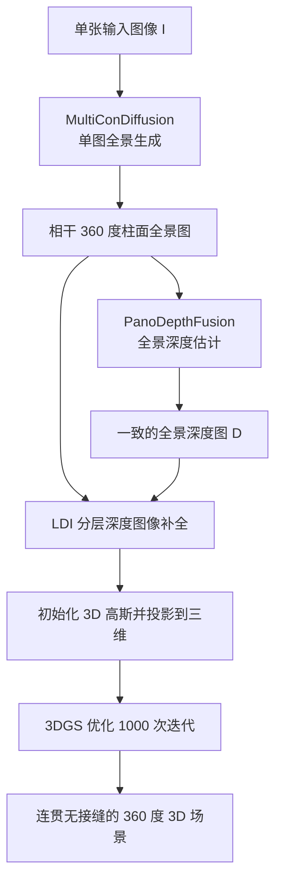

## 一句话总结

PanoDreamer 把"单图生成 360° 3D 场景"重新表述为单图全景生成与全景深度估计两个优化问题，通过交替最小化策略求解，从而得到首尾一致、无接缝的全景图与深度图，再经 LDI 补全和 3DGS 优化重建出连贯的 360° 3D 场景。

## 研究背景

从单张图像生成沉浸式 3D 场景在 VR/AR 与游戏中有广泛应用。早期方法只能合成与输入相机位置偏差很小的新视角，无法覆盖完整的 360° 场景。近期基于扩散模型的方法分为两类，各有明显缺陷：

- 文本条件的两步法（先用文生全景扩散模型生成全景再抬升到 3D）能保证一致性，但完全生成式，无法保证与某张具体输入图像一致。
- 单图渐进式方法（投影到 3D、渲染新视角、扩散补全，沿相机路径重复）由于逐步构建场景，当轨迹绕回输入图像时首尾内容对不上，出现明显接缝与风格漂移。

作者的核心观察是：与其沿轨迹逐帧生成，不如把问题整体建模为"单图全景生成 $$+$$ 全景深度估计"，用优化的方式一次性求出全局一致的结果，从根源上消除接缝。

## 方法

### 整体框架

### 关键设计

- **MultiConDiffusion（单图全景生成）**：在 MultiDiffusion 的基础上，把补全扩散模型作用于重叠裁剪块并聚合。作者发现结果强烈依赖高分辨率条件图 $$L$$，因此在目标里加入约束项 $$\lVert L - J_0 \rVert^2$$，强制条件图逼近干净的高分辨率图像 $$J_0$$。由于 $$J_0$$ 本身是优化目标、事先不可得，作者采用交替最小化：阶段一固定 $$L$$ 闭式求解去噪序列 $$J_{T-1}, \dots, J_0$$；阶段二固定去噪序列、令 $$L^* = J_0$$ 更新条件图，两阶段迭代至收敛。全景生成时该过程在柱面域进行，$$F_i$$ 完成柱面到透视的投影，使用最近邻插值以保留噪声模式，透视相机 FOV 取 45°，共迭代 20 次。

- **PanoDepthFusion（全景深度估计）**：单目深度估计器（如 Depth Anything V2）在超出最佳分辨率的大全景上会丢细节、几何不一致；而对分块估计直接平均会因相对深度不一致产生条带伪影。作者将其建模为优化 $$D^*, \boldsymbol{\theta}^* = \arg\min_{D,\boldsymbol{\theta}} \sum_{i=1}^{n} \lVert F_i(D) - G_{\theta_i}(\Psi(F_i(\tilde{J}_0))) \rVert^2$$，其中 $$G_{\theta_i}$$ 是分段线性对齐函数。同样用交替最小化：固定 $$\boldsymbol{\theta}$$ 闭式求 $$D$$，固定 $$D$$ 以最小二乘回归求 $$\boldsymbol{\theta}$$，从恒等线初始化仅 4 次迭代即可消除接缝。

- **LDI 补全与 3DGS 优化**：用 Shih 等人的四层 LDI（前景、背景与两个中间层，按视差凝聚聚类）对遮挡区域做深度感知补全；将每层每个像素初始化为一个高斯并按深度投影到 3D，不透明度设为 0.5。随后布置 240 个绕投影中心均匀旋转的相机，用原始 3DGS 重建损失、渲染与分层深度间的 $$L2$$ 损失以及基于深度的新视角损失，联合优化每层与合成图，迭代 1000 次得到最终场景。

## 实验结果

在 28 个真实与合成场景上，对 3D 场景重建的新视角合成进行数值对比（质量 Q-IQA/Q-Align、美学 A-CLIP/A-Align、一致性 C-CLIP/C-Style）：

| Method | Q-IQA ↑ | Q-Align ↑ | A-CLIP ↑ | A-Align ↑ | C-CLIP ↑ | C-Style ↓ |
| --- | --- | --- | --- | --- | --- | --- |
| LucidDreamer | 0.495 | 2.911 | 5.253 | 2.705 | 0.848 | 0.058 |
| WonderJourney | 0.504 | 3.506 | 5.368 | 2.834 | 0.820 | 0.058 |
| PanoDreamer（ours） | 0.443 | 3.305 | 5.673 | 2.772 | 0.869 | 0.025 |

PanoDreamer 在一致性指标（C-CLIP 最高、C-Style 最低）上显著领先：对比方法单看一帧尚可，但不同新视角之间风格不一致；PanoDreamer 在所有视角上保持连贯。其质量与美学分数与 WonderJourney 接近（部分略低）。

## 亮点与局限

亮点：

- 用优化视角重新表述问题，把"逐帧生成导致的首尾不一致"从根源上消除，得到真正连贯的 360° 场景。
- MultiConDiffusion 与 PanoDepthFusion 两个组件通用，可迁移到宽幅图像生成、高分辨率深度预测等相关任务。
- 全流程无需训练，直接复用预训练补全扩散模型与单目深度估计器；深度估计器可替换（DA V2 或 MoGe）。

局限：

- 与所有现有方法一样，要求输入图像的地平线大致水平才能生成合适的全景。
- 只能重建物体的正面，无法捕捉物体背后的区域。

## 延伸思考

PanoDreamer 展示了"把生成任务转化为带全局约束的优化，再用交替最小化求解"这一范式的威力：它不训练新模型，而是通过在目标函数中显式编码"全局一致性"来纠正预训练扩散模型的局部偏好。这种思路是否能推广到视频、动态场景乃至可行走的大范围场景？此外，作者指出只能重建物体正面，若把该优化框架与显式的多视角投影或物体级 3D 先验结合，或许能突破单一投影中心的限制，走向可自由漫游的完整场景。深度估计器可插拔的设计也意味着随着单目深度模型进步，该管线能持续受益。
