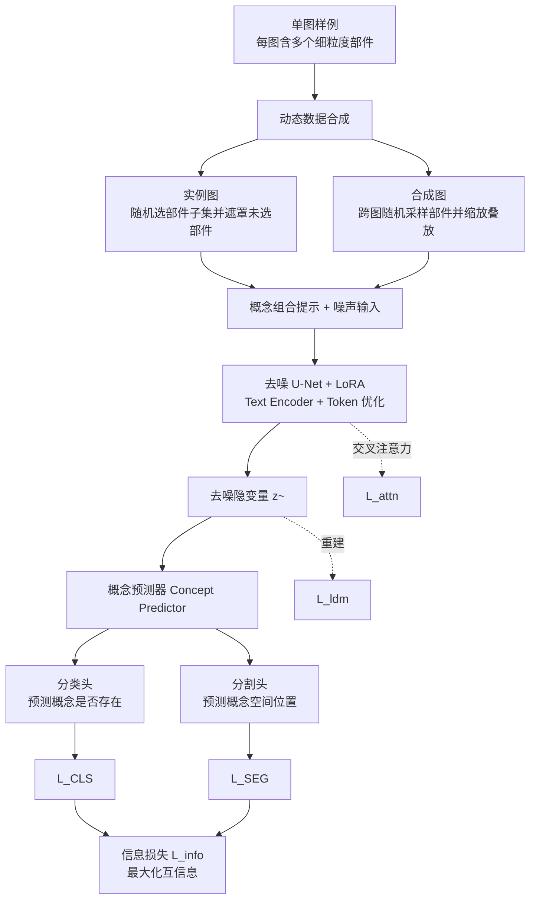

## 一句话总结

PartComposer 从"每个物体只有一张图"的单图样例中学习细粒度的部件级概念，通过动态数据合成与最大化互信息机制，让文本到图像的扩散模型能够清晰解耦并自由重组这些部件，生成同类别或跨类别的新物体。

## 研究背景

从熟悉的部件组合出新颖物体是视觉创作的核心能力：设计师看到几把示例椅子，就能想象出一把借用不同椅子部件、结构又合理的新椅子。要让扩散模型具备这种"部件级概念组合"能力，存在两个主要挑战：

- **部件比主体更细粒度**：部件级概念比主体级概念更精细，且需要结构信息才能组合成合理物体，这使得学习部件身份、并在概念之间实现清晰解耦更加困难。
- **数据极度稀缺**：在没有 3D 模型或多视角图像的情况下，真实世界的样例大多是单图样例（每个物体只有一张图），数据多样性极低，几乎没有可供监督的部件组合真值。

已有方法要么专注主体级概念（如 Break-a-Scene），难以处理细粒度部件；要么虽面向部件级（如 PartCraft、Piece-it-Together），却依赖大规模数据集训练，不支持单图输入。更关键的是，现有方法都缺乏对不同概念所编码信息的显式约束，导致概念纠缠、身份丢失，在组合 4 个及以上概念时尤为明显。

## 方法

### 整体框架

PartComposer 建立在 Break-a-Scene 与 PartCraft 的扩散模型定制范式之上（使用标准扩散损失 $$L_{ldm}$$ 与交叉注意力损失 $$L_{attn}$$ 学习并解耦概念 token），并针对单图部件学习补充了两个核心组件：动态数据合成与最大化互信息机制。方法将部件级概念视为纯视觉信息，不依赖部件的语义或标注，token 与文本提示仅作为编码与传递信息的模板载体。

### 关键设计

- **动态数据合成（Dynamic Data Synthesis）**：每个训练批次包含两张图。一张是**实例图**，直接从输入样例中随机选一张，随机选取其部件子集并遮罩掉未用部件、背景置白，以保留扩散先验中的结构完整性；另一张是**合成图**，对每个部件类别（如椅子的扶手）从各输入实例中随机取一个部件，借鉴 MuDI 随机缩放并允许相互遮挡地摆放到白底上，据遮挡关系修改掩码，从而在单图样例下扩充出丰富多样的部件组合监督。

- **最大化互信息（Maximizing Mutual Information）**：受 InfoGAN 启发，目标是最大化去噪隐变量 $$\tilde{z}$$ 与概念码 $$c$$ 之间的互信息 $$I(c; \tilde{z}) = H(c) - H(c \mid \tilde{z})$$。由于直接计算不可行，引入由概念预测器实现的变分分布 $$Q(c \mid \tilde{z})$$ 逼近真实后验，得到变分下界；在固定概念先验下 $$H(c)$$ 为常数可省略，最终训练损失为 $$L_{Info} = -\mathbb{E}[\log Q(c \mid \tilde{z})]$$。这为部件概念的解耦提供了直接监督，惩罚概念缺失或模糊的组合。

- **概念预测器（Concept Predictor）**：一个作用于去噪隐变量的 CNN（三层卷积，输出通道 16/32/64），带两个并行输出头。**分类头**给出多标签概念存在性预测，其损失 $$L_{CLS}$$ 惩罚错误组合（概念缺失或多出）；**分割头**给出逐概念空间掩码，其损失 $$L_{SEG}$$ 惩罚概念定位错误或纠缠。两者按同一量级加权合并为 $$L_{Info}$$，与概念学习过程联合优化。

- **总损失与训练**：在原 Break-a-Scene 的 $$L_{ldm}$$、$$L_{attn}$$ 基础上，加入概念预测损失与辅助背景损失 $$L_{BG}$$（惩罚在选定部件掩码并集之外生成内容），总损失为 $$L_{total} = L_{ldm} + L_{attn} + \lambda_{info}(L_{CLS} + \lambda_{seg} L_{SEG}) + \lambda_{bg} L_{BG}$$，权重取 $$\lambda_{info}=0.05$$、$$\lambda_{seg}=10.0$$、$$\lambda_{bg}=0.01$$。基座为 Stable Diffusion v2.1，U-Net 上加 rank 32 的 LoRA，采用两阶段训练（先以高学习率仅更新 token 嵌入，再以低学习率更新 text encoder 与 U-Net 的 LoRA 权重）。

## 实验结果

概念保留能力评测：对 chair、vehicle、character 三类，每类 7 个单图样例，用多模态大模型 QWen 对生成图中被正确保留的部件数量打分并归一化到 0–5 分（越高越好）。PartComposer 显著优于所有基线。

| Category | BaS | PartCraft | MuDI | PiT | PartComposer |
|---|---|---|---|---|---|
| Chairs | 3.66 | 1.89 | 1.97 | 2.70 | **4.91** |
| Characters | 4.10 | 3.20 | 2.70 | 4.30 | **4.89** |
| Vehicles | 3.07 | 1.85 | 2.03 | 2.57 | **4.68** |

在生成质量上（FID、KID 及 QWen 质量评分），PartComposer 在三个类别上整体也取得最优或接近最优的表现（如 Chair FID 15.85、QWen 4.72）。消融实验表明：去掉动态数据合成会导致数据利用率下降，去掉概念预测器会造成概念纠缠或缺失。

## 亮点与局限

**亮点**

- 首次聚焦"单图样例下的部件级概念学习"这一更困难、也更贴近真实数据条件的任务，放宽了对每个物体多图输入的要求。
- 用最大化互信息 + 概念预测器把"概念是否存在"和"概念在哪里"两类监督显式化，直接约束概念编码空间，有效缓解多概念（>4）重组时的纠缠与缺失。
- 方法对部件粒度不敏感，可学习每图 4 个以上很细粒度的概念，支持同类别与跨类别组合，甚至能做出富有想象力的虚构物体，还能扩展到背景概念、不完整组合提示与更多输入图。

**局限**

- 依赖部件级掩码作为训练监督（虽兼容 SAM + GPT-4o 自动分割或人工标注，但仍是前置依赖）。
- 属于逐样例优化/微调的路线，相比 PiT 这类前馈推理方法在效率上处于劣势。
- 跨类别组合虽有创意，但仅对"大多数"组合场景能保持合理结构，极端组合的结构合理性并无保证。

## 延伸思考

将"最大化互信息 + 辅助预测器"作为解耦监督的思路，本质上是把 InfoGAN 的可解释性正则迁移到扩散模型定制中，这一范式或许能推广到其他需要精细可控编辑的生成任务（如材质、光照、布局的分量解耦）。另一个值得追问的方向是：当前分割监督依赖预先获得的部件掩码，若能与自监督或弱监督的部件发现联合训练，是否可以彻底摆脱掩码依赖？此外，方法在跨类别组合时的"结构合理性"仍靠扩散先验隐式约束，引入显式的结构/物理先验（例如部件连接关系或可装配性约束）可能是让"疯狂想象"落地为可用设计的关键一步。
