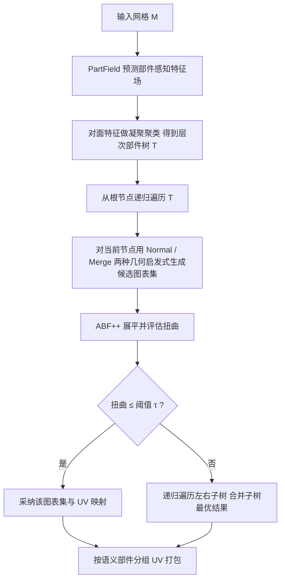

## 一句话总结

PartUV 是一套基于"部件"的 3D 网格 UV 展开流水线，它把学习式语义部件先验（PartField）与几何启发式在自顶向下的递归搜索中结合起来，在保持低扭曲的前提下生成数量显著更少、且与部件边界对齐的 UV 图表（charts）。

## 研究背景

UV 展开把 3D 表面映射到 2D 平面，为纹理、法线、AO 等各类贴图提供存储与编辑空间，是 3D 内容创作流水线的基础环节。它通常包含三步：表面参数化（展平）、图表分割（沿缝切开以降低扭曲）、以及 UV 打包（在单位方块内排布图表）。

现有方法大多针对专业美术师制作的"良态"网格调优，在 AI 生成网格上频频失效。这类网格常通过神经场等值面（如 Marching Cubes）提取，表面凹凸、三角面碎小、几何质量差（存在断连组件或孔洞），导致传统方法要么超时，要么产出极度碎片化的图集——单个图表只含一两个三角面。碎片化会妨碍纹理绘制与编辑，在图表边界引入纹理渗色与烘焙/渲染伪影，并让下游任务背上数量庞大的图表包袱。

近期一些神经场方法（如 Nuvo）虽能控制图表数量，却往往需要三十分钟以上且扭曲仍然明显；另一些联合优化缝长与扭曲的方法同样昂贵。此外，仅依赖局部几何属性的分割方法容易把语义连贯的区域（如整块电视屏幕、人脸）切散，产生不直观的边界，进一步增加纹理创作与语义感知渲染的难度。

## 方法

### 整体框架

给定网格 $$M=(V,F)$$，PartUV 的目标是把面集分解为一组不相交且连通的图表 $$F=\bigcup_{k=1}^{K} C_k,\ C_i\cap C_j=\varnothing\ (i\neq j)$$，并用 ABF++ 将每个图表展平为 2D 映射 $$\phi_k: C_k \rightarrow \mathbb{R}^2$$。核心思路是"粗到细"两阶段：先用学习式方法 PartField 把网格划分为几何较简单的语义部件，再用几何启发式把每个部件进一步切分为可低扭曲展平的图表，整个过程由自顶向下的递归搜索统一调度，力求在满足用户指定扭曲阈值 $$\tau$$ 的同时最小化图表总数。

### 关键设计

1. **自顶向下递归树搜索（含预算约束）**：从部件树根节点出发，每个节点先用主启发式生成候选分解；若无候选满足 $$\tau$$，则不设预算地递归搜索左右子树并合并；若有可行候选，则取图表数最少者，再以"最优图表数减一"为收紧的预算 $$B$$ 继续向下探索，只有更优（图表更少且合法）才替换。预算 $$B$$ 随搜索收紧，防止递归过深，实践中很少深入。

2. **两种几何启发式 Normal 与 Merge**：Normal 对部件面法线做凝聚聚类，一次生成 1 到 $$t$$（实验取 $$t=10$$）个图表的候选分解，快而常够用；扭曲用面积拉伸度量 $$distortion(\mathcal{C})=\max_{C\in\mathcal{C}}\left(\frac{1}{\lvert C\rvert}\sum_{f\in C}\max\left(stretch(f),\frac{1}{stretch(f)}\right)\right)$$。Merge 更昂贵：先算部件的有向包围盒（OBB），给每个面按最接近的 OBB 法线打 1~6 标签，据连通性切成组件后由小到大沿最长公共边迭代合并，每次合并都用 ABF 校验扭曲与无重叠，仅在 Normal 已给出可行解时才启用，用于换取更少的图表。

3. **运行时加速与鲁棒处理**：左右子树递归调用全部并行以吃满多核；用 GPU 加速的网格简化生成候选图表的低分辨率近似，作为"代理扭曲"快速评估，最终才在原始高分辨率网格上跑 ABF。对非流形边通过复制共享顶点、拆边转为流形；对多连通组件先按 PartField 层次分解，必要时回退到逐连通组件处理，避免过度碎片化。

4. **语义感知打包**：图表按语义部件分组，可打进单个图集，也可按部件跨多个 $$[0,1]^2$$ 图集均衡分布，让同部件图表在空间上聚拢，便于集体编辑。

## 实验结果

在 Common Shapes、Trellis（AI 生成）、ABC（CAD）、PartObjaverseTiny 四个数据集上，与 Blender Smart UV、xatlas 对比。核心指标为图表数、缝长、角度/面积扭曲与耗时。PartUV 在图表数与缝长上大幅领先，扭曲保持在同一低水平。以下摘录 Table 1：

| 数据集 | 方法 | 成功率(%) | 平均图表数 ↓ | 中位图表数 ↓ | 中位缝长 ↓ | 角度失真 ↑ | 面积失真 ↓ | 整体面积失真 ↓ | 耗时(s) |
|---|---|---|---|---|---|---|---|---|---|
| Common Shapes (24) | Blender | 100.0 | 1360.3 | 332.5 | 44.7 | 0.906 | 1.172 | 1.102 | 0.3 |
| | xatlas | 100.0 | 974.8 | 301.0 | 42.9 | 0.987 | 1.885 | 1.504 | 77.9 |
| | ours | 100.0 | 48.6 | 16.5 | 16.6 | 0.990 | 1.283 | 1.128 | 39.4 |
| Trellis (114) | Blender | 100.0 | 3352.9 | 1957.0 | 94.5 | 0.921 | 1.252 | 1.107 | 1.1 |
| | xatlas | 100.0 | 1541.6 | 895.0 | 91.2 | 0.984 | 2.357 | 1.093 | 13.1 |
| | ours | 100.0 | 568.7 | 233.5 | 58.8 | 0.981 | 1.373 | 1.145 | 26.0 |
| ABC (100) | Blender | 100.0 | 305.3 | 78.0 | 25.0 | 0.992 | 1.122 | 1.067 | 0.7 |
| | xatlas | 100.0 | 249.6 | 56.0 | 26.5 | 1.000 | 1.192 | 1.030 | 31.0 |
| | ours | 100.0 | 85.4 | 15.5 | 17.3 | 0.998 | 1.191 | 1.073 | 31.9 |
| PartObjaverseTiny (200) | Blender | 100.0 | 1509.2 | 647.5 | 70.2 | 0.925 | 1.325 | 1.115 | 0.2 |
| | xatlas | 100.0 | 1142.1 | 491.5 | 67.0 | 0.982 | 1.728 | 1.286 | 4.4 |
| | ours | 100.0 | 544.8 | 177.0 | 41.8 | 0.983 | 1.305 | 1.112 | 10.1 |

在 Common Shapes 上 PartUV 只用了 Blender 约 1/31 的图表数。与 Open3D 相比，后者在 Trellis 上成功率仅 39.5% 且扭曲很大；与 Nuvo/OptCuts 相比，二者每形状优化常超 30 分钟，Nuvo 扭曲偏高、OptCuts 成功率有限（24 个形状仅 9 个有输出）。消融实验（Table 4，Trellis）显示：固定 20 部件的朴素组合面积失真高达 2.18；用面法线替换 PartField 特征会使运行时翻倍、图表增多；去掉 Merge、去掉递归、去掉扭曲代理都会带来图表数或耗时的上升。

## 亮点与局限

亮点：把语义部件先验显式引入 UV 展开，图表数量与缝长大幅下降，同时保持低扭曲；边界与语义部件对齐，缝落在感知不显眼处；自顶向下递归搜索 + 预算剪枝在保证质量的同时控制搜索深度；工程上并行化、GPU 简化代理、非流形/多组件处理让流水线鲁棒且高效（通常数秒到数十秒完成）；语义分组还带来单/多图集的应用级打包灵活性。

局限：方法性能依赖 PartField 的部件质量，Merge 启发式计算成本较高；Table 1 中角度/面积扭曲相比部分基线并非全面最优（在低扭曲区间内换取更少图表）；在 Trellis 的 95 分位 chart 级面积失真（1.220）略高于 Blender/xatlas，说明极端个例仍有改进空间。

## 延伸思考

PartUV 展示了"语义先验 + 几何启发式"互补的范式：学习式部件划分负责宏观语义连贯，几何启发式负责微观低扭曲展平，二者通过递归搜索交织。这一思路可能迁移到其他需要"少而有意义的分块"的几何处理任务，例如网格简化的区域划分、四边网格化的补丁规划，或纹理合成中的语义分区。另一个值得探索的方向是把扭曲阈值 $$\tau$$ 做成随部件语义自适应，让重要部件（如人脸）享受更严格的扭曲预算；以及将代理扭曲的简化策略推广为可微、端到端可学习的搜索控制器，进一步压缩运行时。
