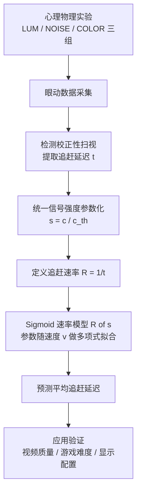

## 一句话总结

本文通过心理物理实验测量并建模了人眼在追踪动态目标时的"追赶延迟"（catch-up latency），提出一个由目标可见度（信号强度）与运动速度共同驱动的可执行预测模型，并将其应用于视频质量评估、游戏难度设计与显示配置优化。

## 研究背景

在游戏、影视等含动态目标的图形应用中，人眼需要不断转动以将移动目标维持在中央凹（fovea）视野内，这一过程称为视觉追踪（visual tracking）。当目标运动突然改变时，平滑追踪（smooth pursuit）无法立即匹配，会积累位置误差，从而触发一次校正性扫视（catch-up saccade）来"追赶"目标。这次追赶的启动延迟直接反映了眼睛对突发运动的反应效率，是任务表现与观看体验的关键指标。

以往的感知图形学研究多聚焦于视觉锐度（visual acuity），例如分辨率或颜色伪影的可检测性；也有工作研究静态图像诱发的反应行为（如外周目标的反应延迟）。然而，在连续观察下针对动态变化的追赶表现一直缺乏研究，主要难点在于这类行为受高维时空视觉因素影响，难以刻画。本文正是要填补这一空白：测量并分析视觉目标可见度如何影响连续追踪中的追赶延迟。

## 方法

整体框架：先用一系列心理物理实验测量不同可见度与速度下的追赶延迟，从数据中提炼出统一的一阶规律，再回归出一个以信号强度和速度为输入的解析预测模型，最后在多种图形应用场景中验证其外推能力。

关键设计：

1. 统一的信号强度参数化。作者将目标可见度用"恰可检测对比度阈值"的倍数来表达，即信号强度 $$s = c / c_{th}$$，其中 $$c$$ 为目标对比度、$$c_{th}$$ 为该个体在该任务下的恰可检测阈值。尽管三组实验分别操纵亮度对比、含噪亮度对比与颜色对比（沿 DKL 空间的 $$L-M$$ 轴），信号强度让不同视觉特征的追赶表现能在同一坐标下比较，验证"追赶表现的一阶规律不依赖具体视觉特征"这一假设。

2. 追赶延迟的客观提取。追赶由平滑追踪与校正性扫视两个并发机制驱动，作者以校正性扫视的启动作为追赶延迟的标记。眼动轨迹先经 20 Hz 巴特沃斯滤波，用速度阈值检测扫视，再用位置准则选出"最晚一次将眼睛移出初始注视分布两个标准差、朝向目标"的扫视作为主校正扫视；$$t < 0.1$$ s 内的扫视因来不及对刺激作出反应而被排除。

3. 速率的 Sigmoid 建模。观察到信号强度增大时收益递减、表现趋于饱和，作者转而对追赶速率 $$R = 1/t$$ 建模（$$t$$ 为平均延迟），这与神经科学中的漂移扩散模型、LATER 模型一致。速率被建模为 Sigmoid 函数：

$$R(s) = (R_{max} - R_{min}) \frac{1 - e^{-\lambda s}}{1 + e^{-\lambda s}} + R_{min}$$

其中 $$R_{max}$$ 为峰值速率、$$R_{min}$$ 为最小速率（$$R(s=0)=R_{min}$$）、$$\lambda$$ 控制斜率。

4. 参数随速度的多项式拟合。为让模型覆盖不同目标速度 $$v$$，$$R_{max}$$、$$R_{min}$$、$$\lambda$$ 用多项式拟合到实验数据（对 $$\log(v)$$ 的二次/一次项），二次项用于刻画"高速使目标更快进入外周、表现上界随速度下降"的效应，同时限制阶数以防过拟合。

## 实验结果

主实验为三组心理物理实验（LUM/NOISE/COLOR，5 名被试），并用留一交叉的方式检验模型跨视觉特征的泛化性：将模型分别拟合到某一组实验，再评估其对另外两组的解释力（$$R^2$$）。结果显示每个模型在全部数据集上都有较高拟合度（$$R^2 > 0.79$$），说明基于信号强度的模型可跨不同视觉特征泛化。

| 训练数据 | 在 LUM 上 $$R^2$$ | 在 NOISE 上 $$R^2$$ | 在 COLOR 上 $$R^2$$ |
| --- | --- | --- | --- |
| LUM 模型 | 0.99 | 0.90 | 0.93 |
| NOISE 模型 | 0.90 | 0.97 | 0.79 |
| COLOR 模型 | 0.95 | 0.83 | 0.99 |

其他关键统计：三组实验中追赶延迟随信号强度与速度提升，最多可缩短 0.166/0.117/0.130 s（LUM/NOISE/COLOR），峰值平均延迟约 0.216/0.218/0.212 s；两因素方差分析显示速度（$$p<0.01$$）与信号强度（$$p<0.001$$）均有显著主效应及显著交互；三组实验平均延迟之间的 Spearman 相关达 $$\rho = 0.94 \sim 0.99$$。跨用户留一交叉验证各被试 $$R^2$$ 为 0.80/0.96/0.92/0.72/0.72。

## 亮点与局限

亮点：

- 用"信号强度"这一统一参数把亮度、噪声、颜色等异质视觉特征归约到同一维度，让追赶表现的一阶规律具有跨特征、跨个体的一致性。
- 模型可执行、低成本，无需为每种内容设计单独做用户实验即可给出近似预测，并在连续 360 度运动、足球视频、FPS 游戏等更复杂场景中验证了趋势外推能力。
- 展示了三类实用价值：评估动态事件在视频中的可追踪性、以追赶延迟作为指标指导游戏难度、结合对比敏感度函数按眼-屏距离优化显示内容。

局限：

- 模型是数据驱动的行为趋势模型，不代表感觉运动控制的神经机制，追求的是相对趋势而非可直接部署的精确时间数值。
- 依赖对每位被试的对比敏感度校准，尚未采用跨群体的统一可见度模型。
- 实验多为单目标、匀速、可预测的简单轨迹；多目标、各向异性光流、加速度与不可预测轨迹、外周呈现等更自然的情形仍待研究。

## 延伸思考

本文最有价值的思路在于把"感知可见度"与"行为表现"用一个可计算量（追赶延迟）连接起来，这为感知驱动的图形系统提供了超越静态锐度指标的新评价维度。值得延伸的方向包括：将该行为模型与大规模注视行为数据集、概率建模结合以提升在真实场景的数值精度；探索眼睛已处于追踪状态时再切换目标的"追踪中追赶"问题；以及把追赶延迟作为损失或约束，直接反哺注视点渲染、动态内容生成与显示系统设计。对于 VR/AR 等眼-屏距离多变的场景，将对比敏感度函数与该模型联动来自适应内容外观，也是一个有落地潜力的应用点。
