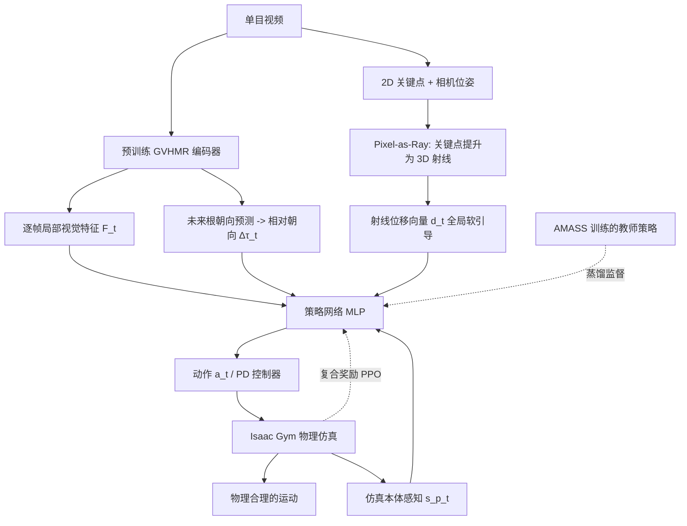

## 一句话总结

PhysHMR 用一个统一的"视觉到动作"策略，直接从单目视频驱动物理仿真中的人形角色，端到端地重建既符合物理规律又与视频对齐的人体运动，避免了传统"先运动学重建、后物理后处理"两阶段管线的误差累积。

## 研究背景

从单目视频重建人体运动（Human Mesh Recovery, HMR）是计算机视觉与图形学的基础问题。主流运动学方法虽然在姿态与形状精度上表现出色，但普遍忽视物理合理性，导致脚部滑动、地面穿插、接触不一致等瑕疵。

为引入物理约束，已有工作大多采用"后处理修正"的两阶段设计：先纯粹从视觉线索重建运动，再交由独立的物理模块（如基于欧拉-拉格朗日方程的解析先验，或用强化学习训练的跟踪控制器）做修正。这种解耦设计存在根本缺陷：单目视频本身存在歧义（同一观测可对应多种合理运动），一旦重建阶段选定了单一解，下游物理模块就无法再访问完整的观测上下文，只能在错误结果上做次优修正，甚至放大误差。

作者主张把运动估计与物理推理统一进单一框架，让视觉线索与物理约束共同参与同一个决策过程，从而根治误差累积问题。

## 方法

### 整体框架

PhysHMR 将物理合理的人体运动重建建模为一个目标条件的、基于物理的运动模仿问题（马尔可夫决策过程），用深度强化学习训练策略 $$\pi$$ 驱动仿真人形角色。每个时刻状态 $$s_t$$ 包含本体感知信息 $$s^p_t$$（局部姿态 $$q_t$$ 与速度）和目标信息 $$s^g_t$$；与传统模仿任务用参考轨迹作为目标不同，这里的目标信息完全从输入视频提取。动作 $$a_t$$ 指定目标关节旋转，作为 PD 控制器的控制目标在物理仿真器（Isaac Gym）中执行，天然满足地面接触、关节限位、动量守恒等约束。

### 关键设计

- **Pixel-as-Ray 软全局引导**：直接从单目视频预测 3D 根关节位置噪声大，会误导控制策略。作者不用显式 3D 根预测，而是把检测到的 2D 关键点 $$(u^i_t, v^i_t)$$ 通过相机内参逆投影为相机坐标系下的 3D 射线 $$\text{ray}^i_t(s) = o_t + s \cdot r^i_t$$，再用相机到世界的变换 $$T^{c2w}_t$$ 转到世界坐标；对每个人形关节计算其到对应射线的最短垂直位移向量 $$d^i_t$$，拼接后作为策略的全局空间观测。这种"射线"提供柔性的全局位置线索而不强加硬性目标，还附带关键点置信度让策略自适应地调节信任度。

- **局部视觉参考（根不变特征）**：直接复用 GVHMR 预训练视频编码器提取逐帧特征。该编码器被训练来预测相对父关节的 SMPL 关节旋转，天然产生对全局根变换不变的特征，作为局部控制的结构化输入；相比显式姿态重建，它保留丰富姿态信息而不塌缩到单一（可能不准确）的确定性估计。同时用 GVHMR 的多任务头回归未来根朝向 $$\bar{\tau}_{t+1}$$，与当前根位姿计算相对差 $$\Delta\tau_t = \tau^{-1}_t \bar{\tau}_{t+1}$$ 作为朝向线索。

- **蒸馏 + 强化学习联合训练**：纯 RL 训练高维视觉控制策略样本效率低、不稳定。作者引入用 AMASS 动捕数据训练的教师策略 $$\pi_{\text{teach}}$$（以真值姿态为条件），用其动作监督学生策略，蒸馏损失为两者动作的 $$L_2$$ 距离。同时用复合奖励做 PPO 精修：$$R = \alpha_1 R_{\text{pose}} + \alpha_2 R_{\text{amp}} + \alpha_3 R_{\text{energy}}$$，分别对应姿态模仿、基于对抗运动先验（AMP）的风格真实性、以及惩罚过大关节加速度的能量平滑项。总损失 $$L = L_{\text{distill}} + L_{\text{PPO}}$$ 兼顾样本高效监督与环境驱动精修。

- **灵活特征掩码**：跨帧融合支持特征掩码，允许在无配对 RGB 图像的纯动捕数据（如 AMASS，丢弃视觉特征 $$f^{\text{feat}}_t$$）上训练，扩充数据来源并增强遮挡鲁棒性。

## 实验结果

在 EMDB2 与 AIST++ 上对比运动学（Kin.）、神经近似物理（Neural）、跟踪（Track.）与本文视觉到动作（V2A）方法，所有指标越低越好。本文方法在衡量物理合理性的脚滑（FS）和脚高方差（HV）上取得最优，同时在 MPJPE 等精度指标上保持竞争力。

| Phys. Type | Method | EMDB2 PA | EMDB2 WA | EMDB2 MPJ | EMDB2 FS | EMDB2 HV | AIST++ PA | AIST++ MPJ | AIST++ FS | AIST++ HV |
|---|---|---|---|---|---|---|---|---|---|---|
| Kin. | TRAM | 35.51 | 148.05 | 56.74 | 11.76 | 22.97 | 50.18 | 76.30 | 23.18 | 7.93 |
| Kin. | GVHMR | 40.95 | 228.67 | 65.21 | 5.65 | 26.42 | 53.43 | 79.05 | 11.54 | 4.64 |
| Neural | PhysPT (CLIFF) | 48.40 | 762.78 | 77.00 | 11.02 | 6.54 | 70.72 | 108.57 | 13.68 | 3.71 |
| Neural | GVHMR × PhysPT | 41.34 | 682.03 | 66.08 | 10.71 | 8.46 | 55.29 | 83.93 | 11.24 | 3.46 |
| Track. | GVHMR × PHC+ | 46.24 | 193.01 | 72.50 | 12.71 | 7.71 | 67.38 | 109.77 | 24.79 | 6.05 |
| V2A | Ours | 39.34 | 189.26 | 55.48 | 4.60 | 5.04 | 50.40 | 63.94 | 9.14 | 3.10 |

用户研究中 66.3% 的参与者更偏好 PhysHMR（PhysPT 19.9%，GVHMR × PHC+ 13.8%）。消融实验（H36M）表明：Pixel-as-Ray 相比显式 3D 根引导大幅降低 WA-MPJPE（112.60 对 195.59）；PPO + 蒸馏联合训练的成功率达 88.4%，明显高于仅 PPO（65.5%）与仅蒸馏（72.0%）。

## 亮点与局限

亮点：
- 首个把人体运动感知与控制统一在单一策略中的框架，从根本上避免两阶段管线的误差累积。
- Pixel-as-Ray 巧妙地用 2D 关键点射线的软引导替代噪声大的显式 3D 根预测，兼顾全局对齐与鲁棒性。
- 蒸馏与 RL 联合训练同时解决样本效率和探索能力问题，收敛更快、泛化更好。

局限：
- 依赖非实时的 GVHMR 预训练编码器，整个系统离线运行，难以在线部署。
- 存在真实到仿真（real-to-sim）的差距，身体力学与接触属性差异有时会产生可见瑕疵。
- 单目视频重建本身欠约束（歧义与遮挡），确定性策略难以捕捉多样的合理运动；且当前框架不支持人-场景交互（如坐下、倚靠）。

## 延伸思考

PhysHMR 的核心洞见是"把物理仿真放进推理回路"，而非事后修正——这与许多领域从"级联管线"走向"端到端联合优化"的趋势一致。Pixel-as-Ray 用射线位移作为策略输入（而非训练时的重投影损失）是一个值得借鉴的思路：在存在深度歧义时，与其强行回归绝对 3D 位置，不如把观测建模为约束流形（射线），让策略在物理动力学中自行消解歧义。

后续方向上，作者提到用条件生成模型替代确定性策略以刻画多解分布，这与扩散/流模型在运动生成中的兴起相呼应；而引入个性化物理参数、环境重建与交互感知控制，则指向从"孤立人体"走向"人-环境耦合"的物理重建，这对具身智能与机器人从视频中学习人类行为有直接价值。
