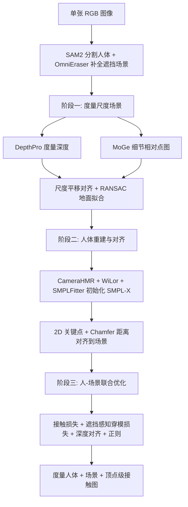

## 一句话总结

PhySIC 只用一张普通 RGB 图像，就能重建出度量尺度一致的 3D 人体（SMPL-X）、稠密场景几何以及顶点级接触图，通过联合优化让人与场景之间的接触、支撑和穿模关系物理上合理。

## 研究背景

对人体及其周围环境做整体的 3D 理解，是具身智能、运动分析、增强现实等应用的基础。这些应用同时需要精确的场景几何、人体在场景中的准确定位，以及连贯的地面接触估计。

但已有方法通常各管一摊：要么只重建静态场景而不含人，要么在给定 3D 场景的前提下只估计人体姿态。HolisticMesh 能从单张 RGB 同时预测场景与人体，但只支持单人与特定室内家具类别，难以扩展到任意场景。更新的整体重建方法如 HSR、HSfM 虽然能做人-场景联合重建，却分别依赖视频或多视角图像输入，无法用于单图场景。

单张图像的难点集中在：需要在深度-尺度歧义下推理各式各样的场景几何、复杂的人-场景接触，还要应对人体和场景互相遮挡的问题，同时还得足够快才实用。本文的核心思路是把人和场景放在一起同时推理——交互过程中场景会限制人可能的姿态，而人体姿态又为估计场景几何和尺度提供关键线索——并借助基础模型（单目深度、点图等）提供的强几何先验来完成这件事。

## 方法

### 整体框架

给定单张 RGB 图像 $$I \in \mathbb{R}^{H \times W \times 3}$$，PhySIC 分三个阶段输出场景点云 $$P_s$$ 和人体网格顶点 $$V_h$$：先做度量尺度场景重建（阶段一），再重建人体并与场景对齐（阶段二），最后通过联合优化得到物理上合理的人-场景接触（阶段三）。

### 关键设计

- **两种深度模型取长补短**：DepthPro 能给出准确的度量尺度深度但几何细节差，MoGe 能捕捉精细几何但只在相对空间。通过优化尺度 $$s$$ 和深度平移 $$t_z$$（用 RANSAC 求解），把 MoGe 的细节点图对齐到 DepthPro 的度量深度，得到既有度量尺度又有细节的场景点云 $$\hat{P}_s$$；再用 SAM2 分割地面并用 RANSAC 拟合平面补全缺失的地板支撑面。

- **遮挡感知的初始化与对齐**：先用 OmniEraser 把人从图中擦除再重建场景，避免人体遮挡造成场景空洞和假阴性接触。人体侧用 CameraHMR 的 SMPL 预测、WiLor 的手部姿态融合出 SMPL-X 初值，再仅优化全局平移 $$t_h$$，用 2D 关键点重投影损失和只针对朝向相机顶点 $$V_{cf}$$（法向与视线夹角小于 70 度）的 Chamfer 距离对齐，避免把背面顶点错误地拉向人体点云。

- **联合优化目标**：总损失 $$L_{total} = \lambda_{j2d} L_{j2d} + \lambda_d L_d + \lambda_c L_c + \lambda_i L_i + \lambda_{reg} L_{reg}$$ 同时优化人体参数与场景尺度 $$s_{sc}$$。接触损失 $$L_c$$ 用 DECO 预测的接触顶点，并只对距离最近场景点小于阈值 $$\epsilon$$ 的活跃接触生效，抑制远距离假接触。

- **遮挡感知穿模损失**：$$L_i$$ 利用每个场景点的法向惩罚穿到法向反方向的人体顶点，但显式排除被物体或自身遮挡的顶点 $$V_{occ}$$（2D 投影落在人体掩码外视为被物体遮挡，某身体部位 30% 顶点被遮挡视为自遮挡）。这样避免在缺乏 2D 关键点约束的遮挡区域，因穿模惩罚把身体拉向不自然的姿态。此外用最近邻网格预计算带来 15 到 20 倍加速，H100 上联合优化仅需 9 秒，端到端不到 27 秒。

## 实验结果

在 PROX 和 RICH 数据集上评估，指标包括人体姿态误差（PA-MPJPE、MPJPE、MPVPE，越低越好）和接触分类指标（精确率、召回率、F1，越高越好）。

| 方法 | PA-MPJPE ↓ | MPJPE ↓ | MPVPE ↓ | Precision ↑ | Recall ↑ | F1 ↑ |
|------|-----------|---------|---------|-------------|----------|------|
| CameraHMR | 42.35 | 997.49 | 996.20 | – | – | – |
| DECO | – | – | – | 0.406 | 0.349 | 0.376 |
| PROX | 73.31 | 266.50 | 266.00 | 0.260 | 0.108 | 0.152 |
| HolisticMesh | 77.04 | 202.80 | 191.70 | 0.373 | 0.412 | 0.391 |
| Ours | 41.99 | 230.26 | 227.19 | 0.508 | 0.514 | 0.511 |

在 PROX 上，PhySIC 把 PA-MPJPE 从 HolisticMesh 的 77mm 几乎减半到 42mm，接触 F1 相对 HolisticMesh 提升约 40 个百分点（0.391 到 0.511）。虽然 HolisticMesh 在 MPJPE、MPVPE 上略优，但作者指出它在自然场景图像上不可靠、穿模严重（体现在较高的 PA-MPJPE）。在同时包含室内外的 RICH-100 上，HolisticMesh 因只面向室内有限家具类别无法评估，PhySIC 相对 PROX 在姿态与接触上全面领先（F1 从 0.069 到 0.428）。消融实验表明深度对齐损失 $$L_d$$ 对全局定位（MPJPE）至关重要，而遮挡感知的穿模损失带来最大的局部姿态（PA-MPJPE）提升。

## 亮点与局限

亮点：
- 据作者所述，是首个能从单张单目图像重建度量尺度人-场景交互、并支持多人、室内外多样场景的方法。
- 巧妙组合基础模型（DepthPro、MoGe、SAM2、CameraHMR、DECO、OmniEraser、WiLor），无需专门训练大模型即可获得强几何先验。
- 遮挡感知的优化设计有效缓解了遮挡区域被穿模损失带偏的问题，且推理高效（端到端不到 27 秒）。

局限（作者列出）：
- 依赖补全模型，对细长或复杂结构容易擦除或变形几何。
- 假设场景刚性静态，无法处理坐垫、衣物等可变形物体。
- 只建模人-场景交互，不显式建模抓握、推按等与小物体的精细交互。
- 假设地面为平面，当检测不到地面点或 RANSAC 失败时会跳过地板采样，可能导致假阴性接触。

## 延伸思考

PhySIC 的思路本质上是把一堆现成基础模型用一个物理约束的联合优化"缝合"起来，这种"以优化为胶水、以基础模型为先验"的范式在单图 3D 理解里很有代表性——它的天花板会随着底层深度、补全、接触预测模型的进步而自动抬升。值得关注的是接触估计仍依赖 DECO 这类可能有噪声的预测器，联合优化虽能纠正一部分，但接触监督本身的质量上限可能成为瓶颈。此外，刚性静态场景与平面地板假设限制了它在真实生活场景（软家具、斜面、楼梯）中的表现，若能结合可变形物体建模或更成熟的整体场景重建，可能是打通"从随手拍照片到可交互 3D 场景"这条链路的关键一步。
