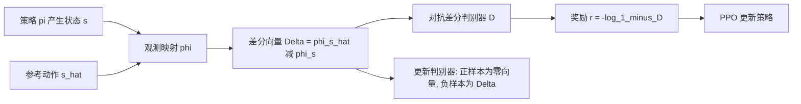

## 一句话总结

提出一种对抗式多目标优化技术：用一个"对抗差分判别器（ADD）"替代人工调权的加权和，把多个目标误差组成的差分向量交给判别器自动、动态地聚合，从而让物理仿真角色无需手工设计奖励函数就能高保真跟踪各种敏捷、杂技类动作。

## 研究背景

- 领域现状：基于强化学习的运动跟踪已能让物理仿真角色复现大量高动态技能，但效果高度依赖精心设计的奖励函数。跟踪类方法（如 DeepMimic）通常把姿态、关节速度、根位置等多个误差项用指数化后加权求和；对抗式模仿学习（如 AMP）则从数据自动学出奖励，但走的是"分布匹配"路线，只求整体风格相似。
- 核心痛点：加权和方法的表现对权重与尺度参数极其敏感，调参耗时且往往需要逐条动作单独调，难以泛化到新技能或新形态；而 AMP 这类分布匹配方法不保证对参考动作的精确复现，对补间、关键帧后处理等需要精准还原的场景不够用。
- 本文 idea：把多目标优化本身建模成一个对抗博弈——不再人工指定各目标权重，而是让判别器去学习"当前这组误差是否对应理想解"，由它在训练中自动决定如何在各目标间分配注意力，并随着模型进步自动聚焦到更难的目标上。

## 方法

### 整体框架

把 $$n$$ 个非负损失 $$l_i(\theta)$$（各在取 0 时最优）拼成一个差分向量 $$\Delta=\left(l_1(\theta),\dots,l_n(\theta)\right)$$，它记录了每个目标"理想与实际之间的差距"。用一个判别器 $$D(\Delta)$$ 作为非线性聚合函数取代传统加权和，通过极小极大博弈联合优化所有目标。关键之处：判别器只收到**唯一一个正样本**——代表完美解的零向量 $$\Delta=0$$；负样本则是模型当前产生的非零差分向量。本文的核心发现是，仅凭一个正样本训练的判别器依然能有效引导优化。

### 关键设计

- **对抗差分判别器（ADD）作为聚合函数**：博弈目标为 $$\min_\theta \max_D \ \log(D(0)) + \log(1-D(\Delta))$$。模型努力把 $$\Delta$$ 推向零以骗过判别器，判别器则不断寻找当前最难的目标组合来施压。相比线性加权和，它能捕捉目标之间潜在的非线性关系，并在训练过程中动态调整对各目标的重视程度。

- **梯度惩罚只加在负样本上**：直接优化上式会让判别器退化成"只对零向量给 1、其余给 0"的 delta 函数，梯度失去信息。因此加入梯度惩罚正则项 $$L_{GP}(D)=\mathbb{E}_{p(s\mid\pi)}\left[\lVert \nabla_\varphi D(\varphi)\vert_{\varphi=\Delta}\rVert_2^2\right]$$，平滑决策边界。与以往对抗方法把梯度惩罚加在正样本上不同，由于 ADD 只有一个正样本，本文把梯度惩罚施加在负样本上——消融显示这是训练成功的关键。

- **应用到运动跟踪**：把跟踪奖励从人工加权和改成学出来的判别器。差分向量取参考状态与仿真状态之差 $$\Delta_t=\hat{s}_t\ominus s_t$$，策略奖励为 $$r_t=-\log(1-D(\Delta_t))$$。判别器不直接吃原始差分，而是先经观测映射 $$\varphi(\cdot)$$ 提取根的全局位置/朝向、各关节的局部位置与全局旋转、根与各关节的线速度/角速度等特征，再取差作为输入。

- **训练流程**：状态含各刚体相对根的位置、6D 法-切表示的旋转与线/角速度，动作为各关节 PD 控制器的目标；策略用 PPO 训练，优势用 GAE 估计，价值函数用 TD(λ)，判别器与策略/价值交替更新。角色从参考动作随机采样的状态初始化，为公平比较只在角色与地面发生不当接触时才提前终止。

## 实验结果

在 28 自由度仿真人形与 26 自由度 Sony EVAL 机器人上，跟踪单条动作片段及 AMASS 的 DanceDB 子集、LAFAN1 子集等大数据集，与 DeepMimic（人工调权、精确跟踪）和 AMP（对抗、分布匹配）对比。下表摘取人形角色若干代表性技能的位置跟踪误差与自由度速度跟踪误差（均为 5 个随机种子均值，越低越好）：

| 技能 | 位置误差 AMP [m] | 位置误差 DeepMimic [m] | 位置误差 ADD [m] | 速度误差 AMP [rad/s] | 速度误差 DeepMimic [rad/s] | 速度误差 ADD [rad/s] |
| --- | --- | --- | --- | --- | --- | --- |
| Double Kong | 0.214 | 0.223 | 0.030 | 1.309 | 0.784 | 0.473 |
| Cartwheel | 0.076 | 0.144 | 0.017 | 0.722 | 0.659 | 0.317 |
| Backflip | 0.267 | 0.111 | 0.062 | 2.243 | 1.103 | 0.878 |
| Climb | 0.185 | 0.066 | 0.046 | 1.190 | 0.567 | 0.374 |
| Run | 0.163 | 0.013 | 0.165 | 2.811 | 0.584 | 0.478 |
| DanceDB（数据集） | 0.299 | 0.046 | 0.043 | 1.217 | 0.597 | 0.447 |
| LAFAN1（子集） | 0.498 | 0.030 | 0.030 | 1.302 | 0.511 | 0.393 |

要点：AMP 因分布匹配目标跟踪精度差；ADD 与 DeepMimic 都能强跟踪，但 DeepMimic 在高难度跑酷动作（如 Double Kong）上会失败——跳不过障碍、跌倒后原地跑步，ADD 则能成功越障并复现精细接触。ADD 在几乎所有动作上都取得更低的自由度速度误差（动作更少抖动），且跨种子一致性更好（DeepMimic 在 Backflip、Cartwheel 上有一半种子陷入局部最优）。EVAL 机器人上结论类似。此外在 2D Walker、Unitree Go1 四足行走等非运动模仿的标准 RL 任务上，ADD 达到与人工调好奖励相当的最终性能与样本效率（Walker 最终归一化回报 0.691 对 0.705），且四足步态更自然、躯干更稳、控制更平滑。

## 亮点与局限

**亮点**
- 把"多目标怎么加权"这一老大难问题，转化为让判别器自动、动态、非线性地聚合，免去逐条动作的手工调参，方法本身不限于动画，可用于一般多目标 RL。
- 只用单个正样本（零向量）就能训练出有效判别器，是一个反直觉但实用的发现。
- 在高难度跑酷/杂技动作上跟踪精度与稳定性优于人工调权的 DeepMimic，同时抖动更小、跨种子更稳。

**局限**
- 容易收敛到局部最优：面对高动态的 sideflip、roll 等动作，策略常退化成站立或"躺下再起来"而非完成完整翻滚；为公平比较作者刻意不用基于跟踪误差的提前终止等启发式，这也放大了该问题。
- 在前向移动类技能（人形跑、机器人走）上根位置跟踪不如 DeepMimic 精确：根位置在高维差分向量里只占三个元素，梯度惩罚又限制判别器对其赋予过大权重。

## 延伸思考

这项工作的核心洞见是把"多目标聚合"从固定的标量化操作变成一个可学习、随训练自适应的判别器——本质上是让模型自己发现"当前哪些目标最该被优化"。它与课程学习、难例挖掘的思想相通，但用对抗框架统一实现。值得追问的是：在没有提前终止启发式时如何缓解局部最优（也许可与稀疏的探索奖励或参考状态初始化策略结合）；以及作者提出的方向——把 ADD 用于在大规模动作数据集上训练不依赖手工奖励的通用控制器，或迁移到计算机视觉、自然语言处理等其他多目标/多任务场景，能否保持"单正样本 + 负样本梯度惩罚"这套配方的有效性。
