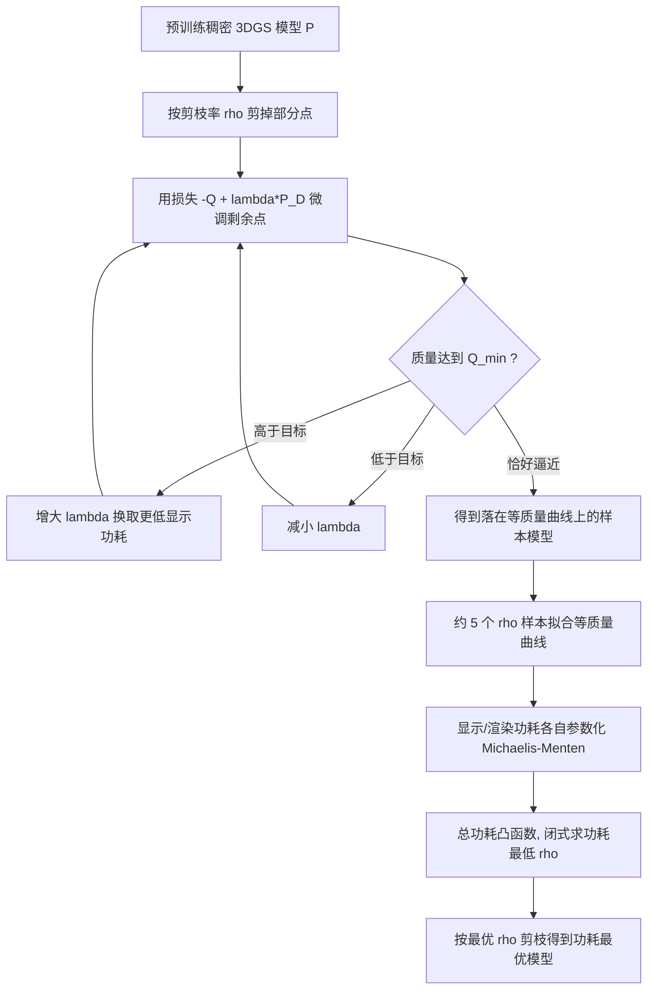

## 一句话总结

本文提出 PowerGS，首个在质量约束下对 3D Gaussian Splatting 的**渲染功耗与显示功耗做联合优化**的框架：它把难解的功耗最小化问题转化为"在显示-渲染功耗平面上重建等质量曲线、再在曲线上求功耗最低点"的凸优化，并可即插即用地扩展到注视点渲染，在感知质量几乎无损的前提下把 XR 设备的总功耗最多降低约 86%。

## 研究背景

- 领域现状：XR（VR/AR）被视为下一代普适计算平台，但电池能量密度没有"摩尔定律"，系统功耗被严重限制。以 3DGS 为代表的辐射场渲染正成为 XR 的有力渲染范式，但 3DGS 家族模型对瓦特级功耗预算的 XR 设备而言远不够高效。
- 核心痛点：XR 的功耗由**渲染功耗**和**显示功耗**两部分构成。已有工作只单独优化其中之一——渲染侧靠剪枝高斯点来降功耗，显示侧靠调暗像素或调整颜色来降功耗。这种"只盯一个目标"的做法容易导致次优解：例如把点剪得很少的模型可能使用高显示功耗的颜色；只做显示侧后处理滤波又完全省不到渲染功耗。
- 本文 idea：任何 3DGS 模型最终都落在由"渲染功耗、显示功耗、质量"张成的三维图景中。给定质量约束，问题就等价于在显示-渲染功耗平面上找到对应的等质量曲线，再找出该曲线上的功耗最低点（即让等功耗线 $$x+y=P$$ 尽量下移直到与等质量曲线相切）。难点在于渲染功耗对模型参数不可微、无解析形式，因此作者用"采样-重建"的思路来绕开梯度优化。

## 方法

### 整体框架

PowerGS 把一个预训练的稠密 3DGS 模型转化为满足质量约束 $$Q_{min}$$ 的功耗最优模型。它先用剪枝率 $$\rho$$ 与显示功耗权重 $$\lambda$$ 采样出若干"等质量但功耗分布不同"的剪枝模型，再把这些样本拟合成参数化的等质量曲线，最后在凸曲线上用闭式解求出功耗最低对应的 $$\rho$$，据此剪枝得到最终模型。对注视点渲染，则把该流程按视场质量分区逐个模型独立套用。

### 关键设计

**联合功耗的问题建模。** 目标是 $$\arg\min_{P}\lvert P_D(P)+P_R(P)\rvert$$ 满足 $$Q(P)\ge Q_{min}$$。显示功耗基于 OLED 实测建模为 RGB 三通道线性 sRGB 均值的线性组合 $$P_{disp}(I)=\alpha R(I)+\beta G(I)+\gamma B(I)+s$$；渲染功耗则针对面向未来 XR 的 ASIC 建模为 FLOP、SRAM、DRAM 三部分单位能耗之和再乘帧率 $$P_{rend}=(e_{FLOP}\#FLOP+e_{SRAM}\#SRAM+e_{DRAM}\#DRAM)\cdot FPS$$，其中操作计数由硬件模拟器统计而非解析给出。

**采样等质量模型。** 影响质量与渲染功耗的主因是点数，因此从稠密模型出发按 $$\rho$$ 剪枝；再用损失 $$-Q(P)+\lambda P_D(P)$$ 微调，$$\lambda$$ 越大像素越偏向省电颜色、显示功耗越低。给定 $$\rho$$，通过 $$\lambda\leftarrow\lambda\cdot S$$（质量富余时）或 $$\lambda\leftarrow\lambda/S$$（质量不足时）自适应调节（取 $$S=2$$ 并用余弦退火降到 1），使模型质量收敛到恰好 $$\epsilon$$ 高于 $$Q_{min}$$，从而落到等质量曲线上。这把二维 $$[\rho,\lambda]$$ 网格搜索降为只沿 $$\rho$$ 采样。

**等质量曲线的参数化与重建。** 把曲线写成以 $$\rho$$ 为参数的方程 $$P_r=\mathcal{R}(\rho)$$、$$P_d=\mathcal{D}(\rho)$$。作者观察到随 $$\rho$$ 变化的功耗遵循逆 Michaelis-Menten 动力学：$$\mathcal{D}(\rho)=1-\frac{V_d(1-\rho)}{K_d+(1-\rho)}$$，$$\mathcal{R}(\rho)=1-\frac{V_r\rho}{K_r+\rho}$$。每条曲线只有 4 个自由参数，因此仅需约 5 个 $$\rho$$ 样本即可高精度回归（显示/渲染功耗回归的平均相对误差分别为 0.003 与 0.008）。相比之下，训练一个把 3DGS 参数映射到功耗的机器学习代理模型在同等训练时间下精度几乎为零。

**闭式求功耗最优模型。** 由于 $$\mathcal{D}(\rho)$$ 与 $$\mathcal{R}(\rho)$$ 都凸，总功耗 $$\mathcal{D}(\rho)+\mathcal{R}(\rho)$$ 也凸，最小化问题 $$\arg\min_{\rho}\mathcal{D}(\rho)+\mathcal{R}(\rho)$$ 有闭式解，等价于把等功耗线移到与等质量曲线相切。求得 $$\rho$$ 后即可剪枝生成最终模型。

**扩展到注视点渲染。** 以 RTGS 的"多模型分区"范式为基线：视场按离心率分为若干质量区、每区一个从稠密模型剪枝而来的模型。PowerGS 对每个区独立套用上述方法（用上一区结果作为下一区剪枝起点），并用受腹侧同像素启发、随离心率变化的 HVSQ 质量度量对齐各区感知质量，从而即插即用地为 FR 联合优化两类功耗。

## 实验结果

评测在 Mip-NeRF360（真实场景）与 Synthetic NeRF（合成场景）数据集上进行，功耗估计基于真实 OLED 测量参数与面向 GSCore 加速器的硬件模拟；功耗优化为一次性离线成本（约 2.5 小时/场景，RTX-4090），运行时无额外开销。

下表为非注视点场景下（整幅图当作中心凹、用最高质量模型渲染）在 Mip-NeRF360 上 9 个场景的平均结果，括号为相对 PowerGS-H 的总功耗倍数（数值忠于原文）：

| 方法 | SSIM↑ | PSNR/dB↑ | LPIPS↓ | 总功耗/W↓ |
| --- | --- | --- | --- | --- |
| Mini-Splatting-D | 0.831 | 27.50 | 0.176 | 1.11（2.06×） |
| 3DGS | 0.816 | 27.50 | 0.216 | 0.80（1.48×） |
| Display-only | 0.828 | 27.24 | 0.175 | 1.06（1.96×） |
| Render-only | 0.826 | 27.44 | 0.199 | 0.56（1.04×） |
| PowerGS-H | 0.825 | 27.35 | 0.201 | 0.54（1.00×） |

在质量几乎持平的情况下，PowerGS 取得最低总功耗（相对稠密模型最多 2.06× 节省）。在注视点场景的质量-功耗权衡中，PowerGS 的各变体 Pareto 支配已有剪枝模型（LightGS、Mini-Splatting），相较只优化渲染功耗的 FR-Render 与只优化显示功耗的 FR-Display 分别再省 13.1% 与 52.5% 功耗，而 PSNR/SSIM 损失均在 0.005 以内；相较稠密模型可省超 40% 功耗且质量损失小于 0.01。9 名受试者的用户研究（2IFC 偏好与 2AFC 伪影报告）显示：PowerGS 在偏好度与伪影率上显著优于 LightGS（$$p<0.01$$），与 FR-Render、FR-Display 的差异不显著。敏感性分析表明，显示功耗占比越高，PowerGS 相对只优化渲染功耗方法的优势越大（显示:渲染=2.66:1 时相对 FR-Render/FR-Display 分别再省约 20%/23%）。此外相较"先 RTGS 再后处理调色"的两阶段基线（RTGS+D22），PowerGS 更快 8%、省电 6%，且在外围区质量最多好 2.4×。

## 亮点与局限

亮点：

- 首次把渲染功耗与显示功耗纳入统一的联合优化问题，指出只优化单一功耗必然次优，填补了 XR 辐射场渲染功耗优化的空白。
- 用"采样-重建"绕开渲染功耗不可微的难点：借助逆 Michaelis-Menten 参数化，仅约 5 个样本即可重建等质量曲线，并把整体难解问题化为有闭式解的凸优化，无需 SGD。
- 用自适应调节 $$\lambda$$ 把二维 $$[\rho,\lambda]$$ 搜索降为一维 $$\rho$$ 采样，收敛只需不到 1000 次迭代，带来约 $$N\times$$ 的采样加速。
- 可即插即用扩展到注视点渲染，主客观评测（含用户研究）均表明在总功耗更低时保持同等或更优的感知质量。

局限：

- 由于该显示模型中蓝通道功耗最高，省显示功耗会降低蓝色强度而使外围区偏黄绿色调；在个别场景（如 bicycle）会被用户注意到，根源是 HVSQ 只是腹侧同像素的近似且训练损失不会归零。
- 等质量曲线是场景专属的（需为每个场景离线优化一次），这与辐射场方法"一场景一模型"的特性一致，但仍是额外成本。
- 渲染功耗优化只用了剪枝这一"旋钮"，压缩、可变速率着色、时域复用等其他降功耗手段未纳入，留作future work。
- 非注视点场景下 PowerGS 相对只优化渲染功耗的优势较小（约 4%），因为人眼对中心凹颜色高度敏感，显示功耗压缩空间有限。

## 延伸思考

这篇工作最值得借鉴的是"把不可微、无解析形式的系统级指标（功耗）转化为可解析优化"的方法论：与其硬训一个高维参数到功耗的代理模型，不如识别出真正主导目标的低维旋钮（这里是剪枝率 $$\rho$$），用少量样本沿这一维度重建一条具有良好数学性质（凸、可闭式求解）的曲线。这种"降维+参数化重建"思路对其他"目标不可微但由少数宏观因素主导"的系统优化问题（如带宽、延迟、能耗的软硬件协同）同样适用。另一方面，它把感知质量度量（HVSQ）显式接入功耗-质量的权衡，提醒我们 XR 渲染优化本质是"以人眼可接受的感知误差换取系统资源"——沿着作者指出的方向，把压缩、可变速率着色、时域复用等更多旋钮一并纳入统一的功耗-质量优化框架，或用更贴近人眼的感知模型替代 HVSQ 以消除偏色伪影，都是自然且有价值的后续方向。
