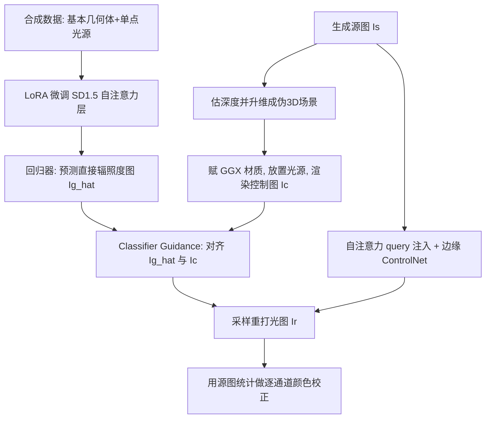

## 一句话总结

本文提出 PractiLight：不训练大规模领域专用重打光数据集，而是把预训练基础扩散模型（Stable Diffusion 1.5）中隐含的光传输先验"撬"出来——用一个轻量 LoRA 回归器从图像预测直接辐照度图（direct-irradiance map），再借助 Classifier Guidance 把目标光照注入另一张图的生成过程，从而以极少参数与数据实现跨多种图像域的通用光照控制。

## 研究背景

在生成图像中控制光照是一项困难任务：光照影响整幅图像的全部空间区域与频段，从低频的整体亮度、反射，到高频的硬阴影边缘、焦散，且重打光时场景元素的形状必须保持一致。这使光照控制显著区别于姿态、边缘等其他控制类型。

现有基于学习的方法大多依赖庞大且领域专用的数据集，因而泛化能力和实际可用性受限：

- 针对特定领域（人像、物体中心、室外、室内）分别训练，跨域（如赛璐璐渲染、室内、超现实图像）性能急剧下降。
- 即便建立在可泛化的基础模型之上，密集的全参数微调也会扭曲已学到的流形分布，反而损害原有泛化能力。
- 最相关的工作利用光传输的线性性、结合光台数据与合成/野外图像，在约一千万张图像上微调整个模型（或其大副本），人像效果出色，但通用场景不如本文方法。
- 图像分解类方法（分离 shading 通道）理论上灵活，但泛化性差且对新 shading 信号敏感；把扩散 U-Net 复用为内在通道提取器的工作只在单个时间步上做，频带过窄，不适合重打光。

与此同时，基础生成模型日益强大，暗示其对光相关的推理其实已有相当程度的理解。PractiLight 的动机正是高效利用这份隐含的光传输知识，用极少训练与数据实现跨域泛化。

## 方法

核心洞见有两点：其一，光照关系与自注意力层中的 token 交互本质相似——一个发光像素的属性（如颜色）应被那些在可见性与反射率上与之相关的像素所"关注"；其二，光相关的生成横跨多个时间步且很早就开始。基于这两点分析，PractiLight 训练一个轻量 LoRA 回归器预测直接辐照度图，再用 Classifier Guidance 把期望光照注入目标图像的生成。

### 光传输分析：光信息藏在哪里

作者用一个由两种光照条件（Original 与 Target）照亮的简单场景做探针实验。先对两张图做 DDIM 反演恢复潜变量，再把重建 Target 的激活注入重建 Original 的去噪过程，用语义相似度指标（DreamSim、DINO、CLIP）衡量结果与 Target 的接近程度。由于两图只差光照，能更好解耦光照的层应带来更高质量的注入结果。在 100 对图像、所有时间步上的实验表明：自注意力层（尤其解码器中的自注意力层）最能编码与光传输相关的特征；且不同注意力头对光的处理分工不同。

时间步分析进一步显示：描绘反射（漫反射与镜面反射）的区域在扩散过程早期关注相关光源，随过程推进转向关注语义相似区域，大约到总步数一半为止。这与扩散模型先解析低频（如 shading）后解析高频（如细纹理）的规律一致。因此光照编辑应尽早开始，但到中点附近停止，否则不仅无效还会损害图像。

### Classifier Guidance 与能量项

给定学到分数函数 $$S_\theta = \nabla_x \log(p(x_t))$$ 的预训练扩散模型，条件 $$y$$ 可经贝叶斯定理引入：

$$
\nabla_x \log(p(x|y)) = \nabla_x \log(p(x)) + \nabla_x \log(p(y|x))
$$

其中后一项是可用于引导生成的能量项。噪声预测形式下最终预测为

$$
\hat{\epsilon} = (1+w)\,\epsilon_\theta(x_t,t,y,c) - w\,\epsilon_\theta(x_t,t,\varnothing,c) + \gamma_t E_t
$$

$$w$$ 为 classifier-free guidance 尺度，$$\gamma_t$$ 为 classifier guidance 尺度，$$E_t$$ 为能量项。本文的能量项由回归器给出，把输入图像 $$x$$ 翻译成其直接辐照度分量 $$y$$，充当 $$p(y|x)$$ 的估计器。

### LoRA 回归器训练

LoRA 用低秩分解 $$\Delta W = BA$$（$$B\in\mathbb{R}^{m\times r},A\in\mathbb{R}^{r\times n},r\ll \min(m,n)$$）微调大模型，以最小扭曲、可控地权衡参数量与精度。作者只在 SD1.5 所有自注意力层的 $$q,k,v$$ 与线性输出投影矩阵上做 rank 8 的 LoRA，把 U-Net 变成一个直接预测干净直接辐照度信号的图到图翻译器。

关键区别在于：不同于以往只在单个固定时间步做翻译（因而无法用于 classifier guidance），本文像训练扩散模型一样在所有时间步上训练回归器。损失是潜空间中的 $$L_2$$ 重建损失 $$\lVert \hat{I}_g - I_g \rVert_2^2$$。相比从零训练、吃所有层特征的回归器，这种"外科式"只接特定层的做法能用少 10 倍的参数取得更好结果。

训练数据仅为 4000 张合成图：在 Blender 中用三种基本几何体（球、立方体、长方体）加单个点光源置于大立方房间，随机化位置、GGX 粗糙度与反照率、光强；正常渲染得到 $$I_s$$，另用一个渲染通道把直接漫反射与直接镜面反射相加得到真值 $$I_g$$。尽管场景简单，已足以驱动硬阴影与镜面高光等剧烈重打光效果。

### 光照控制与重打光

控制信号 $$I_c$$ 的构造类似 radiance hints：对源图 $$I_s$$ 估计深度、建成无纹理高度图伪场景，赋 GGX 材质（用户可调粗糙度），插入任意光源后用正交相机渲染单次反弹的直接辐照度图。该过程快速、可全自动，支持任意灰度光照条件（单点光、多点光乃至环境贴图）。

重打光时用如下能量项引导采样：

$$
E = \frac{\nabla_x \mathcal{L}}{\lVert \nabla_x \mathcal{L} \rVert_2^2}, \quad \mathcal{L} = \lVert \hat{I}_g - I_c \rVert_2^2
$$

使每一步的直接辐照度估计逼近控制图。由于回归器不完美、合成与真实图像存在域差、梯度含噪且光照与其他现象未完全解耦，朴素引导会严重破坏源图的结构、身份与风格。为此采取两项互补措施：其一，用预训练 ControlNet，以"控制图边缘 + 原图反照率估计的边缘"为条件保结构，同时避免复刻原图硬阴影/高光并转移光照条件的硬阴影边缘；但仅用 ControlNet 会带来卡通化与色彩过饱和。其二，注入源图采样过程中所有自注意力层的 query（query 已被证明编码结构），进一步减轻卡通化、保住身份。最后用源图各通道的均值与标准差做归一化颜色校正，纠正全局色偏。

引导调度上，取 $$\gamma_t = 2.2$$ 当 $$t\in[0.05,0.5]$$、否则为 0（$$t$$ 为归一化时间步）。理论上应从 $$t=0$$ 开始，但过早会丢结构；越过中点则会退化为源图与控制图的混合并严重丢身份。

## 实验结果

作者自建评测集：从 DiffusionDB 过滤后手工分为九类（Portrait、Portrait CG、Anime、Animal、Fantasy Landscape、Indoors、Outdoors、Painting、Sketch/Cartoon），每类按美学分取前 20，共 180 对 prompt-图像，并为每张图随机放置点光源生成控制条件。该数据集保留生成超参以便一致复现，且跨多域、图像质量较高，便于人评。

定量比较（与 RGB↔x、IC-Light）：

| 方法 | HPSv2↑ (美学) | Control L2↓ | Control LPIPS↓ | Identity L2↓ | Identity LPIPS↓ | Params↓ | Data↓ | Compute↓ |
| --- | --- | --- | --- | --- | --- | --- | --- | --- |
| RGB↔x | 0.2334 | 0.17 | 0.74 | 0.100 | 0.45 | 1.7e9 | 2e5 | 1600h |
| IC-Light | 0.2462 | 0.10 | 0.63 | 0.100 | 0.38 | 8.6e8 | 1e7 | 800h |
| Ours | 0.2493 | 0.13 | 0.74 | 0.056 | 0.30 | 7.9e5 | 4e3 | 1h |

本文方法在美学与身份保持上更优，控制遵循度相当，而优化参数、训练数据、算力均少约三个数量级。作者将此归功于高效利用了预训练骨干中已有的知识。

主观用户研究（每个数据点两问：谁更好保身份与风格、谁整体重打光更好）：对比 IC-Light 时，身份与风格 73.7% 对 26.3%、重打光 67.0% 对 33.0%；对比 DiLightNet 时，身份与风格 77.3% 对 22.7%、重打光 70.4% 对 29.6%，用户明显偏好本文方法。

消融与设计选择（评测集上的关键发现）：
- With Cross Attention：额外用交叉注意力层性能相当却翻倍参数，说明光信息在交叉注意力中编码不佳。
- No Scheduling：去掉全部引导调度后图像几乎未被编辑，控制指标偏低。
- $$\gamma_t=4.0$$：控制遵循更好，但美学与身份显著退化。
- No Query Injection / No ControlNet：分别去掉后身份严重丢失。
- LoRA Rank=4/16：本文用 rank 8；rank 4 看似有潜力但实际控制遵循较弱。
- Noisy Labels：改预测带噪标签而非干净标签，效果下降。
- 数据量实验（rank 32）：几百个样本已能提取有用信号，超过约 2000 个样本收益递减，证明数据高效。

## 亮点与局限

亮点：
- 提出"撬先验"而非"堆数据"的重打光范式：仅在自注意力层做小 rank LoRA、仅用 4000 张简单合成图，即以三个数量级更少的参数与数据实现跨域通用光照控制。
- 系统分析定位了扩散模型中光传输知识的所在（自注意力层、扩散早期时间步），并据此设计"全时间步训练的回归器 + Classifier Guidance"方案。
- 用 query 注入与边缘 ControlNet 的双重身份保持策略，缓解朴素引导导致的结构/风格/身份丢失与卡通化。
- 适配器式设计能即插即用地融入艺术家现有工具生态，且原理上可扩展到 DiT 类架构。

局限：
- 对硬阴影、高光等高频元素只有中等程度控制，且"添加"比"完全移除"容易得多。
- 目前不支持彩色光：彩色光需显著更多数据（要求回归器解耦材质反射率与光色），且会引入全局色偏；回归器预测还常偏棕色调，可能源于扩散模型动态范围限制或训练数据/过程偏置。
- 全局光照现象（如互反射等高阶效应）的控制仍是开放问题。
- 采样约为原生 SD1.5 的两倍耗时，因引导需反向传播计算梯度。

## 延伸思考

PractiLight 最有价值的启示是：与其为每个领域采集/微调庞大数据，不如先弄清基础模型"已经知道什么、知识存在哪一层哪一步"，再用最小侵入的适配器把它取出来引导生成。这种"分析先行、外科式微调"的思路可推广到重打光之外的其他物理属性控制。文中把光照关系类比为自注意力的多对多 token 交互，为"注意力层是建模光传输的天然归纳偏置"提供了直觉，也解释了为何该方法可望迁移到 DiT。局限则指向清晰方向：如何解耦材质与光色以支持彩色光、如何把高阶全局光照纳入训练、以及能否直接操纵那些"高度关联光照的注意力头"实现无优化的外科式控制——这些都可能进一步把物理光交互注入生成过程。
