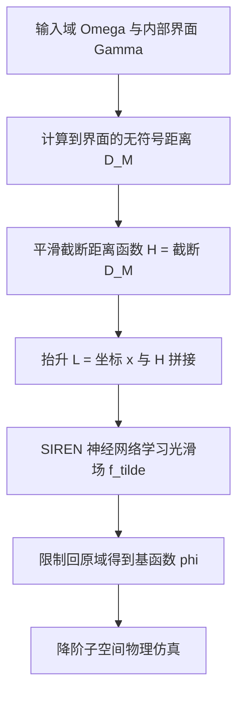

## 一句话总结

通过用一个"平滑截断距离函数"抬升（lifting）输入坐标，让神经场在保持函数连续的同时精确表达梯度不连续，从而实现对异质材料界面与折痕的、与离散化无关的降阶物理仿真。

## 研究背景

梯度不连续（空间导数的突变）广泛存在于物理系统中，例如折叠薄片的折痕、以及刚度突变的异质材料界面。准确建模这类特征对仿真至关重要，但传统基于网格的方法必须让离散化与不连续界面对齐，这就把几何和仿真紧紧耦合在一起：一旦界面随形状变形、材料变化或折痕演化而移动，网格就要重建，之前的降阶模型（ROM）基函数随之失效，难以在形状族之间泛化。

扩展有限元（XFEM）通过在固定网格上加入不连续基函数来避免重网格化，但仍依赖固定的背景网格且通常运行在全分辨率下，不利于降阶建模。神经场把基函数建模为空间上光滑连续的函数，天然与离散化无关，可跨参数化形状族做子空间仿真，但其光滑性使其难以表达不连续。已有的抬升类工作（如 Chang 等 2025）用广义环绕数场处理"函数值"的不连续（如切割），却没有解决"函数连续但梯度不连续"这一问题。而椭圆 PDE 理论指出：带权拉普拉斯算子的特征函数会在权重跳变的界面处出现梯度不连续，这正是异质材料和折痕的物理本质，本文正是基于这一联系构造方法。

## 方法

整体框架：把在界面 $$\Gamma$$ 上梯度不连续、但处处连续的目标场 $$f:\Omega\to\mathbb{R}$$，表示为一个处处光滑场 $$\tilde{f}$$ 在抬升映射上的限制。核心是构造一个闭式、无可学习参数的抬升函数 $$H(\boldsymbol{x})$$，把输入坐标抬升到高维空间 $$L(\boldsymbol{x})=(\boldsymbol{x}, H(\boldsymbol{x}))$$，再用神经网络在抬升域上学光滑场，限制回原域时即得到带梯度突变的基函数。

关键设计：

- 平滑截断距离函数（Smoothly Clamped Distance）：抬升维度用 $$H(\boldsymbol{x})=\lVert D_{\mathcal{M}}(\boldsymbol{x})\rVert_{\mathrm{SC}}$$，它是一个 $$C^0$$ 函数——在界面处保留"绝对值式"的梯度突变，超过阈值 $$s$$ 后被平滑压平。这样只需计算阈值内的距离，既避免了无符号距离场的全局计算开销与中轴奇异性，又适配空间哈希加速；实测查询内存降到 1/4.1，速度提升约 3.6 倍。
- 几何与网络权重解耦：$$H$$ 以闭式给出、不含可学习参数，界面几何不被"烤进"网络权重里，因此同一神经表示可在形状族与材料族之间复用，界面布局的微小改变无需重训。
- 参数条件化的降阶仿真：把形状/刚度信息编码为参数 $$\alpha$$，界面 $$\mathcal{M}_\alpha$$ 与抬升 $$H_\alpha$$ 随之变化，网络权重也以 $$\alpha$$ 为条件。对异质材料，通过最小化带权 Dirichlet 能量 $$E_D[\boldsymbol{\phi}_i]=\tfrac12\int_\Omega w(\boldsymbol{x})\lvert\nabla\boldsymbol{\phi}_i\rvert^2 d\Omega$$ 求解广义特征问题得到基函数；对折痕则最小化 Hessian 能量 $$E_H[\boldsymbol{\phi}_i]=\int_\Omega\lVert\nabla^2\boldsymbol{\phi}_i\rVert_F^2 d\Omega$$，折痕处的梯度突变由网络架构自然产生，损失中无需显式提供不连续信息。
- 与值不连续统一：由于本方法与 Chang 等 2025 都基于抬升，可把广义环绕数场作为额外一维加入抬升 $$L(\boldsymbol{x})=(\boldsymbol{x}, H_d(\boldsymbol{x}), H_{gwn}(\boldsymbol{x}))$$，在单一模型里同时表达切割（值不连续）与折痕（梯度不连续）。

## 实验结果

在 NVIDIA RTX 4090 上以 PyTorch 实现，网络为 5 层、128 通道的 SIREN MLP。下表为论文报告的各示例仿真计时（节选自原文 Table 1）：

| 示例 | 基函数数 | 仿真顶点数 | 基构建时间 (ms) | 每步时间 (ms) |
| --- | --- | --- | --- | --- |
| Snail（图 7） | 21 | 5.9k | 79.06 | 23.52 |
| 2D Robot, $$\alpha=1$$（图 10） | 7 | 102.4k | 144.60 | 76.51 |
| Bar（图 8） | 4 | 40.0k | 86.28 | 2.78 |
| Robot finger（图 11） | 4 | 8.6k | 24.81 | 4.19 |
| Shoe（图 9） | 4 | 30.0k | 226.52 | 2.17 |
| 3D Robot（图 1） | 11 | 23.7k | 370.94 | 5.16 |
| Crease（图 12） | 4 | 150.0k | 87.42 | 5.34 |
| Crease and Cut（图 14） | 2 | 50.0k | 7.75 | 1.87 |

结果表明该方法常能达到接近实时的速度；基构建（网络推理并构造基）只在仿真开始或参数 $$\alpha$$ 改变时进行，调用不频繁。在异质材料的 U 形域与 2D 蜗牛例子中，本方法是唯一能在刚度界面处捕捉到锐利梯度不连续的神经方案，结果与 FEM 可比，而 SIREN 会在界面处平滑化、ReLU 场则因其固有梯度突变无法与物体界面对齐而失败。此外方法展示了跨形状族（狐狸到熊、儿童到成人机器人）的连续变形、对未见刚度分布的泛化、以及基于形状参数 $$\alpha$$ 的可微形状优化（机械手指抓取）。

## 亮点与局限

亮点：

- 首个在可泛化神经场架构中表达梯度不连续、并支持降阶仿真的方法，首次实现切割与折痕的组合、演化折痕、以及带参数化界面的异质材料。
- 界面几何以闭式抬升函数编码、不进入网络权重，实现与离散化无关、跨形状/材料族复用的基函数，无需重网格化即可支持运行时形状变形与折痕交互编辑。
- 平滑截断设计兼顾正确性与效率，适配空间哈希，取得显著的内存与速度收益。

局限：

- 与所有基于神经网络的方法一样，当测试分布明显偏离训练集时泛化受限；测试折痕远离训练分布时，位移场仍在新位置不连续，但纸张不再沿折痕自然弯折，基函数的物理意义变弱。缓解方式是采样更多 $$\alpha$$ 值增加训练多样性。
- 界面需由用户显式表示与对齐，尚未自动化或物理驱动。

## 延伸思考

该工作把椭圆 PDE 中"权重跳变导致法向导数不连续"的经典结论，转译成了神经场的输入抬升构造，本质是用一个精心设计的 $$C^0$$ 辅助坐标，把"难学的不连续"变成"易学的光滑"，让网络的光滑先验反而成为优势。这一思路具有可迁移性：值不连续用环绕数场、梯度不连续用截断距离场，两者可叠加，暗示更高阶或更多类型的奇异性或许都能通过设计合适的闭式抬升维度来统一表达。一个自然的方向正是论文提出的——让界面本身可微、物理驱动地自动演化，从而把"用户指定界面"升级为"仿真自发形成折痕/裂纹"，这将把该框架从表示工具推进为具备预测能力的仿真引擎。
