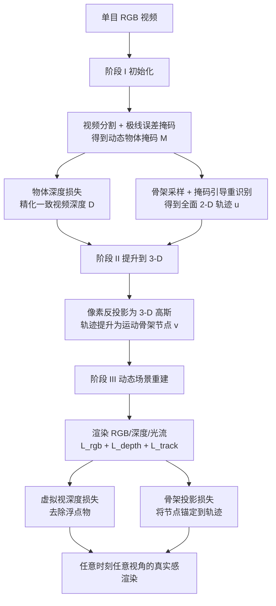

## 一句话总结

本文不设计新的场景表示，而是提升驱动动态高斯泼溅（Dynamic Gaussian Splatting, DGS）的三类 2-D 先验——动态物体掩码、一致视频深度、2-D 点轨迹，并配合两项新损失，从而在单目随手拍视频上重建出细结构清晰、运动连贯的动态场景，效果超过既有单目 DGS 方法。

## 研究背景

从随手拍摄的单目 RGB 视频重建随时间变化的三维场景，是图形学与视觉领域的长期目标。3D 高斯泼溅（3D-GS）把静态场景表示为数万个各向异性高斯并实时光栅化，将其扩展到运动视频便得到动态高斯泼溅（DGS）：高斯随时间平移旋转，支持自由视角回放与 AR/VR 体验。

要解决这一欠定问题，既需要精心设计的运动与几何表示，也需要来自基础模型的多种 2-D 先验（一致深度、动态掩码、2-D 轨迹）来初始化与监督重建。MoSca、Shape-of-Motion 等系统组合这些要素取得了不错的真实感，但动态物体仍暴露出流水线的局限：细结构（如四肢）模糊或消失，复杂运动失去连贯性。

作者的核心观察是：多数已有工作把力气花在更丰富的场景表示或复杂的优化调度上，却忽视了基础模型 2-D 先验本身的质量，而后者已成为主要瓶颈之一。只要升级喂给 DGS 系统的深度、掩码和轨迹，重建质量就能显著提升。因此本文聚焦于提升先验质量，而非改造表示。

## 方法

整体是建立在 MoSca 之上的三阶段全自动流水线：（I）初始化，提炼高质量的动态掩码、精化深度与轨迹；（II）提升到 3-D，把像素与轨迹提升为 3-D 高斯与运动骨架节点 $$v^{(m)}$$；（III）动态场景重建，在渲染监督之上引入两项新损失把精化后的先验直接注入高斯云与运动模型。

### 关键设计一：动态物体掩码选择

极线误差掩码 $$E$$ 只覆盖运动部分，作者用视频分割线索 $$S^{(l)}$$ 将其扩张成完整覆盖物体的物体级掩码。判定分两步：若某分割片段与运动区域的交集占运动总面积的比例达到阈值 $$\tau_{salient}=0.05$$ 则保留；再剔除自身运动面积过小的静态片段（如移动阴影），要求交集占该片段面积的比例达到 $$\tau_{appearance}=0.2$$。两步过滤后得到干净的逐帧动态物体掩码。

### 关键设计二：物体深度精化

Mega-SAM 提供时间一致的视频深度 $$D$$，但在细而快速运动的部件上过度平滑。作者用 MoGe 单目深度 $$\tilde{D}$$ 替换其初始深度，并在一致性优化阶段加入物体深度损失：对每个物体掩码 $$M^{(o)}_t$$ 裁剪出物体单目深度 $$\tilde{D}^{(o)}_t = M^{(o)}_t \odot \tilde{D}_t$$，用掩码内的尺度—偏移拟合 $$\alpha^{(o)}_t \tilde{D}^{(o)}_t + \beta^{(o)}_t$$ 将其对齐到当前视频深度，再约束：

$$L^{object}_{depth} = \frac{1}{T\lvert\Omega\rvert} \sum_{o=1}^{O} \sum_{t=0}^{T} \sum_{p\in\Omega} M^{(o)}_t(p)\,\lvert D_t(p) - (\alpha^{(o)}_t \tilde{D}_t(p) + \beta^{(o)}_t)\rvert$$

由于损失只作用于物体像素，它在锐化细结构的同时保持了全局尺度与整体时间一致性。

### 关键设计三：掩码引导的点轨迹

在极线误差掩码内均匀采样会偏向大而刚性的部位（如躯干），欠采样细而高速运动的区域（如四肢）。作者引入骨架采样：从物体掩码提取 2-D 中轴骨架，膨胀 5 像素，按到掩码边界的逆距离加权，额外抽取 $$\tfrac{1}{6}$$ 的轨迹。此外用掩码做重识别：若某轨迹起源于 $$M^{(o)}$$ 且当前位置仍在该掩码内，就把因遮挡被标为遮挡的轨迹重新标为可见，补回缺失监督。为抑制自遮挡误判，在短窗口 $$[t-2, t+2]$$ 内重采样，若重采样轨迹与原轨迹偏差超过 $$\tau_{self\text{-}occ}=10$$ 像素则仍保持不可见。

### 关键设计四：两项重建阶段损失

重建阶段用 $$L_{rgb}$$、$$L_{depth}$$、$$L^{gaussian}_{track}$$ 监督高斯与骨架，并额外引入两项约束：
- 虚拟视深度损失：小基线视频会让高斯过拟合训练视角，产生仅在新视角可见的浮点物。作者随机在像平面平移生成虚拟相机，把深度扭曲到该视角得 $$D^{virtual}_t$$，约束 $$L^{virtual}_{depth} = \lVert \hat{D}^{virtual}_t - D^{virtual}_t \rVert_1$$，从而清除浮点物。
- 骨架投影损失：ARAP 正则偶尔让骨架节点漂离物体（尤其细而快速运动的部位）。由于每个节点源自某条轨迹，将节点投影到相机得 $$v_{2D}$$，惩罚其与对应轨迹的 2-D 距离 $$L^{scaffold}_{track} = \lVert v_{2D} - u^{(n)}_t \rVert_2$$，把节点锚定回轨迹。

## 实验结果

在 iPhone DyCheck 数据集上与 Shape of Motion（S.o.M.）、MoSca、DpDy、Cat4D 对比，评测新视角的 mPSNR、mSSIM、mLPIPS，分（a）无位姿纯 RGB 与（b）有深度与位姿两种协议。

| 方法 | (a) mPSNR↑ | (a) mSSIM↑ | (a) mLPIPS↓ | (b) mPSNR↑ | (b) mSSIM↑ | (b) mLPIPS↓ |
|------|------|------|------|------|------|------|
| S.o.M. | 17.15 | 0.625 | 0.278 | 17.32 | 0.598 | 0.296 |
| MoSca | 17.24 | 0.603 | 0.304 | 19.32 | 0.706 | 0.264 |
| DpDy | – | – | – | – | 0.559 | 0.516 |
| Cat4D | – | – | – | 18.24 | 0.666 | 0.227 |
| Ours | 17.63 | 0.648 | 0.268 | 19.43 | 0.711 | 0.260 |

- 在严格单目（无位姿纯 RGB）设定下，本方法与 S.o.M.、MoSca 相当且略优；提供 LiDAR 深度与真值位姿后各方法均提升，本方法仍略胜基线。
- 在 NVIDIA 多视角数据集（无真值位姿）上，本方法 PSNR/LPIPS 为 26.58/0.067，优于 MoSca（26.54/0.073）且明显优于 RoDynRF（25.38/0.079）。
- 消融实验（DyCheck 无位姿设定）显示：去掉掩码引导轨迹后 SSIM 从 0.648 降到 0.632，去掉虚拟视深度损失后 LPIPS 从 0.268 升到 0.277，去掉骨架投影损失后 SSIM 降到 0.637，三项组件各有贡献。定量差距虽小，但定性上细结构与视觉连贯性改善明显。

## 亮点与局限

亮点：
- 视角新颖：把提升重建质量的抓手放在基础模型 2-D 先验的质量上，而非重新设计场景表示，属于对现有 DGS 流水线的正交增强。
- 掩码是贯穿全程的枢纽：同一套动态物体掩码同时驱动深度精化、骨架采样、轨迹重识别与自遮挡过滤，设计上简洁自洽。
- 两项重建损失针对性强：虚拟视深度损失专治小基线过拟合导致的浮点物，骨架投影损失专治 ARAP 让节点漂离细结构，都是低成本即插即用的约束。

局限：
- 系统会把输入视频中的运动模糊或失焦模糊直接复制到重建结果，模糊在新视角合成中依然存在。
- 未观测区域会留空，无法补全被遮挡或视野外的内容。
- 在 DyCheck 严格单目设定下相对基线的定量增益较小，绝对提升在小基线场景中有限。

## 延伸思考

- 作者在局限中提出可引入视频生成模型来去模糊并幻构缺失内容，这与近期"生成式先验补全动态场景"的趋势契合，是把判别式先验与生成式先验融合的自然方向。
- "先验质量是瓶颈"这一论点具有普适性：随着深度、分割、点跟踪基础模型持续升级，本文流水线的上限也会随之抬高，值得思考哪些环节最受益于先验升级。
- 掩码作为重识别与自遮挡判定的"oracle"依赖分割质量，在多物体交互、频繁互遮挡或分割失败场景下的鲁棒性，是该框架落地更复杂视频时需要验证的关键。
