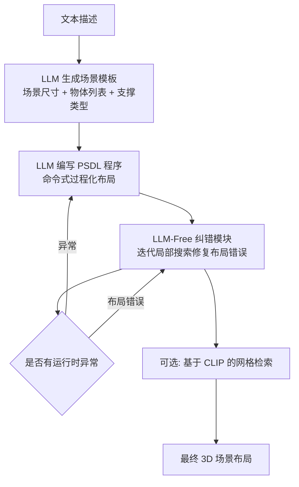

## 一句话总结

本文用"命令式"过程化程序（而非主流的声明式约束求解）来生成开放词汇 3D 场景布局，并配套一个不再调用 LLM 的程序搜索式纠错模块，在保持程序原始结构的前提下修复重叠、越界等布局错误。

## 研究背景

从开放式文本描述合成 3D 场景是近期热门课题，其核心子问题是布局生成：给定一组物体，将它们摆放成符合描述的场景。近乎所有近期工作都采用**声明式范式**——用 LLM 生成物体间约束的规格（如 on(a,b)、adjacent(a,b)），再交给求解器求解出最终布局。声明式范式之所以流行，一是其高层操作语义更自然、简化了 LLM 的预测任务，二是求解器本身自带纠错能力，可缓解 LLM 产生的错误。

但声明式范式也有短板：求解一个布局需要解复杂优化问题，速度慢，且求解时间随关系数量线性增长、关系数量又随物体数量平方增长，因此在博物馆、剧院等大规模场景中尤其缓慢；此外并非任意物体配置都能用某个特定声明式领域语言（DSL）表达，例如 DSL 没有 spiral() 约束就难以摆出螺旋排列。

作者反思：声明式相对早期命令式方法（如 LayoutGPT 逐个直接指定坐标）的两大优势——高层语义操作与内建纠错——是否只能在声明式下实现？命令式范式其实有执行快、精确、原则上能表达任意配置的好处。于是本文尝试把声明式的经验迁移到命令式上，兼得两者之长。

## 方法

### 整体框架

系统把与布局无关的计算阶段抽离并在各对比方法间共享，以保证公平比较。流程为：LLM 先从文本生成"场景模板"（场景尺寸 + 物体列表，每个物体含名称、尺寸和 STANDING / WALL-MOUNTED / FLOATING 三种支撑类型之一）；随后 LLM 用嵌入 Python 的 DSL（PSDL）写出场景程序；接着由无 LLM 参与的纠错模块通过程序搜索修复布局违例；最后可选地检索 3D 网格用于可视化。

### 关键设计

1. **PSDL 语言的三大特征**：与 LayoutGPT 那种"平铺的独立坐标列表"不同，PSDL 让物体属性成为相对于已放置物体或场景边界的**函数表达式**（如 `chair.max.x = table.min.x - 0.1`）；支持**变量共享**，单个符号常量可控制多个物体（改一处间距即可协调更新所有依赖对象）；支持**控制流**（循环、条件）以简洁表达成排桌椅、对称摆件等结构化重复模式。这三点让纠错搜索能在"程序参数化"层面而非"物体"层面进行，从而每个候选程序都天然保持场景关系，搜索空间更紧凑、更有语义。PSDL 还提供 `set_coordinate_frame(o)` 算子建立局部坐标系，便于在规范空间构造子布局后整体变换到全局。

2. **纠错的问题形式化**：LLM 错误分为异常（幻觉函数调用、参数错误、越界索引等运行时异常，处理方式是丢弃程序并重新请求 LLM）与布局错误（物体重叠、越界、违反支撑约束）。布局错误用损失函数 $$loss(L)$$ 量化，含四项：越界损失（包围盒伸出场景边界的最大线性距离）、重叠损失（两物体包围盒相交体积的立方根，门窗还带扩展碰撞盒以留出开启空间）、站立损失（STANDING 物体底面到最近可支撑水平面的距离）、挂载损失（MOUNTED 物体可挂载面到最近竖直面的距离）。

3. **误差与相似度的联合优化**：修错时若破坏语义完整性（例如把餐桌搬到空房间另一头来消除与椅子的重叠）反而更糟。由于用 LLM 判断语义一致性代价高，作者采用保守的充分非必要性质——修改后程序与原程序越相似，越可能语义一致。目标写作 $$\arg\min_{P}\left[loss(L) + d(P, P_0)\right]$$，其中距离项 $$d(P, P_0) = d_{edit}(P, P_0) + d_{OT}(L, L_0)$$：$$d_{edit}$$ 是程序编辑距离，$$d_{OT}(L, L_0) = \min_{f \in F} \sum_{o \in O(L)} Vol(o) \cdot \lVert center(o) - center(f(o)) \rVert_2$$ 是布局间的最优传输距离（按体积加权，使大物体移动受更大惩罚，从而保留主要场景元素位置、只微调小物体）。

4. **迭代局部搜索算法**：从 LLM 原始程序 $$P_0 = P_{LLM}$$ 出发，逐步 $$P_{i+1} = \arg\min_{P \in N(P_i)} f(L)$$，其中 $$f(L) = loss(L) + d_{OT}(L, L_0)$$。基础编辑集只针对 LLM 最易出错的两类——常量表达式与朝向表达式：每个常量采样 10 个编辑（乘以随机量 $$\pm 4^{Y}$$，$$Y$$ 在 $$[-1,1]$$ 均匀采样），每个朝向表达式尝试全部 4 个基本方向。当没有编辑能让目标下降超过阈值时终止。平均每场景仅需约 7.13 次调整即可消除错误。此外作者还提出一个基于多模态 LLM 的自动评测方法 LLMCompare：给它两张布局图并要求先列出各自优缺点再判定优劣，比 VQAScore、DSG 更贴合人类判断。

## 实验结果

基准集含 70 条覆盖多样环境与复杂度的场景提示（按尺寸、室内外、写实/奇幻、混乱/结构化标注），并纳入 Holodeck 用过的 MIT 室内场景提示。语言生成用 claude-3-5-sonnet，评测骨干用 gpt-4o。下表为用 LLMCompare 自动评测得到的偏好率（本文方法被偏好的比例），对比声明式方法 DeclBase、Holodeck、FlairGPT：

| 对比对象 | All | Ours 提示集 | Holodeck 提示集 | Simple | Complex |
|------|------|------|------|------|------|
| vs. DeclBase | 76.5% | 77.1% | 75.8% | 77.8% | 68.4% |
| vs. Holodeck | 82.4% | 90.0% | 74.2% | 82.9% | 78.9% |
| vs. FlairGPT | 88.2% | 85.7% | 90.9% | 87.2% | 94.7% |

在受试者强制二选一感知实验中，本文方法（含纠错）相对 DeclBase 与 Holodeck 分别被偏好 82.9% 与 94.3%；含纠错相对不含纠错被偏好 74.3%，不含纠错相对 DeclBase 仍被偏好 61.8%。按物体数量分箱，40 个以上物体的复杂场景中相对 Holodeck 偏好率高达 95.2%，显示方法在大规模结构化场景中优势最明显。纠错消融（见原文）表明：本文 PSDL 局部搜索修复了 91% 的错误，虽然梯度下降与基础命令式局部搜索能修更多错误（96%、93.5%），但因它们逐物体移动会破坏物体间关系，最终偏好率均低于本文；且 PSDL 搜索（9.3s）比基础命令式搜索（25.2s）快近 3 倍，比 LLM 自修复（106.7s）快一个数量级以上。

## 亮点与局限

**亮点：**
- 逆主流而行，重新论证命令式过程化程序在开放词汇场景布局上的价值，并用"程序层面搜索"把声明式求解器的纠错能力迁移到命令式，避免了昂贵的全局求解。
- 纠错完全不调用 LLM，靠关系表达式、共享变量与循环压低搜索维度，一次常量修改即可协调整排物体，兼顾速度与语义一致性。
- 提出与人类判断更对齐的 LLMCompare 自动评测（先列优缺点再判定），缓解了感知实验难以规模化的问题。

**局限：**
- 局部搜索目前只编辑数值常量与朝向，无法修复更复杂的语义缺陷（如物体身份互换、x/y 坐标互换）。
- 损失函数只覆盖支撑与碰撞，未显式编码视线、可行走性等更高阶美学与功能约束。
- VLM 评测器本身是经验代理，其偏见可能把后续系统引向它自己的盲区；实验还依赖固定检索模块并把朝向限制在四个基本方向。

## 延伸思考

本文最有启发的是"表示决定纠错难度"这一视角：把场景写成保留关系的过程化程序后，修错在低维参数空间进行、天然不破坏结构，这与直接在物体坐标空间修错形成鲜明对比。这提示我们，生成任务的中间表示设计往往比纠错算法本身更关键。顺此思路可延伸几点：其一，编辑算子若能扩展到结构性重写（如交换坐标轴、重排循环），或结合轻量学习模型预测"改哪个常量"，有望覆盖更复杂的语义错误；其二，损失若能纳入视线、动线、可达性等功能性约束，布局的"可用性"而非仅"合法性"会显著提升；其三，作者指向的动态场景生成是自然的下一步——当任务复杂度上升，用过程化程序为 LLM 简化编码负担的价值只会更大。此外 LLMCompare 这类"先讲理由再决策"的评测范式，或许也能反哺生成阶段，作为可微或可搜索的奖励信号。
