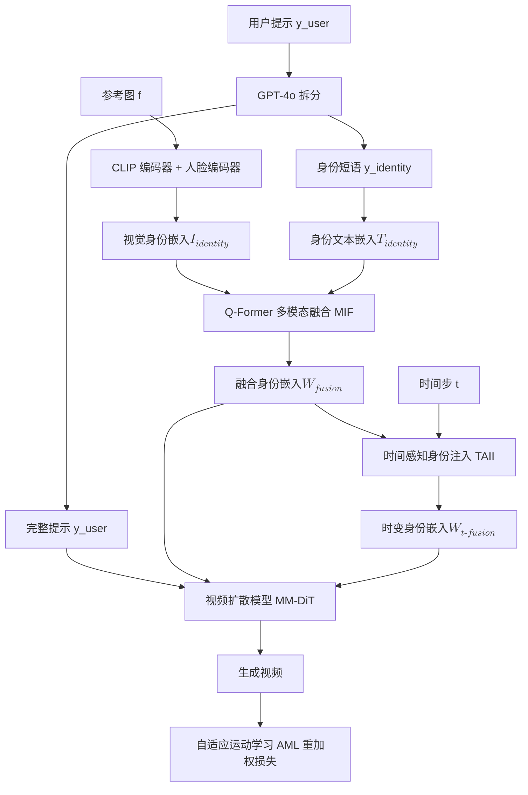

## 一句话总结

Proteus-ID 提出一个基于扩散 Transformer 的视频身份定制框架，通过多模态身份融合、时间感知身份注入与自监督自适应运动学习三大模块，在仅给定单张参考图与文本提示的条件下，生成既保持身份一致、又语义对齐且运动自然流畅的定制视频。

## 研究背景

视频身份定制的目标是：给定一张参考图和一段自然语言描述，合成一段时序连贯、忠实保留特定主体身份、同时符合提示所述外观与动作的视频。这一任务面临两个核心挑战：

- **身份一致性与提示对齐的冲突**。现有方法通常把文本和图像分别编码，再经由不同的条件通路注入去噪模型，导致去噪器接收到彼此错位甚至竞争的引导。视觉线索往往被模型优先采纳，从而产生"复制粘贴"式伪影（僵硬照搬参考人脸、忽略提示），或反过来丢失身份保真度。根源在于视觉与文本身份线索缺乏共享的语义基础。
- **运动僵硬、缺乏自然流动感**。以均匀重建损失训练的文生视频模型倾向于回避有风险的运动，尤其在提示涉及动态动作时输出静止或僵硬结果。已有引入运动先验的方法多依赖姿态、深度、光流等辅助输入，在训练与推理阶段都受限，通用性差。

此外，高质量训练数据稀缺（如 ConsisID 仅约 20K 片段），进一步制约了该任务发展。

## 方法

### 整体框架

Proteus-ID 构建在预训练的 MM-DiT（来自 CogVideoX）之上，包含三个关键组件：多模态身份融合（MIF）在去噪前用 Q-Former 整合身份文本嵌入与视觉特征；时间感知身份注入（TAII）引入时间步嵌入，在去噪过程中自适应调节身份条件强度；自适应运动学习（AML）通过自监督运动信号重加权训练损失以增强运动真实感，且推理时无需额外输入。

### 关键设计

**1. 多模态身份融合（MIF）。** 文本传达通用语义（如"戴眼镜的年轻女性"），图像锚定具体外观细节（发型、脸型），二者天然互补。方法先用 GPT-4o 把用户提示拆成身份短语 $$y_{identity}$$ 与动作/场景描述；参考图经 CLIP 编码器（全局外观）与人脸编码器（精细身份）提取后融合得到视觉嵌入 $$I_{identity} = \text{Trans}(E_{CLIP}(f), E_{Face}(f))$$。随后以 Q-Former 对齐文本与视觉线索，初始化 $$W_0 = [Q, T_{identity}]$$，经 $$L$$ 层自注意力与交叉注意力迭代：

$$W_l = \text{FFN}\big(\text{MHCA}(\text{MHSA}(W_{l-1}), I_{identity})\big), \quad l = 1, \dots, L.$$

得到统一身份嵌入 $$W_{fusion}$$，代表"这个特定的人，正如描述所言"，再投影并拼接到提示嵌入序列注入扩散模型，缓解身份与文本的模态冲突。

**2. 时间感知身份注入（TAII）。** 扩散模型在不同时间步处理信息不均衡：早期捕捉粗粒度低频结构，后期细化高频细节。若把 $$W_{fusion}$$ 在所有时间步均匀注入并不理想。TAII 借鉴 Resampler，用 $$N$$ 个含自适应归一化、交叉注意力与前馈层的堆叠块，把融合身份转成时变嵌入 $$W_{t\text{-}fusion} = \phi_{\theta}(W_{fusion}, t)$$，从而在大 $$t$$ 时强调粗粒度身份特征、小 $$t$$ 时强调精细细节。它以带时间步感知的残差方式注入每个 MM-DiT 块：

$$Z'_i = Z_i + \text{MHCA}\big(Q = Z_i,\; K = W_{t\text{-}fusion},\; V = W_{t\text{-}fusion}\big).$$

**3. 自适应运动学习（AML）。** 用 RAFT 计算相邻帧稠密光流得到运动幅度热图 $$M$$，用分割模型得到主体掩码 $$\Omega_{body}$$ 后隔离主体运动 $$M_{body} = \sigma(\Omega_{body} \odot M)$$，下采样对齐潜空间得到 $$M'_{body}$$。据此重加权去噪损失，令高运动区域误差惩罚更重：

$$L_d = \big(1 + \lambda M'_{body}\big) \odot L_c,$$

其中 $$L_c$$ 为身份感知损失，$$\lambda$$ 控制运动强调程度。该策略无需推理时额外运动输入即可让输出更流畅、时序更连贯。

## 实验结果

作者构建 Proteus-Bench（20 万训练片段 + 150 个跨职业跨族裔评测个体），在身份保持（FaceSim-Cur / FaceSim-Arc）、文本对齐（CLIPScore）、视觉质量（FID）与运动幅度（Motion Amplitude）四个维度上与五个开源基线对比：

| 方法 | FaceSim-Cur ↑ | FaceSim-Arc ↑ | FID ↓ | CLIPScore ↑ | Motion Amplitude ↑ |
| --- | --- | --- | --- | --- | --- |
| ID-Animator | 0.365 | 0.351 | 97.253 | 27.310 | 10.135 |
| ConsisID | 0.614 | 0.596 | 126.586 | 29.075 | 23.491 |
| FantasyID | 0.509 | 0.495 | 127.870 | 28.125 | 15.724 |
| Concat-ID | 0.608 | 0.584 | 134.590 | 29.094 | 26.516 |
| EchoVideo | 0.528 | 0.510 | 149.037 | 28.100 | 30.148 |
| Proteus-ID（本文） | **0.682** | **0.661** | 117.999 | **29.235** | **30.679** |

Proteus-ID 在身份保持、文本对齐与运动幅度上均取得最佳。FID 上 ID-Animator 最优，但作者指出这可能源于其倾向生成更静态的内容。30 人参与、120 组对比样本的用户研究中，Proteus-ID 在身份保持、文本对齐、运动连贯、视觉质量四项主观评分上也全面领先。

## 亮点与局限

**亮点：**
- 用 Q-Former 把视觉与文本身份线索深度融合成单一联合表征，从条件设计上根治"复制粘贴"伪影与模态冲突，而非事后修补。
- TAII 把扩散过程的频率演化规律引入身份注入，让身份引导强度随去噪步动态变化，兼顾身份一致与提示对齐。
- AML 仅靠光流热图重加权损失即可提升运动真实感，推理阶段零额外输入，通用性强。
- 开源了 20 万片段规模的 Proteus-Bench，弥补了该任务高质量数据的空缺。

**局限：**
- 消融显示 AML 会略微增加 FID 并降低 CLIPScore，即在提升运动幅度与视觉体验的同时对文本对齐/静态保真存在轻微权衡。
- 方法依赖 GPT-4o 拆分提示、多种现成检测/分割/光流模型构建数据与掩码，管线较重，对外部模型质量有依赖。
- 评测聚焦真人身份，对非人类主体或多主体场景的泛化未充分展开。

## 延伸思考

Proteus-ID 的核心洞见是"把条件冲突消解在表征层"——与其在推理时平衡竞争的视觉/文本引导，不如先融合成统一身份表征。这一思路可迁移到更广的多条件可控生成（如同时受布局、风格、身份约束的场景）。TAII 揭示的"条件强度应随去噪步频率特性调制"也颇具启发，值得推广到其他控制信号（如布局、深度）的注入时机设计。AML 的自监督损失重加权则提示：在缺乏显式监督的属性上，可用现成分析工具（光流、分割）从数据中"挖"出软监督信号，这是一种低成本增强特定能力的通用范式。
