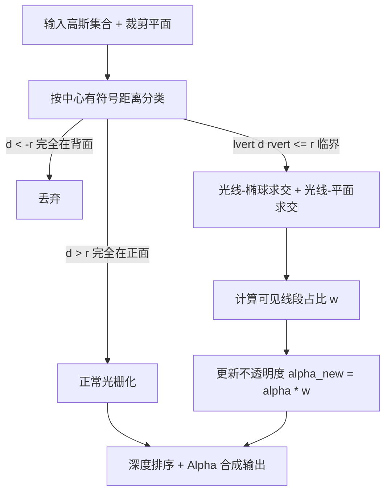

## 一句话总结

本文提出 RaRa Clipper：一个把光栅化与光线追踪混合的高斯泼溅裁剪框架，先用光栅化快速判定哪些高斯被裁剪平面穿过，再仅对这些"临界"高斯做光线-椭球求交、按可见线段比例衰减其不透明度，从而在保持实时帧率的同时实现平滑、无跳变的连续裁剪。

## 研究背景

高斯泼溅（Gaussian Splatting, GS）已成为实时渲染与可微重建的强力表示，广泛用于交互编辑、医学图像裁剪、机器人导航、头发建模等场景。这些应用常常需要"裁剪"操作来隔离感兴趣区域、去除遮挡或加速渲染。

但传统图形管线的裁剪手段（Z-buffer、视锥剔除、AABB 拒绝）难以直接套用到 GS 上。核心困难在于高斯基元的**体积特性**：它对成像的贡献是沿视线方向对密度积分得到的，而非基于表面几何。现有做法（原始 3DGS、多层 GS 等）普遍采用**硬裁剪**（Hard Clipping）——仅根据高斯中心相对裁剪平面的位置做二值取舍。这种方法忽略了每个高斯在图像空间的真实贡献，会在裁剪边界附近产生走样、跳变（popping），并错误地整体删除本应部分可见的基元。

与此同时，已有把光线追踪引入 GS 的工作（如 3DGRT、3DGUT、Relightable 3D Gaussians、Stochastic Ray Tracing）多聚焦于反射折射、重光照等全局效果，很少处理局部裁剪与细粒度可见性估计，且往往需要定制光追管线或网格先验，增加训练成本或降低渲染性能。本文的目标是提供一个可插拔、几乎零额外开销、可直接接入原生 GS 管线的精确裁剪组件。

## 方法

整体框架分三步：先按高斯中心到裁剪平面的有符号距离将所有高斯分为"可见/不可见/临界"三类；仅对临界高斯发射光线，求出光线与椭球、光线与裁剪平面的交点；再依据落在可见区内的线段长度占比构造衰减权重，修正该高斯的不透明度，最后照常做泼溅合成。

其中 GS 的基本合成公式为按深度排序的前向 alpha 混合：

$$
C = \sum_{k \in N} c_k\, \alpha_k \prod_{j=1}^{k-1} (1 - \alpha_j)
$$

### 关键设计 1：三类可见性分类，把昂贵的光追限定在临界高斯

用隐式平面 $$\pi(\mathbf{x}) = \mathbf{n}\mathbf{x} + d = 0$$ 定义裁剪区域，法线指向的半空间为可见区。对中心为 $$\boldsymbol{\mu}_k$$ 的高斯计算有符号距离 $$d_{e.p.} = \mathbf{n}\boldsymbol{\mu}_k + d$$，并取包围半径 $$r_k = 3\max(\sigma_{xk}, \sigma_{yk}, \sigma_{zk})$$：若 $$d_{e.p.} < -r_k$$ 则完全不可见、丢弃；若 $$d_{e.p.} > r_k$$ 则完全可见、正常光栅化；仅当 $$\lvert d_{e.p.}\rvert \le r_k$$ 时判为临界，需精确求交与外观修正。这一步用最大标准差近似（忽略各向异性）会让少量高斯被误判为临界，但代价只是多算一点，换来把光追严格限制在可见性真正模糊的少数高斯上。

### 关键设计 2：光线-椭球与光线-平面精确求交

把椭球视为单位球经 $$\mathbf{M} = \mathbf{R}\mathbf{S}$$ 变换而来，将视线 $$\mathbf{r}(t) = \mathbf{e} + t\mathbf{d}$$ 变换到单位球局部空间后，求解 $$\lvert \tilde{\mathbf{r}}(t)\rvert^2 = 1$$ 得到二次方程 $$At^2 + Bt + C = 0$$，解出两个交点参数 $$t_{e1}, t_{e2}$$。再把视线代入平面方程得到与裁剪平面的交点 $$t_p = -(\mathbf{n}\mathbf{e} + d) / (\mathbf{n}\mathbf{d})$$。若 $$t_p$$ 落在 $$t_{e1}$$ 与 $$t_{e2}$$ 之间，说明该高斯确实被平面切开，需要做外观调整。

### 关键设计 3：基于可见线段比例的衰减函数

被平面部分切掉的高斯无法直接用解析投影结果，需补偿缺失部分。作者提出一维长度比衰减函数：设 $$L_{vis}$$ 为落在可见区内的光线段长度、$$L_{invis}$$ 为落在不可见区的段长，衰减权重定义为

$$
w(\hat{\mathbf{x}}) = \begin{cases} \dfrac{L_{vis}}{L_{vis} \cup L_{invis}}, & \text{存在两个交点} \\ 1, & \text{否则（保持原光栅化）} \end{cases}
$$

再用它修正不透明度 $$\alpha_k^{new} = \alpha_k(\hat{\mathbf{x}})\, w(\hat{\mathbf{x}})$$，最终裁剪到 $$\min(0.99, \alpha_k^{orig} w)$$。该设计用可见体积占比近似残余贡献，使裁剪边界不再出现突变与闪烁。

### 关键设计 4：插件式、无需改动训练与数据结构

整个策略只作用于渲染阶段，可作为 add-on 直接接入通用 GS 渲染器，不修改训练流程或底层数据结构，因此能在几乎可忽略的运行时开销下实现精确、交互式裁剪。

## 实验结果

在 NVIDIA RTX 4090 上，作者在两个大规模稠密数据集（360garden 约 400 万高斯、Hair 约 300 万高斯）上评估动态裁剪性能：将单个裁剪平面在 30 帧内扫过整个场景、相机固定，取平均 FPS。结果显示 RaRa 的帧率与硬裁剪基本持平，且相对无裁剪的原始渲染没有明显下降，即便在稠密点表示下仍保持实时交互。

| 数据集 | Original FPS | Hard Clipping FPS | Ours (RaRa) FPS |
| --- | --- | --- | --- |
| 360garden（约 400 万高斯） | 77.82 | 81.49 | 81.47 |
| Hair（约 300 万高斯） | 128.02 | 146.88 | 145.46 |

消融实验中，作者把裁剪平面放到无穷远处以模拟"全场景可见"的参照条件（此时不应有任何高斯被裁）：使用 RaRa 策略时结果与原始场景完全一致（L1 误差为 0、SSIM 为 1.0），而对所有可见高斯都做光追（wo RaRa）会引入数值偏差与边界处的感知失真。此外 22 人的用户研究在平滑度、时间稳定性、拓扑完整性、自然度、ROI 暴露、上下文完整性六个维度上，参与者一致更偏好 RaRa（所有指标 $$p < 0.001$$），其中拓扑完整性与上下文完整性优势最明显（约 91% 正向评价）。

## 亮点与局限

亮点：
- 首个把光栅化的并行可见性分析与光线追踪的精确求交结合起来、专门用于高斯泼溅裁剪的混合框架，可作为插件无缝接入现有 GS 渲染器。
- 提出物理一致的、基于可见线段长度的衰减不透明度函数，能准确建模部分遮挡，消除硬裁剪的走样与跳变。
- 仅对临界高斯做光追，运行时开销几乎可忽略，稠密场景下仍保持实时；消融证明"只在边界做光追"是必要且正确的。

局限：
- 目前只支持平面裁剪面，虽可扩展到其他基元但需要相应的高效光线-基元求交。
- 方法只作用于渲染层，裁剪结果只存在于可视化过程，不会写回底层数据表示；未来需研究裁剪后重新拟合/优化高斯以持久存储可编辑子区域。
- 在高斯本身小而紧致的数据集（如全腿数据集）上，硬裁剪与 RaRa 差异有限，低分辨率对比下用户甚至可能更偏好硬裁剪。

## 延伸思考

RaRa 揭示了一个有价值的工程思路：当一种表示的渲染主管线（光栅化）在局部无法胜任时，不必推倒重来做全局光追，而是用廉价的分类把"困难少数"分离出来、只对它们施加昂贵的精确计算，从而在质量与性能间取得实用平衡。这种"选择性光追"范式或可推广到高斯场景的其他局部操作，如软阴影、局部反射或语义分层编辑。另一方面，把裁剪从渲染层"烘焙"回高斯参数、生成可持久编辑的子模型，是让 GS 真正走向体数据探索与解剖可视化的关键一步，值得结合重拟合与可微优化进一步研究。
