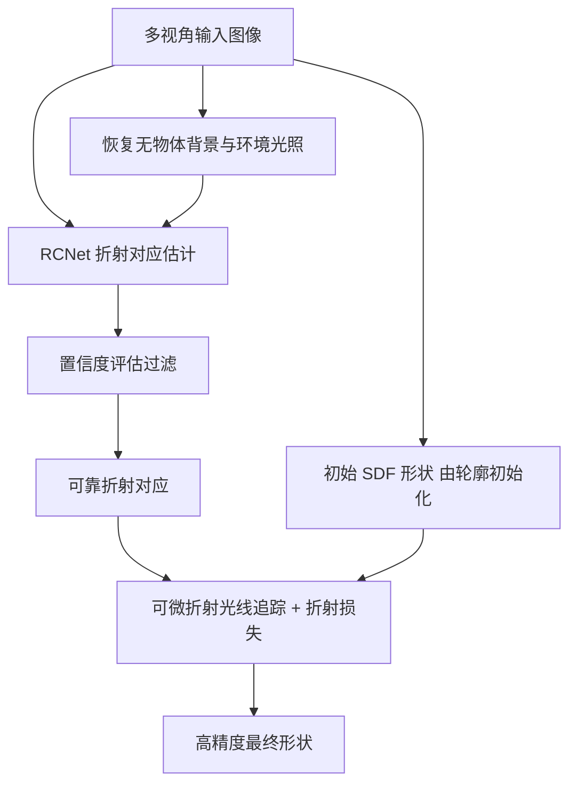

## 一句话总结

RCTrans 通过一个预训练网络估计透明物体与自然背景之间的"折射对应关系"，把光线与背景的交点作为几何优化的强约束，从而在无需受控环境的普通自然场景下，重建出带有精细凹陷结构的高精度透明物体几何。

## 研究背景

透明物体的重建是一个长期难题，因为其外观由多次反射与折射的复杂光路决定，超出了常规重建方法的能力范围。

现有工作大致分两条路线。受控环境类方法借助偏振相机、断层扫描、光探针、转台加显示屏投射图案等专门设备，能获取真实折射光线并实现高精度重建，但复杂的采集条件限制了实用性。无受控环境类方法则放宽采集条件，在自然光照下重建：其中免光线追踪的方法（如 NEMTO、NU-NeRF）用网络直接预测折射外观，虽能生成貌似合理的外观，却因形状-辐射歧义（shape-radiance ambiguity）难以恢复准确几何；基于光线追踪的方法（如 Gao et al.、TNSR）用物理渲染建模外观并以 RGB 颜色作为监督，但自然光照下颜色本身存在歧义，加上颜色梯度的局部性，很难恢复精细结构，尤其是凹陷区域。

核心痛点在于：颜色监督既有局部性又有歧义性。本文的关键 idea 是，尽管折射会扭曲背景，透明物体的外观仍保留了丰富的邻域信息，可以用来与自然背景做匹配，从而得到光线与背景的真实交点（即"折射对应关系"）。用这种对应关系替代颜色作为约束，能更高效、无歧义地约束光路和物体形状。

## 方法

RCTrans 整体分两个阶段：先用预训练网络 RCNet 估计每个视角下的折射对应关系并做置信度过滤，再用可靠的对应关系通过可微折射光线追踪优化物体形状。

关键设计包含以下几点。

第一，外观分解与折射对应建模。透明物体外观 $$I_t = I_{total} \oplus I_v$$ 被拆成发生全反射的部分 $$I_{total}$$ 与其余部分 $$I_v$$。全反射区域光路混乱、几乎无邻域信息，被单独剔除。无全反射部分建模为 $$I_v = (1-\rho) I_r + \rho\, \mathrm{warp}(I_b, C)$$，其中 $$\rho$$ 是由菲涅尔方程决定的透射系数，$$I_r$$ 为反射图像，$$I_b$$ 为背景图像，$$C$$ 是折射引起的 $$I_v$$ 与 $$I_b$$ 之间的二维对应。由于 $$\rho$$ 通常接近 1，反射项干扰可忽略，因此可以反向通过匹配 $$I_v$$ 与 $$I_b$$ 来估计 $$C$$。

第二，RCNet 网络。网络直接以 $$I_t$$ 和 $$I_b$$ 为输入，输出全图对应关系。它先用两个独立 CNN 分别提取透明物体与自然背景的特征，再借用光流方法 GMFlow+ 的 Transformer 与匹配层建模相关性并全局匹配：$$S = \dfrac{F_t F_b^{T}}{\sqrt{D}}$$，$$C = \mathrm{softmax}(S)\, G$$，其中 $$S$$ 存储特征对之间的相似度，$$D$$ 为特征通道数用于防止数值过大，$$G$$ 为坐标网格。全局搜索能高效处理折射引起的大位移。训练时输出被有效掩码 $$M_v$$ 过滤，并用带权重的掩码 L2 损失 $$L_{net} = \sum_{i=1}^{N} \gamma^{N-i}\, \dfrac{\sum M_v \lVert C_i - C_{gt}\rVert^2}{\sum M_v}$$ 监督，$$\gamma = 0.9$$ 给后期预测更高权重。

第三，测试期置信度评估。测试时无法得到 $$M_v$$，全图对应会在全反射区域产生错误值。作者通过把背景按估计的 $$C$$ 变形后与输入图对比来评估置信度：$$S_c = 1 - \lVert \mathrm{warp}(I_b, C) - I_t\rVert_1$$，并过滤掉置信度低于 0.9 的结果，从而剔除全反射、越界及网络失败等错误对应。

第四，形状重建。用神经 SDF 场 $$N_{obj}$$ 表示形状并由轮廓初始化，按斯涅尔定律解析折射光线（折射率作为可优化的均匀值），只记录恰好两次折射且无全反射的光线。二维对应在无穷远光照假设下转为世界坐标下的光线方向 $$\hat{d} = \mathrm{norm}(R^{T} K^{-1} \tilde{C}^{T})$$，再用折射损失 $$L_{refraction} = \dfrac{\sum M_v \lVert \hat{d} - d\rVert_1}{\sum M_v}$$ 监督追踪光线方向。总损失为 $$L = \lambda_{ref} L_{refraction} + \lambda_{sil} L_{silhouette} + \lambda_{eik} L_{eikonal}$$，权重分别取 1.0、1.0、1.5。

为训练 RCNet，作者用 Mitsuba3 渲染了大规模合成数据集，随机组合透明物体、环境贴图与视角，得到 80000 组训练数据和 200 组验证数据，分辨率 512×512。

## 实验结果

在合成数据上以 Chamfer 距离（乘以 $$10^{-4}$$、按包围盒对角线归一化）评估重建精度，RCTrans 在所有物体上均取得最低误差，平均误差相比次优方法降低约一半。消融中"Ours v1"表示去掉置信度评估，"Ours v2"表示去掉折射损失。

| Method | Bowl | Cat | Rabbit | Squirrel | Hand | Avg. |
|---|---|---|---|---|---|---|
| NEMTO | 12.605 | 1.132 | 1.441 | 0.988 | 1.160 | 3.465 |
| TNSR | 12.728 | 1.579 | 1.331 | 3.131 | 1.307 | 4.015 |
| NU-NeRF | 7.892 | 1.955 | 1.815 | 2.144 | 0.775 | 2.916 |
| Gao et al. | 1.325 | 0.613 | 1.002 | 0.933 | 0.804 | 0.935 |
| Ours | **0.528** | **0.243** | **0.622** | **0.453** | **0.339** | **0.437** |
| Ours v1 | 0.780 | 0.341 | 0.715 | 0.480 | 0.391 | 0.541 |
| Ours v2 | 10.146 | 0.862 | 1.330 | 1.080 | 0.602 | 2.804 |

消融显示去掉置信度评估后精度普遍下降（0.437 → 0.541），去掉折射损失则几乎无法恢复凹陷结构（平均误差劣化到 2.804），说明对应估计与置信度评估都是高质量重建的关键。真实数据上（Ashtray、Kitten、Cat、Squirrel、Dog）RCTrans 平均 Chamfer 距离 0.629，显著优于 Gao et al.（4.064）和 NU-NeRF（3.472），尤其在烟灰缸凹陷等结构上表现突出。对应估计本身在验证集上 EPE 为 0.026（BasicShape）与 0.060（OmniObject3D），远优于基于 U-Net 回归的基线。

## 亮点与局限

亮点方面，本文把透明物体重建的监督信号从有歧义的颜色改成几何上更强的"折射对应关系"，并配合置信度评估自动剔除全反射等不可靠区域，在不增加任何专用采集设备的前提下把凹陷等复杂结构的重建精度大幅提升，采集流程对普通用户友好。

局限方面，作者指出：细小且孤立的结构（如尾部装饰线、猫背蝴蝶结）因缺乏可用邻域信息且易发生全内反射，仍难以准确重建；极度缺乏纹理的背景会使对应估计困难；由于只优化恰好两次折射的光线，方法无法处理 NU-NeRF 那样的嵌套物体；当前假设物体无色，若要支持有色物体需扩展训练数据并修改置信度评估。

## 延伸思考

这项工作最有启发的一点是"把难以直接监督的物理量转化为可匹配的对应关系"这一思路，本质上是借助光流式的全局匹配，把折射这种强非线性变换重新表述为背景图与观测图之间的稠密对应，从而绕开颜色歧义。这种"用对应替代外观监督"的范式，或许也适用于镜面、水面等其他强折反射场景的重建。

另一个值得关注的点是数据与泛化的关系：RCNet 完全在合成数据上训练，却能迁移到真实拍摄物体，说明折射对应这一中间表示相对外观更接近物理本质、更少受 sim-to-real 差距影响。未来若能把置信度评估扩展到有色物体、把两次折射假设放宽到多层/嵌套结构，方法的适用范围有望进一步打开。
