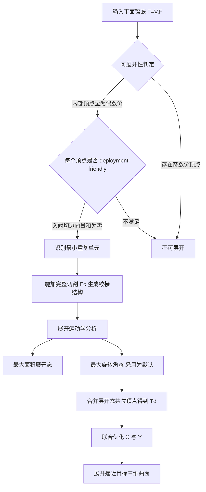

## 一句话总结

提出一套计算框架：判定一个平面镶嵌能否被切割成"绕铰接顶点刚性旋转即可展开"的铰接 kirigami 结构，并反向设计出平整无缝的平面镶嵌，使其展开到最大旋转角后逼近给定的三维自由曲面。

## 研究背景

把平整薄片（纸、金属、织物）变形成预定三维形状，是计算制造的核心问题之一。已有路径包括折纸折叠、抽褶（smocking）、以及在薄片上开切口引入孔洞的 kirigami 方法。其中一类特别的机制是"局部连通性重构"：通过特定切割，平面镶嵌被转成铰接 kirigami 结构，各面片仅在铰接顶点相连，可绕顶点刚性旋转从而产生曲率，这类结构常被称为拉胀（auxetic）结构。

以往铰接 kirigami 工作存在两点局限。其一，它们通常从固定的、研究充分的标准图案出发（等边三角形或正方形镶嵌），设计空间受限于这些标准图案的表达能力。其二，它们只关注"最大面积展开"这一个展开状态，且优化出的镶嵌在展开前的"闭合"态往往含有缝隙，既浪费材料又增加制造复杂度。本文退一步，直接研究镶嵌图案本身的更广阔设计空间，回答：哪些平面镶嵌能被切成可刚性旋转展开、并在面片旋转到极限时通过局部组合变化实现目标曲率的铰接 kirigami 结构？

## 方法

整体框架：给定一个平面镶嵌，先判定其是否可展开（组合条件＋几何条件），若可展开则识别最小重复单元、施加完整切割得到铰接结构、分析其展开运动学，得到两个极限展开态；随后针对目标三维曲面，联合优化展开前后两套顶点坐标，在保持"两态由同一组面片重排而成"的前提下让展开态逼近目标曲面。

关键设计：

- 组合条件与 2-着色。切割就是给每条内部边定向，决定铰接落在哪个端点。要让每个内部顶点在切割后恰好被两个面片共享，同一面片上相邻的两条切边必须在共享顶点处方向交替。这等价于镶嵌对偶图的 2-可着色性，从而得到一个简洁判据：平面流形镶嵌能被切成合法铰接 kirigami，当且仅当所有内部顶点的价数为偶数。

- deployment-friendly 顶点与均匀可展开。偶数价只保证组合合法，不保证有几何旋转自由度。作者定义：对一个 $$2k$$ 价顶点 $$v$$，取以 $$v$$ 为终点的 $$k$$ 条有向切边 $$\vec{e}_1,\dots,\vec{e}_k$$，若 $$\sum_{i=1}^{k}\vec{e}_i=\vec{0}$$ 则称 $$v$$ 为 deployment-friendly。命题指出：所有内部顶点偶数价时，"每个内部顶点都 deployment-friendly"与"铰接结构在二维均匀可展开（所有开口角在任一展开态都相等）"两者等价。均匀性使整个展开过程可由单一参数——开口角 $$\theta$$——刻画。

- 两个极限展开态与最大旋转角。均匀可展开时可解析地追踪展开：作者比较"最大面积展开"（投影覆盖面积最大，前人常用）与"最大旋转角"两种极限。对由内角 $$\alpha_i$$、$$\alpha_j$$ 的两个面片共享的铰接顶点，允许的最大开口角为 $$2\pi-\alpha_i-\alpha_j$$，超过即从背面碰撞；全局最大开口角 $$\theta_{\max}$$ 取所有顶点局部上界的最小值。本文默认采用 $$\theta_{\max}$$ 态，因为它给出简单的实操指令——把每个面片旋到极限即可，无需在线优化。

- 反向设计的联合优化。给定目标曲面 $$M$$，同时求解展开前二维嵌入 $$X\in\mathbb{R}^{n\times 2}$$ 与展开后嵌入 $$Y\in\mathbb{R}^{m\times 3}$$，目标为 $$\omega_1 E_{\text{reconfig}}(X,Y)+\omega_2 E_{\text{planar}}(Y)+\omega_3 E_{\text{shape}}(Y\mid M)+\omega_4 E_{\text{fairness}}(Y)$$。其中可重构项 $$E_{\text{reconfig}}$$ 惩罚各面片内所有顶点对在展开前后的距离畸变，确保面片几何保持刚性；平面度项 $$E_{\text{planar}}$$ 让多边形面在展开后保持共面；形状项 $$E_{\text{shape}}$$ 用点到目标曲面最近点切平面的距离度量贴合程度；fairness 项 $$E_{\text{fairness}}=\lVert Y-Y_0\rVert_2^2$$ 使结果贴近由对称 Dirichlet 参数化提升得到的初值 $$Y_0$$，从而保持形状规整、避免欠约束的边界与孔洞区域出现畸形。

## 实验结果

作者用 6 种镶嵌图案逼近 7 个带明显正/负曲率的曲面，并做了密度与曲率的压力测试。下表为"用同一图案、不同瓦片数逼近同一目标曲面"的主实验，报告面数 $$n_f$$、平均非平方可重构误差 $$E_r$$ 与平均平面度误差 $$E_p$$（单位为度）：

| 面数 $$n_f$$ | 可重构误差 $$E_r$$ | 平面度误差 $$E_p$$ |
| --- | --- | --- |
| 213 | 0.00027 | 0.034° |
| 466 | 0.00042 | 0.030° |
| 1841 | 0.00078 | 0.015° |
| 7068 | 0.00057 | 0.004° |

所有展开的铰接 kirigami 镶嵌都保持最大可重构误差小于 $$10^{-2}$$、最大平面度误差小于 $$0.1°$$，满足可制造性。作者还用重磅纸与毛毡做了激光切割的物理样件（半球、半环面、六边形镶嵌半球、带奇点的完整球面等），验证了仿真展开过程的准确性。

## 亮点与局限

亮点：把"哪些镶嵌可切成可展开铰接 kirigami"归约为一个干净的组合判据（内部顶点偶数价）＋几何判据（deployment-friendly），从而跳出三角形/四边形等标准图案，系统性地生成并验证一大批新图案。将展开推进到"最大旋转角"这一此前被忽视的极限态，既丰富了设计空间，又给出直观的展开指令；并显式约束展开前为无缝无孔的平面镶嵌，几乎不浪费材料。

局限：仅研究了流形且周期的镶嵌，非流形/非周期情形的可展开性条件尚待建立；优化只考虑几何（可重构性与平面度），未纳入材料属性、驱动力与稳定性等力学因素，毛毡等厚材料的部分切割铰链抗弯明显、大孔洞或高负曲率样件稳定性下降需边界固定；镶嵌类型由用户作为输入给定，无法保证任意目标几何都能被某一图案实现，各图案可实现的形状空间目前只有经验性认识。

## 延伸思考

这项工作把"连通性重构"确立为与折叠、拉伸并列的曲率生成机制，其价值在于把设计约束压缩成可验证的图论条件，因而天然适合做成交互式图案探索工具。一个自然的追问是逆命题：能否从目标曲面的曲率分布反推最合适的镶嵌类型与奇点布置，而不是让用户试错？作者也指出，若能建立描述铰接结构展开行为的连续模型，就有望刻画每种图案可达的形状空间边界。此外，把纯几何目标扩展到含真实铰链力学、稳定性与驱动方式的联合建模，是通往真正可部署的建筑级或机器人级结构的关键一步。
