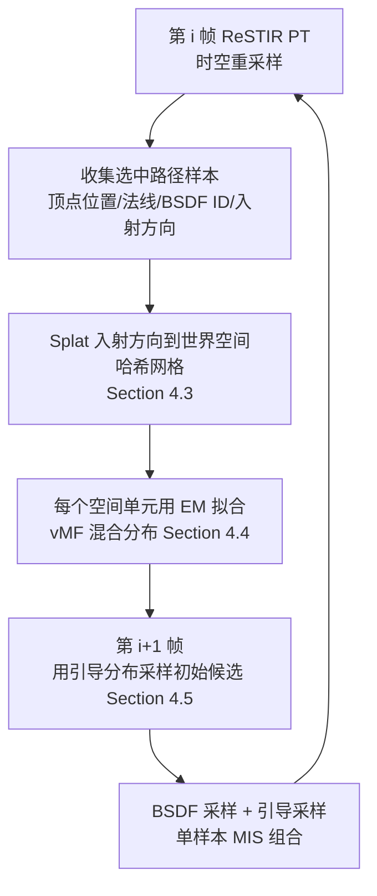

## 一句话总结

ReSTIR PG 发现 ReSTIR 时空重采样后保留下来的路径，其反弹方向天然逼近"入射辐射度乘以余弦加权 BSDF"的理想局部引导分布，于是直接用这些高质量样本拟合轻量引导分布，去改善下一帧的初始候选路径，从而在保持实时性能的同时降低方差、抑制相关性伪影。

## 研究背景

ReSTIR 通过在空间和时间上重采样路径，已成为实时路径追踪降噪的主流手段。但它的最终质量强烈依赖初始候选样本的质量：当初始样本分布很差时，少数高能量样本会在重用过程中主导整个重采样，形成所谓的样本贫化（sample impoverishment），在困难场景里表现为低频"沸腾"或斑块状的相关性伪影。

一个自然的补救办法是路径引导（path guiding）。但传统路径引导通常从原始路径追踪样本拟合引导分布，需要稠密数据、常常分成独立的训练与渲染两阶段，这在离线可行，在实时里却成问题：动态场景下 1spp 的样本既稀疏又带噪，靠时间累积又会让分布产生滞后。

作者的关键观察是：ReSTIR 每帧经过时空重采样后选出的样本，本身就已经近似目标路径贡献分布，并通过在像素间共享高贡献路径显著提高了有效采样密度。因此哪怕只用单帧的这类样本，也足以拟合出可靠的引导分布，无需时间累积，也就避免了滞后。

## 方法

### 整体框架

ReSTIR PG 建立在 ReSTIR PT 之上，在原有管线里插入三个额外阶段：第 $$i$$ 帧时空重采样后，把 ReSTIR 选中路径每个顶点的入射方向"泼溅"（splat）进一个世界空间哈希网格；在该帧末尾，对每个空间单元拟合一个方向引导分布；到第 $$i+1$$ 帧，用这些拟合好的分布去引导新的初始候选路径生成。引导与重采样由此形成正反馈闭环：ReSTIR 为引导提供高质量输入，引导又改善下一帧供 ReSTIR 使用的样本。

### 关键设计

1. 理论洞察：理想的局部引导分布是 $$p(\omega_i \mid x, \omega_o) \propto \rho(x, \omega_o, \omega_i)\, L_i(x, \omega_i)\, \cos\theta$$。作者证明，若一组路径样本按路径贡献函数分布（正是 ReSTIR 样本近似满足的），那么在每个顶点上局部反弹方向的分布恰好正比于上式。这样就能直接从 ReSTIR 样本中提取理想局部引导分布，而无需显式估计入射辐射度。这一结论是 Schüßler 等人（2022）在单像素情形下推导的推广：作者把它扩展到逐像素路径分布，从而能复用已适配各像素目标函数的 ReSTIR 样本。

2. 降维到 2D 边缘分布：直接表示 $$p(\omega_i \mid x, \omega_o)$$ 需要拟合 7D 高维模型并在运行时查询条件分布，实时下不可行。作者先按空间单元划分场景去掉对位置 $$x$$ 的显式依赖，再利用边缘与条件分布关系把 4D 条件分布约化为 2D 边缘分布 $$p(\omega_i) \propto L_i(\omega_i)\cos\theta \int_{H^2} \rho(\omega_o, \omega_i)\, p(\omega_o)\, \mathrm{d}\omega_o$$。在漫反射面上该边缘分布严格正比于理想目标；在光泽面上，积分项相当于对出射分布做 BSDF 加权平均，把光泽反射的方向偏好嵌入边缘分布，实践中不比仅基于入射辐射度的分布差。

3. 空间结构与分布表示：采用可随视距自适应分辨率的非均匀空间哈希网格，并把哈希函数扩展为显式编码 BSDF ID，使相同 BSDF 的单元被归到一起。每个单元用 4 个分量的 von Mises–Fisher（vMF）混合模型表示 $$p(\omega_i)$$。由于收集到的入射方向已匹配目标分布，无需基于辐射度的加权，作者直接用标准 EM 算法而非加权 EM 来拟合。

4. 引导采样与无偏性：在路径构造时，以固定概率 $$\alpha = 0.5$$ 在 BSDF 采样与 vMF 引导采样之间随机选择，用单样本 MIS 组合两者。这样即使引导分布质量差，也能保证无偏与鲁棒，且无需额外的预热阶段。

## 实验结果

方法基于 Falcor 框架实现，在 1920 $$\times$$ 1080 分辨率、NVIDIA RTX 6000 Ada GPU 上以 1spp 评测，误差用平均绝对百分比误差（MAPE，越低越好）。下表为论文首图（Fig. 1）在两个代表场景上的对比：与不加引导的原始 ReSTIR PT（Without PG）以及基于原始路径追踪样本的引导方法 \lbrack Ruppert et al. 2020\rbrack 相比，本方法 MAPE 最低，且时间开销仍维持实时。

| 场景 | 方法 | MAPE ↓ | 时间 |
|------|------|--------|------|
| Barcelona Pavilion | Without PG | 0.4609 | 21.0 ms |
| Barcelona Pavilion | \lbrack Ruppert et al. 2020\rbrack | 0.5279 | 37.9 ms |
| Barcelona Pavilion | Our method | **0.3127** | 34.1 ms |
| Veach Ajar | Without PG | 0.3011 | 9.6 ms |
| Veach Ajar | \lbrack Ruppert et al. 2020\rbrack | 0.3499 | 13.6 ms |
| Veach Ajar | Our method | **0.2031** | 13.4 ms |

此外，作者统计了各场景每帧在空间单元里的有效样本数：ReSTIR 样本数量始终远多于原始 PT 样本（例如 Veach Ajar 为 3055 对 164，Living Room 为 2282 对 95），验证了"重采样输出更稠密"这一动机。方法额外开销约为采集与泼溅 25%、拟合 25%、采样 50%；在动态光照下，基线出现严重的相关性伪影（沸腾斑块），而本方法结果明显更干净。

## 亮点与局限

亮点：
- 首次把 ReSTIR 与路径引导联系起来，既用引导改善 ReSTIR 样本，又用 ReSTIR 样本改善引导，形成正反馈闭环。
- 用一个简洁的理论推导说明"按贡献分布的路径样本，其局部反弹方向即理想引导分布"，从而无需显式估计入射辐射度、无需高维条件建模。
- 仅用单帧的时空重采样样本即可拟合，避免时间累积带来的分布滞后，对场景变化响应更快，并保持实时性能。

局限：
- 只拟合下一反弹方向的 2D 边缘 PDF，在光泽材质上引导质量可能次优；而直接拟合完整 4D 分布往往既慢又不准。
- 引入了不可忽略的运行时与显存开销（每反弹约 102.8 MB 存储 ReSTIR 样本，哈希网格随场景可达数十 MB），随反弹数和有效单元数增长。
- 当 ReSTIR 本身彻底失效（例如无法进行有效重用）时，"样本近似理想分布"的前提会被打破。

## 延伸思考

这项工作最有启发性的地方，是把"重采样"和"引导"这两条原本独立的降噪思路耦合成一个自增强循环：重采样天然产出的高质量样本被当作免费的训练数据反哺引导，而不是额外再跑一遍路径追踪去收集训练路径。这提示我们，实时渲染里很多"中间产物"可能都蕴含着可复用的分布信息，值得被显式挖掘。沿着作者指出的方向，用更具表达力的拟合器（如小型神经网络）替代 vMF 混合模型，或许能更好地刻画光泽材质的方向依赖，缓解 2D 边缘分布在高光下的局限；而引导与 ReSTIR 的耦合也意味着，ReSTIR 端的任何改进（如样本突变、更好的时间偏移映射）都能顺势提升引导质量，二者的协同还有进一步压榨的空间。
