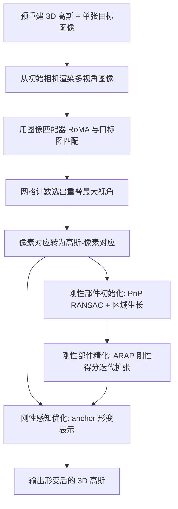

## 一句话总结

本文提出 DeformSplat，仅用**一张**目标图像即可驱动预重建的 3D 高斯发生形变，通过"高斯-像素匹配"建立三维到二维的对应关系提供形变引导，并用"刚性部件分割"显式识别刚性区域以保持原始几何，从而在缺失深度与相机位姿的极端约束下实现一致的单图形变重建。

## 研究背景

从视觉数据重建物体形变对 VR、影视、游戏等媒介的真实感内容创作至关重要。近年基于 3D Gaussian Splatting（3DGS）的动态重建方法虽然渲染质量高、可显式编辑，但普遍依赖多视角或时序连续的视频数据，而这类数据在真实场景中往往难以采集，限制了实用性。

作者把问题推到极限：**只用一张 RGB 目标图像**去形变一个已重建好的 3D 高斯，且不提供深度或相机位姿。这一受限设定带来两个核心挑战：

- 单一视角只给出三维结构的部分观测，难以判断每个高斯"应该往哪个方向、形变多少"，需要在二维图像与三维高斯之间建立可靠对应。
- 缺少深度与多视角约束时，优化极易过拟合到这张输入图像，导致本应保持不变的刚性区域也发生几何畸变。

已有的文本/图像驱动编辑（如扩散模型方案）结果不一致、几何控制弱；GESI 虽用单张参考图做几何编辑，但缺乏刚性与非刚性区域的显式区分，在大范围形变下难以维持结构完整。这引出本文的关键问题：能否在保持原始几何的前提下，从单张图像形变 3D 高斯？

## 方法

整体框架：给定预重建的 3D 高斯 $$G=\lbrace \mu_i, q_i, s_i, \alpha_i, sh_i \rbrace$$ 与一张目标图像，先用高斯-像素匹配选出与目标重叠最大的视角并建立三维-二维对应，再用刚性部件分割（初始化＋精化）识别刚性区域，最后在刚性感知优化中对刚性/非刚性区域施加不同正则，只优化高斯的位置 $$\mu_i$$ 与旋转 $$q_i$$ 即可得到形变后的高斯。

### 关键设计 1：高斯-像素匹配（Gaussian-to-Pixel Matching）

从初始重建用到的相机视角渲染多张图像，用图像匹配器 RoMA 与目标图逐一匹配得到像素对 $$(x_p, x_p')$$。把目标图划分为均匀网格，统计每个渲染视角命中匹配的网格数，选取网格命中最多的视角以保证与目标形变的视觉对齐。随后用 alpha 混合不透明度 $$\alpha_i \prod (1-\alpha_j)$$ 剔除不可见高斯，将匹配像素关联到最近的投影高斯中心 $$\mu_i^{2D}=P\mu_i$$，把像素-像素对应转成高斯-像素对应 $$(\mu_i, x_p')$$，从而携带引导高斯移动所需的方向信息。

### 关键设计 2：刚性部件分割（初始化 + 精化）

刚性区域具备两个性质：共享同一刚性变换、且空间上强连通。初始化阶段用 PnP-RANSAC 从高斯-像素对应估计一致刚性变换的子集；但仅靠变换一致会把恰好变换相似却不相邻的高斯（如左右手）误并，故引入**区域生长**策略：从随机单个高斯出发，用 ball query 逐步纳入邻域高斯并反复用 PnP-RANSAC 筛选内点，直到收敛，保证空间连通。精化阶段不再依赖匹配，而是用优化中不断更新的高斯参数，借鉴 ARAP 原则计算刚性得分：

$$
S_{rigid}(\mu_i, G) = \frac{1}{\lvert G \rvert} \sum_{\mu_j \in G} \lVert R_i^{-1}(\mu_i-\mu_j) - R_i'^{-1}(\mu_i'-\mu_j') \rVert^2
$$

得分低于阈值 $$\tau_{low}$$ 的候选被纳入刚性组，高于 $$\tau_{high}$$ 的被剔除，通过迭代纳入/剔除把刚性组从稀疏初始化扩展到覆盖大部分高斯。

### 关键设计 3：刚性感知优化

采用基于稀疏 anchor 的形变表示，每个 anchor 含位置 $$a_k$$、旋转 $$R_k^a$$、平移 $$T_k$$，高斯的新位置/旋转由邻近 anchor 变换按距离反比权重 $$w_{ik}$$ 插值得到：

$$
\mu_i' = \sum_{k \in N} w_{ik}\left(R_k^a(\mu_i-a_k)+a_k+T_k\right), \quad q_i' = q_i \otimes \sum_{k \in N} w_{ik} q_k^a
$$

总损失综合四项：形变损失 $$L_{deform}$$（拉动高斯中心趋向匹配像素）、刚性组损失 $$L_{group}$$（组内保持原始相对结构）、anchor 间的 ARAP 正则 $$L_{arap}$$（保证非刚性区域平滑过渡）、以及 RGB 光度损失 $$L_{rgb}$$：

$$
L_{total} = \lambda_{deform}L_{deform} + \lambda_{group}L_{group} + \lambda_{arap}L_{arap} + \lambda_{rgb}L_{rgb}
$$

### 关键设计 4：平滑运动插值

优化后引入插值损失 $$L_{inter}$$，让 anchor 变换从初始值渐进逼近优化值，配合衰减系数 $$\lambda_{inter}$$ 保证收敛，实现帧间平滑过渡；由此框架可自回归地把上一帧形变结果作为下一帧输入，扩展到多帧插值。

## 实验结果

在 Diva360 与合成 Dynamic Furry Animal（DFA）两个多视角视频数据集上评测：每个序列选取两个时刻，第一时刻多视角重建初始高斯，第二时刻仅用**单视角**图像作为目标监督，其余视角作为评测真值。DeformSplat 显著超越所有基线，在 Diva360 上 PSNR 较次优基线提升约 4.1，在 DFA 上提升约 1.8。

| 方法 | Diva360 PSNR↑ | Diva360 SSIM↑ | Diva360 LPIPS↓ | DFA PSNR↑ | DFA SSIM↑ | DFA LPIPS↓ |
| --- | --- | --- | --- | --- | --- | --- |
| 3DGS | 21.28 | 0.900 | 0.098 | 19.48 | 0.866 | 0.118 |
| DROT | 21.08 | 0.914 | 0.086 | 17.64 | 0.872 | 0.119 |
| SC-GS | 22.20 | 0.910 | 0.097 | 19.49 | 0.867 | 0.116 |
| 4DGS | 19.93 | 0.913 | 0.100 | 14.56 | 0.856 | 0.204 |
| 3DGStream | 22.57 | 0.928 | 0.088 | 20.16 | 0.886 | 0.100 |
| GESI | 22.71 | 0.897 | 0.086 | 18.54 | 0.876 | 0.127 |
| GESI $$(\mu,q)$$ | 22.53 | 0.924 | 0.078 | 20.05 | 0.888 | 0.100 |
| Ours | 26.84 | 0.955 | 0.050 | 21.81 | 0.897 | 0.091 |

消融实验（Diva360）表明各模块均有贡献：去掉形变损失与刚性组损失后 PSNR 从 26.84 跌至 21.73；用朴素 PnP-RANSAC 替换区域生长初始化会产生空间不连通的刚性组，PSNR 降至 25.25；去掉刚性精化降至 25.79。方法还可扩展到多帧插值与交互式拖拽操作，刚性组损失能在拖拽时保持底层几何。

## 亮点与局限

亮点：
- 首个仅凭**单张图像**（无深度、无相机位姿）驱动 3DGS 形变并显式保持几何的框架。
- 高斯-像素匹配巧妙地把稀疏二维视觉线索转化为三维形变引导，缓解了单视角信息不足的问题。
- 刚性部件分割结合区域生长与 ARAP 刚性得分，既保证空间连通又区分刚性/非刚性区域，几何一致性显著优于纯像素损失方法。

局限：
- 需要预先由多视角重建好的初始高斯，本质是"从初始态到目标态"的形变，而非从零重建动态物体。
- 依赖图像匹配器（RoMA）的匹配质量与目标视角的可见重叠；遮挡严重或视觉重叠不足时匹配与视角选择可能失效。
- 评测的两个时刻由人工挑选以保证明显形变、少遮挡且视觉一致，对更极端或大幅形变的鲁棒性有待进一步验证。

## 延伸思考

把"稀疏二维对应 + 显式刚性约束"作为形变先验，为在极少监督下编辑与重建可形变三维资产提供了一条务实路径。其自回归式多帧插值提示了从单图形变走向单目视频动态重建的可能，而如何摆脱对初始多视角重建的依赖、如何在匹配失效或大遮挡时保持稳健、以及刚性阈值 $$\tau_{low}/\tau_{high}$$ 等超参的自适应设定，都是值得继续探索的方向。将这种刚性感知分割与物理仿真或可微渲染结合，或许能进一步提升交互操作的物理合理性。
