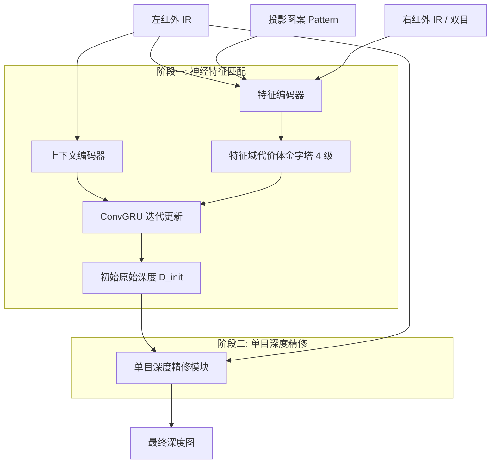

## 一句话总结

NSL 把单帧结构光的深度解码从脆弱的像素域匹配搬到鲁棒的神经特征空间，通过在特征域构建投影图案与红外图像的代价体、再用单目深度基础模型做细节精修，仅靠合成数据训练即可泛化到真实室内场景，全面超越传统结构光与被动 RGB 立体方法。

## 研究背景

单帧结构光（Single-shot Structured Light, SL）广泛用于 Apple Face ID、微软 Kinect、Intel RealSense 等商用 3D 传感设备。其原理是向场景投射空间编码的红外图案，再通过寻找投影图案与拍摄图像之间的对应关系来解码深度。

传统方法主要依赖像素域的对应匹配，即用局部图像块的强度信息做模板匹配。但图像块只包含低层、局部的强度线索，在遮挡、低纹理表面、非朗伯反射（反光/透明）等挑战场景下极不稳定，导致 3D 采集质量下降。

尽管深度学习在被动 RGB 立体匹配上进展显著，但迁移到结构光却收效有限，原因有两点：

- 数据侧：结构光缺少可与 RGB 立体相媲美的大规模数据集，已有工作多在小规模合成集或无真值的半监督真实数据上训练，泛化差。
- 方法侧：多数工作忽略了已知的投影图案，把结构光当作"加了纹理的 RGB 立体"，没有利用投影中编码的空间先验。

本文提出 NSL（Neural Structured Light），核心思想是在神经特征空间中匹配投影图案与红外图像，而非在原始像素强度域，从而同时解决上述两大难题。

## 方法

NSL 支持商用设备中常见的两种输入：单目（图案 + 单张红外）与双目（图案 + 双红外）。整体由两个神经阶段组成：一个学习式特征匹配模块，与一个单目深度精修模块。

关键设计：

- 特征域代价体与图案到图像匹配：受 RAFT-Stereo 启发，用 CNN 编码器从投影图案与红外图像提取 $$1/4$$ 分辨率特征，将左红外特征 $$F_l^{lp}$$ 与图案特征 $$F_p$$ 做点积构建代价体 $$C(i,j,k)=\sum_h F_{L\,i,j,h}\cdot F_{R\,i,k,h}$$，实现"图案到图像"的匹配以显式利用图案编码的空间先验；再沿最后一维做平均池化得到 4 级代价体金字塔，双目时额外构建左右红外的立体代价体并拼接。

- GRU 迭代深度预测：从初始视差 $$d_0$$ 出发，每次迭代采样当前视差处的相关特征 $$\phi(C,d_t)$$ 与上下文特征送入 ConvGRU，输出残差 $$\Delta d_t$$ 累加更新，$$N$$ 次迭代后得到视差 $$d_N$$ 并转换为初始深度 $$D_{init}$$。

- 单目深度精修（注入几何提示）：以 Depth Anything v2（ViT-Base + DPT 解码器）为基础模型，把 RGB 输入替换为红外图像，并借鉴 PromptDA 的提示网络，将 $$D_{init}$$ 作为深度提示注入 DPT 解码器，解决单目深度模型的尺度歧义，输出边界更锐利、结构更连贯的度量深度。

- 物理级结构光仿真与数据生成：基于 Blender Cycles 光追引擎搭建结构光仿真平台，生成 953K 对图案-图像样本，涵盖 2860 个室内场景、5000+ 个含漫反射/镜面/透明材质的物体、8 种投影图案（6 种训练、2 种测试），并随机化物体摆放、材质、相机参数、基线距离与光照。训练混用 6 种图案，使模型一次训练后可在推理时处理多种图案而无需重训。训练分两阶段：特征匹配 200k 次迭代（加权 L1 视差损失），随后精修模块微调 100k 次迭代（度量项 + 梯度边缘一致性项，$$\alpha=0.5$$）。

## 实验结果

在合成数据集（$$1280\times720$$）上与传统模板匹配（TM）、ActiveStereoNet、被动 RGB 立体方法 MonSter 对比。即便是单目配置的 NSL-Mono 也已超越使用双输入的 MonSter 与 ActiveStereoNet，双目 NSL-Bino 进一步领先，验证了图案先验结合特征域匹配的优势。

| 方法 | MAE(m) ↓ | RMSE ↓ | REL ↓ | δ1.25 ↑ | δ1.10 ↑ | δ1.05 ↑ |
| --- | --- | --- | --- | --- | --- | --- |
| TM（单目 IR+图案） | 0.5250 | 1.1984 | 0.2886 | 0.7467 | 0.6955 | 0.5716 |
| Ours（NSL-Mono） | 0.0408 | 0.0907 | 0.0357 | 0.9704 | 0.9437 | 0.9142 |
| TM（双目 IR） | 0.3568 | 1.9008 | 0.2988 | 0.8001 | 0.7790 | 0.7532 |
| ActiveStereoNet | 0.5693 | 75.5485 | 0.4984 | 0.8455 | 0.7912 | 0.7287 |
| MonSter（被动） | 0.0862 | 0.1457 | 0.1839 | 0.9059 | 0.8611 | 0.8087 |
| Ours（NSL-Bino） | 0.0237 | 0.0634 | 0.0210 | 0.9817 | 0.9666 | 0.9502 |

消融实验表明输入配置的性能趋势稳定为"单目 IR+图案 < 双 IR < 双 IR+图案"，即使双目几何信息完整，加入投影图案仍带来明显增益，说明图案先验并非冗余。跨图案测试（含两种未见过的图案）性能波动很小，泛化性良好。真实数据上仅用合成数据训练的模型即取得 NSL-Stereo MAE 0.010m、δ1.05 0.987 的成绩，而 TM、ActiveStereoNet 与 MonSter 在真实条件下均明显退化（MonSter 存在严重尺度不一致）。

## 亮点与局限

亮点：

- 将结构光解码从像素域搬到神经特征空间，用"图案到图像"的特征代价体显式利用投影空间先验，鲁棒性与精度大幅提升。
- 单目深度基础模型 + 初始深度提示的精修设计，兼顾细节恢复与全局结构连贯，同时保持泛化能力。
- 物理级 Blender 仿真产出近百万级、材质/图案多样的数据集，实现"仅合成训练、免微调泛化到真实"的 sim2real 效果，并支持一次训练处理多种图案。

局限：

- 对运动模糊、镜头模糊等低质量真实输入性能会下降，合成数据未建模这些因素，存在残余 sim2real 间隙。
- 精修模块在 RealSense 等低质量成像上易过度平滑（因训练数据缺少噪声/模糊/失焦），第一阶段特征匹配则相对稳健。
- 深度不连续处的物体边界仍有伪影，手持拍摄下运动模糊会加剧边界过平滑。
- 尚未达到实时（NSL-Bino 约 15 FPS），需量化、蒸馏等加速手段。

## 延伸思考

NSL 印证了"把匹配从像素域搬到学习特征域"这一被动立体的成功范式，同样适用于主动结构光，且投影图案本身就是天然、低域间隙的监督信号——这解释了它为何能靠纯合成数据泛化。值得延伸的方向包括：把运动模糊、传感器噪声、失焦等真实退化纳入仿真以缩小 sim2real 间隙；将图案设计与解码端到端联合优化（作者已列为未来工作），有望进一步挖掘编码-解码协同的上限；以及向动态场景与非标定设置扩展。另一个有趣的观察是，即便双目几何完整，投影图案仍能提升精度，提示"主动照明先验"与"多视几何先验"是互补而非替代关系，这对未来融合式深度传感系统的设计有参考价值。
