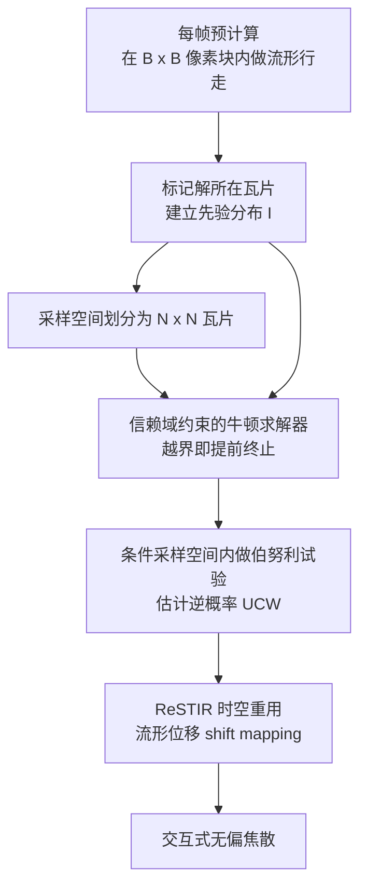

## 一句话总结

本文用"基于瓦片的采样空间划分 + 先验分布 + 时空重用（ReSTIR）"三件套改造 Specular Manifold Sampling（SMS），把原本只适合离线的无偏焦散采样加速到交互式帧率，同时显著降低噪声。

## 研究背景

焦散是由镜面材质（反射/折射）形成的高能光斑，长期是蒙特卡洛渲染的难点：高能镜面路径只占路径空间中极小的区域，常规采样很难命中。双向路径追踪难以处理镜面-漫反射-镜面（SDS）路径；光子映射依赖密度估计会引入模糊偏差。

Zeltner 等人提出的 Specular Manifold Sampling（SMS）用流形行走（manifold walk）配合牛顿迭代来随机采样这些镜面路径，并用伯努利试验估计其无偏权重，是一种有原则的无偏方法。但 SMS 直接用于交互式渲染并不现实：牛顿迭代与其中的光线追踪开销很大，无偏版本需要不定次数的伯努利试验来估计逆概率，在有限采样预算下画面噪声严重。

作者的核心洞察是：牛顿迭代（SMS 的主要性能瓶颈）其实可以被限制在种子路径附近的邻域内求解，从而大幅提升性能；再配合先验分布与时空重用，就能在保持无偏的前提下兼顾速度与质量。

## 方法

### 整体框架

方法建立在 SMS 的 2D 主采样空间 $$U = [0,1)^2$$ 之上（该空间用来参数化种子路径 $$u$$ 与解 $$u^*$$）。渲染每帧前先做一次轻量预计算，识别解可能出现的采样空间区域并建立先验分布；渲染时把采样空间划分为瓦片并对牛顿求解器施加"信赖域"约束，用先验分布把初始猜测集中到解附近；最后用 ReSTIR 做时空重用，跨像素与跨帧聚合样本逼近理想目标分布。

### 关键设计

1. 瓦片化采样空间划分与信赖域：把 $$U$$ 划分为 $$N \times N$$ 规则瓦片，为每个种子 $$u$$ 定义信赖域 $$R(u)$$（取其 $$3 \times 3$$ 邻域瓦片）。牛顿求解器一旦步出信赖域就提前终止，从而砍掉那些发散或收敛缓慢的高成本迭代。对应地，逆概率估计也被限制在条件采样空间 $$C(u^*)$$ 内，期望牛顿求解器调用次数从原始 SMS 的 $$1+K$$ 降到 $$1 + \sum_{k=1}^{K} P(C_k) < 1 + K$$（$$K$$ 为解的个数）。

2. 每帧先验分布：由于相邻着色点的解与收敛盆地高度相关，作者在每个 $$B \times B$$ 像素块（实现中 $$B=16$$）内用若干线程随机命中像素、做无信赖域约束的流形行走，把找到解的瓦片并集 $$I \subset U$$ 标记为重要区域。渲染时以混合 PDF $$p(u) = \alpha\, p_I(u) + (1-\alpha)\, p_U(u)$$（取 $$\alpha=0.8$$）在 $$I$$ 内更频繁地采样，既提高命中率又保证对全部解的无偏覆盖。该方案可扩展到多光源与多镜面物体：固定预计算预算，让每个样本随机挑选一个光源-物体对，并按对聚合重要瓦片。

3. 时空重用（ReSTIR / GRIS）：将像素关心的域定义为 SMS 能采样到的全部镜面路径 $$\hat{x} = [x^*, x_n]$$，目标函数取 $$\hat{p}(\hat{x}) = f(\hat{x})$$。用流形位移作为 shift mapping 在相邻像素/帧间复用样本；delta BSDF 情形下位移的雅可比行列式为 1，glossy 情形则扩展到 offset manifold 并按面积测度计算雅可比。为控制成本，shift mapping 的牛顿迭代上限设为 5 次，越界即放弃，保持无偏。

4. 变量-性能权衡：增大 $$N$$（缩小信赖域）能减少牛顿迭代、加速单样本，但若无先验会增大方差；先验分布正好抵消这一方差上升。实验发现 $$N=16$$ 与 $$N=32$$ 收敛最快。

## 实验结果

方法基于 Falcor 框架实现，在 i9-13900K + RTX 4090 上、以 1920×1080 分辨率测试，RMSE 相对高 SPP 路径追踪参考图计算。下表为 Double-Refractive Slab 场景（图 4）中各方法在等价设置下的 SPP / 帧时间 / RMSE 对比：

| 方法 | SPP | 时间（ms） | RMSE ↓ |
|------|-----|-----------|--------|
| Path Tracing | 18 | 24 | 14.834 |
| ReSTIR PT | 2 | 24 | 5.078 |
| SMS | 1 | 40 | 1.141 |
| Ours | 1 | 17 | 0.515 |
| Ours + ReSTIR | 1 | 24 | 0.137 |

在仅 1 SPP 下，本方法相比 SMS 同时降低了帧时间与方差；叠加 ReSTIR 后进一步收敛。Reflective Plane、Swimming Pool 场景也观察到类似趋势（如 Plane 场景 SMS 为 118 ms / RMSE 0.893，Ours 为 28 ms / RMSE 0.763，Ours+ReSTIR 为 35 ms / RMSE 0.291）。统计（表 1）显示，本方法把采样成功率从个位数提升到 20%~35%，并大幅降低每解所需的伯努利试验次数与牛顿迭代次数。

## 亮点与局限

亮点：
- 首个把 Specular Manifold Sampling 用于交互式焦散渲染的方法，将引导、重采样与求解器改造结合，在无偏前提下达到交互帧率。
- 信赖域把牛顿迭代限制在种子附近，既减少迭代次数，又缩小条件采样空间从而减少伯努利试验，速度与质量同时改善。
- 借助解的时空相干性，用流形位移做 ReSTIR 复用，相比依赖随机重放的 ReSTIR PT 与不做位移的 ReSTIR-FG 在动态场景下更鲁棒（等时对比中避免了拖影与相关性伪影）。

局限：
- 若先验分布因样本不足而未能覆盖某个被采样的光源-物体对，找到解的概率会下降、方差升高，此时退化为无先验的采样空间划分，质量可能反而不如 SMS（图 10 的环境光失败案例）。
- 先验分布中的相干性假设仅对小光源成立，大面积光源或环境贴图需先细分为多个小光源。
- 多物体、不同弹跳次数并存时线程发散加剧，各阶段成本显著上升。

## 延伸思考

这项工作的价值在于说明"约束求解范围"是让基于流形行走的无偏方法走向实时的关键杠杆：信赖域把一个开放的牛顿搜索变成局部有界问题，从而让概率估计、重采样与 GPU 并行都变得可控。它也再次印证了 ReSTIR 与 MCMC 的相似性——每次复用只需常数次流形行走，却能继承大量历史样本。值得继续追问的方向包括：如何为大面积光源与环境贴图构建更好的相干性划分与先验；能否用可学习的引导替代当前基于近邻像素的启发式先验，以缓解图 10 那类覆盖失败；以及在多物体高发散场景下如何调度以降低线程发散带来的开销。
