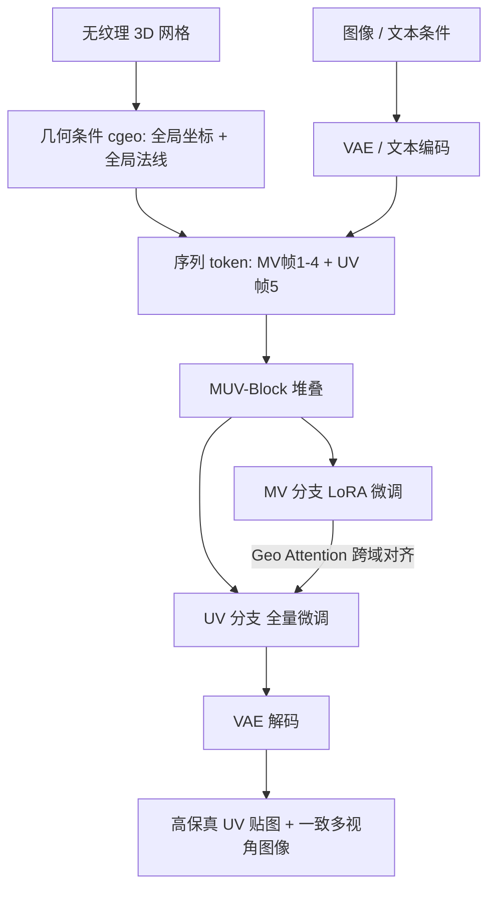

## 一句话总结

SeqTex 把 3D 纹理生成重新表述为一个"视频序列生成"问题，让预训练视频扩散模型在同一次前向中联合生成多视角图像与 UV 贴图，实现端到端、无需后处理的高保真 UV 纹理合成。

## 研究背景

手工为 3D 模型绘制纹理耗时耗力，而自动化纹理生成长期受制于高质量、带一致 UV 参数化的 3D 数据集稀缺。已有方法大多微调 2D 图像生成模型，只能产出多视角图像，再依赖反投影、融合与 UV 补全等后处理拼出 UV 贴图。这类多阶段流水线不是端到端的，容易累积误差，并在 3D 表面上出现空间不一致。

核心难点在于：图像/视频模型的先验运行在投影后的 2D 图像空间，而 UV 空间是把曲面展开后的流形，像素邻接关系由 UV 接缝决定而非 3D 空间连续性，存在天然的不连续。如何把视频模型学到的一致性先验迁移到 UV 域，是本文要解决的关键问题。

## 方法

### 整体框架

给定一个无纹理的 3D 网格，以及一张参考图像（可选文本提示），SeqTex 在单次前向中直接输出完整 UV 贴图。做法是把任务分解为多视角图像合成与 UV 纹理映射两个子问题，并把二者的联合预测重铸为序列生成：模型输出一段"视频"，前若干帧是多视角渲染，最后一帧是 UV 贴图。基于矫正流匹配（rectified flow matching），模型在潜空间对加噪的多视角与 UV token 联合去噪。

### 关键设计

1. 解耦的 MV 与 UV 双分支：多视角帧保持 3D 投影的空间连续性，UV 帧则把曲面展开导致相邻 3D 点被打散，二者共享参数（尤其是归一化层）会相互干扰。因此 MV 分支冻结视频扩散主干、只微调轻量 LoRA 以保留强多视角先验；UV 分支则全量微调，以适应与原生成任务差异很大的 UV 纹理合成。

2. 几何引导注意力（Geo Attention）：利用 3D 坐标与表面法线在 MV 与 UV 域中的几何一致性，把几何信息加入注意力。查询与键在 RoPE 之后叠加几何条件 $$Q' = \text{RoPE}(Q) + c_{geo},\ K' = \text{RoPE}(K) + c_{geo}$$，注意力为 $$\text{Geo-Attention}(Q,K,V,c_{geo}) = \text{Softmax}\!\left(\frac{Q'K'^{T}}{\sqrt{d_k}}\right)V$$。在 UV 分支中，查询只含 UV token，而键值同时拼接 MV 与 UV token，从而引导 UV token 关注几何上对齐的多视角区域，把 MV 分支的空间先验迁移进 UV 域。

3. 自适应 token 分辨率：UV 贴图对细节敏感，用更高分辨率处理（如 1024×1024），多视角图像用较低分辨率（如 512×512）。降采样 MV token 大幅降低计算量，同时高分辨率 UV 分支保住关键纹理细节。位置编码上，MV token 占时间位置 1-4，UV token 占位置 5，RoPE 频率沿用预训练视频模型的原生缩放策略。

此外，多任务训练定义 img2tex 与 geo2mv 两个任务，通过对不同帧分配不同噪声等级（去噪帧、条件帧、无意义帧）统一处理；geo2mv 把 UV 帧当作无意义帧，从而可引入大量仅有多视角的数据集缓解 3D 数据稀缺。材质表示上，img2tex 用无光照 albedo 贴图以保证跨视角一致，geo2mv 用带光照图像以贴合视频模型的数据分布。

## 实验结果

在 TEXGen 数据集（12 万训练 / 400 评估）上训练，图像条件生成任务用多视角渲染与真值图像间的 FID、KID 评估，并对比推理时间。

| 方法 | FID (↓) | KID (×10⁻⁴, ↓) | 时间 (↓) |
| --- | --- | --- | --- |
| TEXTure | 48.31 | 48.00 | 80s |
| Text2Tex | 49.85 | 47.38 | 344s |
| Paint3D | 43.55 | 25.73 | 95s |
| TEXGen | 34.53 | 11.94 | 10s |
| Ours | 30.27 | 1.21 | 12s |

SeqTex 在合成质量上显著领先，KID 相较 TEXGen 从 11.94 降到 1.21，同时保持与 TEXGen 相当的推理速度。文本条件生成任务中，用户偏好率达 57.04%、MLLM 评分 74.84，均大幅超过对比方法。消融实验表明：去掉视频先验、去掉联合 MV-UV 建模、去掉解耦双分支都会明显降低纹理保真度与指令遵循能力。

## 亮点与局限

亮点：首个把预训练视频生成模型直接用于端到端 UV 贴图生成的工作；序列化建模自然对接视频模型的时序结构，把 2D 一致性先验迁移到 UV 域；解耦分支、几何引导注意力与自适应分辨率三项设计兼顾质量与效率；geo2mv 任务使得仅有多视角的数据也能参与训练，缓解 3D 数据稀缺。

局限：仍依赖参考图像作为条件（文本条件需先用 SDXL/FLUX 加 ControlNet 生成图像再送入），并非纯文本端到端；img2tex 使用 albedo，若用带光照 PBR 贴图训练会学到烘焙阴影导致推理出现异常暗斑，说明对材质表示较敏感；生成质量受基础视频模型能力与训练数据规模制约。

## 延伸思考

这项工作的核心启示是"换个序列布局，就能把一个域的强先验搬到另一个域"——把 UV 贴图当作视频的最后一帧，使得视频模型的多视角一致性先验能自然流向 UV 空间。这种把非视频任务伪装成视频序列的思路，或许可推广到法线图、材质通道（金属度、粗糙度）乃至动画序列的联合生成。另一个值得探索的方向是：几何引导注意力本质上是在潜空间用 3D 几何显式建立跨域对应，这种"以几何为锚"的对齐机制，是否也能帮助解决其他跨表示（如点云与体素、隐式场与显式网格）之间的先验迁移问题。
