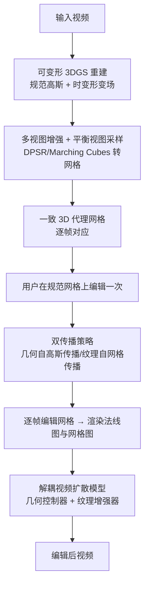

## 一句话总结

Shape-for-Motion 把视频中的目标物体重建成一段时间一致的可编辑 3D 网格作为"代理"，用户只需在单帧网格上编辑一次，改动便自动传播到所有帧，再经解耦的视频扩散模型渲染回视频，从而实现精确且跨帧一致的姿态、形状、纹理与物体合成等编辑。

## 研究背景

可控视频编辑希望按用户意图修改源视频内容，但现有方法难以同时满足两个关键需求。一是精确性：用户希望对物体的姿态、形状、位置、空间布局做可量化的细粒度控制（例如把物体精确旋转 20 度）。二是一致性：编辑要在所有帧之间保持连贯，例如把一棵树放到行驶中的车顶上，需要同时考虑车的运动、旋转与视角变化。

早期方法用文本作为交互信号，但文本对空间属性的编辑缺乏精度与灵活性；基于图像的方法引入一张编辑后的图像作为引导并向后续帧传播；基于拖拽的方法让用户手动拖动锚点做局部调整。这些方法都在 2D 框架内操作，缺乏底层的 3D 表示，因而在处理复杂编辑与保证帧间一致性时力不从心。作者据此提出一个 3D 感知的工作流：先从视频重建目标物体的 3D 代理，在 3D 空间做交互式编辑，再借助编辑后的代理生成视频。

## 方法

整体框架分三步。第一步，把视频中的目标物体转换为带逐帧对应关系的一致 3D 网格（3D 代理），为编辑提供稳定的几何结构；第二步，用户在单帧的规范网格（canonical mesh）上编辑一次，通过双传播策略自动把几何与纹理改动传播到所有帧；第三步，把编辑后的 3D 网格投影为 2D 的几何（法线图）与纹理（网格图）作为控制信号，输入一个解耦的视频扩散模型，生成最终编辑视频。

关键设计：

- **一致 3D 代理重建（Consistent 3D Proxy Reconstruction）**：逐帧独立重建会因缺乏帧间对应而时间一致性差。作者改用可变形 3D 高斯泼溅（deformable 3DGS），维护一组规范高斯与一个时变形变场 $$\theta(\cdot)$$，再经 DPSR 与 Marching Cubes 转为网格，颜色存于规范色彩网络 $$MLP_c(\cdot)$$。针对单目视频视角有限的问题，用多视图扩散模型生成新视角作为额外约束，并提出平衡视图采样：令每帧全部生成新视角的总采样概率等于该帧观测视角的采样概率 $$\beta_i = \sum_{j=1}^{N} \zeta_{i,j}$$，从而抑制合成视角带来的帧内/帧间不一致。

- **双传播策略（Dual-Propagation Strategy）**：直接把规范网格的编辑偏移 $$\Delta m = M_c' - M_c$$ 套用形变场会因形变场是针对高斯点而非网格顶点优化而产生几何错误。作者将几何与纹理分开传播——几何走高斯传播：先建立高斯点到网格顶点的最近邻映射 $$\phi(x) = \arg\min_{v \in M_c} \lVert x - v \rVert_2$$，把 $$\Delta m$$ 转成高斯偏移 $$\Delta g$$，再借形变场得到逐帧编辑网格 $$\hat{M}_t^e = \mathrm{MC}(G_t + \Delta g)$$；纹理走网格传播：利用网格传播得到的编辑网格（颜色大多正确）与高斯传播网格间的映射 $$\xi(\cdot)$$ 检索颜色，避免顶点错位造成的颜色偏移。

- **解耦视频扩散的自监督混合训练（Generative Rendering）**：由于缺少"3D 网格–视频"配对数据，作者通过增广输入视频模拟编辑前后状态来构造自监督数据；以图生视频版 SVD 为底座、采用 ControlNet 范式，把几何（法线图）与纹理作为两路解耦的控制信号。为避免模型退化为单纯的纹理增强而忽略几何分支，采用两阶段混合训练：先固定底座只训几何控制器（此阶段纹理控制被背景图替换），再冻结几何控制器微调底座（此阶段纹理控制以 20% 概率给入、80% 概率被背景图替换），从而在有纹理时保外观、无纹理时保生成灵活性。

## 实验结果

作者构建 V3DBench（70 段视频，涵盖姿态编辑、旋转、缩放、平移、纹理修改、物体合成六类），用 CLIP 系指标 Fram-Acc、Tem-Con，并提出 CLAP 分数（CLIP-APpearance，等于 Fram-Acc 乘以输入与输出帧的 DINO 相似度）衡量编辑前后外观一致性；同时做用户研究，报告编辑质量（EQ）、语义一致性（SC）、视觉合理性（VP）的平均排名（越小越好）。主结果如下：

| 方法 | Fram-Acc ↑ | Tem-Con ↑ | CLAP Score ↑ | EQ ↓ | SC ↓ | VP ↓ |
|------|------|------|------|------|------|------|
| Tune-A-Video | 0.510 | 0.979 | 0.423 | 5.35 | 5.68 | 5.85 |
| Pix2Video | 0.825 | 0.988 | 0.647 | 4.81 | 5.03 | 4.65 |
| I2V-Edit | 0.856 | 0.989 | 0.792 | 2.23 | 2.33 | 2.23 |
| DragVideo | 0.875 | 0.983 | 0.774 | 3.27 | 2.72 | 2.68 |
| VideoShop | 0.812 | 0.985 | 0.726 | 4.21 | 3.88 | 3.78 |
| **Ours** | **0.945** | **0.990** | **0.878** | **1.13** | **1.36** | **1.81** |

本方法在全部客观指标（Fram-Acc、Tem-Con、CLAP）与用户研究三项排名上均领先，说明其在编辑质量与时间一致性上优于基线。消融也印证各设计的作用：去掉新视角约束会导致重建错误，去掉平衡视图采样会因过度采样合成视角而重建不完整，去掉深度约束会使法线图出现凹陷孔洞；解耦扩散的两阶段训练相比单阶段能把 CLAP 分数从 0.723 / 0.769 提升到 0.878。

## 亮点与局限

亮点：

- 首个将可编辑 3D 网格代理引入视频编辑的框架，把编辑从模糊的 2D 操作提升为 3D 空间中可量化、精确的操作，天然保证跨帧几何一致性。
- 双传播策略让用户只在单帧编辑一次即可自动传播到全序列，几何与纹理分路传播规避了形变场作用于网格顶点的误差与颜色错位。
- 解耦的几何/纹理控制加自监督混合训练，解决了缺乏 3D–视频配对数据的难题，支持姿态编辑、旋转、缩放、平移、纹理修改与物体合成等多样操作。

局限：

- 依赖可变形 3DGS 重建，单目视频视角有限，重建质量仍依赖多视图生成器产生的新视角，其固有的不完美会传导到编辑结果。
- 流程较重，需要逐视频重建 3D 代理并训练/使用扩散模型，交互与计算成本高于纯 2D 方法。

## 延伸思考

Shape-for-Motion 展示了"以 3D 为中介"来约束 2D 生成的思路在视频编辑上的价值：当 2D 表示难以表达精确空间意图时，把内容显式抬升到可编辑的 3D 代理，能同时解决精确性与时间一致性这两个长期矛盾的目标。这条路径与图像领域的 Image Sculpting、3D-Fixup 一脉相承，也提示未来可控视频生成可能越来越依赖显式几何代理作为"控制骨架"。随着单目动态重建与多视图生成质量继续提升，这类 3D 感知编辑框架有望降低对新视角合成误差的敏感度，并推广到更复杂的多物体交互、可变形物体乃至完整场景级的精确视频编辑。
