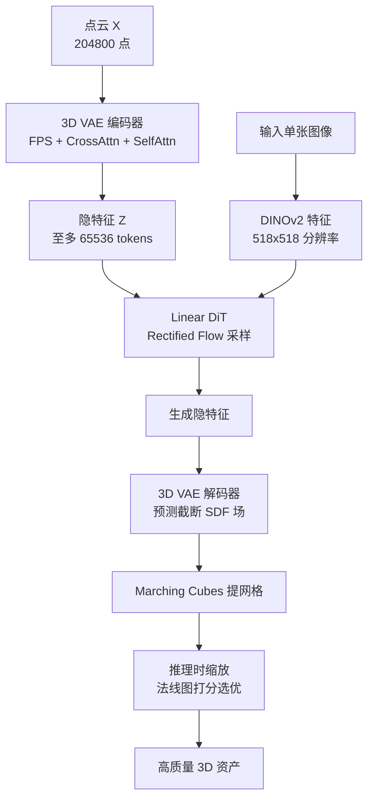

## 一句话总结

ShapeGen 在 3DShape2VecSet/TripoSG 的 VAE + 流模型框架上，通过截断 SDF 表征与 BCE 监督、分辨率与 token 数放大、RGB 与法线图混合条件、线性注意力以及推理时缩放五项改进，实现了从单张图像生成高质量、细节丰富 3D 资产的新最优效果。

## 研究背景

受图像与视频生成范式启发，图像到 3D 的资产生成近年进展显著，能够从单张图像快速合成高保真 3D 模型。然而当前基于 3D-VAE 压缩隐空间加 Diffusion Transformer（DiT）的主流方法仍存在明显短板：细节缺失、表面过度平滑、薄壳结构破碎，以及生成时出现的走样或"阶梯状"伪影。

作者将这些问题归因于三方面的次优选择：一是 VAE 表征与监督策略不当（占用率表征带来阶梯伪影，SDF 表征带来薄壳破碎）；二是分辨率受限（低分辨率水密数据、低分辨率条件图像、隐 token 数量偏少）导致细节不足；三是训练数据中无纹理资产用 ControlNet 合成纹理会与几何不一致，引入歧义。这些因素共同拉低了生成结果的视觉保真度和结构连贯性，使其难以达到专业艺术家的质量标准。

## 方法

整体框架沿用 3DShape2VecSet 与 TripoSG 的两阶段设计：先用 3D-VAE 把原始几何压缩到隐空间（编码器用最远点采样下采样点云、交叉注意力聚合几何信息、自注意力压缩为隐特征 $$Z$$；解码器还原并对查询点预测场值，再用 Marching Cubes 提取网格），再用基于 Rectified Flow 的 DiT 在图像条件（DINOv2 特征）下学习从噪声到隐特征的映射。ShapeGen 在此骨架上叠加五项针对性改进。

关键设计：

- **截断 SDF 表征 + BCE 监督**：占用率配 BCE 训练稳定但有阶梯伪影，SDF 配 MSE 表面光滑但薄壳破碎。作者借鉴 Surf-D，对截断 SDF 施加 BCE 损失，兼得占用率的噪声鲁棒性与 SDF 的表面平滑性，并额外用 PyTorch 自动微分导出的表面法线做监督，约束 SDF 数值及其空间梯度的一致性。将真值 SDF 按阈值 $$\delta$$ 截断并归一到 $$[0,1]$$ 得到标签 $$\tilde{y} = \frac{\mathrm{clip}(y, -\delta, \delta) + \delta}{2\delta}$$，总损失为 $$\mathcal{L}_{recon} = \lambda_{bce} \cdot \mathcal{L}_{bce\text{-}sdf} + \lambda_{normal} \cdot \mathcal{L}_{normal}$$。
- **分辨率放大**：把 3D 数据处理分辨率从 $$512^3$$ 提到 $$1024^3$$，条件图像从 $$224\times224$$ 提到 $$518\times518$$，隐 token 数从常规 2K–4K 扩到 65K，全面提升几何保真度与表征容量。
- **混合条件训练**：对有纹理资产渲染 RGB 图像、对无纹理资产渲染法线图，二者混合作为条件输入，避免 ControlNet 合成纹理与几何不一致带来的训练歧义，法线图还能抑制高频纹理干扰。
- **线性注意力**：3D token 由 1D 序列压缩得到、天然编码全局结构，无需像 SANA 那样用卷积 MixFFN 补局部性。作者按 LightNet 设计引入带门控的线性注意力（仅用于自注意力块，交叉注意力保持不变），在 token 数远超 token 维度时大幅加速。此外推理时采用零阶搜索式缩放：渲染生成物的正视法线图与输入图像估计的伪参考法线图比较 DINOv2 特征余弦相似度作为奖励，迭代选优。

## 实验结果

在 Toys4K 数据集上按 Trellis 评测协议对比图像到 3D 生成性能（FD 为 Fréchet Distance，KD 为 Kernel Distance）：

| 方法 | CLIP（↑） | $$FD_{incep}$$（↓） | $$FD_{dinov2}$$（↓） | $$KD_{dinov2}$$（↓） | $$FD_{point}$$（↓） |
| --- | --- | --- | --- | --- | --- |
| CraftsMan3D-1.5 | 82.11 | 10.35 | 80.11 | 0.98 | 2.87 |
| Trellis | 85.89 | 9.21 | 68.78 | 0.77 | 2.00 |
| Step1X-3D | 85.19 | 9.31 | 69.92 | 0.76 | 2.03 |
| Hunyuan3D-2 | 85.01 | 8.99 | 69.90 | 0.69 | 1.89 |
| TripoSG | 87.34 | 8.02 | 64.04 | 0.63 | 1.77 |
| Hi3DGen | 87.90 | 7.46 | 62.85 | 0.55 | 1.54 |
| Ours | 88.21 | 7.29 | 62.34 | 0.50 | 1.38 |

ShapeGen 在各项指标上均领先。用户研究中（125 张输入图、10 位评审），其"图像-3D 对齐"得分 43.7、"整体质量"得分 35.6，显著高于 Hunyuan3D-2、TripoSG、Hi3DGen。VAE 重建方面，token 数从 2048 增到 65536 时 Chamfer Distance 从 4.51 降到 3.98，法线一致性从 0.958 升到 0.974，且 32768/65536 是在推理阶段扩展得到，说明模型能泛化到训练 token 设置之外。

## 亮点与局限

亮点：系统性地把"表征/监督—分辨率—条件—注意力—推理"五个环节逐项拆解并给出可组合的改进，是首个把线性注意力引入 3D 生成模型的工作，在 token 数达 32768 时相较 Flash Attention 有近 7 倍加速；推理时缩放无需额外训练即可提升几何保真度。

局限：作者自述尚未引入 Dora 的边缘增强 token 采样，细节仍有提升空间；模型仅 1.5B 参数，远小于图像/视频生成常见的 10B+ 规模；法线图作为条件的效果高度依赖 RGB 到法线估计的准确性，复杂图像上估计不准会反而拉低生成质量。

## 延伸思考

ShapeGen 的核心贡献更像是一份"工程化调优清单"而非单一新算法——它揭示了在成熟的 VAE + 流模型框架下，表征选择（截断 SDF+BCE）与规模放大（token 数)对生成质量的杠杆作用被此前低估了。线性注意力天然契合 1D 化 3D token 的观察值得关注：这暗示 3D 生成与 2D 图像生成在 token 局部性上的本质差异，可能是把高分辨率生成推向更大 token 规模的关键突破口。未来若结合边缘感知采样与更大参数量，图像到 3D 或许能真正跨过"艺术家可用"的门槛。
