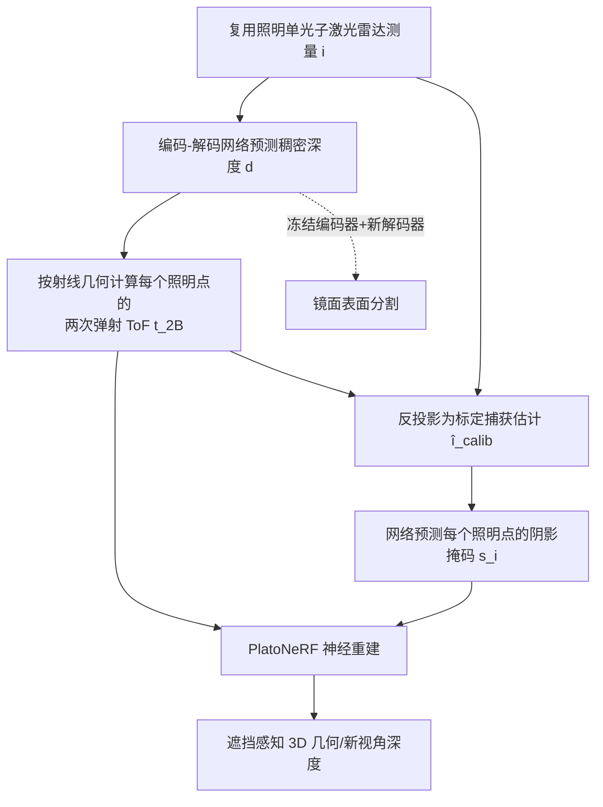

## 一句话总结

本文提出 Shoot-Bounce-3D（SB3D）：一种数据驱动方法，从单视角、单次曝光的单光子激光雷达测量中解混（demultiplex）多点同时照明下的两次弹射光，恢复出稠密度量深度、被遮挡区域几何与镜面等镜反射表面，实现单次拍摄的遮挡感知 3D 重建。

## 研究背景

单次拍摄的 3D 场景理解在自动驾驶、扩展现实等应用中至关重要，但从单张 RGB 图像恢复 3D 天生病态：缺乏多视角对应导致度量深度不可解、遮挡区域只能靠"幻觉"补全、镜面表面常被误判成场景中的"洞"或"传送门"。

作者转而利用单光子激光雷达（脉冲激光 + SPAD 传感器）。这类传感器不仅记录直接反射回来的光（一次弹射，编码被照明点的深度），还能测到在场景中多次弹射后才返回的光。传感器逐像素记录光强随时间的分布，称为瞬态（transient），其中不同弹射次数的光表现为多个时间峰值。两次弹射光相比三次弹射少一次散射衰减、信号质量更高，可用于恢复稠密深度、透视遮挡物、检测镜面。

然而已有工作都假设激光**逐点顺序扫描**场景，一次只照亮一个点。消费级设备（手机、平板、头显）上的高分辨率 SPAD 实际使用**复用照明**（multiplexed illumination）：多点同时照亮。此时瞬态里混合了所有照明点的多次弹射光，峰值与照明点之间失去对应关系，导致旧方法失效。用解析方法反演这种复杂光传输极其困难，本文因此走数据驱动路线。

## 方法

SB3D 把"解混复用照明"这一难题拆成三步流水线：先预测稠密深度并据此分离每个照明点的两次弹射飞行时间（ToF），再结合测量估计每个照明点的阴影掩码，最后用这两组量训练神经重建模型 PlatoNeRF 得到 3D 几何。

关键设计：

- **用深度做代理任务分离 ToF**：直接为每个照明点预测两次弹射 ToF 维度过高（$$n_x \times n_y \times n_{xl}n_{yl}$$），难以学习。作者改为预测低维深度（$$n_x \times n_y$$），再用射线几何解析地算出每个照明点 $$i$$ 的两次弹射飞行时间 $$t_{2B}(\mathbf{x}_i,\mathbf{x}_{u,v};\mathbf{x}_l,\mathbf{x}_c)=\frac{\lvert \mathbf{x}_i-\mathbf{x}_l\rvert+\lvert \mathbf{x}_{u,v}-\mathbf{x}_i\rvert+\lvert \mathbf{x}_{u,v}-\mathbf{x}_c\rvert}{c}$$。深度网络用 SSIM 与 L1 组合的数据保真项加边缘感知平滑项监督，其中平滑项用时间积分强度图 $$I_{u,v}=\sum_t i(u,v,t)$$ 替代缺失的 RGB 提取边缘。

- **阴影瞬态（shadow transient）对齐输入输出**：直接从复用测量学阴影掩码效果差，因为输入测量的是所有照明点净到达的光，而输出预测的是每个照明点缺失的光，二者不一致。作者引入阴影瞬态 $$i_{shadow}=i_{calib}-i$$，其中标定捕获 $$i_{calib}$$ 表示移除被遮挡物后应观测到的光。由于真实标定不可得，用第一步预测的两次弹射 ToF 估计 $$\hat{i}_{calib}$$（把强度 $$A_i$$ 简化设为 1），并将 $$\hat{i}_{calib}$$ 与原测量 $$i$$ 拼接后一起送入网络，显著提升阴影掩码质量，用二元交叉熵训练。

- **镜面线索来自弹射次数的几何关系**：由三角不等式，镜面返回的光路径总比漫反射长，因而两次/三次弹射光的先后到达构成检测镜面的天然物理线索。作者发现第一步为解混 ToF 学到的编码器特征，冻结后接新解码器即可迁移到镜面表面分割任务，暗示这些特征可能是单光子激光雷达的通用表示。

- **大规模仿真数据集**：在 Aria Synthetic Environments 基础上渲染约 97,432 个室内场景的多次弹射瞬态（256×256、128 ps 时间分辨率、4/25/100 个照明点），附带 RGB、深度、法线、镜面分割、实例分割、阴影掩码，是已知首个大规模瞬态数据集（此前同类仅约 5,000 条）。

## 实验结果

作者在 25 个照明点的仿真数据上评测（约 87k 训练、6k 测试），并给出真实世界概念验证。下表汇总三项任务的主要指标（3D 重建以 NeRF 渲染的多视角深度作为代理，在四个场景各 80 个新视角上平均）：

| 任务 | 方法 | MAE ↓ | 边界指标 ↑ |
|------|------|-------|-----------|
| 深度估计 | Bounce-Flash Lidar | 0.4922 | 0.0138 (F1) |
| 深度估计 | Depth Pro | 0.1089 | 0.2930 (F1) |
| 深度估计 | **Shoot-Bounce-3D** | **0.0228** | **0.6238** (F1) |
| 镜面分割 | EBLNet | 0.0117 (Pixel) | 81.21 (IoU %) |
| 镜面分割 | **Shoot-Bounce-3D** | **0.0010** (Pixel) | **86.52** (IoU %) |
| 遮挡感知 3D | ZeroNVS | 0.5619 | 0.0090 (F1) |
| 遮挡感知 3D | **Shoot-Bounce-3D** | **0.0983** | 0.2725 (F1) |
| 遮挡感知 3D | PlatoNeRF Oracle（上界） | 0.0950 | 0.3317 (F1) |

SB3D 在深度估计上大幅超越物理法、RGB/激光雷达融合法与 RGB 深度基础模型；镜面分割优于 RGB 方法 EBLNet；遮挡感知 3D 重建接近使用真值输入的 PlatoNeRF 上界。真实世界数据（16 个照明点、单像素 SPAD 扫描合成复用测量）上深度误差 0.028 m、边界 F1 为 0.556，优于单次拍摄设定下的 PlatoNeRF。

## 亮点与局限

亮点：
- 首次把数据驱动方法引入两次弹射瞬态，解决消费级设备复用照明这一"更实用也更难"的场景。
- 贡献了首个约 100k 规模的仿真多次弹射瞬态数据集，可支撑后续单光子激光雷达研究。
- 解混学到的特征可迁移到镜面分割，展现单光子激光雷达通用表示的潜力；对镜面/遮挡这类 RGB 方法易失败的场景有物理层面的可解释处理。

局限：
- 流水线式设计使 ToF 分离的误差会传播到阴影分离。
- 未考虑消费级 SPAD 的实际问题（串扰、坏点、死区、blooming 等）。
- 假设物体为纯镜面或纯漫反射；真实重建时需人工挑选最优的若干阴影掩码，部分预测含伪影。

## 延伸思考

这项工作的价值不只在于一个更强的 3D 重建器，更在于把"时间维度的光传输"当成一种可学习的视觉信号。RGB 图像丢弃了光到达的时间信息，导致镜面与"传送门"不可区分、遮挡只能靠生成模型幻觉；而瞬态里弹射次数、路径长度、阴影这些物理量提供了硬约束。随着高分辨率 SPAD 在消费设备上普及，围绕单光子激光雷达构建"基础模型"、与 RGB 融合、以及端到端替代当前分步流水线以抑制误差传播，都是自然的下一步。同时，仿真数据能迁移到真实采集这一点，也提示合成瞬态渲染的保真度已足以支撑真实世界泛化，这对数据稀缺的新型传感模态尤为关键。
