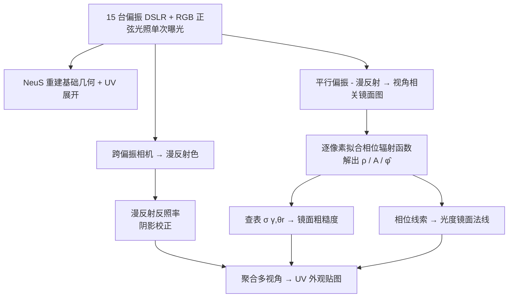

## 一句话总结

本文提出一种单次曝光（single-shot）的人脸外观采集方法：仅用线偏振的 RGB 正弦光照和普通消费级相机，通过 RGB 三通道相位复用的正弦光，直接逐像素分离出漫反射反照率、镜面反照率、镜面粗糙度和高频光度法线，首次在单次采集中把镜面反照率与粗糙度真正解耦，而不依赖时间复用或联合优化。

## 研究背景

- 领域现状：高保真人脸反射率采集是数字人真实感渲染的基础，需要同时拿到几何、空间变化的漫反射反照率、镜面反照率、镜面粗糙度以及编码皮肤微观结构的光度法线。经典的偏振球面梯度光照（light stage）方法能高质量分离漫反/镜面并采集细节法线。
- 核心痛点：这些主动光照方法依赖时间复用（time-multiplexing）光照模式，只能扫描静止对象。近年的被动 / 单次方法转向逆渲染联合优化，但联合估计会导致参数纠缠——尤其是镜面反照率与粗糙度难以区分，且往往需要正则化和启发式先验才能收敛到看似合理的解。
- 本文 idea：用偏振做漫反/镜面分离，同时把 RGB 三通道编码成互相错开相位的正弦光照，用相位分析直接解析式地反解反射率参数。这样镜面反照率与粗糙度可以分别测量而非联合优化，法线也可单独用视角相关的镜面相位线索恢复，得到更锐利、更符合光度学的结果。

## 方法

整体框架：先用偏振 + 正弦光照拍一组多视角照片，重建基础几何并做 UV 展开；再基于跨偏振图得到漫反射、平行偏振图相减得到镜面图；然后在 UV 域内逐像素做相位拟合，分别解出镜面反照率、粗糙度与光度法线，最终聚合成各类外观贴图。

关键设计：

1. **RGB 相位复用正弦光照**：沿经度方向、固定角频率 $$f = 3$$ 的正弦光，三个颜色通道分别错开相位 $$\varphi \in [0, 120^\circ, -120^\circ]$$：

$$
I(\vec{\omega}) =
\begin{cases}
R: \cos(3\phi) + 1 \\
G: \cos(3\phi + 120^\circ) + 1 \\
B: \cos(3\phi - 120^\circ) + 1
\end{cases}
$$

选 $$f = 3$$ 是能有效估计漫反射的最低频率（奇数高频正弦的辐照度在半球上积分为零，从而跨偏振图直接给出漫反射反照率），更高频率会让镜面估计复杂化。

2. **镜面反照率与粗糙度解耦**：利用两点观察——皮肤是介电材料、镜面反射基本无色；RGB 相位复用提供三组独立正弦观测。据此拟合相位辐射函数

$$
E(\varphi) = \rho + A\cos(\varphi - \hat{\varphi})
$$

其中 $$\rho$$ 为（受 Fresnel 调制的）镜面反照率，$$A$$ 为调制幅度，$$\hat{\varphi}$$ 为主反射方向相位。由于偏振已分离镜面分量，$$\rho$$ 直接就是镜面反照率；再用比值 $$\gamma = A / \rho$$ 与反射极角 $$\theta_r$$ 查一张预计算的二维查找表 $$\sigma(\gamma, \theta_r)$$ 得到粗糙度。这是单次采集首次把二者独立测出。

3. **光度镜面法线的独立估计**：相位角 $$\hat{\varphi}$$ 编码了镜面波瓣的方向信息。理想全球面光照下，通过最小化各相机理论相位与实测相位之差恢复法线：

$$
\min_{\vec{n}} \sum_{c} \bigl(\Phi(\vec{n}, \vec{v}_c) - \hat{\varphi}_c\bigr)^2
$$

4. **受限分区光照下的法线浮雕（embossing）**：实际显示器方案只能覆盖有限立体角，直接优化法线会很噪。作者改为把实测相位图 $$\hat{\varphi}$$ 的高频变化嵌入反射向量方位角 $$\phi_r$$，并借助镜面反照率的衰减近似 $$\rho = \rho_s\cos(\theta_r)$$ 反推极角的局部变化 $$d\theta_r$$，重建高频反射向量后取其与视线的半程向量作为法线，从而在受限光照下也能得到干净且富含皮肤毛孔、皱纹等细节的法线，并顺带校正镜面反照率的光照衰减。

## 实验结果

在 Digital Emily 合成数据上，与单次采集的代表方法 Riviere et al. [2020] 对比各外观贴图的平均均方误差（MSE，数值越低越好；Riviere 方法不单独分离粗糙度故无该项）：

| 方法 | 漫反射反照率 $$(10^{-3})$$ | 镜面反照率 $$(10^{-2})$$ | 粗糙度 $$(10^{-3})$$ | 法线 $$(10^{-3})$$ |
| --- | --- | --- | --- | --- |
| Ours（全球面光照） | 1.607 | 2.048 | 1.212 | 0.668 |
| Riviere et al.（全球面光照） | 1.422 | 2.831 | - | 1.324 |
| Ours（显示器受限光照） | 6.212 | 5.767 | 1.744 | 2.956 |

在全球面光照下，本文方法的镜面反照率与法线明显更准（法线误差约为对比方法的一半），漫反射反照率略逊于对比方法。显示器受限光照下整体误差升高（因头顶、下巴等极端角度区域受光不足），但粗糙度估计仍较稳健，因为它依赖参数比值而非绝对值。真实拍摄的结果显示光度法线能捕捉皮肤毛孔、细纹等基础几何无法表达的中尺度细节，并可支持牙齿、眼睛等非皮肤区域的外观采集。

## 亮点与局限

亮点：
- 仅用线偏振 RGB 正弦光 + 普通相机，单次曝光即可解析式地分离四类外观参数，无需时间复用、无需联合优化和启发式先验。
- 首次在单次采集里独立测出空间变化的镜面反照率与粗糙度，避免逆渲染联合优化中的参数纠缠。
- 法线用相位线索独立恢复，比联合优化的"混合"法线更锐利、更符合光度学。
- 可用普通 LCD 显示器（本身线偏振）搭建实用采集装置（15 台偏振 DSLR）。

局限：
- 受限分区光照下漫反射反照率有轻微偏色（全球面光照下不出现），且未显式建模次表面散射。
- 显示器亮度有限，目前只能做静态表情扫描；作者认为在更亮的光照装置下方法天然可扩展到动态采集。
- 头顶、下巴等受光不足区域的反射率估计可靠性下降。

## 延伸思考

这项工作的核心价值在于用"物理编码"替代"数据 / 优化先验"：通过精心设计的 RGB 相位复用正弦光照，把原本欠约束的粗糙度问题变成可解析求解的相位拟合，避免了逆渲染方法常见的参数纠缠与收敛不确定性。这提示了一个思路——在采集端把信息编码进光照结构，往往比在重建端堆正则化更干净。局限也很明确：显示器亮度约束把它锁在静态扫描，若能换用更亮的偏振全球面光源（真正的 light stage），既能消除偏色，又能解锁动态表演捕捉。此外作者指出其采集的"一跨偏振 + 两平行偏振"三元组数据可直接喂给现有逆渲染方法，把解析测量与优化方法结合、并补上次表面散射建模，是很自然的后续方向。
