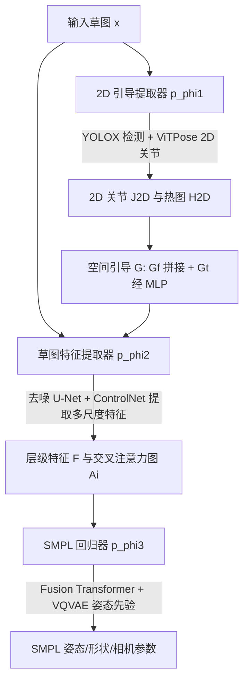

## 一句话总结

本文提出 Sketch2PoseNet：先用"从合成中学习"的策略，借助扩散模型把 2D 姿态渲染成各类风格的草图，构造出 12 万对草图-3D 姿态标注数据集 SKEP-120K，再训练一个端到端前馈网络，直接从各种风格的草图预测 SMPL 表示的 3D 人体姿态，在保持与优化式方法相当精度的同时，把推理速度提升约 500 倍。

## 研究背景

从草图预测 3D 人体姿态在动画与影视制作中应用广泛，但难度远超常规照片姿态估计。草图往往忽略人体比例与几何透视，采用抽象、夸张、比例失衡的表达，且风格繁多（卡通、油画、水墨、炭笔、火柴人、儿童画等），这让面向真实照片训练的通用姿态估计方法难以奏效。

此前代表性工作 Sketch2Pose 先从草图预测 2D 关节，再用启发式规则的优化框架把 3D 参数化人体对齐到骨架。这类方法主要受制于缺乏大规模草图-3D 姿态配对标注，只能依赖优化，既慢又主要针对手绘线稿，泛化性有限。核心痛点在于：既缺训练数据，又在效率与输入多样性之间被迫二选一。

## 方法

### 整体框架

方法分两大块。第一块是数据合成：用 VPoser 采样多样的 SMPL 姿态，在 3D-to-2D 投影时对肢体长度加随机偏置以模拟草图中的比例夸张与透视失真，配合 BLIP2 生成的文本描述，训练一个类 ControlNet 的文本条件图像生成模型，合成六种风格、每种约 2 万张的草图，人工筛除约 10% 低质样本，最终得到 SKEP-120K。第二块是姿态预测网络：由 2D 引导提取器、草图特征提取器、SMPL 回归器三个模块串联组成。

整个过程可用概率模型表达为：

$$p_\phi(\boldsymbol{y}\mid\boldsymbol{x}) = p_{\phi_3}(\boldsymbol{y}\mid \mathcal{F})\, p_{\phi_2}(\mathcal{F}\mid \epsilon(\boldsymbol{x}), \mathcal{G})\, p_{\phi_1}(\mathcal{G}\mid \epsilon(\boldsymbol{x}))$$

其中 $\boldsymbol{x}$ 为输入草图，$\boldsymbol{y}$ 为 SMPL 参数表示的 3D 姿态，$\mathcal{F}$ 为从草图提取的信息特征，$\mathcal{G}$ 为从 2D 姿态提取的空间引导，$\epsilon$ 为预训练图像编码器。

### 关键设计

- **扩散先验做草图特征提取**：借鉴 VPD，用预训练去噪 U-Net 作为骨干，仅一次前向即可抽取多尺度层级特征；并把交叉注意力图 $A_i$ 与特征图拼接，$\mathcal{F}\leftarrow\lbrace[\mathcal{F}_i, A_i]\rbrace$，为遮挡部位提供可见性线索。用 2D 关节条件替代文本条件注入。

- **前馈架构换掉迭代优化**：不同于 Sketch2Pose 的三阶段迭代优化，本文用前馈网络一次性回归，速度提升约 500 倍；SMPL 回归器用 fusion transformer 融合 2D/3D 特征，并借助在 AMASS 上预训练的 VQVAE 提供人体姿态先验。

- **面向草图的启发式损失**：针对草图比例失真、透视与前缩短问题，设计骨架平行损失（约束 3D 骨骼投影与 2D 骨骼方向一致）：

$$\mathcal{L}_{parallel} = \sum_i \left(\frac{\boldsymbol{b}^{2D}_i}{\lVert \boldsymbol{b}^{2D}_i \rVert}\cdot \boldsymbol{n}\right)^2$$

  以及前缩短损失（约束骨骼与屏幕夹角，通过 3D 与 2D 骨长比值匹配）：

$$\mathcal{L}_{f} = \sum_i \left(\frac{\lVert \boldsymbol{b}^{3D}_i \rVert}{\lVert \boldsymbol{b}^{2D}_i \rVert} - \frac{\lVert \bar{\boldsymbol{b}}^{3D}_i \rVert}{\lVert \bar{\boldsymbol{b}}^{2D}_i \rVert}\right)^2$$

  自接触问题则用 SMPL 姿态参数的 $L_1$ 损失替代传统自接触损失。总损失为 $\mathcal{L} = \lambda_1 \mathcal{L}_{parallel} + \lambda_2 \mathcal{L}_{f} + \lambda_3 \mathcal{L}_{pose} + \lambda_4 \mathcal{L}_{shape}$，权重取 3、3、2、1。

## 实验结果

在 Sketch2Pose 提供的艺术家标注数据集（两位专家标注）与 SKEP-120K 验证集上评测，指标为 MPVE、MPJPE、PA-MPJPE（单位 mm，越低越好）。为公平比较，所有方法都用本文训练的 ViTPose 产出相同 2D 输入。

| Method | Expert1 MPVE↓ | Expert1 MPJPE↓ | Expert1 PA-MPJPE↓ | SKEP-120K MPVE↓ | SKEP-120K MPJPE↓ | SKEP-120K PA-MPJPE↓ |
| --- | --- | --- | --- | --- | --- | --- |
| PyMAF | 312.7 | 299.4 | 187.5 | 143.1 | 117.4 | 101.3 |
| HMR2.0 | 118.3 | 105.0 | 85.1 | 128.0 | 104.6 | 88.1 |
| DPMesh(Retrained) | 127.7 | 121.4 | 94.1 | 122.6 | 97.3 | 80.6 |
| Sketch2Pose | 103.8 | 101.4 | 78.1 | 152.1 | 125.9 | 100.3 |
| Ours | 103.1 | 95.7 | 77.4 | 106.7 | 87.7 | 72.6 |

在艺术家数据集上本文取得整体最优；在覆盖六种风格的 SKEP-120K 上显著领先所有对比方法。运行时方面，本文单张预测约 0.12 秒，而 Sketch2Pose 需约 67.57 秒，实现超 500 倍加速，甚至与面向真实照片的通用方法相当或更快。消融实验表明去掉任一损失项（$\mathcal{L}_{parallel}$、$\mathcal{L}_{f}$、$\mathcal{L}_{pose}$）、去掉交叉注意力图 $A_i$、去掉 2D 关节 $J_{2D}$ 或不做数据清洗，性能均下降。

## 亮点与局限

亮点：用"从合成中学习"绕开草图-3D 姿态配对稀缺的瓶颈，构造出规模大、风格全的 SKEP-120K；前馈网络把优化式方法的分钟级推理压到 0.1 秒量级；面向草图特性设计的平行/前缩短/自接触损失显著提升了在比例失真与透视错误下的鲁棒性与泛化。

局限：末端关节（手、脚）预测仍不准，原因包括草图抽象缺乏细节、末端关节常被遮挡或深度模糊、骨架层级结构会让近端小误差沿运动链放大到远端。此外，本文聚焦姿态估计，特定个体的体型重建不在研究范围内。

## 延伸思考

"从合成中学习"这一策略的成败高度依赖合成数据分布与真实草图分布的贴合度，文中通过骨长随机偏置注入比例夸张、并用人工清洗保证质量，这提示数据合成本身就是一项需要精细设计的建模任务。另一个值得思考的方向是：末端关节误差沿运动链放大是参数化人体回归的普遍难题，是否可以引入显式的运动学约束或分层细化，把远端关节的预测与近端解耦，从而缓解误差传播。此外，方法已展示逐帧应用于连续线条动画的潜力，若进一步引入时序一致性约束，或可拓展为面向草图的动作捕捉工具。
