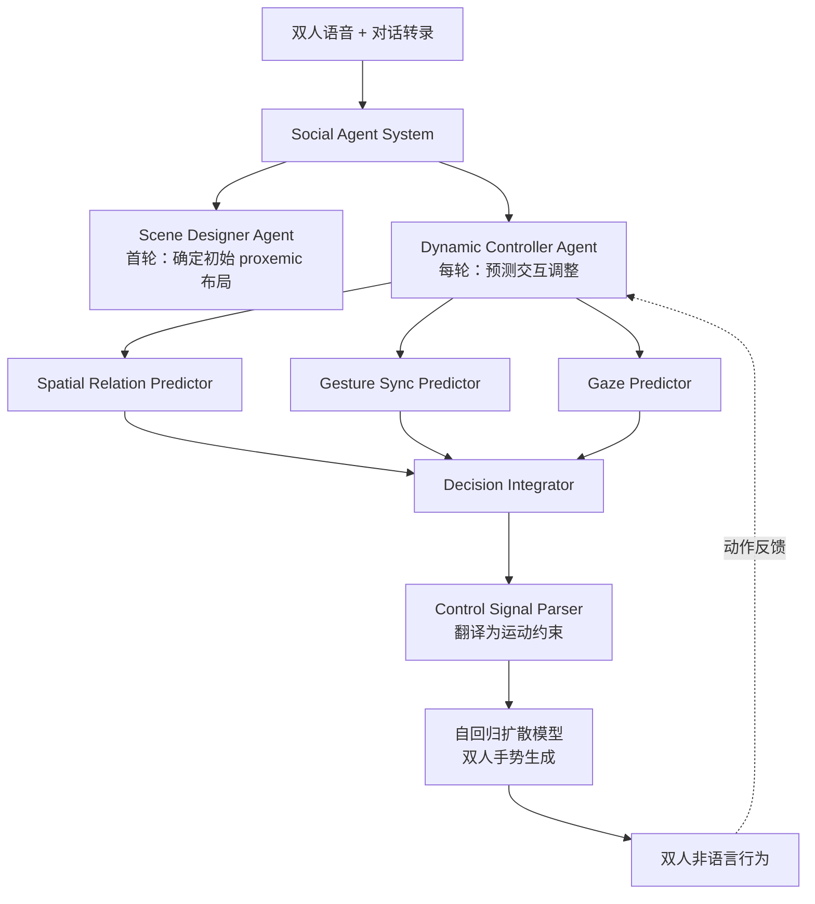

## 一句话总结

本文提出 Social Agent：用一个 LLM 驱动的智能体系统充当"导演"，分析双人对话的场景与意图，输出多尺度的非语言行为控制信号（空间距离、注视、手势同步），再通过一个自回归扩散模型的双人手势生成器把这些高层信号翻译成协调、自然的双人全身动作。

## 研究背景

非语言行为（手势、注视、身体朝向、人际距离等）是人类交流不可或缺的部分，在双人对话中承载着情绪、态度和社交关系等信号。这些信号分布在多个尺度上：细粒度的伴随语音手势、行为尺度的目光接触与"变色龙效应"（无意识模仿对方手势）、以及更宏观的社交距离。

已有工作大多聚焦单人伴随语音手势合成，难以扩展到双人场景。纯数据驱动、监督学习的方法容易过拟合训练数据中占主导的细粒度行为，却无法捕捉稀疏但关键的双人社交信号。而心理学与语言学领域对非语言行为已有大量研究，但如何把这些抽象、描述性的知识与具体的动作数据桥接起来是一个难题，需要在高层推理与低层动作合成之间做精心的协同设计。

作者的核心洞察是：LLM 凭借语义理解能力，可以动态推断社交情境并应用恰当的行为规则，从而处理人类对话的多样性与复杂性。因此他们提出用 LLM 智能体模拟人类对话行为背后的本能过程，显式建模多尺度社交信号与其具身表达之间的因果联系。

## 方法

整体框架由三部分组成：低层的双人手势扩散生成器、高层的 LLM 社交智能体系统（Social Agent System，充当导演）、以及把智能体输出翻译成动作约束的交互引导策略。智能体在固定时间粒度上检查双方动作、推断意图、决定下一轮的交互行为，形成一个持续的反馈闭环。

关键设计：

1. **双人手势自回归扩散模型**。采用滑动窗口机制，把双人动作生成建模为多轮的单智能体任务。第 $$i$$ 轮为角色 I 生成动作段，其条件概率为 $$p(M^I_i \mid M^I_{i-1}, S^I_i, S^II_i)$$，即依赖自己上一轮动作、本轮自己的语音特征以及对方的语音特征；角色 II 对称处理。模型直接在全身动作空间训练（而非潜空间），从而能对每个关节做直接控制，便于按 LLM 输出做动作编辑，也免去通过解码器反传的开销。语音条件用 classifier-free guidance 增强，推理时用尺度因子 $$\lambda$$ 调节语音影响力。

2. **Scene Designer Agent（首轮场景设计）**。对语音做自动语音识别得到转录后，Dialogue Analyzer 抽取场景语境（场景、关系、情绪、角色设定）。Spatial Relation Planner 用结构化的思维链推理，先推断定性的空间关系而非直接预测三维坐标，包括三方面：Positional Configuration（依据 Kendon 的 F-formation，分为 Vis-à-vis / L-shaped / side-by-side）、Spatial Distance（依据 Hall 的人际距离理论，分为 Interpersonal / Social / Public）、Postural State（坐或站）。再用预定义映射规则把定性结果转成数值参数，例如 vis-à-vis 映射为方向关系再转成钟表角度，以角色 I 为原点确定角色 II 的全局位置与朝向。

3. **Dynamic Controller Agent（每轮动态控制）**。Interaction Context Collector 汇集场景语境、上一轮动作描述（相对朝向、距离、头部朝向）、下一轮对话转录，并用一个视觉语言模块 Visual Motion Descriptor 根据渲染的当前姿态图像描述上半身手势。之后三个预测通道分别在不同行为尺度工作：Spatial Relation Predictor 判断位置与朝向是否调整；Gesture Sync Predictor 建模两类手势同步（matching 模仿与 meshing 反馈，如点头），并定位触发词的时间戳；Gaze Predictor 预测是否注视对方及其时长与触发词时机。三者提议由 Decision Integrator 整合，为每个角色选出最合适的调整组合或判定无需调整。

4. **交互引导的动作生成（training-free）**。Control Signal Parser 把 LLM 的结构化 JSON 输出翻译成两类约束：相似性约束（手势模仿信号，在去噪早期阶段直接把动作替换为目标动作 $$x^0_{t<\tilde{t}} = \tilde{x}$$）与关节轨迹约束（位置朝向调整、点头以正弦函数施加于头部俯仰角、注视则计算朝向对方头部所需的头部朝向）。轨迹约束写成损失 $$L(x^0_t) = \lVert W \odot (J(x^0_t) - \tilde{J}) \rVert$$，用其梯度以强度因子 $$\alpha$$ 引导去噪：$$\tilde{x}^0_t = x^0_t - \alpha \nabla_{x^0_t} L(x^0_t)$$，在前 $$\tau$$ 比例的去噪步内每步做两次梯度更新以增强引导。

## 实验结果

在 Photoreal 与 InterAct 两个公开语音-手势数据集上评测。由于现有双人手势系统源码不可得或只能单人生成，作者与单人 SOTA 方法（LDA、EMAGE、Photoreal、GestureDiffuCLIP）比较。用户研究采用成对偏好测试，评测人类相似度（Human Likeness）、节拍匹配（Beat Matching）和交互水平（Interaction Level）。

下表为用户研究平均分（95% 置信区间对应显著性，带 * 表示显著效应），Ours（w/o DCA）为去掉 Dynamic Controller Agent 的消融版本：

| 数据集 | 系统 | Human Likeness ↑ | Beat Matching ↑ | Interaction Level ↑ |
| --- | --- | --- | --- | --- |
| Photoreal | LDA | -0.20* | -0.08* | -0.16* |
| Photoreal | EMAGE | -0.25* | -0.04* | -0.15* |
| Photoreal | Photoreal | 0.10* | 0.03 | -0.07* |
| Photoreal | Ours (w/o DCA) | 0.09* | 0.04 | 0.02* |
| Photoreal | Ours | 0.26 | 0.04 | 0.37 |
| InterAct | GT | 0.42* | 0.14* | 0.38* |
| InterAct | GestureDiffuCLIP | -0.31* | -0.05 | -0.26* |
| InterAct | Ours (w/o DCA) | -0.19* | -0.03 | -0.16* |
| InterAct | Ours | 0.08 | -0.03 | 0.11 |

在节拍匹配上各方法相近，但完整模型在人类相似度和交互水平上显著超过基线，凸显 Social Agent System 的作用。客观指标（FGD、BeatAlign、FDD 以及作者新提出的 Delayed Motion Synchrony Score）上，完整模型在 BeatAlign、FDD、DMSS 三项上均优于所有基线；FGD 略低于用域内真值训练的 Photoreal 上界但显著优于其他基线。消融显示去掉 Dynamic Controller 会导致交互类指标明显下降；prompt 消融表明加入逐步推理引导与参考行为学理论都能提升 LLM 的推理质量。

## 亮点与局限

亮点：
- 首个面向双人对话非语言行为生成的 LLM 智能体框架，能同时建模两位参与者、跨多个尺度合成符合语境的伴随语音动作。
- 将心理学与语言学知识（F-formation、Hall 人际距离、Kinesics 的 matching/meshing 等）结构化地注入 prompt，用思维链把抽象空间关系落到定量参数，缓解 LLM 直接空间推理的短板。
- 交互引导策略是 training-free 的，直接在全身动作空间做约束，注视、点头、模仿、位移等信号都能统一翻译成相似性或轨迹约束。

局限：
- 系统生成注视行为的频率偏高，在电视访谈类场景合适，但在其他语境可能显得不自然。
- 部分点头行为不够自然，源于训练数据中反馈行为稀少、需在强约束下程序化生成。
- 仍存在脚部滑动等动作瑕疵，有待后处理解决；当前行为集合只覆盖最常见的交互类型，尚未建模身体接触等更复杂的非语言行为。

## 延伸思考

这项工作展示了一种"高层 LLM 推理 + 低层扩散生成"的分层范式：把领域知识（这里是社会心理学）编码进 prompt，让 LLM 做可解释的定性推理，再用映射规则和 classifier guidance 把语义决策落到连续动作空间。这一思路可迁移到其他需要稀疏、语境相关控制信号的生成任务，例如群体行为、人物-场景交互或表演动画。值得注意的是，作者刻意避开让 LLM 直接输出坐标，而是先推理定性关系再映射为数值——这对当前 LLM 空间推理能力有限是一个务实的工程折中。另一个开放问题是反馈行为（如点头）依赖数据分布，若要覆盖更丰富的社交信号，如何构建或程序化增广高质量双人交互数据将是关键瓶颈。
