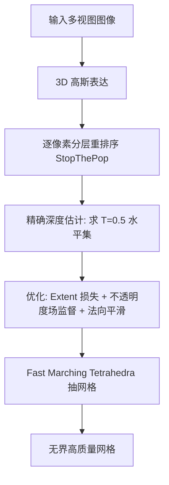

## 一句话总结

SOF 通过逐像素分层重排序、更精确的深度估计、面向不透明度场的正则损失，以及并行化的 Marching Tetrahedra，从 3D 高斯中快速提取高质量的无界场景网格，优化提速 3 倍以上、抽网格提速最多约一个数量级，同时重建精度优于 Gaussian Opacity Fields。

## 研究背景

3D 高斯泼溅（3DGS）凭借显式表达实现了实时渲染与快速优化，但从高斯点云中提取精确表面，尤其是在大规模无界场景中，仍然困难。多数方法依赖 TSDF 融合，只能较好地重建前景物体；针对无界场景的方法如 Binary Opacity Grids 需要密集采样并配合昂贵的网格简化。

Gaussian Opacity Fields（GOF）大幅加速了无界表面重建：它先从 3D 高斯建立不透明度场，再抽取其 0.5 水平集作为表面。理想情况下深度应与该水平集重合，但作者发现二者严重偏离。根本原因有两点：一是 3DGS 采用基于视空间 $$z$$ 深度的全局排序，等价于假设所有高斯朝向一致，从而产生不准确的深度；二是 GOF 的深度估计过于粗糙，总把深度放在高斯的最大贡献点上，导致对深度的系统性高估。此外，GOF 对大型室外场景的处理耗时仍超过一小时。SOF 正是为解决这些问题而提出。

## 方法

### 整体框架

SOF 在 GOF 基础上，从"排序—深度—损失—抽网格"四个环节做系统性改进：用 StopThePop 的分层重排序替换全局排序以获得稳健深度；推导与 0.5 水平集精确对齐的深度公式；引入 extent 损失、直接不透明度场监督与法向平滑损失；最后重写并行化的 Marching Tetrahedra。

### 关键设计

1. 分层重排序 + 精确深度。沿视线 $$r(t)=o+td$$ 按每个高斯的最大贡献点重排序，避免全局排序假设"朝向一致"带来的深度错误。进一步，不再简单取最大贡献点，而是求透射率 $$T_i$$ 恰好降到 0.5 的位置：解 $$T_i\lvert 1-o_i G^{1D}_i(t^{*}_r)\rvert=0.5$$ 得到闭式深度 $$t^{*}_r$$，使深度与不透明度场的 0.5 水平集精确对齐（在无重叠且排序正确的假设下成立）。

2. 自适应 Extent 损失。distortion 损失对高斯沿视线方向的尺度不敏感，可能被两个方差差异极大的高斯"欺骗"。SOF 将高斯的均值与最小贡献点映射到 NDC 空间并惩罚其延展 $$L_{ext}$$，从而鼓励前景高斯变扁平以贴合表面，同时允许背景高斯更大、更各向同性，以支撑无界背景网格。

3. 直接不透明度场监督。抽网格时用的是 0.5 水平集，但优化阶段通常不对该场直接监督。SOF 增加 $$L_{opa}=\lvert O_N(o+t^{*}_r d)-0.5\rvert^2$$，强制深度处的不透明度贴近 0.5；并用一种单遍累加加二次轻量遍的方式高效计算 $$O_N$$，避免朴素两遍法的开销。

4. 快速 Marching Tetrahedra。将点直接映射到 tile 而非像素，用 [tile_id, depth] 键排序保证每个 block 负载均衡；采用基于不透明度的自适应包围 $$E_i=\sqrt{2\ln(255\,o_i)}$$，剔除 $$o_i<\tfrac{1}{255}$$ 的不可见高斯；并利用"评估式 (12) 与排序无关"的性质做提前停止（$$O_N(x)>0.5$$ 即停）。综合使抽网格提速最多约 10 倍。

## 实验结果

在 Tanks & Temples 数据集上评估无界网格的 F1-score（越高越好），SOF 在所有基于 3DGS 的方法中取得最佳重建质量，且优化时间很短。带 † 的数据引自 GOF。

| Method | Barn | Caterp | Courth | Ignatius | Meetingr | Truck | Avg | Time |
|---|---|---|---|---|---|---|---|---|
| NA† | 0.70 | 0.36 | 0.28 | 0.89 | 0.32 | 0.48 | 0.50 | >24h |
| 3DGS† | 0.13 | 0.08 | 0.09 | 0.04 | 0.01 | 0.19 | 0.09 | 14.3m |
| 2DGS† | 0.36 | 0.23 | 0.13 | 0.44 | 0.16 | 0.26 | 0.30 | 15.5m |
| GOF† | 0.51 | 0.41 | 0.28 | 0.68 | 0.28 | 0.59 | 0.46 | 24.2m |
| Ours | 0.54 | 0.41 | 0.30 | 0.74 | 0.31 | 0.56 | 0.47 | 16.7m |

在 Barn、Ignatius 等场景上，SOF 相较 GOF 提升显著；在有真值的 DTU（有界场景，Chamfer 距离越低越好）上 SOF 与 GOF 持平（均值 0.74）。总处理时间（优化 + 抽网格）相比 GOF 减少 3 倍以上。

## 亮点与局限

亮点：
- 系统性诊断了 3DGS 表面重建中"排序错误导致深度不准"这一根因，并给出与水平集精确对齐的闭式深度。
- extent 损失巧妙区分前景/背景，兼顾表面贴合度与无界背景所需的大尺度高斯。
- 并行化 Marching Tetrahedra 带来接近一个数量级的抽网格加速，工程价值高。

局限：
- 精确深度公式依赖"高斯无重叠、排序正确"的假设，实际中该假设被违反，作者承认只是经验上更优。
- 在 Mip-NeRF 360 室内场景的新视图合成指标略低于 GOF，源于逐像素排序抑制了用几何"伪造"视角相关效果的能力。
- 有界场景（DTU）相较 GOF 未见明显质量优势，改进主要体现在无界场景与速度上。

## 延伸思考

SOF 揭示了一个通用启示：当渲染与几何抽取共用同一表达时，二者的一致性（此处即深度与水平集对齐）往往比单点精度更关键，值得在优化阶段显式监督。其"前景扁平、背景各向同性"的自适应正则思路，或可推广到其他需要同时兼顾近景细节与远景覆盖的表达上。此外，把评估顺序无关性转化为提前停止的加速手段，提示在 3DGS 类管线中重新审视"必须严格排序"的假设可能带来进一步的性能空间。将其精确深度公式扩展到显式建模重叠高斯，或与 MCMC 密度控制结合以兼顾图像质量，都是自然的后续方向。
