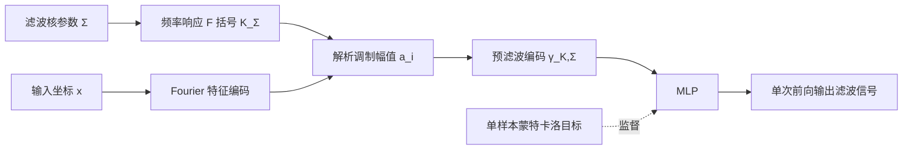

## 一句话总结

本文提出一种训练神经场的方法，让网络在单次前向传播中就能输出被任意对称低通滤波核预滤波后的信号；核心是把卷积搬到输入域，用滤波核的频率响应解析地缩放 Fourier 特征编码的幅值，再配合单样本蒙特卡洛估计进行监督。

## 研究背景

神经场（neural fields）已经广泛用于视觉计算，它把输入坐标（如像素位置）映射到信号值（如辐射亮度），本质上给出的是逐点估计。这带来一个问题：直接对神经场做上采样或下采样会产生采样瑕疵，无法支持 mipmapping 这类需要多尺度、抗锯齿的应用。

已有的分辨率感知神经场方法主要有两条路线，但都有明显局限。第一类通过后处理（post-filtering）来滤波，要么用求积（cubature）离散化，内存与计算开销大；要么用蒙特卡洛采样，噪声过大。第二类把滤波"烘焙"进数据集或网络架构，例如 BACON、MINER 直接改网络结构以支持 box/Gaussian 滤波，但在滤波空间上不连续；Mip-NeRF 系列面向辐射场抗锯齿，但无法在测试时切换滤波方式；与本文最接近的 NGSSF 用尺度条件 MLP 学习各向异性高斯尺度空间，却只限于高斯滤波，还依赖 Lipschitz 正则和一个额外的标定阶段。

作者的关键观察是：如果选用一种"卷积可解析求解"的输入编码，就能把滤波从昂贵的运行时积分转化为对编码系数的闭式调制。基于此，本文贡献两点：其一，提出用 Fourier 特征编码实现神经场的解析预滤波；其二，提出一套预滤波神经场的训练机制，能泛化到多种线性对称卷积滤波核。

## 方法

### 整体框架

给定一个对称核 $$K_\Sigma$$，方法分两步：先对 Fourier 特征做闭式预滤波，再把预滤波后的特征送入 MLP 预测滤波信号；训练时用被滤波信号的单样本蒙特卡洛估计作为监督目标。测试时同一个模型即可支持任意协方差 $$\Sigma$$（各向同性或各向异性）以及训练时未见过的滤波核（如 Box、Lanczos）。

### 关键设计

1. 输入域的闭式卷积。随机 Fourier 特征的每个分量都是频率 $$b_i$$ 处的正弦波，其频谱是 $$\pm b_i$$ 处的一对冲激。由卷积定理，对称核的频率响应 $$\mathcal{F}\lbrace K_\Sigma\rbrace$$ 实且偶，因此与核卷积只是把每对 cos/sin 分量按该频率处的幅值缩放，无相位改变。据此直接令 Fourier 特征幅值 $$a_i(K_\Sigma)=\mathcal{F}\lbrace K_\Sigma\rbrace(b_i)$$，卷积即精确成立。

2. 跨滤波族的泛化。论文给出了 Gaussian、Box（含贝塞尔函数 $$J_{n/2}$$）、Lanczos 三种核的闭式幅值表达式，并用 Mahalanobis 距离 $$\lVert x\rVert_\Sigma=\sqrt{x^\top\Sigma^{-1}x}$$ 把一维核推广到各向异性 $$n$$ 维核。只用一种核（如高斯）监督训练，模型就能自然泛化到其他未见的低通核。

3. 单样本蒙特卡洛训练。对卷积积分做无偏蒙特卡洛估计，采样密度取正比于 $$\lvert K_\Sigma\rvert$$。作者发现每步只用单个样本（$$N=1$$）即可，配合 Adam 优化器和指数学习率衰减来平均掉目标噪声，训练几乎不增加额外开销。频率调制后的 Fourier 编码还能抑制蒙特卡洛噪声，因为它把更新偏向低频内容。

4. 少约束的架构。除 Fourier 特征编码外不对网络施加额外约束，默认沿用 NGSSF 的三层、宽度 1024 的 MLP；相比 NGSSF 去掉 Lipschitz 约束，重构与滤波质量都更好。

## 实验结果

在 100 张 2048×2048 的 Adobe FiveK 图像上评测各向同性高斯滤波，与能在尺度空间连续操作的 NFC、NGSSF 以及离散尺度架构 BACON/MINER/INSP 对比（PSNR 单位 dB，↑越大越好）：

| 方法 | σ²-连续 | σ²=0 PSNR | σ²=10⁻³ PSNR | σ²=10⁻² PSNR | σ²=10⁻¹ PSNR |
|------|:---:|:---:|:---:|:---:|:---:|
| BACON | ✗ | 32.89 | 36.48 | 30.59 | 25.36 |
| MINER | ✗ | 41.19 | 36.99 | 25.89 | 24.38 |
| INSP | ✗ | 30.57 | 23.77 | 20.75 | 23.37 |
| NFC | ✓ | 20.75 | 36.05 | 39.74 | 41.06 |
| NGSSF | ✓ | 33.85 | 34.74 | 35.06 | 34.99 |
| Ours | ✓ | 38.23 | 48.91 | 53.09 | 53.81 |

在各非零模糊尺度上，本方法相较最相关的连续尺度基线（NFC、NGSSF）PSNR 提升约 +4.9 到 +13.4 dB；仅在表示原始未滤波信号（σ²=0）时 MINER 略高，但它缺乏在尺度空间上的连续控制。各向异性高斯滤波下，本方法比 NGSSF 高 +14.5 dB（49.33 对 34.82）。SDF 滤波上也在非零模糊尺度取得最低 Chamfer 距离与最高 IoU。

## 亮点与局限

亮点：把滤波转化为对 Fourier 特征幅值的解析调制，数学上干净、单次前向即可输出预滤波结果；只用一种核训练即可泛化到 Box、Lanczos 等未见核，并支持连续、各向异性的滤波控制；对网络架构几乎无约束，可直接搭配 ReLU 或 SIREN 式激活；去掉 Lipschitz 约束后训练前反向加优化一步的耗时从 130ms 降到 80ms，减少约 38.5%。

局限：与所有基于 MLP 的神经场一样，单样本评估成本高于哈希网格、体素网格等离散表示，推理约 1.8s，慢于 MINER 的 0.1s，在实时或延迟敏感场景受限；方法依赖滤波核的 Fourier 变换实且偶，只适用于对称滤波核，非对称核引入的相位偏移无法被当前编码捕捉；SDF 上因蒙特卡洛方差较高，仍会残留细尺度瑕疵。

## 延伸思考

把卷积从信号域迁移到编码域、并借助解析频率响应实现"训练一种、泛化多种"的思路，本质上是在编码层暴露了信号的频谱表示，这对 mipmapping、纹理抗锯齿、几何多分辨率编辑都很有吸引力。一个自然的延伸是把该编码扩展到神经辐射场，让体密度等内部信号也能被正确、可控地滤波，这正是 Mip-NeRF 系列尚未充分回答的问题。另一方向是突破"仅对称核"的限制：若能引入相位建模来支持非对称核，或结合重要性采样降低 SDF 上的蒙特卡洛方差，方法的适用面和稳健性都会进一步提升。
