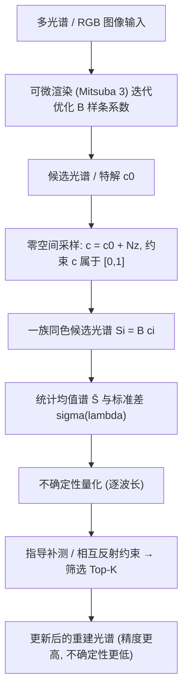

## 一句话总结

本文用可微渲染从多光谱／RGB 图像反演材质反射光谱，并提出一种基于零空间（null-space）采样的光谱上采样框架，为这一本征病态的反问题生成一族「颜色相同但形状各异」的候选光谱，从而量化逐波长的重建不确定性，并据此指导补测以显著提升重建精度。

## 研究背景

光谱信息在遥感、文化遗产分析、食品检测和材质外观建模等领域都至关重要。获取真实材质光谱通常依赖高光谱成像（HSI），但设备昂贵、采集缓慢、标定复杂。计算机视觉领域近年流行从 RGB 图像推断光谱，分为基于先验和基于深度学习两类，但它们都只在图像层面工作，把光照与材质外观纠缠在一起，缺乏物理可解释性，也没有正确处理全局光照。

作者转而用可微渲染来做光谱重建：作为物理化的框架，它天然考虑几何与全局光照，能联合重建形状、材质和场景参数，且相互反射（interreflection）本身还能帮助消解光谱的歧义。但核心难点在于，从多波段观测反演完整光谱是本征病态的——同一组多波段观测可对应无穷多光谱解（即同色异谱 metamerism 现象）。现有可微渲染框架只输出单一估计，即便有全局光照约束也可能明显偏离真值。为此，作者提出零空间采样方法，生成一族合理光谱，实现不确定性量化并指导补充测量。

## 方法

### 整体框架

给定 $$K$$ 波段成像系统，第 $$i$$ 个波段响应为 $$v_i=\int_\Lambda S(\lambda)M_i(\lambda)\,d\lambda$$，其中 $$M_i$$ 是波段敏感度函数，RGB 情形下 $$K=3$$、$$\Lambda$$ 取可见光 400–700nm。反射光谱用 B 样条表示 $$S(\lambda)=\sum_{j=1}^{N}c_j B_j(\lambda)$$，其单位分解（partition of unity）性质保证只要系数 $$c_j\in[0,1]$$ 就能得到物理合理、值域落在 $$[0,1]$$ 的光谱。流程是：先用可微渲染迭代求出一个候选光谱系数，再在零空间中采样出一族同色光谱，统计均值与标准差以量化不确定性，最后按补测信息或相互反射约束筛选出更优候选。

### 关键设计

- **零空间采样量化不确定性**：把光谱积分写成矩阵形式 $$\mathbf{y}=\mathbf{MBc}=\mathbf{Ac}$$。给定可微渲染得到的多波段值 $$\mathbf{y}^*$$，欠定系统的全部同色解可写为 $$\mathbf{c}=\mathbf{c}_0+\mathbf{Nz}$$，其中 $$\mathbf{N}$$ 张成 $$\mathbf{A}$$ 的零空间、$$\mathbf{z}$$ 为自由参数。算法逐维计算令 $$\mathbf{c}\in[0,1]^N$$ 成立的合法区间，在其中均匀采样并过滤越界样本，再对约 1000 个（实验中 30k–80k 有效样本）样本谱求均值 $$\bar{\mathbf{S}}(\lambda)$$ 与标准差 $$\sigma(\lambda)$$，后者即逐波长的重建不确定性度量。

- **由不确定性指导补测**：不确定性在波长两端（400nm、700nm，敏感度函数低）通常最高。作者在这些点引入单波长补充测量，用损失 $$L=\sum_i\lVert S(\lambda_i)-S^*(\lambda_i)\rVert^2$$ 对样本排序、保留最匹配的 Top-K 候选，使均值谱显著更接近真值、不确定性大幅下降。

- **相互反射与光源光谱增强**：已知光源光谱 $$L(\lambda)$$ 时把它并入投影矩阵 $$\mathbf{M}$$；进一步用相互反射下的多光谱响应定义损失 $$L=\sum_i\lVert \mathbf{y}-\mathbf{y}_i^*\rVert^2$$ 来筛选候选，使采样谱能保留物体自反射／物体间相互反射效应，均值谱更贴近真值。

- **自适应基细化**：真实光谱的高阶变化幅度远小于低阶成分，直接增大 B 样条系数数量会加重病态、抬高不确定性。作者先用粗基估计主结构，再通过伪逆把粗解「提升」到细基 $$\mathbf{c}_{f0}=\mathbf{Tc}_c$$（$$\mathbf{T}=\mathbf{B}_f^\dagger \mathbf{B}_c$$），并在残差子空间上构造受限零空间只采样残差自由度，效果优于直接在细基上采样。

## 实验结果

作者先验证 B 样条能拟合 Kremer 颜料与 EcoSIS 植被等真实光谱，再在 Mitsuba 3 合成场景（单光谱、联合形状-光谱、含相互反射的 Cornell Box）上重建，最后用真实拍摄的 Cornell Box 物理实验（Valspar 涂料、ASD 光谱辐射计测真值、Sony a7 II 相机拟合敏感度函数）验证。下表为 teaser 中花丝（filigree）样例上与图像法（NTIRE 2022 光谱重建挑战赛冠军方法）的定量对比：

| 方法 | 平均光谱误差 ↓ | 统计样本数 |
| --- | --- | --- |
| 图像法 [Cai et al. 2022] | 0.4033 | 11k 条光谱 |
| 本文方法 | 0.0810 | 90k 条光谱 |

本文误差约为图像法的五分之一。作者指出图像法不区分光照与材质，即使在最有利的白光设定下仍明显偏离真值。另外在 Cornell Box 橙盒的暴力法对比中：逐波长独立优化的暴力法虽精度略高，但在 RTX 4090 上需 8.7 分钟，是本文基于 B 样条方法（1.2 分钟）的 7.1 倍，而零空间采样步骤本身仅需 0.001 秒。含相互反射的实验进一步表明，开启全局光照后可微渲染反演更准，采样均值谱也更贴近真值；物理实验中绿墙重建的均值谱在波长内区间明显优于纯反演结果，凸显了在真实（存在测量误差）场景下做不确定性量化的重要性。

## 亮点与局限

**亮点**

- 把可微渲染引入光谱重建，物理化地纳入 3D 几何与全局光照，用相互反射消解歧义，比只在 2D 图像层面工作的视觉方法更具物理可解释性。
- 用通用零空间采样刻画同色异谱的完整解空间，能量化逐波长不确定性；相比最接近的 Belcour 等人（2023）贪心逐系数采样（系数达 7 个以上常无有效解、且仅限 RGB），本文支持一般多光谱输入且不易失败。
- 兼具实用价值：相比高光谱成像免去复杂采集，相比暴力逐波长优化提速约 7 倍，还能用于光谱上采样／材质创作，从单张 RGB 生成多样且物理合理的光谱。

**局限**

- 方法目前作为逆渲染之后的后处理步骤，上采样假设可微渲染得到的光谱在 RGB 上是忠实的，反演误差会传播进上采样结果。
- 需要预先假定合适的 B 样条系数个数；已知该数目能提升精度、降低不确定性，但当前未自动确定。
- 主要面向平滑光谱，对非平滑光谱、光照光谱重建等尚未处理。

## 延伸思考

这项工作最有意思的一点，是把「病态反问题只给一个解」转变为「显式刻画整个解空间并量化不确定性，再用最小代价的补测去坍缩它」——把重建与主动测量规划连成闭环，这种思路对任何欠定的外观/材质获取问题都有借鉴意义。作者也指出，当前均值谱精度受限于逆渲染在 RGB 上的忠实度，且采样是渲染后的独立后处理；若能把零空间探索直接嵌入可微渲染优化过程，让「多解探索」在优化中原生进行，可能比事后采样更有原则性，也更能利用几何与光照约束主动收窄解空间。此外，如何自动推断所需系数数量、把方法推广到荧光等非平滑光谱与未知光源光谱，都是决定其能否走向通用光谱采集工具的关键。
