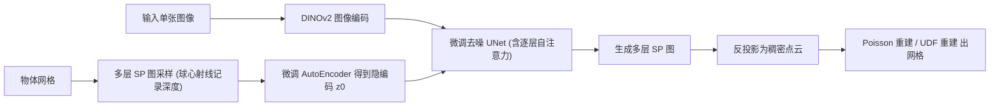

## 一句话总结

SPGen 把 3D 物体的表面几何投影到包围球上、再展开成紧凑的多层二维「球面投影图（Spherical Projection, SP）」，从而完全在图像域内微调预训练的扩散模型，实现从单张图像秒级生成视角一致、拓扑灵活的高质量 3D 网格。

## 研究背景

从单张图像生成高质量 3D 资产在 AR/VR、机器人、工业设计等场景需求旺盛。现有方法按中间表示大致分两类，各有明显短板：

- 几何表示类方法（点云、SDF、显式网格面）直接用扩散模型或大重建模型合成 3D 结构，但受限于 3D 数据的稀缺与噪声，且需要复杂预处理（如自回归方法限制面数、SDF 方法要求水密物体），难以规模化。
- 图像表示类方法借助强大的二维预训练先验来记录几何，但各自有缺陷：多视角图像缺乏严格的视角一致性与几何连贯性；几何图与 UV 图集依赖非唯一的切割与映射，带来大量边界缝合负担、难以规模化训练；而简单的单层球面投影又存在严重的自遮挡问题。

作者的目标是找到一个「单射」的几何投影表示，既能像图像一样直接复用二维扩散先验，又能天然保证视角一致，还能表达复杂内部结构与非平凡拓扑。

## 方法

### 整体框架

SPGen 的核心是把物体归一化后放入单位球，从球心沿径向发射光线，记录光线与表面交点的深度 $$d = \lVert P \rVert_2$$，用等距圆柱投影 $$F(P): \mathbb{R}^3 \to \mathbb{R}^2$$ 把三维点映射到以方位角 $$\theta$$ 和极角 $$\varphi$$ 参数化的二维 SP 图上。对每条光线记录多个交点、由外向内依次存入多层 SP 图，从而同时解决自遮挡并表达内部嵌套结构。随后先微调图像 AutoEncoder 得到紧凑隐空间，再微调隐空间扩散模型（基于 SDXL）生成多层 SP 图，最后反投影为点云并重建网格。

### 关键设计

- **多层球面投影表示**：合法像素到表面点的映射是单射函数，天然编码 360 度几何、消除视角冲突（一致性）；多层结构可直接重建水密面、开放面以及分层内部结构（灵活性）；作为结构化二维表示可直接继承 SDXL 等预训练扩散先验并低成本微调（高效性）。实验中 Objaverse 用 4 层、分辨率 256 × 512，DeepFashion3D 用 3 层。

- **逐层自注意力（Layer-wise Self-Attention, LSA）**：把 UNet 各层对应的中间隐状态 $$\{m_1, \dots, m_k\}$$ 展平后沿空间维拼接为 $$\bar{m}$$，再做标准自注意力 $$\mathrm{Attention}(Q,K,V) = \mathrm{softmax}\!\left(\frac{QK^{T}}{\sqrt{C_a}}\right) V$$，从而约束多层之间的相对空间位置，避免自相交与漂浮伪影。

- **几何正则化**：作者观察到重建误差主要集中在 SP 图边界（图像高频分量）。为此提出两项正则：其一是用 Sobel 加膨胀提取硬边界掩码 $$B$$，对边界像素施加更大惩罚 $$L_{edge} = \mathbb{E}_M[\mu B \cdot \lVert M - \Psi(M)\rVert + (1-\mu)(1-B)\cdot \lVert M - \Psi(M)\rVert]$$；其二是在频域用高通滤波 $$H$$ 分别惩罚相位与幅度差异 $$L_{spec} = \mathbb{E}_M[H\cdot\lVert \mathrm{Arg}(M_s) - \mathrm{Arg}(\tilde{M}_s)\rVert + \zeta H\cdot\lVert \lVert M_s\rVert_2 - \lVert \tilde{M}_s\rVert_2\rVert]$$，显著降低表面噪声、锐化几何轮廓。

- **表面提取**：水密物体训练轻量 3D-UNet 估计点云法向后做 Poisson 重建；开放面则沿用 SurfD 的点云到 UDF 自编码器预测无符号距离场，再用 MeshUDF 提取隐式面。整个重建过程快速且低成本。

## 实验结果

在 Google Scanned Objects（GSO）数据集上与多类单图 3D 生成 SOTA 方法对比，采用 Chamfer Distance、Volume IoU 与 F-Score（阈值 0.1）衡量几何质量，并报告推理延迟。SPGen 在全部指标上大幅领先，同时保持秒级速度。

| 方法 | 延迟 | CD ↓ | Vol. IoU ↑ | F-Score (%) ↑ |
| --- | --- | --- | --- | --- |
| Point-E | ~25s | 0.0690 | 0.1953 | 52.23 |
| Shape-E | ~20s | 0.0418 | 0.2785 | 64.83 |
| Wonder3D | ~10min | 0.0398 | 0.2930 | 68.82 |
| CRM | ~18s | 0.0264 | 0.3374 | 74.43 |
| OpenLRM | ~15s | 0.0344 | 0.3770 | 71.50 |
| LGM | ~40s | 0.0212 | 0.4220 | 78.41 |
| InstantMesh | ~35s | 0.0120 | 0.4310 | 88.84 |
| Ours | 6-10s | 0.0051 | 0.5407 | 95.57 |

在 DeepFashion3D 开放面数据集上，SPGen（RGB 或 sketch 条件）也优于 Wonder3D、OpenLRM、LGM、InstantMesh 及 SurfD。消融实验表明逐层自注意力、微调 AutoEncoder 与微调 UNet 三者缺一不可：去掉任一项都会使 CD 显著恶化（如去掉 UNet 微调后 CD 从 0.0051 升至 0.1742）。与 Matryoshka、UV Mapping 的表示能力对比中，SP 图在各分辨率下都以更小的存储实现更低的重建误差。整个微调仅需两块 48 GB 显存 GPU 约七天，训练开销明显低于以往工作。

## 亮点与局限

**亮点**

- 提出单射的多层球面投影表示，一举兼顾视角一致性、拓扑灵活性（水密面/开放面/内部结构）与图像域高效性，绕开了多视角图像的一致性难题与几何图/UV 图集的边界缝合负担。
- 完全在图像域微调 SDXL，直接继承二维扩散先验的局部性、语义、隐式对称与重复模式，训练开销远低于同类方法却取得 SOTA。
- 针对 SP 图误差集中于高频边界的现象，设计了空间边界掩码与频域高通两项几何正则，切实提升几何锐度与表面质量。

**局限**

- SP 图层数是经验设定（Objaverse 4 层、DeepFashion3D 3 层），对交点数超过层数上限的极端复杂内部结构可能覆盖不全。
- 依赖球心射线投影，对相对球心呈现极度凹陷或细长枝干的几何，采样可能不足。
- 生成质量与分辨率受限于二维 SP 图分辨率（256 × 512），更精细的表面细节仍受此瓶颈约束。

## 延伸思考

SPGen 最具启发性的地方在于「把 3D 生成问题转化为一张结构良好的二维图，从而最大化复用二维扩散先验」。这条思路的价值不只在于省算力，更在于让 3D 生成能随着二维基础模型的进步而水涨船高。值得进一步思考的是：球面投影的单射性建立在「从球心可见」的假设上，如何为高度非星形（non-star-shaped）的复杂几何设计自适应的多中心或可变形投影，将决定该表示的适用边界。此外，误差集中于高频边界的发现具有普适性，频域正则或许可以迁移到其他基于深度图/几何图的生成任务中，作为提升几何锐度的通用手段。
