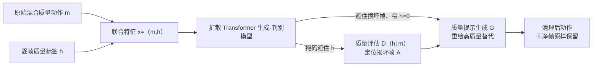

## 一句话总结

StableMotion 提出用"帧级质量指示变量 + 扩散式生成-判别模型"的方式，直接在含瑕疵、无需成对干净数据的原始动捕数据上训练动作清理模型，训练完成后既能识别损坏帧、又能就地重绘出高质量替代动作。

## 研究背景

- 领域现状：数据驱动的动作清理（motion cleanup）能自动修复动捕数据里的抖动、穿模、冻帧等瑕疵，是动画工业与大规模动作数据集构建的关键环节。
- 核心痛点：主流方法依赖"成对的损坏—干净"数据做监督训练。而构造这种成对数据要么需要人工清理原始数据（昂贵费时），要么在已清理数据上人工合成瑕疵（难以真实还原现实伪影）。在体育等领域特定的大规模场景下，人工清理成本极高；直接丢弃损坏片段又会把序列切碎（如 SoccerMocap 平均只剩约 1.5 秒的片段），破坏长时程动作的时序连贯性。图像域已有"从损坏数据直接学习"的方法，但它们假设已知噪声分布（如高斯、椒盐噪声），这类假设在动作数据上几乎不成立。
- 本文 idea：借鉴离线强化学习中"用次优数据也能超越只用专家数据的行为克隆"的观察，引入类似"状态级奖励"的帧级质量指示变量 QualVar；把混合质量的原始数据全部拿来训练一个既能评估质量、又能按指定质量生成动作的统一模型，测试时通过"质量提示"就能生成干净动作。

## 方法

整体框架：StableMotion 把动作清理拆成两件事——判别（逐帧评估质量）与生成（按目标质量重绘），并用一个基于扩散 Transformer 的统一模型、一个简单的掩码修补（inpainting）目标同时训练二者。训练输入是原始动作序列 $$m_{1:N}$$ 及其逐帧质量标签 $$h_{1:N}$$（损坏帧 $$h_i=1$$、干净帧 $$h_i=0$$），模型把动作与 QualVar 拼成联合特征 $$x_t=(m,h)_t$$ 一起去噪。测试时通过不同的修补掩码，同一模型既可当质量评估器 $$D(h \mid m)$$，也可当条件生成器 $$G(m_{i\in A} \mid m_{i\in B}, h_{1:N})$$。

关键设计（2~4 点）：

1. 质量指示变量 QualVar 与质量感知修补。把 1 维质量标签并入每帧特征，让扩散模型能显式表征并控制生成质量。训练时随机采用两种掩码模式：一是"动作评估"（给定动作 $$m_{1:N}$$ 推断全部 $$h_{1:N}$$），二是"动作生成"（给定观测帧与逐帧目标质量，重绘缺失帧）。二者用同一套掩码修补目标实现，得到一个统一的质量感知模型。推理清理时先用评估器找出损坏帧集合 $$A$$，再把这些帧连同其 QualVar 一起遮掉、令目标 $$h\leftarrow 0$$，让模型只在损坏帧处生成高质量动作，干净帧保持不变。

2. 自适应清理（Adaptive Cleanup）。标准扩散采样从 $$x_T$$ 的纯高斯噪声起步，会抹掉损坏帧里仍有用的原始信息。作者用蒙特卡洛多次采样 $$\hat{h}_i$$ 估计"软质量标签" $$\bar{h}_i\approx \mathbb{E}[\hat{h}_i]$$ 来衡量每帧的损坏程度，再据此为每帧选择不同的起始去噪步 $$t^i_{\text{soft}}$$：轻微瑕疵（$$\bar{h}_i$$ 低）从较晚的去噪步起步以保留更多原始信息，严重瑕疵从更早的步起步以彻底去除伪影。调度公式为 $$t^i_{\text{soft}} = T\sin\!\big(\tfrac{\pi}{2}\min(1,\,2\bar{h}_i-1)+\tau\big)$$（当 $$\bar{h}_i\ge\tau$$，否则为 0），阈值 $$\tau=0.5$$。

3. 质量感知集成（Quality-Aware Ensemble）。利用扩散模型采样的多样性：对同一输入跑多次"评估+修补"得到多个候选（默认 5 个），再用评估器 $$D(h \mid m)$$ 给每个候选打质量分（逐帧 $$h$$ 求和），挑质量最高的候选输出。相比直接平均（会破坏动作自然动态），这种"生成-判别"式择优更稳。多候选可批量并行推理，几乎不增加实际耗时。

4. 表征与网络。采用相对首帧规范化的全局动作表征（全局根平移、朝向、局部关节旋转与位置、全局脚部位置与速度、全局根速度），以便局部化修改、保护未损坏帧；SoccerMocap 上每帧 244 维再加 1 维 QualVar。骨干是扩散 Transformer（DiT），用自适应归一化注入扩散步与类别标签、用旋转位置编码（RoPE）捕捉帧间相对时序。

## 实验结果

在真实生产数据集 SoccerMocap（约 245 小时足球动捕，含真实采集伪影）上，用专有瑕疵检测算法评估清理前后质量。StableMotion 在多数指标上优于各基线与消融版本：

| 方法 | FS Dist ↓ | Pops Rate ↓ | Frozen Rate ↓ | Jittering ↓ |
|------|-----------|-------------|---------------|-------------|
| Input（原始） | 2.39 | 0.41 % | 23.86 % | 8.94 |
| XClean（示例式） | 2.86 | 0.35 % | 23.07 % | 15.18 |
| ConvAE-B | 9.54 | 47.46 % | 5.07 % | 104.44 |
| CondMDI-B | 3.25 | 18.21 % | 4.64 % | 22.09 |
| w/o QualVar | 3.76 | 1.91 % | 6.43 % | 9.85 |
| w/ Filtered | 2.96 | 0.23 % | 4.43 % | 14.67 |
| StableMotion | 2.14 | 0.13 % | 4.50 % | 8.68 |

相对原始输入，动作 pops 与冻帧分别减少约 68% 与 81%；对需要人工标注的细微瑕疵（HAA），质量评估的召回率达 81.54%。消融显示：只用过滤后的干净片段训练（w/ Filtered）会因时序断裂损失质量；不用 QualVar 直接在混合数据上训练（w/o QualVar）反而会放大伪影——说明质量指示变量是充分利用原始数据的关键。

在受控基准 BrokenAMASS（对 AMASS 注入抖动、漂移、过平滑等合成瑕疵）上，StableMotion 只用无配对损坏数据训练，仍在 Jitter、Accel、GMPJPE、M2M R@3 等指标上超过用干净或成对数据训练的 CondMDI、RoHM 等 SOTA；相比用成对数据训练的 RoHM，脚滑距离降约 16%、加速度误差降约 40%、全局关节位置误差降约 68%，语义保持相当。在真实野外数据集 PopDanceSet（网络视频姿态估计得到的舞蹈动作）上同样有效降低抖动与脚部穿插并保持内容。

## 亮点与局限

- 亮点：
  - 直接在原始、混合质量、无配对数据上训练清理模型，绕开了昂贵的成对数据构造，且不需要假设噪声分布，对现实动捕伪影更实用。
  - "生成-判别"统一模型一举两得：既能定位损坏帧，又能就地重绘，框架简洁（一个掩码修补目标）。
  - 自适应清理与质量感知集成两个测试时技巧，在保内容与保稳定之间做了很好的折中，且集成可并行、几乎不增耗时。
  - 在真实 245 小时生产数据上验证，展示了工业可用性（原本动画师要数十分钟到数小时修的瑕疵可秒级自动修复）。

- 局限：
  - 修补过程在某些场景会较大改动动作内容；对精度要求更高的应用（如灵巧操作），可能需引入测试时分类器引导来更好保内容。
  - 仍依赖质量标签训练，标注需要一定人工投入（尽管文中显示只标注小部分数据也可训出有效模型）。
  - 依赖启发式/人工的瑕疵标注质量；更自动、更准确的瑕疵识别有待发展。

## 延伸思考

- 核心思想"把质量当成可提示的条件变量、用混合质量数据统一训练"与文本图像模型的"质量提示词"、离线 RL 的"回报条件生成"一脉相承，可能迁移到其他脏数据充斥的生成任务（如视频、音频修复）。
- "生成-判别"合一使模型自带打分器，天然支持自集成择优，这种自评思路在缺乏外部判别器/奖励模型时很有借鉴价值。
- 未来若能把质量标注也自动化（用无监督/自监督的瑕疵检测替代启发式与人工），框架的适用域会大幅扩展；同时如何在"彻底去伪影"与"忠实保内容"之间做更细粒度的可控权衡，是值得深入的方向。
