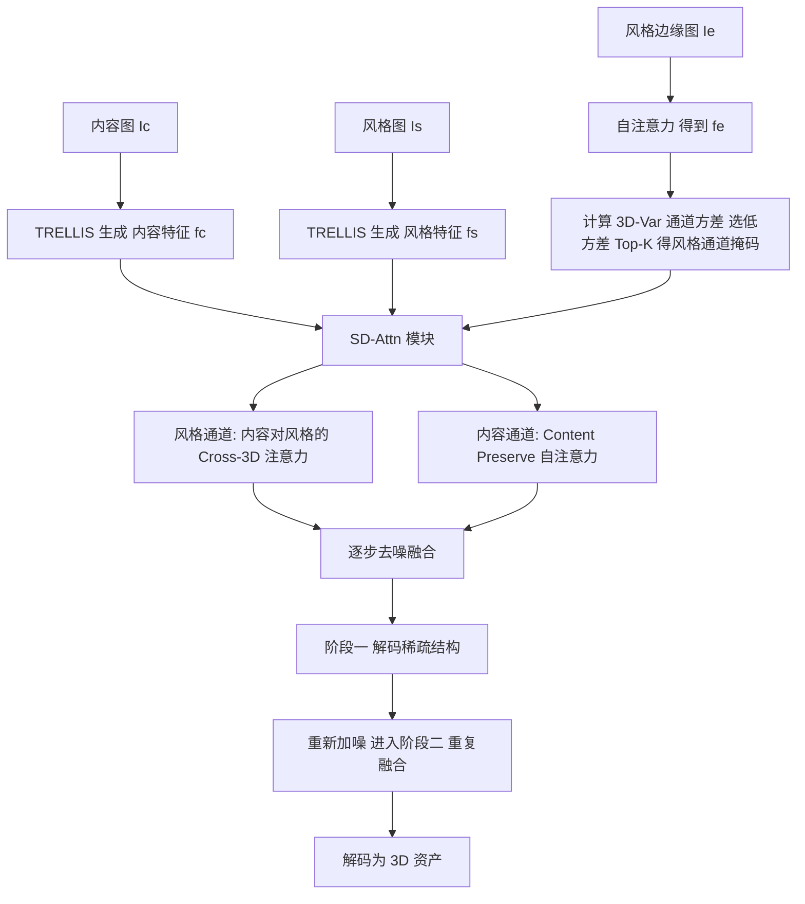

## 一句话总结

StyleSculptor 提出首个无需训练的零样本方法，在预训练 3D 生成模型的隐空间中通过风格解耦注意力与风格引导控制，从内容图与参考风格图同时迁移纹理与几何风格，生成风格可控的 3D 资产。

## 研究背景

在游戏与虚拟现实等实际场景中，新生成的 3D 资产往往需要与已有资产保持风格一致，既包括纹理风格，也包括几何风格（如体素化、像素艺术、网格结构等）。现有大规模 3D 生成模型（如 TRELLIS、Hunyuan3D）虽能从文本或图像生成高质量 3D 资产，却无法在生成过程中控制纹理与几何风格。

现有的两阶段做法都存在缺陷：

- 先迁移后生成（Transfer-then-Generate）：先对输入图做 2D 风格迁移再生成 3D。2D 迁移只处理平面特征，容易扭曲图像的 3D 结构与布局，导致语义失真、重建困难。
- 先生成后迁移（Generate-then-Transfer）：先生成 3D 资产再做 3D 风格迁移。这类方法通常只能修改纹理，为保持空间一致性而固定几何结构，无法迁移几何风格。

在生成过程中直接融合风格面临两大难题：一是内容与风格语义差异大时，简单特征融合会失效（语义冲突）；二是风格信息过度注入会破坏原资产语义（内容泄漏）。StyleSculptor 目标是在零样本条件下同时注入纹理与几何风格并规避这两个问题。

## 方法

整体框架基于预训练的 3D 整流流模型 TRELLIS。TRELLIS 用 DINOv2 提取条件特征，分两阶段生成：第一阶段用 Flow Transformer 生成稀疏结构，第二阶段用 Sparse Flow Transformer 在稀疏结构上生成细节隐特征。StyleSculptor 将两个阶段中所有自注意力层替换为风格解耦注意力（SD-Attn）模块，其余交叉注意力与前馈层保持不变，不修改任何主干参数。

给定内容图 $$I_c$$ 与一张或多张风格图 $$I_s$$，网络对内容与风格分别执行生成过程，取相同时间步 $$t$$ 的中间隐特征 $$f_c$$ 与 $$f_s$$，并借助风格图的边缘图 $$I_e$$ 提取的特征 $$f_e$$ 做通道筛选，将筛选出的风格信息注入内容分支，逐步融合，最终解码为风格一致、语义对齐的 3D 资产。两阶段共享相同初始噪声以保证特征分布一致。

关键设计：

1. **Cross-3D 注意力**：将自注意力替换为内容与风格中间特征之间的交叉注意力，用内容的 query 与风格的 key、value 计算 $$\text{Cross-Attention}(Q_c, K_s, V_s) = \text{softmax}\!\left(\frac{Q_c \cdot K_s^{T}}{\sqrt{d_k}}\right) V_s$$。这样在融合中保持特征分布不被破坏，即便内容与风格语义无关也能稳定迁移。

2. **风格解耦特征选择（SDFS）**：基于两个洞见——3D 特征通道可分为内容主导与风格主导通道；风格信息在空间上比内容更全局一致。因此用各通道跨 patch 的 3D 特征方差 $$\text{3D-Var}(C) = \frac{1}{N}\sum_{n=1}^{N}\left(f'_e(n,C) - \mu\right)^2$$ 作为统计量，方差小的通道视为风格主导。选取方差最小的 Top-$$K$$ 通道构成二值风格掩码 $$M_s^{(C)}$$，仅在这些通道上做交叉注意力。用边缘图特征 $$f_e$$ 而非 $$f_s$$ 做筛选，可减少局部复杂纹理的干扰。

3. **内容保持机制（Content Preserve）**：每步去噪前复制一份 $$f_c$$ 记为 $$f_{cp}$$，走正常自注意力，保留完整内容分布。非风格通道用该自注意力特征补全，整体计算为 $$f'_c = \text{Cross-Attention}(Q_c, K_s, V_s) \otimes M_s^{(C)} + \text{Self-Attention}(Q_{cp}, K_{cp}, V_{cp}) \otimes (1 - M_s^{(C)})$$，其中 $$\otimes$$ 表示按通道广播相乘。

4. **风格引导控制（SGC）**：仅通过调节风格通道数 $$K$$ 即可控制风格强度。$$K=0$$ 时退化为自注意力（接近内容图），$$K$$ 增大风格越强。随 $$K$$ 从 0 增大，资产先获得纹理风格、再获得几何风格，据此可实现纹理-only 与几何-only 的分离引导。

## 实验结果

基准由 ObjaverseXL 与 Sketchfab 收集的 50 个具有鲜明几何与纹理风格的 3D 资产作为风格输入，内容输入选自 StyleBench 与 TRELLIS 的 30 张具明确 3D 结构的公开图像。对比先迁移后生成（StyleID、IP-Adapter-Plus、SaMam + TRELLIS）与先生成后迁移（StyleRF、Paint3D、StyleTex）两类方法。指标为 ArtFID（内容保持与风格质量综合）、FID（输出与风格图相似度）、LPIPS（输出与内容图差异，衡量内容失真或风格泄漏），在 60 组结果上统计。

| Method | ArtFID ↓ | FID ↓ | LPIPS ↓ |
| --- | --- | --- | --- |
| StyleID | 19.94 | 12.18 | 0.5103 |
| IP-Adapter-Plus | 18.39 | 11.23 | 0.5073 |
| SaMam | 20.44 | 12.58 | 0.5055 |
| StyleRF | 20.06 | 12.43 | 0.4981 |
| Paint3D | 18.81 | 11.61 | 0.4973 |
| StyleTex | 20.22 | 12.53 | 0.4961 |
| StyleSculptor (Geo-Only) | 18.46 | 11.46 | 0.4829 |
| StyleSculptor (Tex-Only) | 19.92 | 12.65 | 0.4617 |
| StyleSculptor (Dual-Style) | **17.07** | **10.41** | 0.4971 |

双风格引导在 ArtFID 与 FID 上均最优；LPIPS 上仅略逊于依赖文本引导的 StyleTex，位列第二，说明在风格迁移与内容保真之间取得了良好平衡。用户研究（30 名用户、18 组用例）中，本方法的纹理偏好率 69.63%、几何偏好率 66.48%，显著超越其他方法。消融实验验证了 SD-Attn、SDFS、内容保持路径与边缘图筛选各组件的有效性；洞见验证实验表明选低方差通道效果最佳；在 Hunyuan3D-2.1 主干上的迁移实验也带来一致提升，说明方法不绑定特定主干。

## 亮点与局限

亮点：

- 首个支持纹理与几何双重风格引导的 3D 生成方法，且完全零样本、无需训练，可即时适配任意参考模型。
- SD-Attn 通过 Cross-3D 注意力保证特征分布稳定，SDFS 用特征方差解耦风格与内容通道，有效缓解语义冲突与内容泄漏。
- 仅靠单一超参 $$K$$ 即可实现风格强度调节以及纹理-only／几何-only 的分离控制，灵活可控。
- 方法可迁移到其他 3D 生成主干（如 Hunyuan3D），并可扩展到 3D 资产间的几何增强风格迁移应用。

局限：

- 依赖预训练主干（TRELLIS）的表达能力与其隐特征质量，性能上限受主干制约。
- 需要对内容与风格分别跑一次生成以获取中间特征，双分支带来额外计算开销。
- 在内容保持指标 LPIPS 上并非最优，纹理与几何强度的最佳平衡仍需通过 $$K$$ 手工调节。
- 几何-only 与纹理-only 的精细拆分依赖经验观察到的通道渐变规律，缺乏严格保证。

## 延伸思考

该工作的核心价值在于揭示了预训练 3D 生成模型隐特征中"风格通道全局一致、内容通道空间多变"这一统计规律，并用一个简单的方差指标加以利用，为免训练可控生成提供了新思路。值得延伸的方向包括：能否将 3D-Var 这类无监督统计量推广到更多可控生成任务（如材质、光照的解耦控制）；能否让风格强度 $$K$$ 自适应于内容-风格语义差异而无需手动设定；以及在视频或动态 3D 场景中保持时序一致的风格引导。此外，双分支生成的计算成本若能通过特征缓存或蒸馏降低，将更利于实际部署。
